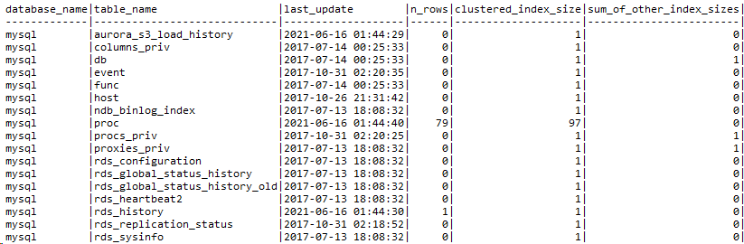
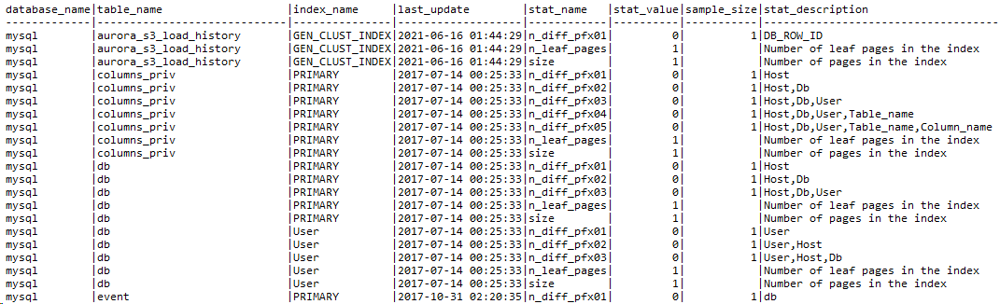

# Oracle table statistics and MySQL managing statistics

With AWS DMS, you can gather and manage statistics about database tables and indexes to improve query performance. Oracle table statistics and MySQL managing statistics provide mechanisms to collect and update metadata about the distribution of data in tables and associated indexes. This information helps the query optimizer generate efficient run plans.

| Feature compatibility            | AWS SCT / AWS DMS automation level | AWS SCT action code index | Key differences                                       |
| -------------------------------- | ---------------------------------- | ------------------------- | ----------------------------------------------------- |
| Three star feature compatibility | N/A                                | N/A                       | Syntax and option differences, similar functionality. |

## Oracle usage

Table statistics are one of the important aspects affecting SQL query performance. They turn on the query optimizer to make informed assumptions when deciding how to generate the run plan for each query. Oracle provides the `DBMS_STATS` package to manage and control the table statistics, which you can collected automatically or manually.

The following statistics are usually collected on database tables and indexes:

- Number of table rows.
- Number of table blocks.
- Number of distinct values or nulls.
- Data distribution histograms.

### Automatic optimizer statistics collection

By default, Oracle collects table and index statistics during predefined maintenance windows using the database scheduler and automated maintenance tasks. The automatic statistics collection mechanism uses Oracle data modification monitoring feature that tracks the approximate number of `INSERT`, `UPDATE`, and `DELETE` statements to determine which table statistics should be collected.

In Oracle 19, you can gather real-time statistics on tables during regular `UPDATE`, `INSERT`, and `DELETE` operations, which ensures that statistics are always up-to-date and are not going stale.

Oracle 19 also introduces high-frequency automatic optimizer statistics collection. Use this feature to set up automatic task that will collect statistics for stale objects.

### Manual optimizer statistics collection

When the automatic statistics collection is not suitable for a particular use case, you can perform the optimizer statistics collection manually at several levels:

| Statistics level          | Description                              |
| ------------------------- | ---------------------------------------- |
| `GATHER_INDEX_STATS`      | Index statistics                         |
| `GATHER_TABLE_STATS`      | Table, column, and index statistics      |
| `GATHER_SCHEMA_STATS`     | Statistics for all objects in a schema   |
| `GATHER_DICTIONARY_STATS` | Statistics for all dictionary objects    |
| `GATHER_DATABASE_STATS`   | Statistics for all objects in a database |

### Examples

Collect statistics at the table level for the `HR` schema and the `EMPLOYEES` table.

```
BEGIN
DBMS_STATS.GATHER_TABLE_STATS('HR','EMPLOYEES');
END;
/

PL/SQL procedure successfully completed.
```

Collect statistics at a specific column level for the `HR` schema, the `EMPLOYEES` table, and the `DEPARTMENT_ID` column.

```
BEGIN
DBMS_STATS.GATHER_TABLE_STATS('HR','EMPLOYEES',
METHOD_OPT=>'FOR COLUMNS department_id');
END;
/

PL/SQL procedure successfully completed.
```

For more information, see [Optimizer Statistics Concepts](https://docs.oracle.com/en/database/oracle/oracle-database/19/tgsql/optimizer-statistics-concepts.html#GUID-C0E74ACE-2706-48A1-97A2-33F52207166A "https://docs.oracle.com/en/database/oracle/oracle-database/19/tgsql/optimizer-statistics-concepts.html#GUID-C0E74ACE-2706-48A1-97A2-33F52207166A") in the _Oracle documentation_.

## MySQL usage

Aurora MySQL supports two modes of statistics management: Persistent Optimizer Statistics and Non-Persistent Optimizer Statistics. As the name suggests, persistent statistics are written to disk and survive service restart. Non-persistent statistics are kept in memory and need to be recreated after service restart. It is recommended to use persistent optimizer statistics (the default for Aurora MySQL) for improved plan stability.

Statistics in Aurora MySQL are created for indexes only. Aurora MySQL does not support independent statistics objects on columns that are not part of an index.

Typically, administrators change the statistics management mode by setting the global parameter `innodb_stats_persistent = ON`. Therefore, control the statistics management mode by changing the behavior for individual tables using the table option `STATS_PERSISTENT = 1`. There are no column-level or statistics-level options for setting parameter values.

To view statistics metadata, use the `INFORMATION_SCHEMA.STATISTICS` standard view. To view detailed persistent optimizer statistics, use the `innodb_table_stats` and `innodb_index_stats` tables.

The following image demonstrates an example of the `mysql.innodb_table_stats` content.



The following image demonstrates an example of the `mysql.innodb_index_stats` content.



Automatic refresh of statistics is controlled by the global parameter `innodb_stats_auto_recalc`, which is set to `ON` in Aurora MySQL. You can set it individually for each table using the `STATS_AUTO_RECALC=1` option.

To explicitly force a refresh of table statistics, use the `ANALYZE TABLE` statement. It is not possible to refresh individual statistics or columns.

Use the `NO_WRITE_TO_BINLOG`, or its clearer alias `LOCAL`, to avoid replication to replication secondaries.

Use `ALTER TABLE …​ ANALYZE PARTITION` to analyze one or more individual partitions.

###### Note

Amazon Relational Database Service (Amazon RDS) for MySQL version 8 adds new `INFORMATION_SCHEMA.INNODB_CACHED_INDEXES` table which reports the number of index pages cached in the InnoDB buffer pool for each index.

### Syntax

```
ANALYZE [NO_WRITE_TO_BINLOG | LOCAL] TABLE <Table Name> [,...];
```

```
CREATE TABLE ( <Table Definition> ) | ALTER TABLE <Table Name>
STATS_PERSISTENT = <1|0>,
STATS_AUTO_RECALC = <1|0>,
STATS_SAMPLE_PAGES = <Statistics Sampling Size>;
```

### Migration considerations

Unlike Oracle, Aurora MySQL collects only density information. It does not collect detailed key distribution histograms. This difference is critical for understanding execution plans and troubleshooting performance issues that are not affected by individual values used by query parameters.

Statistics collection is managed at the table level. You cannot manage individual statistics objects or individual columns. In most cases, that should not pose a challenge for successful migration.

### Examples

The following example creates a table with explicitly set statistics options.

```
CREATE TABLE MyTable
(Col1 INT NOT NULL AUTO_INCREMENT,
Col2 VARCHAR(255),
DateCol DATETIME,
PRIMARY KEY (Col1),
INDEX IDX_DATE (DateCol)
) ENGINE=InnoDB,
STATS_PERSISTENT=1,
STATS_AUTO_RECALC=1,
STATS_SAMPLE_PAGES=25;
```

The following example refreshes all statistics for `MyTable1` and `MyTable2`.

```
ANALYZE TABLE MyTable1, MyTable2;
```

The following example changes the `MyTable` settings to use non-persistent statistics.

```
ALTER TABLE MyTable STATS_PERSISTENT=0;
```

## Summary

The following table identifies Aurora MySQL features. All of the features are accessed in Oracle using the `DBMS_STATS` package.

| Feature                      | Aurora MySQL                              | Comments                                                                                  |
| ---------------------------- | ----------------------------------------- | ----------------------------------------------------------------------------------------- |
| Column statistics            | N/A                                       |                                                                                           |
| Index statistics             | Implicit with every index                 | Statistics are maintained automatically for every table index.                            |
| Refresh or update statistics | `ANALYZE TABLE`                           | Minimal scope in Aurora MySQL is the entire table. No control over individual statistics. |
| Auto create statistics       | N/A                                       |                                                                                           |
| Auto update statistics       | Use the `STATS_AUTO_RECALC` table option  |                                                                                           |
| Statistics sampling          | Use the `STATS_SAMPLE_PAGES` table option | Can only use page number, not percentage for `STATS_SAMPLE_PAGES`.                        |
| Full scan refresh            | N/A                                       | Using a very large `STATS_SAMPLE_PAGES` may serve the same purpose.                       |
| Non-persistent statistics    | Use the `STATS_PERSISTENT=0` table option |                                                                                           |

For more information, see [The INFORMATION_SCHEMA COLUMN_STATISTICS Table](https://dev.mysql.com/doc/refman/8.0/en/information-schema-column-statistics-table.html "https://dev.mysql.com/doc/refman/8.0/en/information-schema-column-statistics-table.html"), [Configuring Persistent Optimizer Statistics Parameters](https://dev.mysql.com/doc/refman/5.7/en/innodb-persistent-stats.html "https://dev.mysql.com/doc/refman/5.7/en/innodb-persistent-stats.html"), [Configuring Non-Persistent Optimizer Statistics Parameters](https://dev.mysql.com/doc/refman/5.7/en/innodb-statistics-estimation.html "https://dev.mysql.com/doc/refman/5.7/en/innodb-statistics-estimation.html"), and [Configuring Optimizer Statistics for InnoDB](https://dev.mysql.com/doc/refman/5.7/en/innodb-performance-optimizer-statistics.html "https://dev.mysql.com/doc/refman/5.7/en/innodb-performance-optimizer-statistics.html") in the _MySQL documentation_.
