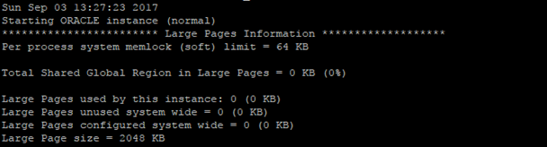
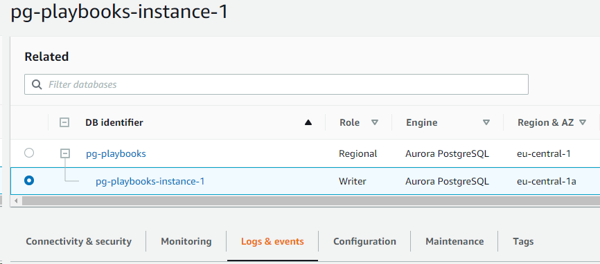
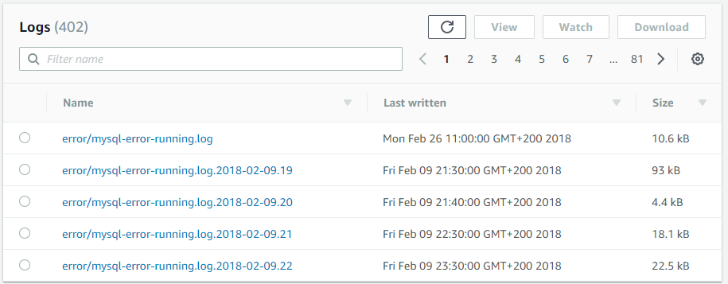
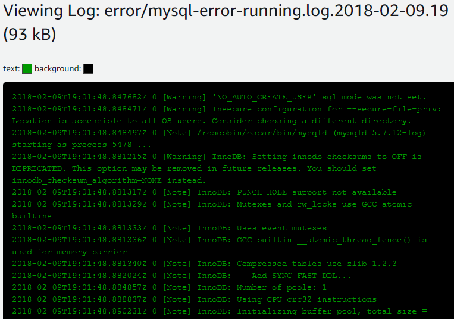

# Oracle Alert Log and PostgreSQL error log

With AWS DMS, you can capture and analyze database logs to monitor migration tasks and troubleshoot issues. The Oracle Alert Log and PostgreSQL error log provide detailed information about database events, errors, and warnings during the migration process.

| Feature compatibility          | AWS SCT / AWS DMS automation level | AWS SCT action code index | Key differences                                                                                                                                                                                                                                     |
| ------------------------------ | ---------------------------------- | ------------------------- | --------------------------------------------------------------------------------------------------------------------------------------------------------------------------------------------------------------------------------------------------- |
| One star feature compatibility | N/A                                | N/A                       | Use [Event Notifications Subscription](../../../AmazonRDS/latest/UserGuide/USER_Events.md "../../../AmazonRDS/latest/UserGuide/USER_Events.md") with [Amazon Simple Notification Service](https://aws.amazon.com/sns "https://aws.amazon.com/sns"). |

## Oracle usage

The primary Oracle error log file is the Alert Log. It contains verbose information about database activity including informational messages and errors. Each event includes a timestamp indicating when the event occurred. The Alert Log filename format is `alert<sid>.log`.

The Alert Log is the first place to look when troubleshooting or investigating errors, failures, and other messages indicating a potential database problem. Common events logged in the Alert Log include:

- Database startup or shutdown.
- Database redo log switch.
- Database errors and warnings, which begin with `ORA-` followed by an Oracle error number.
- Network and connection issues.
- Links for a detailed trace files about specific database events.

The Oracle Alert Log can be found inside the database Automatic Diagnostics Repository (ADR), which is a hierarchical file-based repository for diagnostic information: `$ADR_BASE/diag/rdbms/{DB-name}/{SID}/trace`.

In addition, several other Oracle server components have unique log files such as the database listener and the Automatic Storage Manager (ASM).

**Examples**

The following screenshot displays partial contents of the Oracle database Alert Log File.

For more information, see [Monitoring Errors and Alerts](https://docs.oracle.com/en/database/oracle/oracle-database/19/admin/monitoring-the-database.html#GUID-E5F89E8E-7FBC-47DD-BA5D-96AFD9CE4BC7 "https://docs.oracle.com/en/database/oracle/oracle-database/19/admin/monitoring-the-database.html#GUID-E5F89E8E-7FBC-47DD-BA5D-96AFD9CE4BC7") in the _Oracle documentation_.

## PostgreSQL usage

PostgreSQL provides detailed logging and reporting of errors that occur during the database and connected sessions lifecycle. In an Amazon Aurora deployment, these informational and error messages are accessible using the Amazon RDS console.

### PostgreSQL and Oracle error codes

| Oracle                                                | PostgreSQL                                                                                                   |
| ----------------------------------------------------- | ------------------------------------------------------------------------------------------------------------ |
| ORA-00001: unique constraint (string.string) violated | SQLSTATE[23505]: Unique violation: 7 ERROR: duplicate key value violates unique constraint "constraint_name" |

For more information, see [PostgreSQL Error Codes](https://www.postgresql.org/docs/10/errcodes-appendix.html "https://www.postgresql.org/docs/10/errcodes-appendix.html") in the _PostgreSQL documentation_.

### PostgreSQL error log types

| Log type      | Information written to log                                            |
| ------------- | --------------------------------------------------------------------- |
| DEBUG1…DEBUG5 | Provides successively-more-detailed information for use by developers |
| INFO          | Provides information implicitly requested by the user                 |
| NOTICE        | Provides information that might be helpful to users                   |
| WARNING       | Provides warnings of likely problems                                  |
| ERROR         | Reports an error that caused the current command to abort             |
| LOG           | Reports information of interest to administrators                     |
| FATAL         | Reports an error that caused the current session to abort             |
| PANIC         | Reports an error that caused all database sessions to abort           |

For more information, see [Error Reporting and Logging](https://www.postgresql.org/docs/13/runtime-config-logging.html "https://www.postgresql.org/docs/13/runtime-config-logging.html") in the _PostgreSQL documentation_.

**Examples**

Access the PostgreSQL error log using the Amazon RDS or Aurora management console.

1. Sign in to your AWS console and choose **RDS**.
2. Choose **Databases** and select your database.
3. Choose **Logs & events**.

 4. Scroll down to the Logs section and select the log to inspect. For example, select the log during the hour the data was experiencing problems. The following screen shot displays partial contents of a PostgreSQL database error log as viewed from the Amazon RDS Management Console.

 5. Choose one of the logs.

### PostgreSQL error log configuration

The following tables shows parameters that control how and where PostgreSQL log and errors files will be placed.

| Parameter                    | Description                                                                                                                                                         |
| ---------------------------- | ------------------------------------------------------------------------------------------------------------------------------------------------------------------- |
| `log_filename`               | Sets the file name pattern for log files. Modifiable by an Aurora Database Parameter Group.                                                                         |
| `log_rotation_age`           | (min) Automatic log file rotation will occur after N minutes. Modifiable by an Aurora Database Parameter Group.                                                     |
| `log_rotation_size`          | (kB) Automatic log file rotation will occur after N kilobytes. Modifiable by an Aurora Database Parameter Group.                                                    |
| `log_min_messages`           | Sets the message levels that are logged (`DEBUG`, `ERROR`, `INFO`, and so on). Modifiable by an Aurora Database Parameter Group                                     |
| `log_min_error_statement`    | Causes all statements generating error at or above this level to be logged (`DEBUG`, `ERROR`, `INFO`, and so on). Modifiable by an Aurora Database Parameter Group. |
| `log_min_duration_statement` | Sets the minimum run time above which statements will be logged (ms). Modifiable by an Aurora Database Parameter Group                                              |

Modifications to certain parameters, such as `log_directory` (which sets the destination directory for log files) or `logging_collector` (which start a subprocess to capture stderr output and/or csvlogs into log files) are disabled for Aurora PostgreSQL instances.
