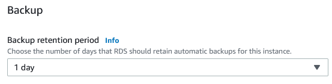
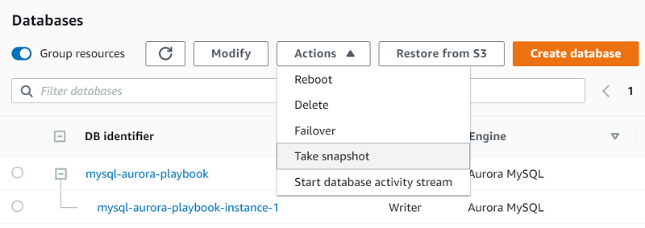

# Oracle Flashback Database and PostgreSQL Amazon Aurora snapshots

With AWS DMS, you can migrate databases between different database platforms or versions by capturing consistent data snapshots from the source database and applying them to the target database. Oracle Flashback Database and PostgreSQL Amazon Aurora snapshots provide point-in-time backups of the source database, enabling migration with minimal downtime.

| Feature compatibility           | AWS SCT / AWS DMS automation level | AWS SCT action code index | Key differences                             |
| ------------------------------- | ---------------------------------- | ------------------------- | ------------------------------------------- |
| Five star feature compatibility | N/A                                | N/A                       | Storage level backup managed by Amazon RDS. |

## Oracle usage

Oracle Flashback Database is a special mechanism built into Oracle databases that helps protect against human errors by providing capabilities to revert the entire database back to a previous point in time using SQL commands. Flashback database implements a self-logging mechanism that captures all changes applied to a database and to data. Essentially, it stores previous versions of database modifications in the configured database “Fast Recovery Area”.

When using Oracle flashback database, you can choose to restore an entire database to either a user-created restore point, a timestamp value, or to a specific System Change Number (SCN).

**Examples**

Create a database restore point to which you can flashback a database.

```
CREATE RESTORE POINT before_update GUARANTEE FLASHBACK DATABASE;
```

Flashback a database to a previously created restore point.

```
shutdown immediate;
startup mount;
flashback database to restore point before_update;
```

Flashback a database to a specific time.

```
shutdown immediate;
startup mount;
FLASHBACK DATABASE TO TIME "TO_DATE('01/01/2017','MM/DD/YY')";
```

For more information, see [FLASHBACK DATABASE](https://docs.oracle.com/en/database/oracle/oracle-database/19/rcmrf/FLASHBACK-DATABASE.html#GUID-584AC79A-40C5-45CA-8C63-DED3BE3A4511 "https://docs.oracle.com/en/database/oracle/oracle-database/19/rcmrf/FLASHBACK-DATABASE.html#GUID-584AC79A-40C5-45CA-8C63-DED3BE3A4511") in the _Oracle documentation_.

## PostgreSQL usage

Snapshots are the primary backup mechanism for Amazon Aurora databases. They are extremely fast and nonintrusive. You can take snapshots using the Amazon RDS Management Console or the AWS CLI. Unlike RMAN, there is no need for incremental backups. You can choose to restore your database to the exact time when a snapshot was taken or to any other point in time.

Amazon Aurora provides the following types of backups:

- **Automated Backups** — Always enabled on Amazon Aurora. They do not impact database performance.
- **Manual Backups** — You can create a snapshot at any time. There is no performance impact when taking snapshots of an Aurora database. Restoring data from snapshots requires creation of a new instance. Up to 100 manual snapshots are supported for each database.

**Examples**

The following steps to enable Aurora automatic backups and configure the backup retention window as part of the database creation process. This process is equivalent to setting the Oracle RMAN backup retention policy using the `configure retention policy to recovery window of X days` command.

1. Sign in to your AWS console and choose **RDS**.
2. Choose **Databases**, then choose your database or create a new one.
3. Expand **Additional configuration** and specify **Backup retention period** in days.



The following table identifies the default automatic backup time for each region.

| Region                    | Default backup window |
| ------------------------- | --------------------- |
| US West (Oregon)          | 06:00–14:00 UTC       |
| US West (N. California)   | 06:00–14:00 UTC       |
| US East (Ohio)            | 03:00–11:00 UTC       |
| US East (N. Virginia)     | 03:00–11:00 UTC       |
| Asia Pacific (Mumbai)     | 16:30–00:30 UTC       |
| Asia Pacific (Seoul)      | 13:00–21:00 UTC       |
| Asia Pacific (Singapore)  | 14:00–22:00 UTC       |
| Asia Pacific (Sydney)     | 12:00–20:00 UTC       |
| Asia Pacific (Tokyo)      | 13:00–21:00 UTC       |
| Canada (Central)          | 06:29–14:29 UTC       |
| EU (Frankfurt)            | 20:00–04:00 UTC       |
| EU (Ireland)              | 22:00–06:00 UTC       |
| EU (London)               | 06:00–14:00 UTC       |
| South America (São Paulo) | 23:00–07:00 UTC       |
| AWS GovCloud (US)         | 03:00–11:00 UTC       |

Use the following steps to perform a manual snapshot backup of an Aurora database. This process is equivalent to creating a full Oracle RMAN backup (`BACKUP DATABASE PLUS ARCHIVELOG`).

1. Sign in to your AWS console and choose **RDS**.
2. Choose **Databases**, then choose your database.
3. Choose **Actions** and then choose **Take snapshot**.



Use the following steps to restore an Aurora database from a snapshot. This process is similar to the Oracle RMAN commands `RESTORE DATABASE` and `RECOVER DATABASE`. However, instead of running in place, restoring an Aurora database creates a new cluster.

1. Sign in to your AWS console and choose **RDS**.
2. Choose **Snapshots**, then choose the snapshot to restore.
3. Choose **Actions** and then choose **Restore snapshot**. This action creates a new instance.
4. On the **Restore snapshot** page, for **DB instance identifier**, enter the name for your restored DB instance.
5. Choose **Restore DB instance**.

Use the following steps to restore an Aurora PostgreSQL database backup to a specific point in time. This process is similar to running the Oracle RMAN command `SET UNTIL TIME "TO_DATE('XXX')"` before running `RESTORE DATABASE` and `RECOVER DATABASE`.

1. Sign in to your AWS console and choose **RDS**.
2. Choose **Databases**, then choose your database.
3. Choose **Actions** and then choose **Restore to point in time**.
4. This process launches a new instance. Select the date and time to which you want to restore your database. The selected date and time must be within the configured backup retention for this instance.

### AWS CLI backup and restore operations

In addition to using the AWS web console to backup and restore an Aurora instance snapshot, you can also use the AWS CLI to perform the same actions. The CLI is especially useful for migrating existing automated Oracle RMAN scripts to an AWS environment. The following list highlights some CLI operations:

- Use `describe-db-cluster-snapshots` to view all current Aurora PostgreSQL snapshots.
- Use `create-db-cluster-snapshot` to create a snapshot ("Restore Point").
- Use `restore-db-cluster-from-snapshot` to restore a new cluster from an existing database snapshot.
- Use `create-db-instance` to add new instances to the restored cluster.

```
aws rds describe-db-cluster-snapshots

aws rds create-db-cluster-snapshot
  --db-cluster-snapshot-identifier Snapshot_name
  --db-cluster-identifier Cluster_Name

aws rds restore-db-cluster-from-snapshot
  --db-cluster-identifier NewCluster
  --snapshot-identifier SnapshotToRestore
  --engine aurora-postgresql

aws rds create-db-instance
  --region us-east-1
  --db-subnet-group default
  --engine aurora-postgresql
  --db-cluster-identifier NewCluster
  --db-instance-identifier newinstance-nodeA
  --db-instance-class db.r4.large
```

- Use `restore-db-instance-to-point-in-time` to perform point-in-time recovery.

```
aws rds restore-db-cluster-to-point-in-time
  --db-cluster-identifier clusternamerestore
  --source-db-cluster-identifier clustername
  --restore-to-time 2017-09-19T23:45:00.000Z

aws rds create-db-instance
  --region us-east-1
  --db-subnet-group default
  --engine aurora-postgresql
  --db-cluster-identifier clustername-restore
  --db-instance-identifier newinstance-nodeA
  --db-instance-class db.r4.large
```

## Summary

| Description                                    | Oracle                                                                                                                | Amazon Aurora                                                                                                                                                                                                                                                                                                                                                                                                                                                                                                                                                                |
| ---------------------------------------------- | --------------------------------------------------------------------------------------------------------------------- | ---------------------------------------------------------------------------------------------------------------------------------------------------------------------------------------------------------------------------------------------------------------------------------------------------------------------------------------------------------------------------------------------------------------------------------------------------------------------------------------------------------------------------------------------------------------------------- |
| Create a restore point                         | `<br>CREATE RESTORE POINT<br>before_update GUARANTEE<br>FLASHBACK DATABASE;<br>`                                      | `<br>aws rds create-db-cluster-snapshot<br>--db-cluster-snapshotidentifier Snapshot_name<br>--db-cluster-identifier Cluster_Name<br>`                                                                                                                                                                                                                                                                                                                                                                                                                                        |
| Configure flashback retention period           | `<br>ALTER SYSTEM SET<br>db_flashback_retention_target=2880;<br>`                                                     | Configure the \*_Backup retention window_<br>• setting using the AWS management console or AWS CLI.                                                                                                                                                                                                                                                                                                                                                                                                                                                                          |
| Flashback database to a previous restore point | `<br>shutdown immediate;<br>startup mount;<br>flashback database to<br>restore point before_update;<br>`              | Create new cluster from a snapshot.<br>`<br>aws rds restore-db-cluster-from-snapshot<br>--db-cluster-identifier NewCluster<br>--snapshot-identifier SnapshotToRestore<br>--engine aurora-postgresql<br>`<br>Add new instance to the cluster.<br>`<br>aws rds create-db-instance<br>--region us-east-1<br>--db-subnetgroup default<br>--engine aurora-postgresql<br>--db-cluster-identifier clustername-restore<br>--db-instance-identifier newinstance-nodeA<br>--db-instance-class db.r4.large<br>`                                                                         |
| Flashback database to a previous point in time | `<br>shutdown immediate;<br>startup mount;<br>FLASHBACK DATABASE TO TIME<br>"TO_DATE ('01/01/2017','MM/DD/YY')";<br>` | Create a new cluster from a snapshot and provide a specific point in time.<br>`<br>aws rds restore-db-cluster-to-point-in-time<br>--db-cluster-identifier clustername-restore<br>--source-db-cluster-identifier clustername<br>--restore-to-time 2017-09-19T23:45:00.000Z<br>`<br>Add a new instance to the cluster:<br>`<br>aws rds create-db-instance<br>--region us-east-1<br>--db-subnetgroup default<br>--engine aurora-postgresql<br>--db-cluster-identifier clustername-restore<br>--db-instance-identifier newinstance-nodeA<br>--db-instance-class db.r4.large<br>` |

For more information, see [rds](../../../cli/latest/reference/rds/index.md#cli-aws-rds "../../../cli/latest/reference/rds/index.md#cli-aws-rds") in the _CLI Command Reference_ and [Restoring a DB instance to a specified time](../../../AmazonRDS/latest/UserGuide/USER_PIT.md "../../../AmazonRDS/latest/UserGuide/USER_PIT.md") and [Restoring from a DB snapshot](../../../AmazonRDS/latest/UserGuide/USER_RestoreFromSnapshot.md "../../../AmazonRDS/latest/UserGuide/USER_RestoreFromSnapshot.md") in the _Amazon RDS user guide_.
