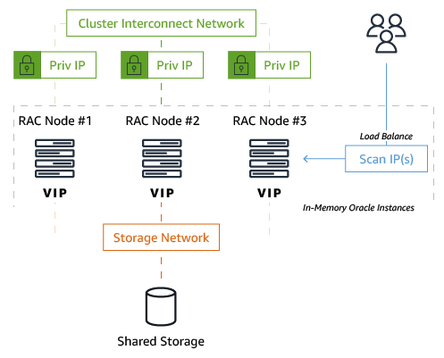
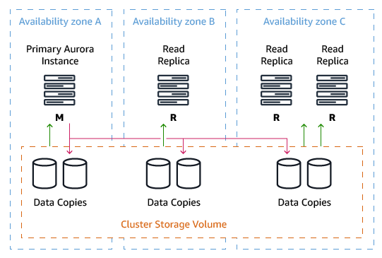
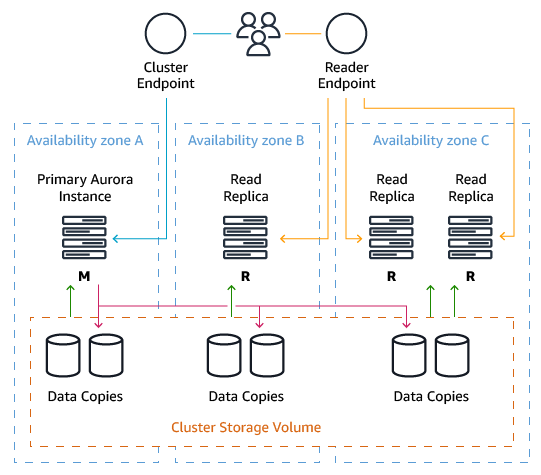
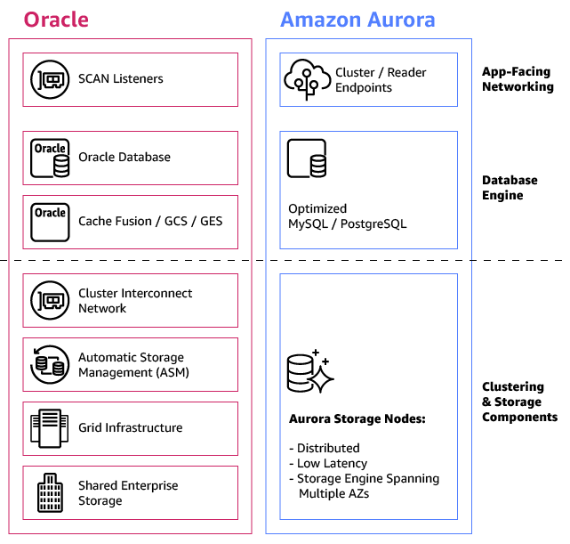

# Oracle Real Application Clusters and PostgreSQL Aurora architecture

With AWS DMS, you can migrate your on-premises Oracle Real Application Clusters (RAC) and PostgreSQL databases to Amazon Aurora, a fully managed relational database service. Oracle RAC provides scalability and high availability by allowing multiple instances to access a single database. Similarly, Amazon Aurora PostgreSQL clusters consist of a writer instance and multiple reader instances, enabling read scaling and failover support.

| Feature compatibility            | AWS SCT / AWS DMS automation level | AWS SCT action code index | Key differences                                                    |
| -------------------------------- | ---------------------------------- | ------------------------- | ------------------------------------------------------------------ |
| Three star feature compatibility | N/A                                | N/A                       | Distribute load, applications, or users across multiple instances. |

## Oracle usage

Oracle Real Application Clusters (RAC) is one of the most advanced and capable technologies providing highly available and scalable relational databases. It allows multiple Oracle instances to access a single database. Applications can access the database through the multiple instances in Active-Active mode.

The following diagram illustrates the Oracle RAC architecture.

Oracle RAC requires network configuration of SCAN IPs, VIP IPs, interconnect, and other items. As a best practice, all severs should run the same versions of Oracle software.

Because of the shared nature of the RAC cluster architecture—specifically, having all nodes write to a single set of database data files on disk—the following two special coordination mechanisms ensure Oracle database objects and data maintain ACID compliance:

- **GCS (Global Cache Services)** — Tracks the location and status of the database data blocks and helps guarantee data integrity for global access across all cluster nodes.
- **GES (Global Enqueue Services)** — Performs concurrency control across all cluster nodes including cache locks and transactions.

These services, which run as background processes on each cluster node, are essential for serializing access to shared data structures in an Oracle database.

Shared storage is another essential component in the Oracle RAC architecture. All cluster nodes read and write data to the same physical database files stored on a disk accessible by all nodes. Most customers rely on high-end storage hardware to provide the shared storage capabilities required for RAC.

In addition, Oracle provides its own software-based storage/disk management mechanism called Automatic Storage Management (ASM). ASM is implemented as a set of special background processes that run on all cluster nodes and allow for easy management of the database storage layer.

### Performance and scale-out with Oracle RAC

You can add new nodes to an existing RAC cluster without downtime. Adding more nodes increases the level of high availability and enhances performance.

Although you can scale read performance easily by adding more cluster nodes, scaling write performance is more complicated. Technically, Oracle RAC can scale writes and reads together when adding new nodes to the cluster, but attempts from multiple sessions to modify rows that reside in the same physical Oracle block (the lowest level of logical I/O performed by the database) can cause write overhead for the requested block and impact write performance.

Concurrency is another reason why RAC implements a “smart mastering” mechanism that attempts to reduce write-concurrency overhead. The “smart mastering” mechanism enables the database to determine which service causes which rows to be read into the buffer cache and master the data blocks only on those nodes where the service is active. Scaling writes in RAC isn’t as straightforward as scaling reads.

With the limitations for pure write scale-out, many Oracle RAC customers choose to split their RAC clusters into multiple services, which are logical groupings of nodes in the same RAC cluster. By using services, you can use Oracle RAC to perform direct writes to specific cluster nodes. This is usually done in one of two ways:

- Splitting writes from different individual modules in the application (that is, groups of independent tables) to different nodes in the cluster. This approach is also known as application partitioning (not to be confused with database table partitions).
- In extremely non-optimized workloads with high concurrency, directing all writes to a single RAC node and load-balancing only the reads.

In summary, Oracle Real Application Clusters provides two major benefits:

- Multiple database nodes within a single RAC cluster provide increased high availability. No single point of failure exists from the database servers themselves. However, the shared storage requires storage-based high availability or disaster recovery solutions.
- Multiple cluster database nodes enable scaling-out query performance across multiple servers.

For more information, see [Oracle Real Application Clusters](https://docs.oracle.com/en/database/oracle/oracle-database/19/racad/index.html "https://docs.oracle.com/en/database/oracle/oracle-database/19/racad/index.html") in the _Oracle documentation_.

## PostgreSQL usage

Aurora extends the vanilla versions of PostgreSQL in two major ways:

- Adds enhancements to the PostgreSQL database kernel itself to improve performance (concurrency, locking, multi-threading, and so on).
- Uses the capabilities of the AWS ecosystem for greater high availability, disaster recovery, and backup/recovery functionality.

Comparing the Amazon Aurora architecture to Oracle RAC, there are major differences in how Amazon implements scalability and increased high availability. These differences are due mainly to the existing capabilities of PostgreSQL and the strengths the AWS backend provides in terms of networking and storage.

Instead of having multiple read/write cluster nodes access a shared disk, an Aurora cluster has a single primary node that is open for reads and writes and a set of replica nodes that are open for reads with automatic promotion to primary in case of failures. While Oracle RAC uses a set of background processes to coordinate writes across all cluster nodes, the Amazon Aurora primary writes a constant redo stream to six storage nodes distributed across three Availability Zones within an AWS Region. The only writes that cross the network are redo log records (not pages).

Each Aurora cluster can have one or more instances serving different purposes:

- At any given time, a single instance functions as the primary that handles both writes and reads from your applications.
- You can create up to 15 read replicas in addition to the primary, which are used for two purposes:
  - **Performance and Read Scalability** — Replicas can be used as read-only nodes for queries and report workloads.
  - **High Availability** — Replicas can be used as failover nodes in the event the master fails. Each read replica can be located in one of the three Availability Zones hosting the Aurora cluster. A single Availability Zone can host more than one read replica.

The following diagram illustrates a high-level Aurora architecture with four cluster nodes: one primary and three read replicas. The primary node is located in Availability Zone A, the first read replica in Availability Zone B, and the second and third read replicas in Availability Zone C.

An Aurora Storage volume is made up of 10 GB segments of data with six copies spread across three Availability Zones. Each Amazon Aurora read replica shares the same underlying volume as the master instance. Updates made by the master are visible to all read replicas through a combination of reading from the shared Aurora storage volume and applying log updates in-memory when received from the primary instance after a master failure. Promotion of a read replica to master usually occurs in less than 30 seconds with no data loss.

For a write to be considered durable in Aurora, the primary instance (“master”) sends a redo stream to six storage nodes — two in each availability zone for the storage volume — and waits until four of the six nodes have responded. No database pages are ever written from the database tier to the storage tier. The Aurora Storage volume asynchronously applies redo records to generate database pages in the background or on demand. Aurora hides the underlying complexity.

### High availability and scale-out in Aurora

Aurora provides two endpoints for cluster access. These endpoints provide both high availability capabilities and scale-out read processing for connecting applications.

- **Cluster Endpoint** — Connects to the current primary instance for the Aurora cluster. You can perform both read and write operations using the cluster endpoint. If the current primary instance fails, Aurora automatically fails over to a new primary instance. During a failover, the database cluster continues to serve connection requests to the cluster endpoint from the new primary instance with minimal interruption of service.
- **Reader Endpoint** — Provides load-balancing capabilities (round-robin) across the replicas allowing applications to scale-out reads across the Aurora cluster. Using the Reader Endpoint provides better use of the resources available in the cluster. The reader endpoint also enhances high availability. If an AWS Availability Zone fails, the application’s use of the reader endpoint continues to send read traffic to the other replicas with minimal disruption.

While Amazon Aurora focuses on the scale-out of reads and Oracle RAC can scale-out both reads and writes, most OLTP applications are usually not limited by write scalability. Many Oracle RAC customers use RAC first for high availability and second to scale-out their reads. You can write to any node in an Oracle RAC cluster, but this capability is often a functional benefit for the application versus a method for achieving unlimited scalability for writes.

## Summary

- Multiple cluster database nodes provide increased high availability. There is no single point of failure from the database servers. In addition, since an Aurora cluster can be distributed across three availability zones, there is a large benefit for high availability and durability of the database. These types of “stretch” database clusters are usually uncommon with other database architectures.
- AWS managed storage nodes also provide high availability for the storage tier. A zero-data loss architecture is employed in the event a master node fails and a replica node is promoted to the new master. This failover can usually be performed in under 30 seconds.
- Multiple cluster database nodes enable scaling-out query read performance across multiple servers.
- Greatly reduced operational overhead using a cloud solution and reduced total cost of ownership by using AWS and open source database engines.
- Automatic management of storage. No need to pre-provision storage for a database. Storage is automatically added as needed, and you only pay for one copy of your data.
- With Amazon Aurora, you can easily scale-out your reads (and scale-up your writes) which fits perfectly into the workload characteristics of many, if not most, OLTP applications. Scaling out reads usually provides the most tangible performance benefit.

When comparing Oracle RAC and Amazon Aurora side by side, you can see the architectural differences between the two database technologies. Both provide high availability and scalability, but with different architectures.

Overall, Amazon Aurora introduces a simplified solution that can function as an Oracle RAC alternative for many typical OLTP applications that need high performance writes, scalable reads, and very high availability with lower operational overhead.

| Feature                                   | Oracle RAC                                                                                                                                                                                         | Amazon Aurora                                                                        |
| ----------------------------------------- | -------------------------------------------------------------------------------------------------------------------------------------------------------------------------------------------------- | ------------------------------------------------------------------------------------ |
| Storage                                   | Usually enterprise-grade storage + ASM                                                                                                                                                             | Aurora Storage Nodes: Distributed, Low Latency, Storage Engine Spanning Multiple AZs |
| Cluster type                              | Active/Active. All nodes open for R/W                                                                                                                                                              | Active/Active. Primary node open for R/W, Replica nodes open for reads               |
| Cluster virtual IPs                       | R/W load balancing: SCAN IP                                                                                                                                                                        | R/W: Cluster endpoint + Read load balancing: Reader endpoint                         |
| Internode coordination                    | Cache-fusion + GCS + GES                                                                                                                                                                           | N/A                                                                                  |
| Internode private network                 | Interconnect                                                                                                                                                                                       | N/A                                                                                  |
| Transaction (write) TTR from node failure | Typically, 0-30 seconds                                                                                                                                                                            | Typically, less than 30 seconds                                                      |
| Application (Read) TTR from node failure  | Immediate                                                                                                                                                                                          | Immediate                                                                            |
| Max number of cluster nodes               | Theoretical maximum is 100, but smaller clusters (2 to 10 nodes) are far more common                                                                                                               | 15                                                                                   |
| Provides built-in read scaling            | Yes                                                                                                                                                                                                | Yes                                                                                  |
| Provides built-in write scaling           | Yes, under certain scenarios, write performance can be limited and affect scale-out capabilities. For example, when multiple sessions attempt to modify rows contained in the same database blocks | No                                                                                   |
| Data loss in case of node failure         | No data loss                                                                                                                                                                                       | No data loss                                                                         |
| Replication latency                       | N/A                                                                                                                                                                                                | Milliseconds                                                                         |
| Operational complexity                    | Requires database, IT, network, and storage expertise                                                                                                                                              | Provided as a cloud-solution                                                         |
| Scale-up nodes                            | Difficult with physical hardware, usually requires to replace servers                                                                                                                              | Easy using the AWS UI/CLI                                                            |
| Scale-out cluster                         | Provision, deploy, and configure new servers, unless you pre-allocate a pool of idle servers to scale-out on                                                                                       | Easy using the AWS UI/CLI                                                            |

For more information, see [Amazon Aurora as an Alternative to Oracle RAC](https://aws.amazon.com/blogs/database/amazon-aurora-as-an-alternative-to-oracle-rac "https://aws.amazon.com/blogs/database/amazon-aurora-as-an-alternative-to-oracle-rac").
