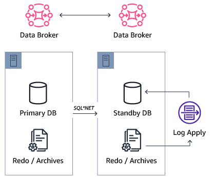

# Oracle Active Data Guard and PostgreSQL replicas

With AWS DMS, you can create and manage Oracle Active Data Guard and PostgreSQL logical replication instances to maintain standby databases for disaster recovery and read scaling. Oracle Active Data Guard and PostgreSQL logical replication provide continuous data protection by transmitting database changes from a primary database to one or more standby databases.

| Feature compatibility            | AWS SCT / AWS DMS automation level | AWS SCT action code index | Key differences                                                   |
| -------------------------------- | ---------------------------------- | ------------------------- | ----------------------------------------------------------------- |
| Three star feature compatibility | N/A                                | N/A                       | Distribute load, applications, or users across multiple instances |

## Oracle usage

Oracle Active Data Guard (ADG) is a synced database architecture with primary and standby databases. The difference between Data Guard and ADG is that ADG standby databases allow read access only.

The following diagram illustrates the ADG architecture.

- **Primary DB** — The main database open to read and write operations.
- **Redo/Archive** — The redo files and archives that store the redo entries for recovery operations.
- **Data Broker** — The data guard broker service is responsible for all failover and syncing operations.
- **Standby DB** — The secondary database that allows read operations only. This database remains in recovery mode until it is shut down or becomes the primary (failover or switchover).
- **Log Apply** — Runs all the redo log entries from the redo and archives files on the standby db.
- **Redo/Archive** — Contains the redo files and archives that are synced from the primary log and archive files.
- **Data Broker** — The Data Guard broker service is responsible for all failover and syncing operations.

All components use SQL\*NET protocol.

**Special features**

- You can select "asynchronously" for best performance or "synchronously" for best data protection.
- You can temporarily convert a standby database to a snapshot database and allow read/write operations. When you are done running QA, testing, loads, or other operations, it can be switched back to standby.
- A sync gap can be specified between the primary and standby databases to account for human errors (for example, creating 12 hours gap of sync).

For more information, see [Creating a Physical Standby Database](https://docs.oracle.com/en/database/oracle/oracle-database/19/sbydb/creating-oracle-data-guard-physical-standby.html#GUID-B511FB6E-E3E7-436D-94B5-071C37550170 "https://docs.oracle.com/en/database/oracle/oracle-database/19/sbydb/creating-oracle-data-guard-physical-standby.html#GUID-B511FB6E-E3E7-436D-94B5-071C37550170") in the _Oracle documentation_.

## PostgreSQL usage

You can use Aurora replicas for scaling read operations and increasing availability such as Oracle Active Data Guard, but with less configuration and administration. You can easily manage many replicas from the Amazon RDS console. Alternatively, you can use the AWS CLI for automation.

When you create Aurora PostgreSQL instances, use one of the two following replication options:

- **Multi-AZ (Availability Zone)** — Create a replicating instance in a different region.
- **Instance Read Replicas** — Create a replicating instance in the same region.

For instance options, you can use one of the two following options:

- Create Aurora Replica.
- Create Cross Region Read Replica.

The main differences between these two options are:

- Cross Region creates a new reader cluster in a different region. Use Cross Region for a higher level of Higher Availability and to keep the data closer to the end users.
- Cross Region has more lag between the two instances.
- Additional charges apply for transferring the data between the two regions.

DDL statements that run on the primary instance may interrupt database connections on the associated Aurora Replicas. If an Aurora Replica connection is actively using a database object such as a table, and that object is modified on the primary instance using a DDL statement, the Aurora Replica connection is interrupted.

Rebooting the primary instance of an Amazon Aurora database cluster also automatically reboots the Aurora Replicas for that database cluster.

Before you create a cross region replica, turn on the `binlog_format` parameter.

When using Multi-AZ, the primary database instance switches over automatically to the standby replica if any of the following conditions occur:

- The primary database instance fails.
- An Availability Zone outage.
- The database instance server type is changed.
- The operating system of the database instance is undergoing software patching.
- A manual failover of the database instance was initiated using reboot with fail-over.

**Examples**

The following walkthrough demonstrates how to create a replica/reader.

1. Sign in to your AWS console and choose **RDS**.
2. Choose **Instance actions** and choose **Add reader**.
3. Enter all required details and choose **Create**.

After the replica is created, you can run read and write operations on the primary instance and read-only operations on the replica.

### Compare Oracle Active Data Guard and Aurora PostgreSQL Replicates

| Description                                                | Oracle Active Data Guard                                                                                                                                                                                                                                                                                                                                                                                                                                                                                     | Aurora PostgreSQL Replicates                                                                                                                                                     |
| ---------------------------------------------------------- | ------------------------------------------------------------------------------------------------------------------------------------------------------------------------------------------------------------------------------------------------------------------------------------------------------------------------------------------------------------------------------------------------------------------------------------------------------------------------------------------------------------ | -------------------------------------------------------------------------------------------------------------------------------------------------------------------------------- |
| How to switch over                                         | ` ALTER DATABASE SWITCHOVER TO DBREP VERIFY; `                                                                                                                                                                                                                                                                                                                                                                                                                                                         | Note that you can’t choose to which instance to failover, the instance with the higher priority will become a writer (primary).                                                  |
| Define automatic failover                                  | ` EDIT DATABASE db1 SET PROPERTY FASTSTARTFAILOVERTARGET='db1rep'; EDIT DATABASE db1rep SET PROPERTY FASTSTARTFAILOVERTARGET='db1'; ENABLE FAST_START FAILOVER; `                                                                                                                                                                                                                                                                                                                          | Use Multi-AZ on instance creation or by modifying existing instance.                                                                                                             |
| Asynchronous or synchronous replication                    | Change to synchronous ` ALTER SYSTEM SET LOG_ARCHIVE_DEST_2='SERVICE=db1rep AFFIRM SYNC VALID_FOR=(ONLINE_LOGFILES, PRIMARY_ROLE) DB_UNIQUE_NAME=db1rep'; ALTER DATABASE SET STANDBY DATABASE TO MAXIMIZE AVAILABILITY; ` Change to asynchronous ` ALTER SYSTEM SET LOG_ARCHIVE_DEST_2='SERVICE=db1rep NOAFFIRM ASYNC VALID_FOR=(ONLINE_LOGFILES, PRIMARY_ROLE) DB_UNIQUE_NAME=db1rep'; ALTER DATABASE SET STANDBY DATABASE TO MAXIMIZE PERFORMANCE; ` | Not supported. Only asynchronous replication is in use.                                                                                                                          |
| Open standby to read/write and continue syncing afterwards | ` CONVERT DATABASE db1rep TO SNAPSHOT STANDBY; CONVERT DATABASE db1rep TO PHYSICAL STANDBY; `                                                                                                                                                                                                                                                                                                                                                                                                 | Not supported but you can: restore your database from snapshot, run your QA, testing or other operations on the restored instance. After you finish, drop the restored instance. |
| Create gaped replication                                   | Create 5 minutes delay ` ALTER DATABASE RECOVER MANAGED STANDBY DATABASE CANCEL; ALTER DATABASE RECOVER MANAGED STANDBY DATABASE DELAY 5 DISCONNECT FROM SESSION; ` Return for no delay ` ALTER DATABASE RECOVER MANAGED STANDBY DATABASE CANCEL; ALTER DATABASE RECOVER MANAGED STANDBY DATABASE NODELAY DISCONNECT FROM SESSION; `                                                                                                                | Not Supported                                                                                                                                                                    |

For more information, see [Replication with Amazon Aurora](../../../AmazonRDS/latest/AuroraUserGuide/Aurora.md "../../../AmazonRDS/latest/AuroraUserGuide/Aurora.md") in the _user guide_ and [Multi-AZ deployments for high availability](../../../AmazonRDS/latest/UserGuide/Concepts.md "../../../AmazonRDS/latest/UserGuide/Concepts.md") in the _user guide_.
