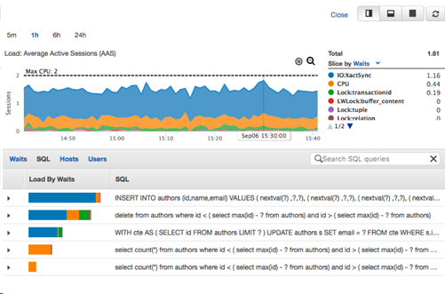

# Oracle and PostgreSQL monitoring

This section provides information about Oracle V$ views and the data dictionary and PostgreSQL system catalog and the statistics collector.

## Oracle V$ Views and the data dictionary and PostgreSQL system catalog and the statistics collector

| Feature compatibility            | AWS SCT / AWS DMS automation level | AWS SCT action code index | Key differences                                          |
| -------------------------------- | ---------------------------------- | ------------------------- | -------------------------------------------------------- |
| Three star feature compatibility | N/A                                | N/A                       | Table names in queries need to be changed in PostgreSQL. |

### Oracle usage

Oracle provides several built-in views that are used to monitor the database and query its operational state. These views can be used to track the status of the database, view information about database schema objects and more.

The data dictionary is a collection of internal tables and views that supply information about the state and operations of the Oracle database including: database status, database schema objects (tables, views, sequences, and so on), users and security, physical database structure (datafiles), and more. The contents of the data dictionary are persistent to disk.

Examples for data dictionary views include:

- `DBA_TABLES` — information about all of the tables in the current database.
- `DBA_USERES` — information about all the database users.
- `DBA_DATA_FILES` — information about all of the physical datafiles in the database.
- `DBA_TABLESPACES` — information about all tablespaces in the database.
- `DBA_TABLES` — information about all tables in the database.
- `DBA_TAB_COLS` — information about all columns, for all tables, in the database.

###### Note

Data dictionary view names can start with `DBA_*`, `ALL_*`, and `USER_*`, depending on the level and scope of information presented (user-level versus database-level).

For more information, see [Static Data Dictionary Views](https://docs.oracle.com/en/database/oracle/oracle-database/19/refrn/static-data-dictionary-views-5.html#GUID-22FAAA6B-2181-47AE-8A10-6CF968B52CA4 "https://docs.oracle.com/en/database/oracle/oracle-database/19/refrn/static-data-dictionary-views-5.html#GUID-22FAAA6B-2181-47AE-8A10-6CF968B52CA4") in the _Oracle documentation_.

**Dynamic performance views** (`V$ Views`) are a collection of views that provide real-time monitoring information about the current state of the database instance configuration, runtime statistics and operations. These views are continuously updated while the database is running.

Information provided by the dynamic performance views includes session information, memory usage, progress of jobs and tasks, SQL execution state and statistics and various other metrics.

Common dynamic performance views include:

- `V$SESSION` — information about all current connected sessions in the instance.
- `V$LOCKED_OBJECT` — information about all objects in the instance on which active “locks” exist.
- `V$INSTANCE` — dynamic instance properties.
- `V$SESSION_LONG_OPS` — information about certain “long running” operations in the database such as queries currently executing.
- `V$MEMORY_TARGET_ADVICE` — advisory view on how to size the instance memory, based on instance activity and past workloads.

For more information, see [Data Dictionary and Dynamic Performance Views](https://docs.oracle.com/en/database/oracle/oracle-database/19/cncpt/data-dictionary-and-dynamic-performance-views.html#GUID-BDF5B748-EB43-4B48-938E-89099069C3BB "https://docs.oracle.com/en/database/oracle/oracle-database/19/cncpt/data-dictionary-and-dynamic-performance-views.html#GUID-BDF5B748-EB43-4B48-938E-89099069C3BB") in the _Oracle documentation_.

### PostgreSQL usage

PostgreSQL provides three different sets of meta-data tables that are used to retrieve information about the state of the database and current activities. These tables are similar in nature to the Oracle data dictionary tables and V$ performance views. In addition, Amazon Aurora PostgreSQL provides the Performance insights console for monitoring and analyzing database workloads and troubleshooting performance issues.

| Category                       | Description                                                                                                                                                                                                                                                                           |
| ------------------------------ | ------------------------------------------------------------------------------------------------------------------------------------------------------------------------------------------------------------------------------------------------------------------------------------- |
| Statistic collection views     | Subsystem that collects runtime dynamic information about certain server activities such as statistical performance information. Some of these tables could be thought as comparable to Oracle `V$` views.                                                                            |
| System catalog tables          | Static metadata regarding the PostgreSQL database and static information about schema objects. Some of these tables could be thought as comparable to Oracle `DBA_*` Data Dictionary tables.                                                                                          |
| Information schema tables      | Set of views that contain information about the objects defined in the current database. The information schema is specified by the SQL standard and as such, supported by PostgreSQL. Some of these tables could be thought as comparable to Oracle `USER_*` Data Dictionary tables. |
| Advance performance monitoring | Use the Performance insights console.                                                                                                                                                                                                                                                 |

#### System catalog tables

These are a set of tables used to store dynamic and static meta-data for the PostgreSQL database and can be thought of as the data dictionary for the database. These tables are used for internal bookkeeping-type activities.

All System catalog tables start with the `pg_*` prefix and can be found in the `pg_catalog` schema. Both system catalog tables and statistics collector views can be found on the `pg_catalog` schema.

Starting with PostgreSQL 12 it is now possible to monitor progress of `CREATE INDEX`, `REINDEX`, `CLUSTER`, `VACUUM FULL` operations by querying system views `pg_stat_progress_create_index` and `pg_stat_progress_cluster`.

PostgreSQL 13 added the following features:

- Monitoring of the progress of `ANALYZE` operations by querying system view `pg_stat_progress_analyze`.
- Monitoring of the shared memory usage with system view `pg_shmem_allocations`.

**Example**

Display all tables in the `pg_catalog` schema.

```
select * from pg_tables where schemaname='pg_catalog';
```

The following table includes some of the common system catalog tables.

| Table name    | Purpose                                                                                                                                      |
| ------------- | -------------------------------------------------------------------------------------------------------------------------------------------- |
| `pg_database` | Contains information and properties about each database in the PostgreSQL cluster, such as the database encoding settings as well as others. |
| `pg_tables`   | Information about all tables in the database, such as indexes and the tablespace for each database table.                                    |
| `pg_index`    | Contains information about all indexes in the database.                                                                                      |
| `pg_cursors`  | List of currently available/open cursors.                                                                                                    |

New catalog tables and views in PostgreSQL 10:

- `pg_publication` — All publications created in the database.
- `pg_partitioned_table` — All partitioned tables in the database.
- `pg_sequences` — All sequences.
- `pg_statistic_ext` — Table statistics.
- `pg_subscription` — All existing logical replication subscriptions across the cluster.
- `pg_hba_file_rules` — Summary of the contents of the client authentication configuration file.
- `pg_publication_tables` — Mapping between publications and the tables they contain.

For more information, see [System Catalogs](https://www.postgresql.org/docs/13/catalogs.html "https://www.postgresql.org/docs/13/catalogs.html") in the _PostgreSQL documentation_.

#### Statistics collector

Special subsystem which collects runtime dynamic information about the current activities in the database instance. For example, statistics collector views are useful to determine how frequently a particular table is accessed and if the table is scanned or accessed using an index.

```
SELECT * FROM pg_stat_activity WHERE STATE = 'active';
```

The following table includes some of the common statistics collector views.

| Table name             | Purpose                                                                                                                                                  |
| ---------------------- | -------------------------------------------------------------------------------------------------------------------------------------------------------- |
| `pg_stat_activity`     | Statistics of currently sessions in the database. Useful for identifying long running queries.                                                           |
| `pg_stat_all_tables`   | Performance statistics on all tables in the database, such as identifying table size, write activity, full scans vs. index access, and so on.            |
| `pg_statio_all_tables` | Performance statistics and I/O metrics on all database tables.                                                                                           |
| `pg_stat_database`     | One row for each database showing database-wide statistics such as blocks read from the buffer cache vs. blocks read from disk (buffer cache hit ratio). |
| `pg_stat_bgwriter`     | Important performance information on PostgreSQL checkpoints and background writes.                                                                       |
| `pg_stat_all_indexes`  | Performance and usage statistics on indexes, for example, useful for identifying unused indexes.                                                         |

For more information, see [Dynamic Statistics Views](https://www.postgresql.org/docs/13/monitoring-stats.html#MONITORING-STATS-DYNAMIC-VIEWS-TABLE "https://www.postgresql.org/docs/13/monitoring-stats.html#MONITORING-STATS-DYNAMIC-VIEWS-TABLE") in the _PostgreSQL documentation_.

#### Information schema tables

The information schema consists of views which contain information about objects that were created in the current database.

- The information schema is specified by the SQL standard and as such, supported by PostgreSQL.
- The owner of this schema is the initial database user.
- Because the information schema is defined as part of the SQL standard, it can be expected to remain stable across PostgreSQL versions. This is unlike the system catalog tables, which are specific to PostgreSQL, and subject to changes across different PostgreSQL versions.
- The information schema views do not display information about PostgreSQL-specific features.

```
select * from information_schema.tables;
```

By default, all database users can query both the system catalog tables, the statistics collector views and the information schema.

For more information, see [The Information Schema](https://www.postgresql.org/docs/13/information-schema.html "https://www.postgresql.org/docs/13/information-schema.html") in the _PostgreSQL documentation_.

### Summary

| Information                             | Oracle            | PostgreSQL             |
| --------------------------------------- | ----------------- | ---------------------- |
| Database properties                     | `V$DATABASE`      | `PG DATABASE`          |
| Database sessions                       | `V$SESSION`       | `PG_STAT_ACTIVITY`     |
| Database users                          | `DBA_USERS`       | `PG_USER`              |
| Database tables                         | `DBA_TABLES`      | `PG_TABLES`            |
| Database roles                          | `DBA_ROLES`       | `PG_ROLES`             |
| Table columns                           | `DBA_TAB_COLS`    | `PG_ATTRIBUTE`         |
| Database locks                          | `V$LOCKED_OBJECT` | `PG_LOCKS`             |
| Currently configured runtime parameters | `V$PARAMETER`     | `PG_SETTINGS`          |
| All system statistics                   | `V$SYSSTAT`       | `PG_STAT_DATABASE`     |
| Privileges on tables                    | `DBA_TAB_PRIVS`   | `TABLE_PRIVILEGES`     |
| Information about IO operations         | `V$SEGSTAT`       | `PG_STATIO_ALL_TABLES` |

### Amazon RDS Performance Insights

In addition to monitoring database status and activity using queries on metadata tables, Aurora PostgreSQL provides a visual performance monitoring and status information using the **Performance insights** feature accessible as part of the Amazon RDS Management Console.

Performance insights monitors your Amazon RDS/Aurora databases and captures workloads so that you can analyze and troubleshoot database performance. Performance insights visualizes the database load and provides advanced filtering using various attributes such as: waits, SQL statements, hosts, or users.

**Example**

To access the Amazon Aurora Performance Insights console, do the following.

1. Sign in to your AWS console and choose **RDS**.
2. Choose **Performance Insights**.
3. Review a visualized dashboard of your current and past database performance metrics. You can choose the period of time of the displayed performance data (5m, 1h, 6h or 24h) as well as different criteria to filter and slice the information presented such as waits, SQL, Hosts or Users, and so on.



**Enabling Performance Insights**

The Performance Insights feature is enabled by default for Amazon Aurora clusters. If you have more than one database created in your Aurora cluster, performance data for all of the databases is aggregated. Database performance data is kept for 24 hours.

For more information, see [Monitoring DB load with Performance Insights on Amazon RDS](../../../AmazonRDS/latest/UserGuide/USER_PerfInsights.md "../../../AmazonRDS/latest/UserGuide/USER_PerfInsights.md") in the _Amazon RDS user guide_.
