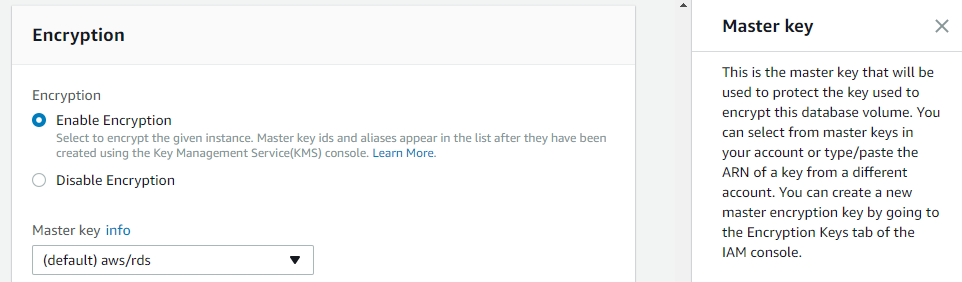
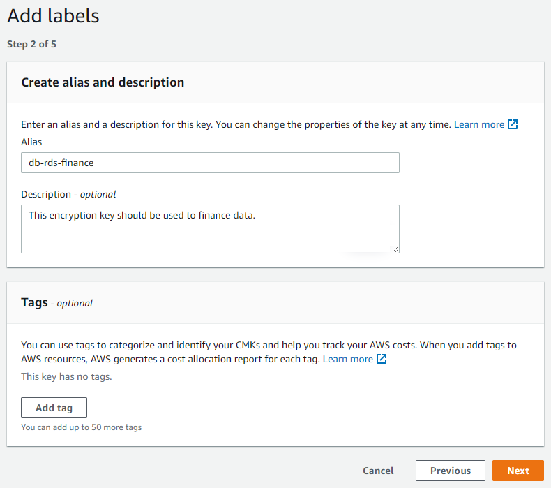
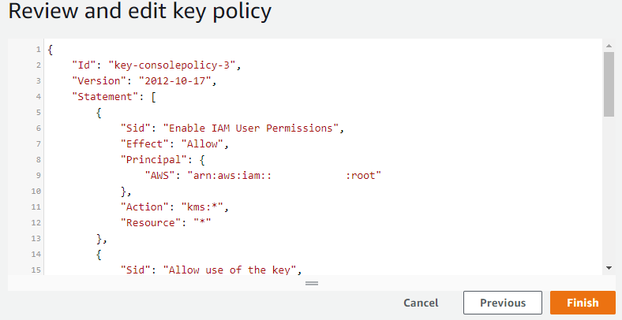

# Oracle transparent data encryption and PostgreSQL encryption

With AWS DMS, you can securely migrate databases by encrypting data at rest using Oracle transparent data encryption or PostgreSQL encryption. Oracle transparent data encryption and PostgreSQL encryption are data-at-rest encryption solutions that protect sensitive data by encrypting database files, backups, and replicas.

| Feature compatibility          | AWS SCT / AWS DMS automation level | AWS SCT action code index | Key differences                                                                                                                   |
| ------------------------------ | ---------------------------------- | ------------------------- | --------------------------------------------------------------------------------------------------------------------------------- |
| Two star feature compatibility | N/A                                | N/A                       | Use [Amazon Aurora Encryption](../../../AmazonRDS/latest/UserGuide/Overview.md "../../../AmazonRDS/latest/UserGuide/Overview.md") |

## Oracle usage

Oracle data encryption is called Transparent Data Encryption (TDE).

TDE encrypts the data that is saved in the tables or tablespaces and protects data stored on media (also called data at rest) in case this media or data files are stolen.

Oracle uses authentication, authorization, and auditing mechanisms to secure data in the database but TDE is working on the operating system level.

You don’t need to change from the application or client when encrypting data with TDE; the database manages it automatically.

TDE doesn’t protect data in transit. Use the network encryption solutions discussed.

- The user who wants to configure TDE needs `ADMINISTER KEY MANAGEMENT` system privilege.
- Data can be encrypted at column level or tablespace level.
- Key of encryption managed in external module is called TDE root encryption.
- There is one root key store for each database.

**Examples**

To store the root encryption key, you can configure Oracle software keystore.

Define at `sqlnet.ora` the `ENCRYPTION_WALLET_LOCATION` parameter to define where the keystore is. You can put to key file in:

- Regular filesystem.
- Multiple DBs shared the same file.
- ASM filesystem.
- ASM disk group.

Register in `sqlinit.ora` to put key file in ASM disk group.

```
ENCRYPTION_WALLET_LOCATION=
  (SOURCE=
    (METHOD=FILE)
      (METHOD_DATA=
        (DIRECTORY=+ASM_file_path_of_the_diskgroup)))
```

Create software keystores. Use one of the following types.

- Password-based.
- Auto-login.
- Local auto-login.

To create password-based software keystore, connect to a database with user that have `ADMINISTER KEY MANAGEMENT` or `SYSKM` privilege and then create the keystore.

```
sqlplus c##sec_admin as syskm
Enter password: password
Connected.

ADMINISTER KEY MANAGEMENT CREATE KEYSTORE '/etc/ORACLE/WALLETS/orcl' IDENTIFIED BY password;

keystore altered.
```

When you use the password-based software keystore, open the keystore before any TDE root encryption keys can be created or accessed in the keystore, auto-login and local auto-login are automatically opened (you can close them). Use the following query to open the keystore.

```
sqlplus c##sec_admin as syskm
Enter password: password
Connected.

ADMINISTER KEY MANAGEMENT SET KEYSTORE OPEN IDENTIFIED BY password;

keystore altered.
```

Set the software root encryption key, the key is stored in the keystore, this key protects the TDE table keys and tablespace encryption keys.

By default, the TDE root encryption key is a key that the TDE generates.

To set the software root encryption key:

- Make sure that the database is open in `READ WRITE` mode.
- Connect with the user that has the right privileges and create the root key.

```
sqlplus c##sec_admin as syskm
Enter password: password
Connected.

ADMINISTER KEY MANAGEMENT SET KEY IDENTIFIED BY keystore_password WITH BACKUP USING 'emp_key_backup';

keystore altered.
```

Encrypt the data.

The following data types support encryption: `BINARY_DOUBLE`, `BINARY_FLOAT`, `CHAR`, `DATE`, `INTERVAL DAY TO SECOND`, `INTERVAL YEAR TO MONTH`, `NCHAR`, `NUMBER`, `NVARCHAR2`, `RAW` (legacy or extended), `TIMESTAMP` (includes `TIMESTAMP WITH TIME ZONE` and `TIMESTAMP WITH LOCAL TIME ZONE`), `VARCHAR2` (legacy or extended).

You can’t use column encryption with the following features:

- Index types other than B-tree.
- Range scan search through an index.
- Synchronous change data capture.
- Transportable tablespaces.
- Columns used in foreign key constraints.

To create table with encrypted column, use the following query.

```
CREATE TABLE employee (
  FIRST_NAME VARCHAR2(128),
  LAST_NAME VARCHAR2(128),
  EMP_ID NUMBER,
  SALARY NUMBER(6) ENCRYPT);
```

You can change the algorithm that encrypts the data.

The `NO SALT` option encrypts without the algorithm.

The `USING` clause defines the algorithm that is used to encrypt data.

```
CREATE TABLE EMPLOYEE (
  FIRST_NAME VARCHAR2(128),
  LAST_NAME VARCHAR2(128),
  EMP_ID NUMBER ENCRYPT NO SALT,
  SALARY NUMBER(6) ENCRYPT USING '3DES168');
```

To change the algorithm, use the following query.

```
ALTER TABLE EMPLOYEE REKEY USING 'SHA-1';
```

Stop encrypting column.

```
ALTER TABLE employee MODIFY (SALARY DECRYPT);
```

When you encrypt a tablespace, the TDE encrypts in the SQL layer so all the data types and indexes restrictions aren’t applied for tablespace encryption.

- Make sure that COMPATIBLE initialization parameter is set to 11.2.0.0 (minimum).
- Login to the database.
- Create the tablespace, you can’t modify existing tablespace, only to create new one. In this example, the first TS created with AES256 algorithm and the second TS created with default algorithm.

```
sqlplus sec_admin@hrpdb
Enter password: password
Connected.

CREATE TABLESPACE encrypt_ts
DATAFILE '$ORACLE_HOME/dbs/encrypt_df.dbf' SIZE 1M
ENCRYPTION USING 'AES256'
DEFAULT STORAGE (ENCRYPT);
CREATE TABLESPACE securespace_2
DATAFILE '/home/user/oradata/secure01.dbf'
SIZE 150M
ENCRYPTION
DEFAULT STORAGE(ENCRYPT);
```

For more information, see [Introduction to Transparent Data Encryption](https://docs.oracle.com/en/database/oracle/oracle-database/19/asoag/introduction-to-transparent-data-encryption.html#GUID-62AA9447-FDCD-4A4C-B563-32DE04D55952 "https://docs.oracle.com/en/database/oracle/oracle-database/19/asoag/introduction-to-transparent-data-encryption.html#GUID-62AA9447-FDCD-4A4C-B563-32DE04D55952") in the _Oracle documentation_.

## PostgreSQL usage

Amazon provides the ability to encrypt data at rest (data stored in persistent storage).

When you enable data encryption, it will automatically encrypt the database server storage, its automated backups, its read replicas and snapshots by using the AES-256 encryption algorithm.

This encryption will be done by using [AWS KMS](../../../kms/latest/developerguide/overview.md "../../../kms/latest/developerguide/overview.md").

Once enabled, Amazon will transparently encrypt/decrypt the data without any impact on performances or any user intervention, and there will be no need to set any additional modifications to your clients to support this encryption.

### Enable encryption

As part of the database settings you will be asked to enable encryption and choose a root key.



You can choose the default key provided for the account or define a specific key based on an IAM AWS KMS ARN from your account or a different account.

### Create an encryption key

**To create your own key**

1. Go to the AWS Key Management Service (KMS) console, choose **Customer managed keys** and create a new key.
2. Choose relevant options and then choose **Next**.
3. Enter **Alias** as the name of the key and choose **Next**.

 4. Skip **Define Key Administrative Permissions** and choose **Next**. 5. Assign the key to the relevant users who will need to interact with Aurora. 6. On the last step you can see the ARN of the key and its account.

 7. Choose **Finish** and the key will be listed in under customer managed keys.

Now you can set the root encryption key by using the ARN of the key that you have created or picking it from the list. Proceed with this operation and finish the instance launch.

### SSE-S3 encryption feature overview

Server-side encryption (SSE) with Amazon S3-managed encryption keys (SSE-S3) uses a multi-factor encryption. Amazon S3 encrypts its objects with a unique key and in addition it also encrypts the key itself with a root key that rotates periodically.

SSE-S3 uses AES-256 as its encryption standard.

After the Amazon S3 bucket was enabled with Server-side encryption, the data will be encrypted at rest, meaning that from this stage, any API call will have to include the special `x-amz-server-side-encryption` header.

Additionally, the AWS command line tool will also need to be added with the `--sse` switch.

For more information, see [Specifying Amazon S3 encryption](../../../AmazonS3/latest/userguide/specifying-s3-encryption.md "../../../AmazonS3/latest/userguide/specifying-s3-encryption.md") in the _Amazon Simple Storage Service user guide_ and [s3](../../../cli/latest/reference/s3.md "../../../cli/latest/reference/s3.md") in the _CLI Command Reference_.

**Enable SSE-S3**

1. Sign in to the AWS Glue console.
2. Create an AWS Glue job.
3. Define the role, bucket, and the script to use.
4. Enable Server-Side Encryption.
5. Submit the job and run it.

From this point, you will notice that the only way to access the files will be by using AWS CLI Amazon S3 along with the `--sse` switch, or by adding `x-amz-server-side-encryption` to your API calls.
