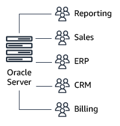
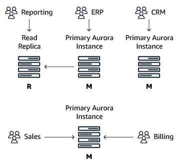

# Oracle Resource Manager and PostgreSQL dedicated Amazon Aurora clusters

With AWS DMS, you can migrate data from an Oracle database to a PostgreSQL-compatible Amazon Aurora database cluster. Oracle Resource Manager helps manage Oracle database migration by allowing you to deploy data pump jobs for migrating schemas and data from an Oracle database. PostgreSQL dedicated Amazon Aurora clusters provide a PostgreSQL-compatible relational database built for the cloud, enabling you to scale database resources up or down based on your needs.

| Feature compatibility            | AWS SCT / AWS DMS automation level | AWS SCT action code index | Key differences                                                    |
| -------------------------------- | ---------------------------------- | ------------------------- | ------------------------------------------------------------------ |
| Three star feature compatibility | N/A                                | N/A                       | Distribute load, applications, or users across multiple instances. |

## Oracle usage

Oracle Resource Manager enables enhanced management of multiple concurrent workloads running under a single Oracle database. Using Oracle Resource Manager, you can partition server resources for different workloads.

Resource Manager helps with sharing server and database resources without causing excessive resource contention and helps to eliminate scenarios involving inappropriate allocation of resources across different database sessions.

Oracle Resource Manager enables you to:

- Guarantee a minimum amount of CPU cycles for certain sessions regardless of other running operations.
- Distribute available CPU by allocating percentages of CPU time to different session groups.
- Limit the degree of parallelism of any operation performed by members of a user group.
- Manage the order of parallel statements in the parallel statement queue.
- Limit the number of parallel running servers that a user group can use.
- Create an active session pool. An active session pool consists of a specified maximum number of user sessions allowed to be concurrently active within a user group.
- Monitor used database/server resources by dictionary views.
- Manage runaway sessions or calls and prevent them from overloading the database.
- Prevent the running of operations that the optimizer estimates will run for a longer time than a specified limit.
- Limit the amount of time that a session can be connected but idle, thus forcing inactive sessions to disconnect and potentially freeing memory resources.
- Allow a database to use different resource plans, based on changing workload requirements.
- Manage CPU allocation when there is more than one instance on a server in an Oracle Real Application Cluster environment (also called instance caging).

Oracle Resource Manager introduces three concepts:

- **Consumer group** — A collection of sessions grouped together based on resource requirements. The Oracle Resource Manager allocates server resources to resource consumer groups, not to the individual sessions.
- **Resource plan** — Specifies how the database allocates its resources to different Consumer Groups. You will need to specify how the database allocates resources by activating a specific resource plan.
- **Resource plan directive** — Associates a resource consumer group with a plan and specifies how resources are to be allocated to that resource consumer group.

###### Note

Only one Resource Plan can be active at any given time. Resource Directives control the resources allocated to a Consumer Group belong to a Resource Plan. The Resource Plan can refer to Subplans to create even more complex Resource Plans.

**Examples**

Create a simple Resource Plan. To use the Oracle Resource Manager, you need to assign a plan name to the `RESOURCE_MANAGER_PLAN` parameter. Using an empty string will disable the Resource Manager.

```
ALTER SYSTEM SET RESOURCE_MANAGER_PLAN = 'mydb_plan';
ALTER SYSTEM SET RESOURCE_MANAGER_PLAN = '';
```

You can create complex Resource Plans. A complex Resource Plan is one that is not created with the `CREATE_SIMPLE_PLAN` PL/SQL procedure and provides more flexibility and granularity.

```
BEGIN
DBMS_RESOURCE_MANAGER.CREATE_PLAN_DIRECTIVE (
PLAN => 'DAYTIME',
GROUP_OR_SUBPLAN => 'OLTP',
COMMENT => 'OLTP group',
MGMT_P1 => 75);
END;
/
```

For more information, see [Managing Resources with Oracle Database Resource Manager](https://docs.oracle.com/en/database/oracle/oracle-database/19/admin/managing-resources-with-oracle-database-resource-manager.html#GUID-2BEF5482-CF97-4A85-BD90-9195E41E74EF "https://docs.oracle.com/en/database/oracle/oracle-database/19/admin/managing-resources-with-oracle-database-resource-manager.html#GUID-2BEF5482-CF97-4A85-BD90-9195E41E74EF") in the _Oracle documentation_.

## PostgreSQL usage

PostgreSQL doesn’t have built-in resource management capabilities that are equivalent to the functionality provided by Oracle Resource Manager. However, due to the elasticity and flexibility provided by cloud economics, workarounds could be applicable and such capabilities might not be as of similar importance to monolithic
on-premises databases.

The Oracle Resource Manager primarily exists because traditionally, Oracle databases were installed on very powerful monolithic servers that powered multiple applications simultaneously. The monolithic model made the most sense in an environment where the licensing for the Oracle database was per-CPU and where Oracle databases were deployed on physical hardware. In these scenarios, it made sense to consolidate as many workloads as possible into few servers. In cloud databases, the strict requirement to maximize the usage of each individual server is often not as important and a different approach can be employed:

Individual Amazon Aurora clusters can be deployed, with varying sizes, each dedicated to a specific application or workload. Additional read-only Aurora Replica servers can be used to offload any reporting-style workloads from the master instance.

The following diagram shows the traditional Oracle model where maximizing the usage of each physical Oracle server was essential due to physical hardware constraints and the per-CPU core licensing model.



With Amazon Aurora, you can deploy separate and dedicated database clusters. Each cluster is dedicated to a specific application or workload creating isolation between multiple connected sessions and applications. The following diagram shows this architecture.



Each Amazon Aurora instance (primary or replica) can be scaled independently in terms of CPU and memory resources using the different instance types. Because multiple Amazon Aurora instances can be instantly deployed and much less overhead is associated with the deployment and management of Aurora instances when compared to physical servers, separating different workloads to different instance classes could be a suitable solution for controlling resource management.

For instance types and resources, see [Amazon EC2 Instance Types](https://aws.amazon.com/ec2/instance-types/ "https://aws.amazon.com/ec2/instance-types/").

In addition, each Amazon Aurora primary or replica instance can also be directly accessed from your applications using its own endpoint. This capability is especially useful if you have multiple Aurora read-replicas for a given cluster and you wish to utilize different Aurora replicas to segment your workload.

**Examples**

Suppose that you were using a single Oracle Database for multiple separate applications and used Oracle Resource Manager to enforce a workload separation, allocating a specific amount of server resources for each application. With Amazon Aurora, you might want to create multiple separate databases for each individual application. Adding additional replica instances to an existing Amazon Aurora cluster is easy.

1. Sign in to your AWS console and choose **RDS**.
2. Choose **Databases** and select the Amazon Aurora cluster that you want to scale-out by adding an additional reader.
3. Choose **Actions** and then choose **Add reader**.
4. Select the instance class depending on the amount of compute resources your application requires.
5. Choose **Create Aurora Replica**.

## Summary

| Oracle Resource Manager                                                         | Amazon Aurora instances                                                                                                                                                                                                                                                                                                                                                                                                                                                                                                                                                                                                                                                                                                                                                                                                                                                                                                                                                                                                                                                                                                                                                                                                                                                                                                                                                                                                                                                                                                                                                          |
| ------------------------------------------------------------------------------- | -------------------------------------------------------------------------------------------------------------------------------------------------------------------------------------------------------------------------------------------------------------------------------------------------------------------------------------------------------------------------------------------------------------------------------------------------------------------------------------------------------------------------------------------------------------------------------------------------------------------------------------------------------------------------------------------------------------------------------------------------------------------------------------------------------------------------------------------------------------------------------------------------------------------------------------------------------------------------------------------------------------------------------------------------------------------------------------------------------------------------------------------------------------------------------------------------------------------------------------------------------------------------------------------------------------------------------------------------------------------------------------------------------------------------------------------------------------------------------------------------------------------------------------------------------------------------------- |
| Set the maximum CPU usage for a resource group                                  | Create a dedicated Aurora Instance for a specific application                                                                                                                                                                                                                                                                                                                                                                                                                                                                                                                                                                                                                                                                                                                                                                                                                                                                                                                                                                                                                                                                                                                                                                                                                                                                                                                                                                                                                                                                                                                    |
| Limit the degree of parallelism for specific queries                            | `<br>SET max_parallel_workers_per_gather TO x;<br>`<br>Setting the PostgreSQL `max_parallel_workers_per_gather` parameter should be done as part of your application database connection.                                                                                                                                                                                                                                                                                                                                                                                                                                                                                                                                                                                                                                                                                                                                                                                                                                                                                                                                                                                                                                                                                                                                                                                                                                                                                                                                                                                        |
| Limit parallel runs                                                             | `<br>SET max_parallel_workers_per_gather TO x;<br>-<br>• by a single Gather or Gather Merge node<br>-<br>• OR<br>SET max_parallel_workers TO x;<br>-<br>• for the whole system (since PostgreSQL 10)<br>`                                                                                                                                                                                                                                                                                                                                                                                                                                                                                                                                                                                                                                                                                                                                                                                                                                                                                                                                                                                                                                                                                                                                                                                                                                                                                                                                                                        |
| Limit the number of active sessions                                             | Manually detect the number of connections that are open from a specific application and restrict connectivity either with database procedures or within the application DAL itself.<br>`<br>select pid from pg_stat_activity where usename in(<br>select usename from pg_stat_activity where<br>state = 'active' group by usename having count(*) > 10)<br>and state = 'active' order by query_Start;<br>`                                                                                                                                                                                                                                                                                                                                                                                                                                                                                                                                                                                                                                                                                                                                                                                                                                                                                                                                                                                                                                                                                                                                                                       |
| Restrict maximum runtime of queries                                             | Manually terminate sessions that exceed the required threshold. You can detect the length of running queries using SQL commands and restrict maximum run duration using either database procedures or within the application DAL itself.<br>`<br>SELECT pg_terminate_backend(pid) FROM pg_stat_activity<br>WHERE now()-pg_stat_activity.query_start > interval '5 minutes';<br>`                                                                                                                                                                                                                                                                                                                                                                                                                                                                                                                                                                                                                                                                                                                                                                                                                                                                                                                                                                                                                                                                                                                                                                                                 |
| Limit the maximum idle time for sessions                                        | Manually terminate sessions that exceed the required threshold. You can detect the length of your idle sessions using SQL queries and restrict maximum run using either database procedures or within the application DAL itself.<br>`<br>SELECT pg_terminate_backend(pid)<br>FROM pg_stat_activity<br>WHERE datname = 'regress'<br>AND pid <> pg_backend_pid()<br>AND state = 'idle'<br>AND state_change < current_timestamp<br>• INTERVAL '5' MINUTE;<br>`                                                                                                                                                                                                                                                                                                                                                                                                                                                                                                                                                                                                                                                                                                                                                                                                                                                                                                                                                                                                                                                                                                                     |
| Limit the time that an idle session holding open locks can block other sessions | Manually terminate sessions that exceed the required threshold. You can detect the length of blocking idle sessions using SQL queries and restrict maximum run duration using either database procedures or within the application DAL itself.<br>`<br>SELECT pg_terminate_backend(blocking_locks.pid)<br>FROM pg_catalog.pg_locks AS blocked_locks<br>JOIN pg_catalog.pg_stat_activity AS blocked_activity<br>ON blocked_activity.pid = blocked_locks.pid<br>JOIN pg_catalog.pg_locks AS blocking_locks<br>ON blocking_locks.locktype = blocked_locks.locktype<br>AND blocking_locks.DATABASE IS NOT DISTINCT<br>FROM blocked_locks.DATABASE<br>AND blocking_locks.relation  IS NOT DISTINCT<br>FROM blocked_locks.relation<br>AND blocking_locks.page IS NOT DISTINCT<br>FROM blocked_locks.page<br>AND blocking_locks.tuple IS NOT DISTINCT<br>FROM blocked_locks.tuple<br>AND blocking_locks.virtualxid IS NOT DISTINCT<br>FROM blocked_locks.virtualxid<br>AND blocking_locks.transactionid IS NOT DISTINCT<br>FROM blocked_locks.transactionid<br>AND blocking_locks.classid IS NOT DISTINCT<br>FROM blocked_locks.classid<br>AND blocking_locks.objid IS NOT DISTINCT<br>FROM blocked_locks.objid<br>AND blocking_locks.objsubid IS NOT DISTINCT<br>FROM blocked_locks.objsubid<br>AND blocking_locks.pid != blocked_locks.pid<br>JOIN pg_catalog.pg_stat_activity<br>AS blocking_activity<br>ON blocking_activity.pid = blocking_locks.pid<br>WHERE NOT blocked_locks.granted<br>and blocked_activity.state_change <<br>current_timestamp<br>• INTERVAL '5' minute;<br>` |
| Use instance caging in a multi-node Oracle RAC Environment                      | Similar capabilities can be achieved by separating different applications to different Aurora clusters or, for read-only workloads, separate Aurora read replicas within the same Aurora cluster.                                                                                                                                                                                                                                                                                                                                                                                                                                                                                                                                                                                                                                                                                                                                                                                                                                                                                                                                                                                                                                                                                                                                                                                                                                                                                                                                                                                |

For more information, see [Resource Consumption](https://www.postgresql.org/docs/13/runtime-config-resource.html "https://www.postgresql.org/docs/13/runtime-config-resource.html") in the _PostgreSQL documentation_.
