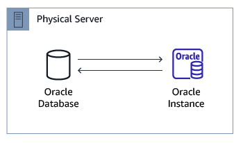
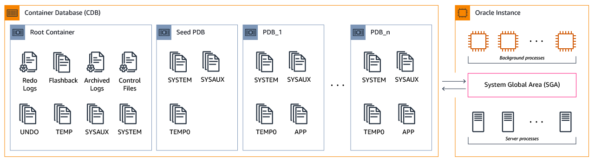
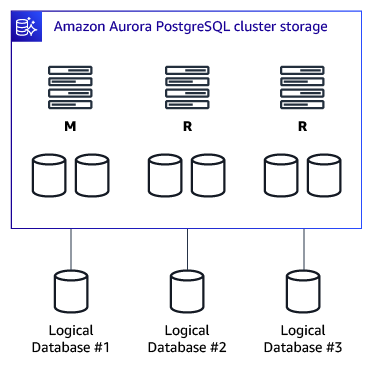

# Oracle multitenant and PostgreSQL database architecture

With AWS DMS, you can migrate data from Oracle multitenant databases and PostgreSQL databases to AWS. Oracle multitenant architecture refers to the capability of hosting multiple pluggable databases within a single container database. PostgreSQL utilizes a traditional database architecture where each database instance operates independently.

| Feature compatibility            | AWS SCT / AWS DMS automation level | AWS SCT action code index | Key differences |
| -------------------------------- | ---------------------------------- | ------------------------- | --------------- |
| Three star feature compatibility | N/A                                | N/A                       | N/A             |

## Oracle usage

Oracle 12c introduces a new multitenant architecture that provides the ability to create additional independent pluggable databases under a single Oracle instance. Prior to Oracle 12c, a single Oracle database instance only supported running a single Oracle database as shown in the following diagram.



Oracle 12c introduces a new multitenant container database (CDB) that supports one or more pluggable databases (PDB). The CDB can be thought of as a single superset database with multiple pluggable databases. The relationship between an Oracle instance and databases is now 1:N.


Oracle 18c adds following multitenant related features:

- DBCA PDB Clone: UI interface which allows cloning multiple pluggable databases (PDB).
- Refreshable PDB Switchover: ability to switch roles between pluggable database clone and its original master
- CDB Fleet Management: ability to group multiple container databases (CDB) into fleets that can be managed as a single logical database.

Oracle 19 introduced support to having more than one pluggable database (PDB) in a container database (CDB) in sharded environments.

**Advantages of the Oracle 12c multitenant architecture**

- You can use PDBs to isolate applications from one another.
- You can use PDBs as portable collection of schemas.
- You can clone PDBs and transport them to different CDBs/Oracle instances.
- Management of many databases (individual PDBs) as a whole.
- Separate security, users, permissions, and resource management for each PDB provides greater application isolation.
- Enables a consolidated database model of many individual applications sharing a single Oracle server.
- Provides an easier way to patch and upgrade individual clients and/or applications using PDBs.
- Backups are supported at both a multitenant container-level as well as at an individual PDB-level (both for physical and logical backups).

**The Oracle multitenant architecture**

- A multitenant CDB can support one or more PDBs.
- Each PDB contains its own copy of `SYSTEM` and application tablespaces.
- The PDBs share the Oracle Instance memory and background processes. The use of PDBs enables consolidation of many databases and applications into individual containers under the same Oracle instance.
- A single Root Container (CDB$ROOT) exists in a CDB and contains the Oracle Instance Redo Logs, undo tablespace (unless Oracle 12.2 local undo mode is enabled), and control files.
- A single Seed PDB exists in a CDB and is used as a template for creating new PDBs.



**CDB and PDB semantics**

Container databases (CDB)

- Created as part of the Oracle 12c software installation.
- Contains the Oracle control files, its own set of system tablespaces, the instance undo tablespaces (unless Oracle 12.2 local undo mode is enabled), and the instance redo logs.
- Holds the data dictionary for the root container and for all of the PDBs.

Pluggable databases (PDB)

- An independent database that exists under a CDB. Also known as a container.
- Used to store application-specific data.
- You can create a pluggable database from a the pdb$seed (template database) or as a clone of an existing PDB.
- Stores metadata information specific to its own objects (data-dictionary).
- Has its own set of application data files, system data files, and tablespaces along with temporary files to manage objects.

**Examples**

List existing PDBs created in an Oracle CDB instance.

```
SHOW PDBS;

CON_ID  CON_NAME  OPEN MODE   RESTRICTED
2       PDB$SEED  READ ONLY   NO
3       PDB1      READ WRITE  NO
```

Provision a new PDB from the template `seed$pdb`.

```
CREATE PLUGGABLE DATABASE PDB2 admin USER ora_admin
IDENTIFIED BY ora_admin FILE_NAME_CONVERT=('/pdbseed/','/pdb2/');
```

Alter a specific PDB to the `READ/WRITE` mode and verify the change.

```
ALTER PLUGGABLE DATABASE PDB2 OPEN READ WRITE;

SHOW PDBS;

CON_ID  CON_NAME  OPEN MODE   RESTRICTED
2       PDB$SEED  READ ONLY   NO
3       PDB1      READ WRITE  NO
4       PDB2      READ WRITE  NO
```

Clone a PDB from an existing PDB.

```
CREATE PLUGGABLE DATABASE PDB3
  FROM PDB2 FILE_NAME_CONVERT= ('/pdb2/','/pdb3/');

SHOW PDBS;

CON_ID  CON_NAME  OPEN MODE   RESTRICTED
2       PDB$SEED  READ ONLY   NO
3       PDB1      READ WRITE  NO
4       PDB2      READ WRITE  NO
5       PDB3      MOUNTED
```

For more information, see [Oracle Multitenant](https://docs.oracle.com/en/database/oracle/oracle-database/19/multi/index.html "https://docs.oracle.com/en/database/oracle/oracle-database/19/multi/index.html") in the _Oracle documentation_.

## PostgreSQL usage

Amazon Aurora PostgreSQL offers a different and simplified architecture to manage and create a multitenant database environment. You can use Aurora PostgreSQL to provide levels of functionality similar (but not identical) to those offered by Oracle PDBs by creating multiple databases under the same Aurora PostgreSQL cluster and / or using separate Aurora clusters if total isolation of workloads is required.

You can create multiple PostgreSQL databases under a single Amazon Aurora PostgreSQL cluster.



Each Amazon Aurora cluster contains a primary instance that can accept both reads and writes for all cluster databases.

You can create up to 15 read-only nodes providing scale-out functionality for application reads and high availability.


An Oracle CDB/Instance is a high-level equivalent to an Amazon Aurora cluster, and an Oracle Pluggable Database (PDB) is equivalent to a PostgreSQL database created inside the Amazon Aurora cluster. Not all features are comparable between Oracle 12c PDBs and Amazon Aurora.

In PostgreSQL, you can copy databases using templates. Database needs to be created or modified to have `IS_TEMPLATE` flag set to true and then new database could be created with `CREATE DATABASE <newdbname> TEMPLATE <templatedbname>`.

Starting with Oracle 18c and 19c, you can use this feature for the following:

- PDB Clone
- Refreshable PDB Switchover
- CDB Fleet Management
- More than one pluggable database (PDB) in a container database (CDB) in sharded environments.

In the AWS Cloud, these features can be achieved in many ways and each can be optimized using different services.

To clone a databases inside the PostgreSQL instance, use the `TEMPLATE` option with the `CREATE DATABASE` statement. The following command copies the `emp` database to `emp_bck`.

```
CREATE DATABASE emp_bck TEMPLATE emp;
```

To achieve similar functionality to Refreshable PDB Switchover, it depends on the use case but there are multiple options mostly depended on the required granularity:

- Databases in the same instance — you can do the failover using `CREATE DATABASE` statement when size and required downtime allow that and use an application failover to point to any of the databases.
- Database links and replication method — database links or AWS DMS can be used to make sure there are two databases in two different instances that are in sync and have application failover to point to the other database when needed.
- PostgreSQL logical replication provides fine-grained control over replicating and synchronizing parts of a database. For example, you can use logical replication to replicate an individual table of a database.

Managing CDB is actually very similar to the AWS orchestration, as you can manage multiple Amazon RDS instances there (CDB) and databases inside (PDB), all monitored centrally and can be managed through the AWS console or AWS CLI.

**Examples**

Create a new database in PostgreSQL using the `CREATE DATABASE` statement.

```
CREATE DATABASE pg_db1;
CREATE DATABASE pg_db2;
CREATE DATABASE pg_db3;
```

List all databases created under an Amazon Aurora PostgreSQL cluster.

```
\l

Name       Owner         Encoding  Collate      Ctype
admindb    rds_pg_admin  UTF8      en_US.UTF-8  en_US.UTF-8
pg_db1     rds_pg_admin  UTF8      en_US.UTF-8  en_US.UTF-8
pg_db2     rds_pg_admin  UTF8      en_US.UTF-8  en_US.UTF-8
pg_db3     rds_pg_admin  UTF8      en_US.UTF-8  en_US.UTF-8
postgres   rds_pg_admin  UTF8      en_US.UTF-8  en_US.UTF-8
rdsadmin   rdsadmin      UTF8      en_US.UTF-8  en_US.UTF-8
template0  rdsadmin      UTF8      en_US.UTF-8  en_US.UTF-8
template1  rds_pg_admin  UTF8      en_US.UTF-8  en_US.UTF-8
```
