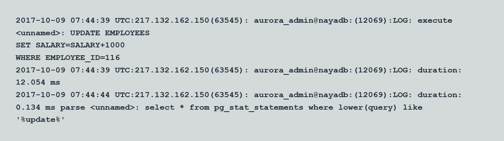

# Oracle Log Miner and PostgreSQL logging options

With AWS DMS, you can migrate data from Oracle and PostgreSQL databases while maintaining transaction integrity by utilizing Oracle Log Miner and PostgreSQL logical replication capabilities. Oracle Log Miner provides access to redo log files, allowing you to capture data manipulation language (DML) and data definition language (DDL) changes made to Oracle databases. PostgreSQL logical replication streams write-ahead log (WAL) records, enabling data synchronization between primary and standby servers.

| Feature compatibility            | AWS SCT / AWS DMS automation level | AWS SCT action code index | Key differences                                               |
| -------------------------------- | ---------------------------------- | ------------------------- | ------------------------------------------------------------- |
| Three star feature compatibility | N/A                                | N/A                       | PostgreSQL doesn’t support LogMiner, workaround is available. |

## Oracle usage

Oracle Log Miner is a tool for querying the database Redo Logs and the Archived Redo Logs using an SQL interface. Using Log Miner, you can analyze the content of database “transaction logs” (online and archived redo logs) and gain historical insights on past database activity such as data modification by individual DML statements.

**Examples**

The following examples demonstrate how to use Log Miner to view DML statements that run on the employees table.

Find the current redo log file.

```
SELECT V$LOG.STATUS, MEMBER
FROM V$LOG, V$LOGFILE
WHERE V$LOG.GROUP# = V$LOGFILE.GROUP#
AND V$LOG.STATUS = 'CURRENT';

STATUS    MEMBER
CURRENT   /u01/app/oracle/oradata/orcl/redo02.log
```

Use the `DBMS_LOGMNR.ADD_LOGFILE` procedure. Pass the file path as a parameter to the Log Miner API.

```
BEGIN
DBMS_LOGMNR.ADD_LOGFILE('/u01/app/oracle/oradata/orcl/redo02.log');
END;
/

PL/SQL procedure successfully completed.
```

Start Log Miner using the `DBMS_LOGMNR.START_LOGMNR` procedure.

```
BEGIN
DBMS_LOGMNR.START_LOGMNR(options=>
dbms_logmnr.dict_from_online_catalog);
END;
/

PL/SQL procedure successfully completed.
```

Run a DML statement.

```
UPDATE HR.EMPLOYEES SET SALARY=SALARY+1000 WHERE EMPLOYEE_ID=116;
COMMIT;
```

Query the `V$LOGMNR_CONTENTS` table to view the DML commands captured by the Log Miner.

```
SELECT TO_CHAR(TIMESTAMP,'mm/dd/yy hh24:mi:ss') TIMESTAMP,
SEG_NAME, OPERATION, SQL_REDO, SQL_UNDO
FROM V$LOGMNR_CONTENTS
WHERE TABLE_NAME = 'EMPLOYEES'
AND OPERATION = 'UPDATE';

TIMESTAMP  SEG_NAME  OPERATION
10/09/17   06:43:44  EMPLOYEES UPDATE

SQL_REDO                                         SQL_UNDO
update "HR"."EMPLOYEES" set                      update "HR"."EMPLOYEES" set
"SALARY" = '3900' where "SALARY" = '2900'        "SALARY" = '2900' where "SALARY" = '3900'
and ROWID = 'AAAViUAAEAAABVvAAQ';                and ROWID = 'AAAViUAAEAAABVvAAQ';
```

For more information, see [Using LogMiner to Analyze Redo Log Files](https://docs.oracle.com/en/database/oracle/oracle-database/19/sutil/oracle-logminer-utility.html#GUID-3417B738-374C-4EE3-B15C-3A66E01AE2B5 "https://docs.oracle.com/en/database/oracle/oracle-database/19/sutil/oracle-logminer-utility.html#GUID-3417B738-374C-4EE3-B15C-3A66E01AE2B5") in the _Oracle documentation_.

## PostgreSQL usage

PostgreSQL doesn’t provide a feature that is directly equivalent to Oracle Log Miner. However, several alternatives exist which allow viewing historical database activity in PostgreSQL.

**Using PG_STAT_STATEMENTS**

Extension module for tracking query run details with statistical information. The `PG_STAT_STATEMENTS` view presents a single row for each database operation that was logged, including information about the user, query, number of rows retrieved by the query, and more.

**Examples**

1. Sign in to your AWS console and choose **RDS**.
2. Choose **Parameter groups** and choose the parameter to edit.
3. On the **Parameter group actions**, choose **Edit**.
4. Set the following parameters:
   - shared_preload_libraries = 'pg_stat_statements'
   - pg_stat_statements.max = 10000
   - pg_stat_statements.track = all

5. Choose **Save changes**.

A database reboot may be required for the updated values to take effect.

Connect to your database and run the following command.

```
CREATE EXTENSION PG_STAT_STATEMENTS;
```

Test the `PG_STAT_STATEMENTS` view to see captured database activity.

```
UPDATE EMPLOYEES
SET SALARY=SALARY+1000
WHERE EMPLOYEE_ID=116;

SELECT *
FROM PG_STAT_STATEMENTS
WHERE LOWER(QUERY) LIKE '%update%';

[ RECORD 1 ]
userid               16393
dbid                 16394
queryid              2339248071
query                UPDATE EMPLOYEES + SET SALARY = SALARY + ? + WHERE EMPLOYEE_ID=?
calls                1
total_time           11.989
min_time             11.989
max_time             11.989
mean_time            11.989
stddev_time          0
rows                 1
shared_blks_hit      15
shared_blks_read     10
shared_blks_dirtied  0
shared_blks_written  0
local_blks_hit       0
local_blks_read      0
local_blks_dirtied   0
local_blks_written   0
temp_blks_read       0
temp_blks_written    0
blk_read_time        0
blk_write_time       0
```

###### Note

PostgreSQL `PG_STAT_STATEMENTS` doesn’t provide a feature that is equivalent to LogMiner `SQL_UNDO` column.

**DML / DDL Database Activity Logging**

DML and DML operations can be tracked inside the PostgreSQL log file (postgres.log) and viewed using AWS console.

**Examples**

1. Sign in to your AWS console and choose **RDS**.
2. Choose **Parameter groups** and choose the parameter to edit.
3. On the **Parameter group actions**, choose **Edit**.
4. Set the following parameters:
   - log_statement = 'ALL'
   - log_min_duration_statement = 1

5. Choose **Save changes**.

A database reboot may be required for the updated values to take effect.

Test DDL/DML logging.

1. Sign in to your AWS console and choose **RDS**.
2. Choose **Databases**, then choose your database, and choose **Logs**.
3. Sort the log by the `Last Written` column to show recent logs.
4. For the log you want to review, choose **View**. For example, the following image shows the PostgreSQL log file with a logged `UPDATE` command.



**Amazon Aurora Performance Insights**

The Amazon Aurora performance insights dashboard provides information about current and historical SQL statements, runs and workloads. Note, enhanced monitoring should be enabled during Amazon Aurora instance configuration.

**Examples**

1. Sign in to the AWS Management Console and choose **RDS**.
2. Choose **Databases**, then choose your database.
3. On the **Actions**, choose **Modify**.
4. Make sure that the Enable Enhanced Monitoring option is set to Yes.
5. Choose **Apply immediately** and then choose **Continue**.
6. On the AWS console, choose **RDS**, and then choose **Performance insights**.
7. Choose the instance to monitor.
8. Specify the timeframe and the monitoring scope (Waits, SQL, Hosts and Users).

For more information, see [Error Reporting and Logging](https://www.postgresql.org/docs/13/runtime-config-logging.html "https://www.postgresql.org/docs/13/runtime-config-logging.html") and [pg_stat_statements](https://www.postgresql.org/docs/13/pgstatstatements.html "https://www.postgresql.org/docs/13/pgstatstatements.html") in the _PostgreSQL documentation_ and [PostgreSQL database log files](../../../AmazonRDS/latest/UserGuide/USER_LogAccess.Concepts.md "../../../AmazonRDS/latest/UserGuide/USER_LogAccess.Concepts.md") in the _Amazon RDS user guide_.
