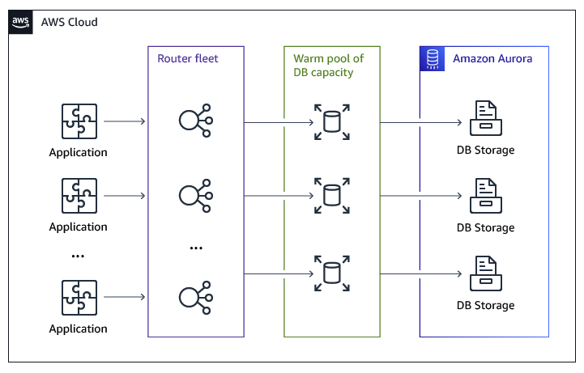
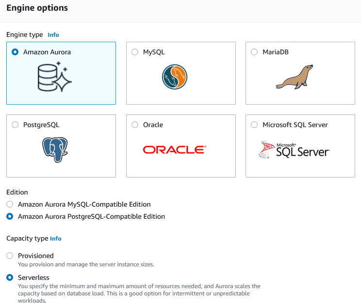
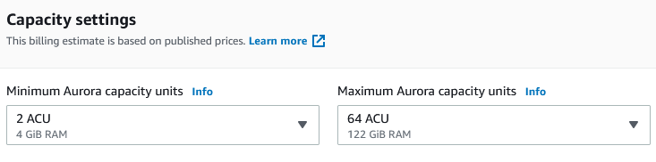

# Amazon Aurora Serverless v1

Amazon Aurora Serverless v1 (Amazon Aurora Serverless version 1) is an on-demand autoscaling configuration for Amazon Aurora. An Aurora Serverless DB cluster is a DB cluster that scales compute capacity up and down based on your application’s needs. This contrasts with Aurora provisioned DB clusters, for which you manually manage capacity. Aurora Serverless v1 provides a relatively simple, cost-effective option for infrequent, intermittent, or unpredictable workloads. It is cost-effective because it automatically starts up, scales compute capacity to match your application’s usage, and shuts down when it’s not in use.

To learn more about pricing, see Serverless Pricing under MySQL-Compatible Edition or PostgreSQL-Compatible Edition on the [Amazon Aurora pricing page](https://aws.amazon.com/rds/aurora/pricing "https://aws.amazon.com/rds/aurora/pricing").

Aurora Serverless v1 clusters have the same kind of high-capacity, distributed, and highly available storage volume that is used by provisioned DB clusters. The cluster volume for an Aurora Serverless v1 cluster is always encrypted. You can choose the encryption key, but you can’t disable encryption. That means that you can perform the same operations on an Aurora Serverless v1 that you can on encrypted snapshots. For more information, see Aurora Serverless v1 and snapshots.

Aurora Serverless v1 provides the following advantages:

- **Simpler than provisioned**. Aurora Serverless v1 removes much of the complexity of managing DB instances and capacity.
- **Scalable**. Aurora Serverless v1 seamlessly scales compute and memory capacity as needed, with no disruption to client connections.
- **Cost-effective**. When you use Aurora Serverless v1, you pay only for the database resources that you consume, on a per-second basis.
- **Highly available storage**. Aurora Serverless v1 uses the same fault-tolerant, distributed storage system with six-way replication as Aurora to protect against data loss.
  Aurora Serverless v1 is designed for the following use cases:

- **Infrequently used applications**. You have an application that is only used for a few minutes several times for each day or week, such as a low-volume blog site. With Aurora Serverless v1, you pay for only the database resources that you consume on a per-second basis.
- **New applications**. You’re deploying a new application and you’re unsure about the instance size you need. By using Aurora Serverless v1, you can create a database endpoint and have the database automatically scale to the capacity requirements of your application.
- **Variable workloads**. You’re running a lightly used application, with peaks of 30 minutes to several hours a few times each day, or several times for each year. Examples are applications for human resources, budgeting, and operational reporting applications. With Aurora Serverless v1, you no longer need to provision for peak or average capacity.
- **Unpredictable workloads**. You’re running daily workloads that have sudden and unpredictable increases in activity. An example is a traffic site that sees a surge of activity when it starts raining. With Aurora Serverless v1, your database automatically scales capacity to meet the needs of the application’s peak load and scales back down when the surge of activity is over.
- **Development and test databases**. Your developers use databases during work hours but don’t need them on nights or weekends. With Aurora Serverless v1, your database automatically shuts down when it’s not in use.
- **Multi-tenant applications**. With Aurora Serverless v1, you don’t have to individually manage database capacity for each application in your fleet. Aurora Serverless v1 manages individual database capacity for you.
  This process takes almost no time and since the storage is shared between nodes Aurora can scale up or down in seconds for most workloads. The service currently has autoscaling thresholds of 1.5 minutes to scale up and 5 minutes to scale down. That means metrics must exceed the limits for 1.5 minutes to trigger a scale up or fall below the limits for 5 minutes to trigger a scale down. The cool-down period between scaling activities is 5 minutes to scale up and 15 minutes to scale down. Before scaling can happen the service has to find a “scaling point” which may take longer than anticipated if you have long-running transactions. Scaling operations are transparent to the connected clients and applications since existing connections and session state are transferred to the new nodes. The only difference with pausing and resuming is a higher latency for the first connection, typically around 25 seconds. You can find more details in the documentation.

## How to provision

Log in to your [AWS console](https://eu-central-1.console.aws.amazon.com/rds/home?#databases: "https://eu-central-1.console.aws.amazon.com/rds/home?#databases:"), choose **Amazon RDS** , and then choose **Create database**.

On **Engine options**, choose **Serverless** for the **Capacity type**.

Choose the capacity settings for your use case.

For more information, see [Amazon Aurora Serverless](https://aws.amazon.com/rds/aurora/serverless "https://aws.amazon.com/rds/aurora/serverless"), [Aurora Serverless MySQL Generally Available](https://aws.amazon.com/blogs/aws/aurora-serverless-ga/ "https://aws.amazon.com/blogs/aws/aurora-serverless-ga/"), and [Amazon Aurora PostgreSQL Serverless Now Generally Available](https://aws.amazon.com/blogs/aws/amazon-aurora-postgresql-serverless-now-generally-available "https://aws.amazon.com/blogs/aws/amazon-aurora-postgresql-serverless-now-generally-available").
