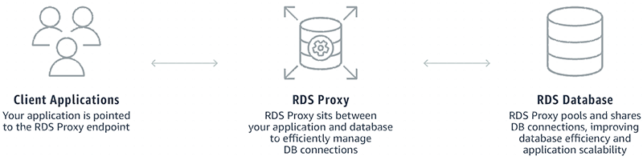

# Amazon RDS Proxy

Amazon RDS Proxy is a fully managed, highly available database proxy for Amazon Relational Database Service (RDS) that makes applications more scalable, more resilient to database failures, and more secure.

Many applications, including those built on modern server-less architectures, can have many open connections to the database server, and may open and close database connections at a high rate, exhausting database memory and compute resources. Amazon RDS Proxy allows applications to pool and share connections established with the database, improving database efficiency and application scalability. With Amazon RDS Proxy, fail-over times for Aurora and Amazon RDS databases are reduced by up to 66% and database credentials, authentication, and access can be managed through integration with AWS Secrets Manager and AWS Identity and Access Management (IAM).

Amazon RDS Proxy can be enabled for most applications with no code changes, and you don’t need to provision or manage any additional infrastructure. Pricing is simple and predictable: you pay for each vCPU of the database instance for which the proxy is enabled. Amazon RDS Proxy is now generally available for Aurora MySQL, Aurora PostgreSQL, Amazon RDS for MySQL, and Amazon RDS for PostgreSQL.

## Amazon RDS Proxy benefits

- **Improved application performance**. Amazon RDS proxy manages a connection pooling which helps with reducing the stress on database compute and memory resources that typically occurs when new connections are established and it is useful to
  efficiently support a large number and frequency of application connections.
- **Increase application availability**. By automatically connecting to a new database instance while preserving application connections Amazon RDS Proxy can reduce fail-over time by 66%.
- **Manage application security**. Amazon RDS Proxy also enables you to centrally manage database credentials using AWS Secrets Manager.
- **Fully managed**. Amazon RDS Proxy gives you the benefits of a database proxy without requiring additional burden of patching and managing your own proxy server.
- **Fully compatible with your database**. Amazon RDS Proxy is fully compatible with the protocols of supported database engines, so you can deploy Amazon RDS Proxy for your application without making changes to your application code.
- **Available and durable**. Amazon RDS Proxy is highly available and deployed over multiple Availability Zones (AZs) to protect you from infrastructure failure.

## How Amazon RDS Proxy works

For more information, see [Amazon Relational Database Service Proxy for Scalable Serverless Applications](https://aws.amazon.com/blogs/aws/amazon-rds-proxy-now-generally-available "https://aws.amazon.com/blogs/aws/amazon-rds-proxy-now-generally-available") and [Amazon Relational Database Service Proxy](https://aws.amazon.com/rds/proxy "https://aws.amazon.com/rds/proxy").
