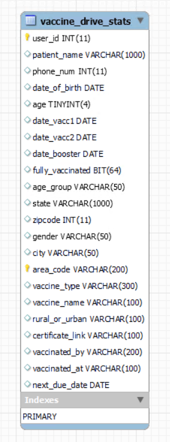
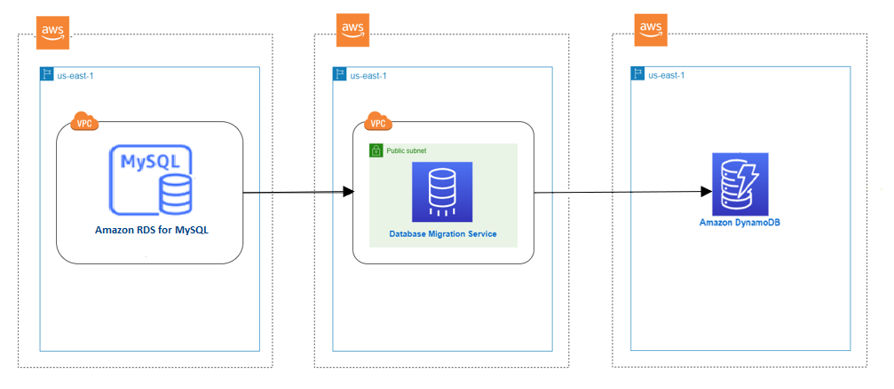

# Migrating an Amazon RDS for MySQL Database to an Amazon DynamoDB target

This walkthrough helps you to understand the process of migrating data from Amazon Relational Database Service (Amazon RDS) for MySQL to Amazon DynamoDB using AWS Database Migration Service (AWS DMS).

Amazon DynamoDB is a key-value and document database that delivers single-digit millisecond performance at any scale for modern applications. It’s a fully managed, multi-region, multi-master, durable database with built-in security, backup and restore, and in-memory caching for internet-scale applications. DynamoDB can handle more than 10 trillion requests per day and can support peaks of more than 20 million requests per second. Many of the world’s fastest growing businesses depend on the scale and performance of DynamoDB to support their mission-critical workloads.

Customers use DynamoDB for banking/finance, gaming, ad-tech, retail, media & entertainment workloads to build internet-scale applications supporting user-content metadata and caches. It requires high concurrency and connections for millions of users and requests, where there is a requirement for a very stringent response time. With DynamoDB, you can use design patterns for deploying shopping carts, workflow engines, inventory tracking, customer profiles, fraud detection, and leader boards, to name a few.

In this document, we will talk about a use case where a customer is running an application that handles a COVID-19 vaccination drive and stores this information in a data store. Currently, they use RDS MySQL to store vaccine data, but because of the sheer scale where data of millions of people can be getting stored at the same time, MySQL poses scalability challenges vis-à-vis response time. As business and application requirements are sensitive enough for response time in both writing data and reading it back, a relational database like MySQL cannot meet the SLA requirements. So, the customer decides to migrate to DynamoDB, which is purpose built to be performant at scale and is specifically designed to handle such use cases. The business also requires that the initial transfer of data from RDS MySQL to Amazon DynamoDB must complete within a 15-hour window.

To illustrate the process, we use AWS DMS to migrate data from an example database. AWS DMS is a managed service that helps migrate between heterogeneous sources and targets. In our case, we migrate an RDS MySQL database to Amazon DynamoDB. AWS DMS supports not only the migration of your existing data, but also ensures that the source and target are synchronized for ongoing transactions.

###### Topics

- [Why use AWS DMS?](#chap-manageddatabases.mysql2dynamodb.whydms "#chap-manageddatabases.mysql2dynamodb.whydms")
- [Example data set](#chap-manageddatabases.mysql2dynamodb.sampledataset "#chap-manageddatabases.mysql2dynamodb.sampledataset")
- [Solution overview](#chap-manageddatabases.mysql2dynamodb.solutionoverview "#chap-manageddatabases.mysql2dynamodb.solutionoverview")
- [Prerequisites](#chap-manageddatabases.mysql2dynamodb.prerequisites "#chap-manageddatabases.mysql2dynamodb.prerequisites")
- [Step-by-step Amazon RDS for MySQL database to Amazon DynamoDB migration walkthrough](chap-manageddatabases.mysql2dynamodb.md "chap-manageddatabases.mysql2dynamodb.md")

## Why use AWS DMS?

When migrating from a relational database like MySQL to Dynamo DB, there are multiple approaches that you can take. One can be dumping your data using a CSV dump and loading that into Amazon DynamoDB Tables from S3. However, it comes with its own challenges in regard to size and requires taking extended downtime. AWS DMS supports binary log-based replication between MySQL based engines and Dynamo DB which can help achieve such migrations with minimal downtime. Also, Relational Database Management System (RDBMS) tables store the data in a normalized way across multiple tables. However, using DMS, you can customize the target table using the object mapping feature to denormalize the data into a single target table.

In this document, we guide you through the steps that you take to migrate the example MySQL database into Amazon DynamoDB. In the next sections, we describe the characteristics of the database. Then, we build the replication resources in AWS DMS that we use to migrate the database, paying close attention to matching the AWS DMS configuration with our particular use case.

## Example data set

In this walkthrough, the following is the table information that is used to store the vaccine drive data. As it can be noted that the schema does not completely play out the relational model of normalization, and all data are stored in a single table in a de-normalized way.

Generally, relational tables are used to fetch a fixed data set based on the table definition. However, in this use case, we define the tables in a de-normalized manner, and going forward based on the business requirement schema, growth can be exponential in rate and dynamic in nature. Services like Amazon DynamoDB help application developers and architects to rethink the data model in a key-value format for such use cases, and plan to move the data store on DynamoDB.

The “vaccine_drive_stats” table contains 1022 million records with a size of 210 GB. This table mainly collects the information for people who participated in the vaccination program, including their vaccine status and user details.

Note that the table contains composite primary keys for the “user_id” and “area_code” columns. In MySQL, the application and admin user accesses the data using composite keys for reporting and manipulating the records in the tables.

There are additional use cases to get aggregate data , such as the total number of people who have received the first or second vaccination, state-wise vaccine numbers, total percentage of the population receiving vaccination, etc. All of these aggregate use cases can be handled using a DynamoDB schema designed to cater to aggregations.

Migration of this use case can be handled using one-to-one mapping from RDBMS MySQL to a DynamoDB table.

Similarly, if you have the following types of tables, you can consider migrating to a DynamoDB target using DMS with less downtime.

1. Table with non-relational data
2. Logging tables
3. User preference tables
4. Application Session state tables

## Solution overview

The following diagram displays a high-level architecture of the solution, where we use AWS DMS to move data from a MySQL database hosted on RDS to Amazon DynamoDB.

To connect to the source database where your data resides and target Amazon DynamoDB, you will create two endpoint resources in AWS DMS. An “endpoint” is a resource for storing connection information such as hostname, username, and password. For DynamoDB, it stores an IAM role name that provides access to resources. Endpoint resources also store unique settings for each endpoint to configure the endpoint behavior.

The endpoint itself does not have a mechanism to connect to the source or target. A resource called a “replication task” connects to the source and target to migrate data. One source and target endpoint can be associated with single replication task. Tasks can use source and target endpoints, which are used by other tasks.

A replication instance is a resource where your replication task is running. It has a network interface connected to your VPC, through which AWS DMS tasks communicate with sources and targets.

In summary, in this walkthrough you will set up the following resources in AWS DMS

- **Replication Instance** — An AWS managed instance that hosts the AWS DMS engine. You control the type or size of the instance based on your workload.
- **Source Endpoint** — A resource that provides connection details, data store type, and credentials to connect to a source database. For this use case, we will configure the source endpoint to point to the Amazon RDS for MySQL database.
- **Target table** - A DynamoDB table used on this scenario to consume the data from the Source database. We will create a DynamoDB table with customized settings for migration.
- **Target Endpoint** — AWS DMS supports several target systems including Amazon RDS, Amazon Aurora, Amazon Redshift, Amazon Kinesis Data Streams, Amazon S3, and more. For this use case, we will configure Amazon Dynamo DB as the target endpoint.
- **Replication Task** — A resource that runs on the replication instance and connects to endpoints to replicate data from the source to the target.

## Prerequisites

The following prerequisites are required to complete this walkthrough:

- An understanding of Amazon Relational Database Service (Amazon RDS), the applicable database technologies, and SQL.
- A user with AWS Identity and Access Management (IAM) credentials that allows you to launch Amazon RDS and AWS Database Migration Service (AWS DMS) instances in your AWS Region. For information about IAM credentials, see [Create an IAM user](../userguide/CHAP_GettingStarted.md#CHAP_SettingUp.IAM "../userguide/CHAP_GettingStarted.md#CHAP_SettingUp.IAM").
- An understanding of the Amazon Virtual Private Cloud (Amazon VPC) service and security groups. For information about using Amazon VPC with Amazon RDS, see [Amazon Virtual Private Cloud (VPCs) and Amazon RDS](../../../AmazonRDS/latest/UserGuide/USER_VPC.md "../../../AmazonRDS/latest/UserGuide/USER_VPC.md"). For information about Amazon RDS security groups, see [Controlling access with security groups](../../../AmazonRDS/latest/UserGuide/Overview.md "../../../AmazonRDS/latest/UserGuide/Overview.md").
- An understanding of the supported features and limitations of AWS DMS. For information about AWS DMS, see [What is Database Migration Service](../userguide/Welcome.md "../userguide/Welcome.md")?
- An understanding of how to work with MySQL as a source and Amazon DynamoDB as a target. For information about working with MySQL as a source, see [Using an MySQL database as a source](../userguide/CHAP_Source.md "../userguide/CHAP_Source.md"). For information about working with Amazon DynamoDB as a target, see [Using Amazon DynamoDB as a target](../userguide/CHAP_Target.md "../userguide/CHAP_Target.md").
- An understanding of the supported data type conversion options for MySQL and Amazon DynamoDB. For information about data types for MySQL as a source, see [Source data types for MySQL](../userguide/CHAP_Source.md#CHAP_Source.MySQL.DataTypes "../userguide/CHAP_Source.md#CHAP_Source.MySQL.DataTypes"). For information about data types for Amazon DynamoDB as a target, see [Target data types for Amazon DynamoDB](../userguide/CHAP_Target.md#CHAP_Target.DynamoDB.DataTypes "../userguide/CHAP_Target.md#CHAP_Target.DynamoDB.DataTypes").

For more information about AWS DMS, see [Getting started with Database Migration Service](../userguide/CHAP_GettingStarted.md "../userguide/CHAP_GettingStarted.md").
