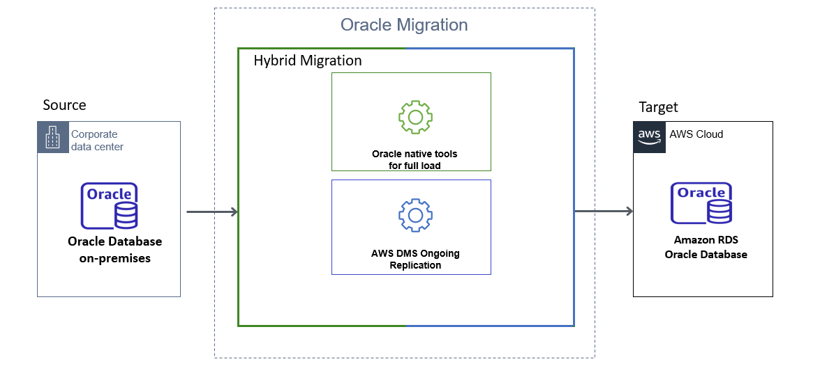

# Migrating an Oracle Database to Amazon RDS for Oracle

You can use these three main approaches to migrate self-managed Oracle databases to Amazon Relational Database Service (Amazon RDS) for Oracle.

- Using a native database tool such as Oracle Data Pump.
- Using a managed service such as the AWS Database Migration Service (AWS DMS).
- Using a native tool for the full load phase and AWS DMS for ongoing replication.
  This document describes the third strategy — we call this the hybrid approach. The following diagram shows the components of the hybrid approach.

The hybrid approach provides the following advantages.

- To automate the creation of secondary database objects such as views, indexes, and constraints.
- To use AWS DMS data validation to ensure your target data matches with the source, row by row and column by column.
- To use some of the other capabilities that AWS DMS provides, for example data filtering or renaming tables and columns.
  This document describes the native options for the full load. It also includes a comparison so you can evaluate the options against your migration requirements. In conclusion, you can find a brief description of how to use AWS DMS for ongoing replication.

###### Topics

- [Summary](#_summary "#_summary")
- [Full load Oracle database migration](chap-manageddatabases.oracle2rds.md "chap-manageddatabases.oracle2rds.md")
- [Full load Oracle database migration options performance comparison](chap-manageddatabases.oracle2rds.md "chap-manageddatabases.oracle2rds.md")
- [Migrate Oracle database with AWS DMS ongoing replication](chap-manageddatabases.oracle2rds.md "chap-manageddatabases.oracle2rds.md")

## Summary

To migrate database objects and data, use either Oracle Export/Import or Oracle Data Pump. Oracle Export/Import and Oracle Data Pump automate schema object creation. Oracle Data Pump has better performance than Oracle Export/Import and it’s a newer version of Oracle Export/Import.

You can still choose to work with Oracle Export/Import for relatively small data sets which are less than 10 GB because of the ease of use. To migrate table data only, choose any native full load option described in the full load and performance comparison sections.

For full load and ongoing replication, use the hybrid approach. AWS DMS recommends using Oracle Data Pump for full load because it’s faster than other tools, and it automates target object creation.
