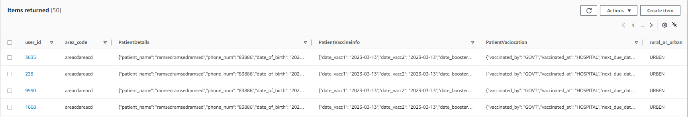
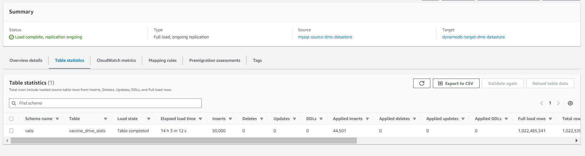
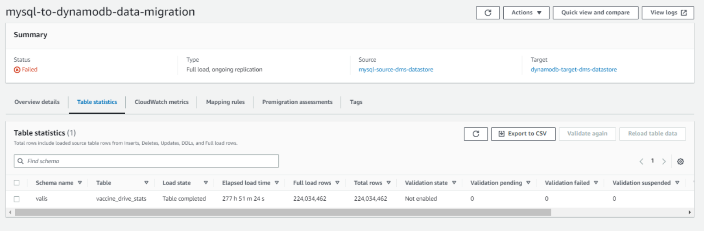
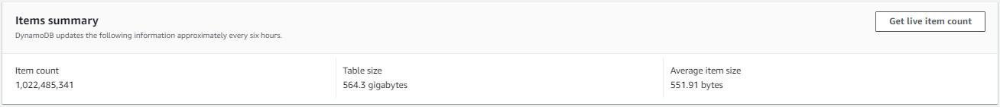

# Step-by-step Amazon RDS for MySQL database to Amazon DynamoDB migration walkthrough

The following steps provide instructions for migrating an Amazon RDS for MySQL database to DynamoDB. These steps assume that you have already prepared your source database as described previously.

Step 1: [Create an AWS DMS Replication Instance](#step1 "#step1")

Step 2: [Configure a Source Amazon RDS for MySQL Database](#step2 "#step2")

Step 3: [Create an AWS DMS Source Endpoint](#step3 "#step3")

Step 4: [Configure a Target Amazon DynamoDB table](#step4 "#step4")

Step 5: [Configure an AWS DMS Target Endpoint](#step5 "#step5")

Step 6: [Create an AWS DMS Task](#step6 "#step6")

Step 7: [Run the AWS DMS Task](#step7 "#step7")

## Step 1: Create replication instance

An AWS DMS replication instance hosts the software that migrates data between the source and target. The replication instance also caches the transaction logs during the migration. The CPU and memory capacity of the replication instance influences the overall time needed for the migration. Make sure that you consider the specifics of your particular use case when you determine the size of your replication instance. A full load task consumes a lot of memory if it is run multithreaded. For more information, see [Choosing the right replication instance for your migration](../userguide/CHAP_ReplicationInstance.md "../userguide/CHAP_ReplicationInstance.md").

For our use case, we have a limited time window of 15 hours to complete the full load, and the table that includes 210 GB of data. Our goal is to fit into the 10-hour window. Therefore, we scale the replication instance to accommodate these requirements.

Each type of instance class has a different CPU, memory, and I/O capacity. Sizing the replication instance should be based on factors such as data volume, transaction frequency, large objects (LOBs) within storage of the data migration, and so on. We initially chose a DMS dms.c5.large instance running the latest AWS DMS engine version and default task configuration. We then upgraded to a dms.c5.12xlarge instance with a customized task configuration to see the performance differences. We will discuss the performance and configuration details in an upcoming section.

We also upgraded the storage of the replication instance to 200 GB, and as a result, 600 IOPS were available for our replication instance. By default, DMS allocates 50 GB of storage to a replication instance. This may not be sufficient for use cases where more tasks are running on same replication instance or when running tasks with parallel load for large tables. With 600 IOPS, we saved several minutes of migration time. For more information about storage volume performance and burst I/O credits, see [General Purpose SSD (gp2) volumes](../../../AWSEC2/latest/UserGuide/general-purpose.md#EBSVolumeTypes_gp2 "../../../AWSEC2/latest/UserGuide/general-purpose.md#EBSVolumeTypes_gp2").

Because we replicate production data in this walkthrough, we use the Multi-AZ deployment option for our replication instance for high availability. Also, we didn’t make this replication instance publicly accessible for additional security.
For information about best practices for using AWS DMS, see [Database Migration Service Best Practices](https://d0.awsstatic.com/whitepapers/RDS/AWS_Database_Migration_Service_Best_Practices.pdf "https://d0.awsstatic.com/whitepapers/RDS/AWS_Database_Migration_Service_Best_Practices.pdf").

To create an AWS DMS replication instance, do the following:

1. Sign in to the AWS Management Console, and open the [AWS DMS console](https://console.aws.amazon.com/dms/v2 "https://console.aws.amazon.com/dms/v2").
2. If you are signed in as an AWS Identity and Access Management (IAM) user, you must have the appropriate permissions to access AWS DMS. For more information about the permissions required, see [IAM permissions](../userguide/CHAP_Security.md#CHAP_Security.IAMPermissions "../userguide/CHAP_Security.md#CHAP_Security.IAMPermissions").
3. On the Welcome page, choose **Create replication instance** to start a database migration.
4. On the **Create replication instance** page, specify your replication instance information.

|                                                                                                             |                                                                                                                                                                                                              |
| ----------------------------------------------------------------------------------------------------------- | ------------------------------------------------------------------------------------------------------------------------------------------------------------------------------------------------------------ | --------------------------------------------------------------------------------------------------------------------------------------------------------------------------------------------------------------------------------------------------------------------------------------------------------------------------------------------------------------------------------------------------------------------------------------------------------------------------------------------------------------------------------------------------------------------------------------------------------------------------------------------------------------------------------------------------------------------------------------------------------------------------------------------------------------------------------------------------------------------------------------------------------------------------------------------------------------------------------------------------------------------------------------------------------------------------------------------------------------------------------------------------------------------------------------------------------------------------------------------------------------------------------------------------------------------------------------------------------------------------------------------------------------------------------------------------------------------------------------------------------------------------------------------------------------------------------------------------------------------------------------------------------------------------------------------------------------------------------------------------------------------------------------------------------------------------------------------------------------------------------------------------------------------------------------------------------------------------------------------------------------------------------------------------------------------------------------------------------------------------------------------------------------------------------------------------------------------------------------------------------------------------------------------------------------------------------------------------------------------------------------------------------------------------------------------------------------------------------------------------------------------------------------------------------------------------------------------------------------------------------------------------------------------------------------------------------------------------------------------------------------------------------------------------------------------------------------------------------------------------------------------------------------------------------------------------------------------------------------------------------------------------------------------------------------------------------------------------------------------------------------------------------------------------------------------------------------------------------------------------------------------------------------------------------------------------------------------------------------------------------------------------------------------------------------------------------------------------------------------------------------------------------------------------------------------------------------------------------------------------------------------------------------------------------------------------------------------------------------------------------------------------------------------------------------------------------------------------------------------------------------------------------------------------------------------------------------------------------------------------------------------------------------------------------------------------------------------------------------------------------------------------------------------------------------------------------------------------------------------------------------------------------------------------------------------------------------------------------------------------------------------------------------------------------------------------------------------------------------------------------------------------------------------------------------------------------------------------------------------------------------------------------------------------------------------------------------------------------------------------------------------------------------------------------------------------------------------------------------------------------------------------------------------------------------------------------------------------------------------------------------------------------------------------------------------------------------------------------------------------------------------------------------------------------------------------------------------------------------------------------------------------------------------------------------------------------------------------------------------------------------------------------------------------------------------------------------------------------------------------------------------------------------------------------------------------------------------------------------------------------------------------------------------------------------------------------------------------------------------------------------------------------------------------------------------------------------------------------------------------------------------------------------------------------------------------------------------------------------------------------------------------------------------------------------------------------------------------------------------------------------------------------------------------------------------------------------------------------------------------------------------------------------------------------------------------------------------------------------------------------------------------------------------------------------------------------------------------------------------------------------------------------------------------------------------------------------------------------------------------------------------------------------------------------------------------------------------------------------------------------------------------------------------------------------------------------------------------------------------------------------------------------------------------------------------------------------------------------------------------------------------------------------------------------------------------------------------------------------------------------------------------------------------------------------------------------------------------------------------------------------------------------------------------------------------------------------------------------------------------------------------------------------------------------------------------------------------------------------------------------------------------------------------------------------------------------------------------------------------------------------------------------------------------------------------------------------------------------------------------------------------------------------------------------------------------------------------------------------------------------------------------------------------------------------------------------------------------------------------------------------------------------------------------------------------------------------------------------------------------------------------------------------------------------------------------------------------------------------------------------------------------------------------------------------------------------------------------------------------------------------------------------------------------------------------------------------------------------------------------------------------------------------------------------------------------------------------------------------------------------------------------------------------------------------------------------------------------------------------------------------------------------------------------------------------------------------------------------------------------------------------------------------------------------------------------------------------------------------------------------------------------------------------------------------------------------------------------------------------------------------------------------------------------------------------------------------------------------------------------------------------------------------------------------------------------------------------------------------------------------------------------------------------------------------------------------------------------------------------------------------------------------------------------------------------------------------------------------------------------------------------------------------------------------------------------------------------------------------------------------------------------------------------------------------------------------------------------------------------------------------------------------------------------------------------------------------------------------------------------------------------------------------------------------------------------------------------------------------------------------------------------------------------------------------------------------------------------------------------------------------------------------------------------------------------------------------------------------------------------------------------------------------------------------------------------------------------------------------------------------------------------------------------------------------------------------------------------------------------------------------------------------------------------------------------------------------------------------------------------------------------------------------------------------------------------------------------------------------------------------------------------------------------------------------------------------------------------------------------------------------------------------------------------------------------------------------------------------------------------------------------------------------------------------------------------------------------------------------------------------------------------------------------------------------------------------------------------------------------------------------------------------------------------------------------------------------------------------------------------------------------------------------------------------------------------------------------------------------------------------------------------------------------------------------------------------------------------------------------------------------------------------------------------------------------------------------------------------------------------------------------------------------------------------------------------------------------------------------------------------------------------------------------------------------------------------------------------------------------------------------------------------------------------------------------------------------------------------------------------------------------------------------------------------------------------------------------------------------------------------------------------------------------------------------------------------------------------------------------------------------------------------------------------------------------------------------------------------------------------------------------------------------------------------------------------------------------------------------------------------------------------------------------------------------------------------------------------------------------------------------------------------------------------------------------------------------------------------------------------------------------------------------------------------------------------------------------------------------------------------------------------------------------------------------------------------------------------------------------------------------------------------------------------------------------------------------------------------------------------------------------------------------------------------------------------------------------------------------------------------------------------------------------------------------------------------------------------------------------------------------------------------------------------------------------------------------------------------------------------------------------------------------------------------------------------------------------------------------------------------------------------------------------------------------------------------------------------------------------------------------------------------------------------------------------------------------------------------------------------------------------------------------------------------------------------------------------------------------------------------------------------------------------------------------------------------------------------------------------------------------------------------------------------------------------------------------------------------------------------------------------------------------------------------------------------------------------------------------------------------------------------------------------------------------------------------------------------------------------------------------------------------------------------------------------------------------------------------------------------------------------------------------------------------------------------------------------------------------------------------------------------------------------------------------------------------------------------------------------------------------------------------------------------------------------------------------------------------------------------------------------------------------------------------------------------------------------------------------------------------------------------------------------------------------------------------------------------------------------------------------------------------------------------------------------------------------------------------------------------------------------------------------------------------------------------------------------------------------------------------------------------------------------------------------------------------------------------------------------------------------------------------------------------------------------------------------------------------------------------------------------------------------------------------------------------------------------------------------------------------------------------------------------------------------------------------------------------------------------------------------------------------------------------------------------------------------------------------------------------------------------------------------------------------------------------------------------------------------------------------------------------------------------------------------------------------------------------------------------------------------------------------------------------------------------------------------------------------------------------------------------------------------------------------------------------------------------------------------------------------------------------------------------------------------------------------------------------------------------------------------------------------------------------------------------------------------------------------------------------------------------------------------------------------------------------------------------------------------------------------------------------------------------------------------------------------------------------------------------------------------------------------------------------------------------------------------------------------------------------------------------------------------------------------------------------------------------------------------------------------------------------------------------------------------------------------------------------------------------------------------------------------------------------------------------------------------------------------------------------------------------------------------------------------------------------------------------------------------------------- |
| For this parameter                                                                                          | Do the following                                                                                                                                                                                             |
| **Name**                                                                                                    | Enter **mysql-to-ddb-migration-ri**. If you are using multiple replication servers or sharing an account, choose a name that helps you quickly differentiate between the different servers.                  |
| **Description**                                                                                             | Enter **Migrate MySQL to Amazon DynamoDB**.                                                                                                                                                                  |
| **Instance class**                                                                                          | Choose **dms.c5.12xlarge**. Each size and type of instance class has increasing CPU, memory, and I/O capacity.                                                                                               |
| **Engine version**                                                                                          | Leave the default value, which is the latest stable version of the AWS DMS replication engine.                                                                                                               |
| **Allocated storage (GiB)**                                                                                 | Choose **200 GiB**.                                                                                                                                                                                          |
| **VPC**                                                                                                     | Choose the virtual private cloud (VPC) in which your replication instance will launch. Select the same VPC in which your source is placed.                                                                   |
| **Multi AZ**                                                                                                | In this scenario, choose **No**. If you choose **Yes**, AWS DMS creates a second replication server in a different Availability Zone for failover if there is a problem with the primary replication server. |
| **Publicly accessible**                                                                                     | Choose **Yes**. If either your source or target database resides outside of the VPC in which your replication server resides, you must make your replication server policy publicly accessible.              | 1. Choose **Create**. ## Step 2: Configure a Source Amazon RDS for MySQL Database Before setting up AWS DMS resource, there are some setups are required to configure your MySQL DB instances as a source for AWS DMS. As you know, in this walkthrough we are using a MySQL database on Amazon RDS, so DMS MySQL required prerequisites has to be enabled at the instance parameter group. ### Binary logging and its retention To use AWS DMS change data capture (CDC), enable binary logging on the source MySQL RDS instance. To enable binary logs for RDS for MySQL and for RDS for MariaDB, enable automatic backups at the instance level. For more information about setting up automatic backups, see [Working with automated backups](../../../AmazonRDS/latest/UserGuide/USER_WorkingWithAutomatedBackups.md "../../../AmazonRDS/latest/UserGuide/USER_WorkingWithAutomatedBackups.md") in the _Amazon RDS User Guide_. Next, the following parameters must be configured on the parameter group used by the source database. You can’t modify a default parameter group. If the database instance is using a default parameter group, create a new parameter group and associate it with the database instance. After you perform these steps, you must reboot the database instance for your changes to apply. The following parameters are dynamic types, so a custom parameter group with the below values doesn’t require an instance reboot. `binlog_format=ROW` `binlog_checksum=NONE` `binlog_row_image=FULL` To ensure that binary logs are available to AWS DMS, you should increase the length of time that the logs remain available in the database instance host. For example, to increase the log retention to 24 hours, execute the following procedure call on the source database. `call mysql.rds_set_configuration('binlog retention hours', 24);` Also, it is recommended to retain the binary logs until the task completes the full load phase, and runs the CDC phase with less latency. In the planning phase, test your workload, and based on that, retain the logs for the production migration. ### Source User Permission You must have an account for AWS DMS that has the Replication Admin role. The role needs the following privileges to run the CDC task. **REPLICATION CLIENT** – This privilege is required for CDC tasks only. In other words, full-load-only tasks don’t require this privilege. **REPLICATION SLAVE** – This privilege is required for CDC tasks only. In other words, full-load-only tasks don’t require this privilege. The AWS DMS user must also have SELECT privileges for the source tables designated for replication. ### Network configuration In this walkthrough, the DB instance and the replication instance are placed in the same VPC and the same subnet, so all you need to do is configure security groups, network ACLs, and route tables so that these Amazon RDS for MySQL DB instances and AWS DMS replication instances can communicate within the subnet. If you have source databases in different subnets or different VPCs, you need to configure your network to allow communication between the Amazon RDS for MySQL DB instance and the AWS DMS replication instance. For more information about network setup, see [Network configurations for database migration](../userguide/CHAP_ReplicationInstance.md "../userguide/CHAP_ReplicationInstance.md") in the _DMS user Guide_. ### Inbound connection rule To ensure that the replication instance can access the server and the port for the database, you need to make changes to the relevant security groups and network access control lists. AWS DMS only requires access to the MySQL database listener port (3306). Also, the connection is always from the AWS DMS replication instance to MySQL. Therefore, allow connections from the replication instance to the ingress rule of the security group attached to the DB instance. We recommend you to add the complete subnet group range in the ingress rule, because the AWS DMS replication instance is a managed service and the IP address may change automatically. ## Step 3: Create an AWS DMS Source Endpoint After you complete the network configurations, you can create a source endpoint. To create a source endpoint, do the following: 1. Open the AWS DMS console at [https://console.aws.amazon.com/dms/v2/](https://console.aws.amazon.com/dms/v2/ "https://console.aws.amazon.com/dms/v2/"). 2. Choose **Endpoints**. 3. Choose **Create endpoint**. 4. On the **Create endpoint** page, enter the following information.                                                                                                                                                                                                                                                                                                                                                                                                                                                                                                                                                                                                                                                                                                                                                                                                                                                                                                                                                                                                                                                                                                                                                                                                                                                                                                                                                                                                                                                                                                                                                                                                                                                                                                                                                                                                                                                                                                                                                                                                                                                                                                                                                                                                                                                                                                                                                                                                                                                                                                                                                                                                                                                                                                                                                                                                                                                                                                                                                                                                                                                                                                                                                                                                                                                                                                                                                                                                                                                                                                                                                                                                                                                                                                                                                                                                                                                                                                                                                                                                                                                                                                                                                                                                                                                                                                                                                                                                                                                                                                                                                                                                                                                                                                                                                                                                                                                                                                                                                                                                                                                                                                                                                                                                                                                                                                                                                                                                                                                                                                                                                                                                                                                                                                                                                                                                                                                                                                                                                                                                                                                                                                                                                                                                                                                                                                                                                                                                                                                                                                                                                                                                                                                                                                                                                                                                                                                                                                                                                                                                                                                                                                                                                                                                                                                                                                                                                                                                                                                                                                                                                                                                                                                                                                                                                                                                                                                                                                                                                                                                                                                                                                                                                                                                                                                                                                                                                                                                                                                                                                                                                                                                                                                                                                                                                                                                                                                                                                                                                                                                                                                                                                                                                                                                                                                                                                                                                                                                                                                                                                                                                                                                                                                                                                                                                                                                                                                                                                                                                                                                                                                                                                                                                                                                                                                                                                                                                                                                                                                                                                                                                                                                                                                                                                                                                                                                                                                                                                                                                                                                                                                                                                                                                                                                                                                                                                                                                                                                                                                                                                                                                                                                                                                                                                                                                                                                                                                                                                                                                                                                                                                                                                                                                                                                                                                                                                                                                                                                                                                                                                                                                                                                                                                                                                                                                                                                                                                                                                                                                                                                                                                                                                                                                                                                                                                                                                                                    |
|                                                                                                             |                                                                                                                                                                                                              |
| ---                                                                                                         | ---                                                                                                                                                                                                          |
| Parameter                                                                                                   | Value                                                                                                                                                                                                        |
| **Endpoint type**                                                                                           | Choose **Source endpoint**                                                                                                                                                                                   |
| **Endpoint identifier**                                                                                     | Enter **mysql-source-dms-datastore**                                                                                                                                                                         |
| Source engine                                                                                               | Choose **MySQL**.                                                                                                                                                                                            |
| **Access to endpoint database**                                                                             | Choose **Provide access information manually**.                                                                                                                                                              |
| Server name                                                                                                 | Enter the MySQL Database host amazon ec2 instance IP                                                                                                                                                         |
| Port                                                                                                        | Enter **3306**.                                                                                                                                                                                              |
| **Secure Socket Layer (SSL) mode**                                                                          | Choose **none**.                                                                                                                                                                                             |
| **User name**                                                                                               | Enter **dms_user**.                                                                                                                                                                                          |
| Password                                                                                                    | Enter the password that you created for the `dms_user` user.                                                                                                                                                 | ## Step 4: Configure a Target Amazon DynamoDB table A DMS task can create a target DynamoDB table based on the source table definition. When AWS DMS sets DynamoDB parameter values for a migration task, the default Read Capacity Units (RCU) parameter value is set to 200. The Write Capacity Units (WCU) parameter value is also set, but its value depends on several other settings:  • The default value for the WCU parameter is 200.  • If the `ParallelLoadThreads` task setting is set greater than 1 (the default is 0), then the WCU parameter is set to 200 times the ParallelLoadThreads value. In this case, DMS uses the default provisioned capacity, which will not be sufficient to handle the workload from Source database. To avoid a resource constraint issue, and to customize the key usage, consider creating the target DynamoDB table with the configuration required by your workload. In this walkthrough, use the below source MySQL table definition to create the target DynamoDB table. As you can see below, the source table contains composite primary keys (`user_id`, `area_code`), so you can use these fields to create a DynamoDB table with a partition key and a sort key. ``Table: vaccine_drive_stats Create Table: CREATE TABLE `vaccine_drive_stats` ( 'user_id' int(11) NOT NULL AUTO_INCREMENT, 'patient_name' varchar(1000) DEFAULT NULL, 'phone_num' int(11) DEFAULT NULL, 'date_of_birth' date DEFAULT NULL, 'age' tinyint(4) DEFAULT NULL, 'date_vacc1' date DEFAULT NULL, 'date_vacc2' date DEFAULT NULL, 'date_booster' date DEFAULT NULL, 'fully_vaccinated' bit(64) DEFAULT NULL, 'age_group' varchar(50) DEFAULT NULL, 'state' varchar(1000) DEFAULT NULL, 'zipcode' int(11) DEFAULT NULL, 'gender' varchar(50) DEFAULT NULL, 'city' varchar(50) DEFAULT NULL, 'area_code' varchar(200) NOT NULL, 'vaccine_type' varchar(300) DEFAULT NULL, 'vaccine_name' varchar(100) DEFAULT NULL, 'rural_or_urban' varchar(100) DEFAULT NULL, 'certificate_link' varchar(100) DEFAULT NULL, 'vaccinated_by' varchar(200) DEFAULT NULL, 'vaccinated_at' varchar(100) DEFAULT NULL, 'next_due_date' date DEFAULT NULL, PRIMARY KEY ('user_id','area_code') ) ENGINE=InnoDB AUTO_INCREMENT=13462359 DEFAULT CHARSET=utf8mb4;`` To create an Amazon DynamoDB table, do the following. 1. Open the DynamoDB console at [https://console.aws.amazon.com/dynamodb/](https://console.aws.amazon.com/dynamodb/ "https://console.aws.amazon.com/dynamodb/"). 2. Choose **Create Table**. In the **Create DynamoDB table** screen, do the following: 3. On the Table name box, enter the name of the table as “vaccine_drive_stats_tab”. ###### Note The target table can be renamed as per your requirements, but make sure to map the table name using a DMS object mapping rule. The Dynamo DB sort/partition key for a table should be picked based on the table access patterns. DMS has the limitation in the CDC phase that DynamoDB doesn’t allow updates to the primary key attributes. This restriction is important when using ongoing replication with change data capture (CDC) because it can result in unwanted data on the target. Depending on how you have the object mapping, a CDC operation that updates the primary key can do one of two things: It can either fail, or insert a new item with the updated primary key and incomplete data. So, choose the partition key and sort key carefully to avoid issues in the migration. For the Primary key, do the following: DynamoDB query performance depends on the partition key and sort key selection for a table. So, choose a high cardinality column as the partition key to distribute the data across partitions in a DDB table. The sort key is used to sort and order items in a partition internally at the DDB table level. So, choose a sort key that collects related information together in one partition area, so that query performance can be improved. In this use case, we have chosen user_id as the partition key and "area_code" as the sort key to distribute and organize the data based on the application access pattern. Refer [Choosing the Right DynamoDB Partition Key](https://aws.amazon.com/blogs/database/choosing-the-right-dynamodb-partition-key/ "https://aws.amazon.com/blogs/database/choosing-the-right-dynamodb-partition-key/") for more details. 1. In the Partition key box, enter column name as “user_id” and set the data type to String. 2. Choose To add sort key. 3. In the Sort key box, enter column name as “area_code" and set the data type to String. 4. In table settings, choose Customize Settings and then select On-Demand Read/Write capacity 5. When the settings are as you want them, choose Create. In this Walkthrough, we are pre-creating the target table with On-demand capacity mode for migration. Later, based on the traffic flow, you can change the capacity mode on the target to save costs after the migration completes. For more information, see [Amazon DynamoDB create table](../../../amazondynamodb/latest/developerguide/getting-started-step-1.md "../../../amazondynamodb/latest/developerguide/getting-started-step-1.md"). ## Step 5: Configure an AWS DMS Target Endpoint Before you begin to work with a DynamoDB database as a target for AWS DMS, make sure that you create an IAM role. This IAM role should allow AWS DMS to assume the application role, and grants access to the DynamoDB tables that are being migrated into. The minimum set of access permissions is shown in the following IAM policy. `{ "Version": "2012-10-17", "Statement": [ { "Sid": "", "Effect": "Allow", "Principal": { "Service": "dms.amazonaws.com" }, "Action": "sts:AssumeRole" } ] }` DMS creates the control tables “awsdms_apply_exceptions” and “awsdms_full_load_exceptions” on the DynamoDB target to record the failures in loading/applying the records in the migration. So, the role that you use for the migration to DynamoDB must have the following permissions, including for control tables. `{ "Version": "2012-10-17", "Statement": [ { "Effect": "Allow", "Action": [ "dynamodb:PutItem", "dynamodb:CreateTable", "dynamodb:DescribeTable", "dynamodb:DeleteTable", "dynamodb:DeleteItem", "dynamodb:UpdateItem" ], "Resource": [ "arn:aws:dynamodb:us-west-2:account-id:table/name1", "arn:aws:dynamodb:us-west-2:account-id:table/OtherName*", "arn:aws:dynamodb:us-west-2:account-id:table/awsdms_apply_exceptions", "arn:aws:dynamodb:us-west-2:account-id:table/awsdms_full_load_exceptions" ] }, { "Effect": "Allow", "Action": [ "dynamodb:ListTables" ], "Resource": "*" } ] }` To create a target endpoint for Amazon DynamoDB, do the following: 1. Open the AWS DMS console at [https://console.aws.amazon.com/dms/v2/](https://console.aws.amazon.com/dms/v2/ "https://console.aws.amazon.com/dms/v2/"). 2. Choose **Endpoints**. 3. Choose **Create endpoint**. 4. On the **Create endpoint** page, enter the following information.                                                                                                                                                                                                                                                                                                                                                                                                                                                                                                                                                                                                                                                                                                                                                                                                                                                                                                                                                                                                                                                                                                                                                                                                                                                                                                                                                                                                                                                                                                                                                                                                                                                                                                                                                                                                                                                                                                                                                                                                                                                                                                                                                                                                                                                                                                                                                                                                                                                                                                                                                                                                                                                                                                                                                                                                                                                                                                                                                                                                                                                                                                                                                                                                                                                                                                                                                                                                                                                                                                                                                                                                                                                                                                                                                                                                                                                                                                                                                                                                                                                                                                                                                                                                                                                                                                                                                                                                                                                                                                                                                                                                                                                                                                                                                                                                                                                                                                                                                                                                                                                                                                                                                                                                                                                                                                                                                                                                                                                                                                                                                                                                                                                                                                                                                                                                                                                                                                                                                                                                                                                                                                                                                                                                                                                                                                                                                                                                                                                                                                                                                                                                                                                                                                                                                                                                                                                                                                                                                                                                                                                                                                                                                                                                                                                                                                                                                                                                                                                                                                                                                                                                                                                                                                                                                                                                                                                                                                                                                                                                                                                                                                                                                                                                                                                                                                                                                                                                                                                                                                                                                                                                                                                                                                                                                                                                                                                                                                                                                                                                                                                                                                                                                                                                                                                                                                                                                                                                                                                                                                                                                                                                                                                                                                                                                                                                                                                                                                                                                                                                                                                                                                                                                                                                                                                                                                                                                                                                                                                                                                                                                                                                                                                                                                                                                                                                                                                                                                                    |
|                                                                                                             |                                                                                                                                                                                                              |
| ---                                                                                                         | ---                                                                                                                                                                                                          |
| Parameter                                                                                                   | Value                                                                                                                                                                                                        |
| **Endpoint type**                                                                                           | Choose **Target endpoint**                                                                                                                                                                                   |
| **Endpoint identifier**                                                                                     | Enter **dynamodb-target-dms-datastore**                                                                                                                                                                      |
| **Target engine**                                                                                           | Choose **Amazon DynamoDB**.                                                                                                                                                                                  |
| **Service access role ARN**                                                                                 | Provide the IAM role ARN created above                                                                                                                                                                       | ## Step 6: Create DMS Task Before you create the replication task, it is important to understand the workload on the source database, and the usage pattern of the tables being replicated. This helps plan an effective migration approach, and minimizes any configuration or workload related issues. In this section, we first review the important considerations, and then learn how to configure our walkthrough DMS task accordingly by applying table mappings and task settings. ### Considerations Before Creating an AWS DMS Task #### Size and number of records The volume of migrated records affects the full load completion time. It is difficult to predict the full load time upfront, but testing with a replica of a production instance should provide a baseline. Use this estimate to decide whether you should parallelize full load by using multiple tasks or by using the parallel load option. DMS supports parallel load threads for a target DynamoDB endpoint. However, other features such as parallel-load table level mapping aren’t supported for a target Dynamo DB endpoint. `ParallelLoadThreads` – Use this option to specify the number of threads that AWS DMS uses to load each table into its DynamoDB target table. The default value is 0 (single-threaded). The maximum value is 200. You can contact support to have this maximum limit increased. `ParallelLoadBufferSize` – Use this option to specify the maximum number of records to store in the buffer that the parallel load threads use to load data to the DynamoDB target. The default value is 50. The maximum value is 1,000. Use this setting with **ParallelLoadThreads**. **ParallelLoadBufferSize** is valid only when there is more than one thread. `ParallelLoadThreads` related settings responsible for only loading the data to target table using multiple threads. However, it doesn’t help to unload the source data in parallel. To speed up the full load of large tables such as “vaccine_drive_stats” table in our use case, we can increase the number of parallel load threads in a task. #### Transactions per second While full load is affected by the number of records, the ongoing replication performance relies on the number of transactions on the source MySQL database. Performance issues during change data capture (CDC) generally stem from resource constraints on the source database, replication instance, target database, and network bandwidth or throughput. Knowing average and peak TPS on the source and recording CDC throughput and latency metrics helps baseline AWS DMS performance and identify an optimal task configuration. For more information, see [Replication task metrics](../userguide/CHAP_Monitoring.md#CHAP_Monitoring.Metrics.Task "../userguide/CHAP_Monitoring.md#CHAP_Monitoring.Metrics.Task"). In this walkthrough, the source database is an RDS MySQL database where transaction volume depends on number of people attending the vaccination drive. So, a considerable amount of read and write traffic is expected during the day on the Source RDS MySQL database during the migration. This approach requires a replication instance with higher compute capacity if the data volume is huge. We chose the compute-intensive c5 class replication instance to speed up the process. If you are not sure about your data volumes or performance expectations from the migration task, start with general t3-class instances, and then migrate to c5-class instances for compute-intensive tasks, or r5-class instances for memory intensive tasks. You should monitor the task metrics continuously, and choose the appropriate instance class that best suits your needs. #### Unsupported data types Identify data types used in tables and check that AWS DMS supports these data types. For more information, see [Source data types for MySQL](../userguide/CHAP_Source.md#CHAP_Source.MySQL.DataTypes "../userguide/CHAP_Source.md#CHAP_Source.MySQL.DataTypes"). Validate that the target DynamoDB has the corresponding data types. For more information, see [Target data types for DynamoDB](../userguide/CHAP_Target.md#CHAP_Target.DynamoDB.DataTypes "../userguide/CHAP_Target.md#CHAP_Target.DynamoDB.DataTypes"). After you run the initial load test, validate that AWS DMS converted data as you expected. You can also initiate a pre-migration assessment to identify any unsupported data types in the migration scope. For more information, see [Specifying individual assessments](../userguide/CHAP_Tasks.md#CHAP_Tasks.AssessmentReport1.Individual "../userguide/CHAP_Tasks.md#CHAP_Tasks.AssessmentReport1.Individual"). #### Source filtering in full load phase Running AWS DMS replication tasks for large tables can add to the workload on the source database especially during the full load phase when AWS DMS reads whole tables from source database without any filters to restrict rows. When you use filters in AWS DMS task table mapping, confirm that appropriate indexes exist on the source tables and indexes are actually being used during full load. Regularly monitor the source database to identify any workload related issues. For more information, see [Using table mapping to specify task settings](../userguide/CHAP_Tasks.CustomizingTasks.md "../userguide/CHAP_Tasks.CustomizingTasks.md"). In this walkthrough, we migrate one large source table (a table with 1 billion records and 210 GB in size) with the DMS default configuration to migrate the existing data to check the performance. Based on the full load run time and resource utilization metrics on the source MySQL database instance and replication instance, we used the AWS DMS parallel load option to further improve full load performance. ### Task configuration In this walkthrough, we migrate the existing and incremental changes to the target DynamoDB. To do so, we use the Full Load + CDC option. For more information about the AWS DMS task creation steps and available configuration options, see [Creating a task](../userguide/CHAP_Tasks.md "../userguide/CHAP_Tasks.md"). We will first focus on the following settings. #### LOB Settings DMS considers source MySQL data types such as JSON, LONGTEXT, MEDIUMTEXT as LOB fields during migration. AWS DMS handles large binary object (LOB) columns differently compared to other data types. For more information, see [Migrating large binary objects (Lobs)](../userguide/CHAP_BestPractices.md#CHAP_BestPractices.LOBS "../userguide/CHAP_BestPractices.md#CHAP_BestPractices.LOBS"). A detailed explanation of LOB handling by AWS DMS is out of scope for this walkthrough. However, remember that increasing the `LOB Max Size` increases the task’s memory utilization. Because of that, we recommended that you don’t set `LOB Max Size` to a large value. For more information about LOB settings, see [Task Configuration](chap-rdssqlserver2s3datalake.steps.md#chap-rdssqlserver2s3datalake.steps.createtask.configuration "chap-rdssqlserver2s3datalake.steps.md#chap-rdssqlserver2s3datalake.steps.createtask.configuration"). For this use case, the source table doesn’t contain any large object data types, so we decided to disable LOB settings in the task “TargetMetadata” configuration. Refer to the below task setting for more details. `{ "TargetMetadata": { "TargetSchema": "", "SupportLobs": false, "FullLobMode": false, "LobChunkSize": 0, "LimitedSizeLobMode": false, "LobMaxSize": 0, "InlineLobMaxSize": 0, "LoadMaxFileSize": 0, "ParallelLoadThreads": 0, "ParallelLoadBufferSize": 0, "BatchApplyEnabled": false, "TaskRecoveryTableEnabled": false, "ParallelLoadQueuesPerThread": 0, "ParallelApplyThreads": 0, "ParallelApplyBufferSize": 0, "ParallelApplyQueuesPerThread": 0 }, }` DMS has the following limitations in migrating large objects. If you have source table with large objects, check the respective source database DMS documentation for support scope, and based on that, configure the migration task.  • AWS DMS doesn’t support LOB data unless it is a CLOB. AWS DMS converts CLOB data into a DynamoDB string when migrating the data. #### Table Object mappings DMS has the following limitations for a target DynamoDB endpoint.  • AWS DMS only supports replication of tables with non-composite primary keys. The exception is if you specify an object mapping for the target table with a custom partition key or sort key, or both. For this use case, the source MySQL table contains a composite primary key. Initially, we tried migrating the composite primary key table with a target prep mode of “DROP and CREATE” with only a DMS selection mapping rule. However, the table got suspended from the migration with following error, as mentioned in the limitations section prior: `00019383: 2023-03-14T08:48:33 [TARGET_LOAD ]E: Table 'vaccine_drive_stats' has composite primary key [1025900] (dynamodb_imp.c:368) 00019383: 2023-03-14T08:48:33 [TARGET_LOAD ]E: Unable to determine hash key for table 'vaccine_drive_stats' [1025900] (dynamodb_table_requests.c:399) 00019383: 2023-03-14T08:48:33 [TARGET_LOAD ]E: Failed to initialize create table request. [1020413] (dynamodb_table_requests.c:92) 00019383: 2023-03-14T08:48:33 [TARGET_LOAD ]E: Handling new table 'valis'.'vaccine_drive_stats' failed [1020413] (endpointshell.c:2712) 00019382: 2023-03-14T08:48:33 [SOURCE_UNLOAD ]I: Unload finished for table 'valis'.'vaccine_drive_stats' (Id = 1). 20970 rows sent. (streamcomponent.c:3543) 00019374: 2023-03-14T08:48:33 [TASK_MANAGER ]W: Table 'valis'.'vaccine_drive_stats' (subtask 1 thread 1) is suspended (replicationtask.c:2550)` To mitigate this issue, we created the target table as mentioned in Step 4, and then configured the task with the following object mapping rule. In our case, we used the "map-record-to-record" option to restructure the target table and its data storing method. Refer to the source table "vaccine_drive_stats" definition with the following object mapping for more clarity. `{ "rules": [ { "rule-type": "selection", "rule-id": "1", "rule-name": "1", "object-locator": { "schema-name": "valis", "table-name": "vaccine_drive_stats" }, "rule-action": "include" }, { "rule-type": "object-mapping", "rule-id": "2", "rule-name": "2", "rule-action": "map-record-to-record", "object-locator": { "schema-name": "valis", "table-name": "vaccine_drive_stats" }, "target-table-name": "vaccine_drive_stats_tab", "mapping-parameters": { "partition-key-name": "user_id", "sort-key-name": "area_code", "exclude-columns": [ "patient_name", "phone_num", "date_of_birth", "age", "date_vacc1", "date_vacc2", "date_booster", "fully_vaccinated", "age_group", "state", "zipcode", "gender", "city", "vaccine_type", "vaccine_name", "rural_or_urban", "certificate_link", "vaccinated_by", "vaccinated_at", "next_due_date" ], "attribute-mappings": [ { "target-attribute-name": "user_id", "attribute-type": "scalar", "attribute-sub-type": "string", "value": "${user_id}" }, { "target-attribute-name": "area_code", "attribute-type": "scalar", "attribute-sub-type": "string", "value": "${area_code}" }, { "target-attribute-name": "rural_or_urban", "attribute-type": "scalar", "attribute-sub-type": "string", "value": "${rural_or_urban}" }, { "target-attribute-name": "PatientDetails", "attribute-type": "scalar", "attribute-sub-type": "string", "value": "{\"patient_name\": \"${patient_name}\",\"phone_num\": \"${phone_num}\",\"date_of_birth\": \"${date_of_birth}\",\"age\": \"${age}\",\"gender\": \"${gender}\",\"state\": \"${state}\",\"zipcode\": \"${zipcode}\"}" }, { "target-attribute-name": "PatientVaccineinfo", "attribute-type": "scalar", "attribute-sub-type": "string", "value": "{\"date_vacc1\": \"${date_vacc1}\",\"date_vacc2\": \"${date_vacc2}\",\"date_booster\": \"${date_booster}\",\"fully_vaccinated\": \"${fully_vaccinated}\",\"vaccine_type\": \"${vaccine_type}\",\"vaccine_name\": \"${vaccine_name}\",\"certificate_link\": \"${certificate_link}\"}" }, { "target-attribute-name": "PatientVaclocation", "attribute-type": "scalar", "attribute-sub-type": "string", "value": "{\"vaccinated_by\": \"${vaccinated_by}\",\"vaccinated_at\": \"${vaccinated_at}\",\"next_due_date\": \"${next_due_date}\"}" } ] } } ] }` In this case, the source table contains 22 columns in total, but by using object mapping, we restructured the total number of columns to 6, and concatenated other fields into new columns, as mentioned following. Similarly, you can restructure the target based on your requirements using the object mapping feature. For more information, see [Using object mapping to migrate data to DynamoDB](../userguide/CHAP_Target.md#CHAP_Target.DynamoDB.ObjectMapping "../userguide/CHAP_Target.md#CHAP_Target.DynamoDB.ObjectMapping"). The following DynamoDB console screenshot shows the records in the table. As you can see, DMS migrated the records based on object mapping configuration.  #### Parallel load configuration High values for `ParallelLoadThreads` cause heavy write traffic on the target DynamoDB tables. In such a scenario, you might find an increase in throttling events even in On-demand capacity mode. While increasing the setting value, monitor the target table’s monitoring graph and make sure that no throttling events occur. In our use case, the task is initially configured to use 200 for the `ParallelLoadThreads` setting. However, the task experienced the following DynamoDB throttling error. To avoid this DynamoDB error, we reduced the values from 200 to 150 to avoid having high throttling write events on the target table. After this change, the number of throttling events was reduced to zero on target table. For more information about throttling, see [Why is my on-demand DynamoDB table being throttled](https://aws.amazon.com/premiumsupport/knowledge-center/on-demand-table-throttling-dynamodb/ "https://aws.amazon.com/premiumsupport/knowledge-center/on-demand-table-throttling-dynamodb/")? `00143766: 2023-03-15T05:26:07 [SOURCE_CAPTURE ]E: PutItem failed with error: Throughput exceeds the current capacity of your table or index. DynamoDB is automatically scaling your table or index so please try again shortly. If exceptions persist, check if you have a hot key: https://docs.aws.amazon.com/amazondynamodb/latest/developerguide/bp-partition-key-design.html. [1001788] (ddb_item_actions.cpp:78) 00143766: 2023-03-15T05:26:07 [TARGET_LOAD ]E: Encountered a non-data error. Thread is exiting. [1025906] (dynamodb_load.c:83)` Task setting used for parallel load configuration: `{ "TargetMetadata": { "TargetSchema": "", "SupportLobs": false, "FullLobMode": false, "LobChunkSize": 0, "LimitedSizeLobMode": false, "LobMaxSize": 0, "InlineLobMaxSize": 0, "LoadMaxFileSize": 0, "ParallelLoadThreads": 150, "ParallelLoadBufferSize": 1000, "BatchApplyEnabled": false, "TaskRecoveryTableEnabled": false, "ParallelLoadQueuesPerThread": 0, "ParallelApplyThreads": 0, "ParallelApplyBufferSize": 0, "ParallelApplyQueuesPerThread": 0 }, }` #### Other task settings Choose **Enable CloudWatch Logs** to upload the AWS DMS task run log to Amazon CloudWatch. You can use these logs to troubleshoot issues, because they include error and warning messages, start and end times of the run, configuration issues, and so on. To diagnose performance issues, you can change the task logging setting, such as to enable debugging or tracing. **Note** Cloud Watch log usage is charged at standard rates. For more information, see [Amazon CloudWatch pricing](https://aws.amazon.com/cloudwatch/pricing/ "https://aws.amazon.com/cloudwatch/pricing/"). For **Target table preparation mode**, choose one of the following options: **Do nothing**, **Truncate**, or **Drop**. Use **Truncate** in data pipelines where the downstream systems rely on a fresh dump of clean data and do not rely on historical data. In our use case, the truncate option doesn’t support DynamoDB as a target. In this walkthrough, we choose **Do nothing** because we pre-created the target table as per the use case requirements. For **Maximum number of tables to load in parallel**, enter the number of parallel threads that AWS DMS initiates during the full load. You can increase this value to improve the full load performance and minimize the load time when you have numerous tables. In this walkthrough, we use the default value of 8 because the task is only migrating one source table. For **Commit rate during full load**, enter a value to indicate the maximum number of records that can be transferred together to the target table. The default value is 10000. In this walkthrough, use 50000 for better performance. Configuration used for `FullLoadSettings` : `"FullLoadSettings": { "TargetTablePrepMode": "DO_NOTHING", "CreatePkAfterFullLoad": false, "StopTaskCachedChangesApplied": false, "StopTaskCachedChangesNotApplied": false, "MaxFullLoadSubTasks": 8, "TransactionConsistencyTimeout": 600, "CommitRate": 50000 },` **Note** Increasing this parameter induces additional load on the source database, replication instance, and target database. #### To create a database migration task 1. Log in to the AWS Management Console, and open the [AWS DMS console](https://console.aws.amazon.com/dms/v2 "https://console.aws.amazon.com/dms/v2"). 2. Choose **Database migration tasks**, then choose **Create task**. 3. On the **Create database migration task page**, enter the following information. |
| Parameter                                                                                                   | Action                                                                                                                                                                                                       |
| ---                                                                                                         | ---                                                                                                                                                                                                          |
| **Task identifier**                                                                                         | Enter **mysql-to-dynamodb-data-migration**.                                                                                                                                                                  |
| **Replication instance**                                                                                    | Choose **mysql-to-ddb-migration-ri**. You configured this value in Step 1.                                                                                                                                   |
| **Source database endpoint**                                                                                | Choose **mysql-source-dms-datastore**. You configured this value in Step 3.                                                                                                                                  |
| **Target database endpoint**                                                                                | Choose **dynamodb-target-dms-datastore**. You configured this value in Step 5.                                                                                                                               |
| **Migration type**                                                                                          | Choose **Migrate existing data and replicate ongoing changes**.                                                                                                                                              |
| **Editing mode**                                                                                            | Choose **Wizard**.                                                                                                                                                                                           |
| **Custom CDC stop mode for source transactions**                                                            | Choose **Disable custom CDC stop mode**.                                                                                                                                                                     |
| **Target table preparation mode**                                                                           | Choose **Do nothing**.                                                                                                                                                                                       |
| **Stop task after full load completes**                                                                     | Choose **Don’t stop**.                                                                                                                                                                                       |
| **Include LOB columns in replication**                                                                      | Choose **Don’t include LOB columns**                                                                                                                                                                         |
| **Advanced task settings**, **Full load tuning settings**, **Maximum number of tables to load in parallel** | Use default value                                                                                                                                                                                            |
| **Enable validation**                                                                                       | Turn off because DynamoDB doesn’t support validation.                                                                                                                                                        |
| **Enable CloudWatch logs**                                                                                  | Turn on.                                                                                                                                                                                                     | 1. Keep the default values for other parameters, and choose Create task. AWS DMS runs the task immediately. The **Database migration tasks** section displays the status of the migration task. ## Step 7: Run the AWS DMS Task After you create your AWS Database Migration Service (AWS DMS) task, do a test run to identify the full load run time and ongoing replication performance. You can validate that initial configurations work as expected. You can do this by monitoring and documenting resource utilization on the source database, replication instance, and target database. These details make up the initial baseline and help determine if you need further optimization. After you started the task, the full load operation starts loading tables. You can see the table load completion status in the **Table Statistics** section and the corresponding records in the target DynamoDB instance. In our use case, the following image shows table statistics for the **dms.c5.12xlarge** replication instance with parallel-load threads option. The full load for migrating 1 billion records completed in 14 hours. This means that we achieved our goal of completing full load in less than 15 hours. Further, if you still want to reduce the full load time, you can distribute the table workload using multiple tasks with DMS source filter conditions and Parallel load threads configurations. Following this approach, you can migrate the data in parallel with better performance.  A task with instance class “dms.c5.large” and default configuration was able to migrate 1 Billion records in 278 hours. Later, the task moved to the `failed` state due to unavailability of the source binary log from the full load start time. To avoid this issue, ensure that you are retaining the binary log based on the full load completion time. Using these statistics, you can understand the benefits of using a parallel load configuration to speed up the migration phase. See the following screenshot for details.  We also monitored the CloudWatch metrics such as compute, memory, and network to identify the resource usage of the AWS DMS instances. You have to identify the resource constraint and scale-up to the AWS DMS instance class that serves your workloads better. You could also scale-down the AWS DMS instance to a t3 or r5 instance class based on the transaction volume for your ongoing replication task. Because we turned on the parallel-load option, the I/O load on the replication instance is expected to increase. We described in Step 1 that you should monitor the **Write IOPS** and **Read IOPS** metrics in CloudWatch to make sure that the total IOPS (write + read IOPS) doesn’t exceed the total IOPS available for your replication instance. If it does, make sure that you allocate more storage to scale for better I/O performance. For more information, see [Monitoring replication tasks using Amazon CloudWatch](../userguide/CHAP_Monitoring.md#CHAP_Monitoring.CloudWatch "../userguide/CHAP_Monitoring.md#CHAP_Monitoring.CloudWatch"). We covered most of the prerequisites that help avoid errors related to configuration. If you observe issues when running the task, then see [Troubleshooting migration tasks in Database Migration Service](../userguide/CHAP_Troubleshooting.md "../userguide/CHAP_Troubleshooting.md") or [Best practices for Database Migration Service](../userguide/CHAP_BestPractices.md "../userguide/CHAP_BestPractices.md"), or reach out to AWS Support for further assistance. Optionally, you could choose to validate the successful completion of the data migration by querying the target DynamoDB table from the console. You can use the “Get live item count” option to get the total table record counts.  When you choose "Start scan" from **Get live item count**, you will perform a DynamoDB scan to determine the most-recent item count. This scan might consume additional table read capacity units. Generally, it is not recommended to perform this action on very large tables or tables that serve critical production traffic. You can pause the action at any time to avoid consuming extra read capacity. After you complete the migration, validate that your data migrated successfully, and delete the cloud resources that you created. ## Conclusion We covered all of the steps that you need to migrate a table from RDS MySQL to Amazon DynamoDB, and used the available configuration details to complete the migration in less time. Once the data was completely migrated to the target DB, then you can view the application traffic on the DynamoDB table. In this walkthrough, we achieved the crucial business requirements by using AWS DMS. Try out these steps to migrate your data to DynamoDB and explore how you can centralize your data with a low-cost solution. To learn more about AWS DMS, see the [Database Migration Service User Guide](../../index.md "../../index.md").                                                                                                                                                                                                                                                                                                                                                                                                                                                                                                                                                                                                                                                                                                                                                                                                                                                                                                                                                                                                                                                                                                                                                                                                                                                                                                                                                                                                                                                                                                                                                                                                                                                                                                                                                                                                                                                                                                                                                                                                                                                                                                                                                                                                                                                                                                                                                                                                                                                                                                                                                                                                                                                                                                                                                                                                                                                                                                                                                                                                                                                                                                                                                                                                                                                                                                                                                                                                                                                                                                                                                                                                                                                                                                                                                                                                                                                                                                                                                                                                                                                                                                                                                                                                                                                                                                                                                                                                                                                                                                                                                                                                                                                                                                                                                                                                                                                                                                                                                                                                                                                                                                                                                                                                                                                                                                                                                                                                                                                                                                                                                                                                                                                                                                                                                                                                                                                                                                                                                                                                                                                                                                                                                                                                                                                                                                                                                                                                                                                                                                                                                                                                                                                                                                                                                                                                                                                                                                                                                                                                                                                                                                                                                                                                                                                                                                                                                                                                                                                                                                                                                                                                                                                                                                                                                                                                                                                                                                                                                                                                                                                                                                                                                                                                                                                                                                                                                                                                                                                                                                                                                                                                                                                                                                                                                                                                                                                                                                                                                                                                                                                                                                                                                                                                                                                                                                                                                                                                                                                                                                                                                                                                                                                                                                                                                                                                                                                                                                                                                                                                                                                                                                                                                                                                                                                                                                                                                                                                                                                                                                                                                                                                                                                                                                                                                                                                                                                                                                                                                                                                                                                                                                                                                                                                                                                                                                                                                                                                                                                                                                                                                                                                                                                                                                                                                                                                                                                                                                                                                                                                                                                                                                                                                                                                                                                                                                                                                                                                                                                                                                                                                                                                                                                                                                                                           |
