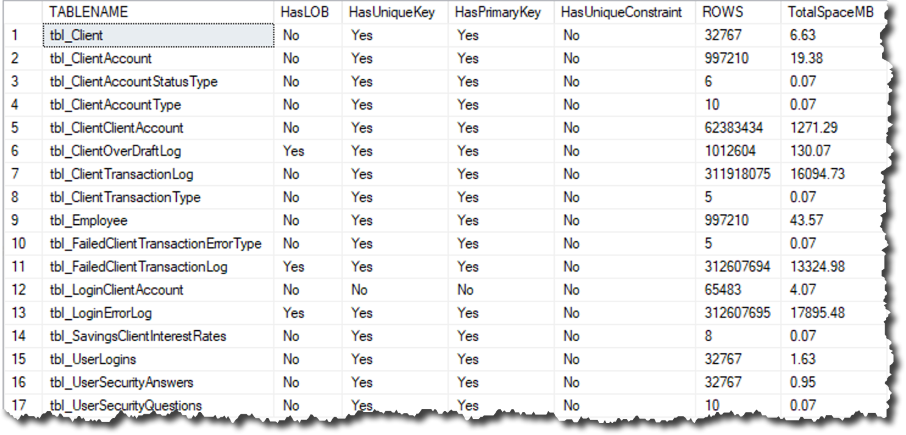
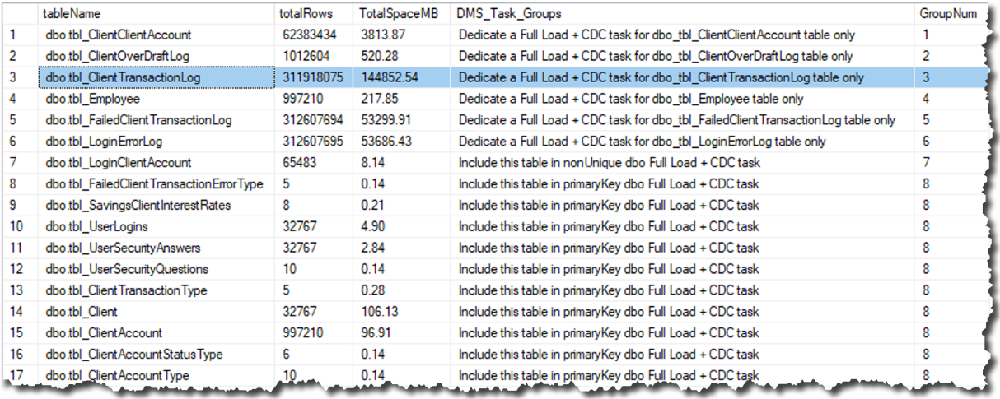
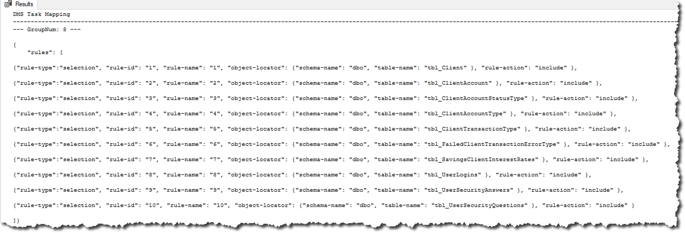
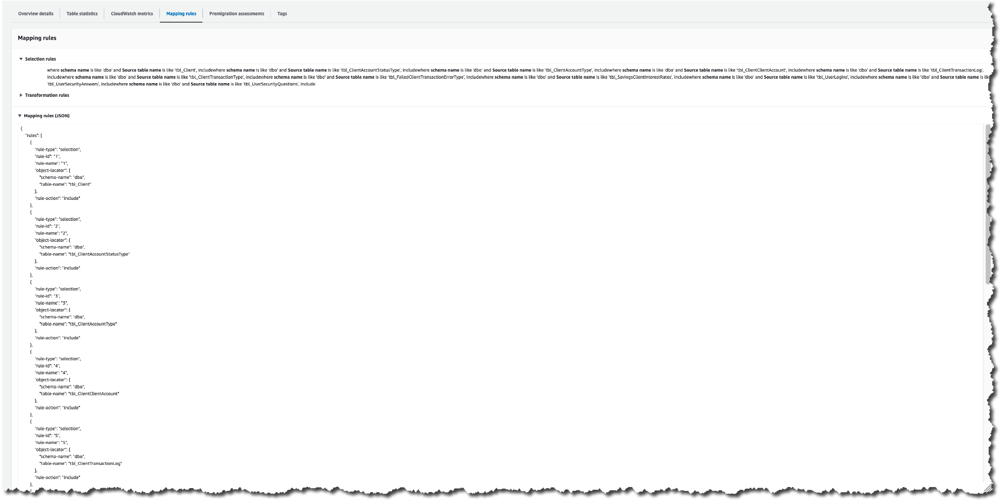
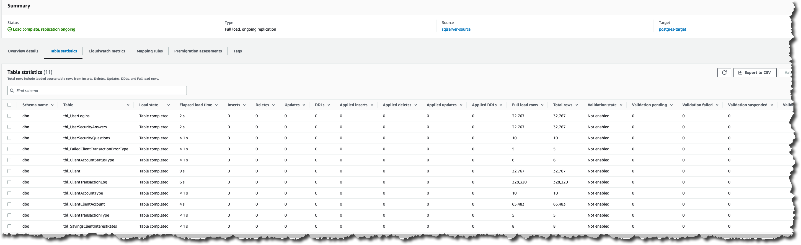
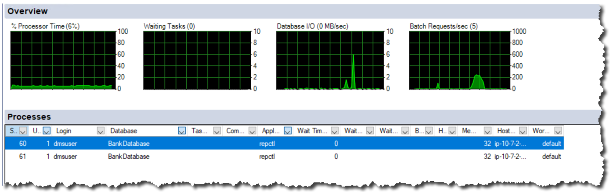

# Step-by-step SQL Server AlwaysOn databases on primary replica to Amazon Aurora PostgreSQL migration walkthrough

The following standard steps assume you have prepared your source and target endpoint as described in the above prerequisites. We also assume that you have converted your SQL Server database schema to PostgreSQL using the [Schema Conversion Tool (AWS SCT)](../../../SchemaConversionTool/latest/userguide/CHAP_Installing.md "../../../SchemaConversionTool/latest/userguide/CHAP_Installing.md") first, and that you’ve created all database objects on the target database.

## Step 1: Configure SQL Server database for Replication or Change Data Capture

In this walkthrough we create a “migrate existing data and replicate ongoing changes” DMS migration task. This type of DMS task will perform an initial copy of all existing data from source to the target, and then it will transition into replicating ongoing as changes occurring on the source endpoint. The migration mode also provides flexibility of reloading the target tables when needed. For more information, see [Prerequisites for using ongoing replication (CDC) from a SQL Server source](../userguide/CHAP_Source.md "../userguide/CHAP_Source.md").

Following is the list of tables in our sample database. We use the [AWS DMS Best Practice Support Scripts for SQL Server](https://quip-amazon.com/6brXAN6KoZK7/AWS-DMS-Best-Practices-Support-Scripts-for-SQL-Server "https://quip-amazon.com/6brXAN6KoZK7/AWS-DMS-Best-Practices-Support-Scripts-for-SQL-Server") to gather details about the tables. Table level info will be useful while designing the migration approach and selecting DMS task settings in later steps. You can execute the script in AWS DMS Best Practice to gather similar info about your database.

LOB in SQL Server is a data type designed to store large amounts of data. Data replication performance could be impacted when LOB data types are replicated and DMS task settings may need to be adjusted accordingly. Those task settings are discussed later in this document. For more information, see [LOB support for source database in an AWS DMS task](../userguide/CHAP_Tasks.md "../userguide/CHAP_Tasks.md").

Next, we follow the AWS DMS SQL Server source endpoint public documentation to configure the distribution database on each SQL Server AlwaysOn replica. AWS DMS ongoing change replication supports either the Microsoft SQL Server Replication (MS-Replication) or Microsoft Change Data Capture (MS-CDC) feature. For more information concerning setup of distribution database and enabling MS-CDC to support AWS DMS replication task, see [Setting up ongoing replication using the sysadmin role with self-managed SQL Server](../userguide/CHAP_Source.md "../userguide/CHAP_Source.md"). For more information about using MS-REPLICATION and MS-CDC, see [Configuring a Microsoft SQL Server Database as a Replication Source](../userguide/CHAP_Source.md#CHAP_Source.SQLServer.Configuration "../userguide/CHAP_Source.md#CHAP_Source.SQLServer.Configuration"). For sample SQL queries that can help you with prepare the task, see [AWS DMS Best Practice Support Scripts for SQL Server](https://quip-amazon.com/6brXAN6KoZK7/AWS-DMS-Best-Practices-Support-Scripts-for-SQL-Server "https://quip-amazon.com/6brXAN6KoZK7/AWS-DMS-Best-Practices-Support-Scripts-for-SQL-Server").

## Step 2: Create an AWS DMS replication instance

To create an AWS DMS replication instance, follow the steps below:

1. Sign in to the AWS Management Console, and open the [AWS DMS console](https://console.aws.amazon.com/dms/v2 "https://console.aws.amazon.com/dms/v2").
2. In the console, choose **Create replication instance**. If you are signed in as an AWS Identity and Access Management (IAM) user, you must have the appropriate permissions to access AWS DMS. For more information about the permissions required, see [IAM Permissions](../userguide/CHAP_Security.md "../userguide/CHAP_Security.md").
3. On the **Create replication instance** page, specify your replication instance information. For this walkthrough, both endpoints reside in the same AWS region. We configure our AWS replication instance using the same endpoint VPC. For more information concerning how to select the best instance class to support your data migration, see [Choosing the right AWS DMS replication instance class for your migration](../userguide/CHAP_ReplicationInstance.md "../userguide/CHAP_ReplicationInstance.md").

|                                        |                                                                |                                                                                                                                                                                                                                                                                                                                             |
| -------------------------------------- | -------------------------------------------------------------- | ------------------------------------------------------------------------------------------------------------------------------------------------------------------------------------------------------------------------------------------------------------------------------------------------------------------------------------------- | ------------------------------------------------------------------------------------------------------------------------------------------------------------------------------------------------------------------------------------------------------------------------------------------------------------------------------------------------------------------------------------------------------------------------------------------------------------------------------------------------------------------------------------------------------------------------------------------------------------------------------------------------------------------------------------------------------------------------------------------------------------------------------------------------------------------------------------------------------------------------------------------------------------------------------------------------------------------------------------------------------------------------------------------------------------------------------------------------------------------------------------------------------------------------------------------------------------------------------------------------------------------------------------------------------------------------------------------------------------------------------------------------------------------------------------------------------------------------------------------------------------------------------------------------------------------------------------------------------------------------------------------------------------------------------------------------------------------------------------------------------------------------------------------------------------------------------------------------------------------------------------------------------------------------------------------------------------------------------------------------------------------------------------------------------------------------------------------------------------------------------------------------------------------------------------------------------------------------------------------------------------------------------------------------------------------------------------------------------------------------------------------------------------------------------------------------------------------------------------------------------------------------------------------------------------------------------------------------------------------------------------------------------------------------------------------------------------------------------------------------------------------------------------------------------------------------------------------------------------------------------------------------------------------------------------------------------------------------------------------------------------------------------------------------------------------------------------------------------------------------------------------------------------------------------------------------------------------------------------------------------------------------------------------------------------------------------------------------------------------------------------------------------------------------------------------------------------------------------------------------------------------------------------------------------------------------------------------------------------------------------------------------------------------------------------------------------------------------------------------------------------------------------------------------------------------------------------------------------------------------------------------------------------------------------------------------------------------------------------------------------------------------------------------------------------------------------------------------------------------------------------------------------------------------------------------------------------------------------------------------------------------------------------------------------------------------------------------------------------------------------------------------------------------------------------------------------------------------------------------------------------------------------------------------------------------------------------------------------------------------------------------------------------------------------------------------------------------------------------------------------------------------------------------------------------------------------------------------------------------------------------------------------------------------------------------------------------------------------------------------------------------------------------------------------------------------------------------------------------------------------------------------------------------------------------------------------------------------------------------------------------------------------------------------------------------------------------------------------------------------------------------------------------------------------------------------------------------------------------------------------------------------------------------------------------------------------------------------------------------------------------------------------------------------------------------------------------------------------------------------------------------------------------------------------------------------------------------------------------------------------------------------------------------------------------------------------------------------------------------------------------------------------------------------------------------------------------------------------------------------------------------------------------------------------------------------------------------------------------------------------------------------------------------------------------------------------------------------------------------------------------------------------------------------------------------------------------------------------------------------------------------------------------------------------------------------------------------------------------------------------------------------------------------------------------------------------------------------------------------------------------------------------------------------------------------------------------------------------------------------------------------------------------------------------------------------------------------------------------------------------------------------------------------------------------------------------------------------------------------------------------------------------------------------------------------------------------------------------------------------------------------------------------------------------------------------------------------------------------------------------------------------------------------------------------------------------------------------------------------------------------------------------------------------------------------------------ |
| Parameter                              | Value                                                          | Explanation                                                                                                                                                                                                                                                                                                                                 |
| **Name**                               | **replication-test**                                           | Helps quickly differentiate between the different servers.                                                                                                                                                                                                                                                                                  |
| **Description**                        | DMS replication instance                                       | Helps identify the purpose of the server.                                                                                                                                                                                                                                                                                                   |
| **Instance class**                     | dms.c5.xlarge                                                  | c5.xlarge EC2 class provides 2 vCPU, 4 GB RAM, and up to 10 Gbps base network bandwidth. It also provides better performance over a general purpose t3.medium EC2 class with up to 5 Gbps network bandwidth.                                                                                                                                |
| **VPC**                                | vpc-08xxxxxxxxxxxxe                                            | Using the same VPC as the SQL server endpoint since the instance is hosted in the AWS network.                                                                                                                                                                                                                                              |
| **Multi-AZ**                           | Dev or test workload (Single-AZ)                               | Testing DMS replication workload. If it’s production data, you will choose **Yes** to create a standby replication server to support Multi-AZ, and to support high availability.                                                                                                                                                            |
| **Publicly accessible**                | No                                                             | Publicly accessible is not needed since source and endpoint reside in the AWS network.                                                                                                                                                                                                                                                      | 1. For the **Advanced** section, specify the following information. For more information, see [Working with an AWS DMS replication instance](../userguide/CHAP_ReplicationInstance.md "../userguide/CHAP_ReplicationInstance.md"). For information about the KMS key, see [Setting an Encryption Key and Specifying KMS Permissions](../userguide/CHAP_Security.md "../userguide/CHAP_Security.md").                                                                                                                                                                                                                                                                                                                                                                                                                                                                                                                                                                                                                                                                                                                                                                                                                                                                                                                                                                                                                                                                                                                                                                                                                                                                                                                                                                                                                                                                                                                                                                                                                                                                                                                                                                                                                                                                                                                                                                                                                                                                                                                                                                                                                                                                                                                                                                                                                                                                                                                                                                                                                                                                                                                                                                                                                                                                                                                                                                                                                                                                                                                                                                                                                                                                                                                                                                                                                                                                                                                                                                                                                                                                                                                                                                                                                                                                                                                                                                                                                                                                                                                                                                                                                                                                                                                                                                                                                                                                                                                                                                                                                                                                                                                                                                                                                                                                                                                                                                                                                                                                                                                                                                                                                                                                                                                                                                                                                                                                                                                                                                                                                                                                                                                                                                                                                                                                                                                                                                                                                                                                                                                                                                                                                                                                                                                                                                                                                                                                                                                                                                                                                                                                                                                                                                                                                                                                                                                                                                                                                                                                                                                                                                           |
|                                        |                                                                |                                                                                                                                                                                                                                                                                                                                             |
| ---                                    | ---                                                            | ---                                                                                                                                                                                                                                                                                                                                         |
| Parameter                              | Value                                                          | Explanation                                                                                                                                                                                                                                                                                                                                 |
| **Allocated storage**                  | 80 GB                                                          | Allocated storage size based on 1.5x of the migrating database size                                                                                                                                                                                                                                                                         |
| **Replication Subnet Group**           | default-vpc-08xxxxxxxxxxxxe                                    | Using single replication subnet group with single AZ                                                                                                                                                                                                                                                                                        |
| **Availability zone (AZ)**             | us-east-2c                                                     | Using same availability zone as SQL server source endpoint which reside in AWS network                                                                                                                                                                                                                                                      |
| **VPC Security Group(s)**              | xxx-sec-group                                                  | Using the same VPC security group as source and target database since both endpoints reside in the same AWS region.                                                                                                                                                                                                                         | 1. Click **Next**. ## Step 3: Create an AWS DMS source endpoint for SQL server You can specify the source or target database endpoints using the [https://console.aws.amazon.com/](https://console.aws.amazon.com/ "https://console.aws.amazon.com/") `AWS` Management Console]. 1. In the AWS DMS console, specify your connection information for the source SQL Server database. The following table describes the source settings used in this walkthrough.                                                                                                                                                                                                                                                                                                                                                                                                                                                                                                                                                                                                                                                                                                                                                                                                                                                                                                                                                                                                                                                                                                                                                                                                                                                                                                                                                                                                                                                                                                                                                                                                                                                                                                                                                                                                                                                                                                                                                                                                                                                                                                                                                                                                                                                                                                                                                                                                                                                                                                                                                                                                                                                                                                                                                                                                                                                                                                                                                                                                                                                                                                                                                                                                                                                                                                                                                                                                                                                                                                                                                                                                                                                                                                                                                                                                                                                                                                                                                                                                                                                                                                                                                                                                                                                                                                                                                                                                                                                                                                                                                                                                                                                                                                                                                                                                                                                                                                                                                                                                                                                                                                                                                                                                                                                                                                                                                                                                                                                                                                                                                                                                                                                                                                                                                                                                                                                                                                                                                                                                                                                                                                                                                                                                                                                                                                                                                                                                                                                                                                                                                                                                                                                                                                                                                                                                                                                                                                                                                                                                                                                                                                                |
|                                        |                                                                |                                                                                                                                                                                                                                                                                                                                             |
| ---                                    | ---                                                            | ---                                                                                                                                                                                                                                                                                                                                         |
| Parameter                              | Value                                                          | Explanation                                                                                                                                                                                                                                                                                                                                 |
| **Endpoint Identifier**                | **sqlserver-source**                                           | Helps quickly differentiate between the different endpoints.                                                                                                                                                                                                                                                                                |
| **Source Engine**                      | **sqlserver**                                                  | Define the endpoint engine                                                                                                                                                                                                                                                                                                                  |
| **Server name**                        | listener-xxxxxx.us-east-2.compute.amazonaws.com                | Setting the endpoint to use SQL Server AlwaysOn Listener’s fully qualify domain name                                                                                                                                                                                                                                                        |
| **Port**                               | 1433                                                           | Setting the endpoint to use default port 1433 on the SQL Server AlwaysOn Listener’s fully qualify domain                                                                                                                                                                                                                                    |
| **SSL mode**                           | none                                                           | Setting SSL mode to none since teh replication instance will reside in the same AWS VPC and region as the source and target. endpoints.                                                                                                                                                                                                     |
| **User name**                          | dmsuser                                                        | Setting the endpoint to use the dmsuser to connect to the SQL Server endpoint.                                                                                                                                                                                                                                                              |
| **Password**                           | strong password                                                | Setting the endpoint to use the password to connect to the SQL Server endpoint.                                                                                                                                                                                                                                                             |
| **Database name**                      | BankDatabase                                                   | Setting the endpoint to use the BankDatabase after successful login to the SQL Server.                                                                                                                                                                                                                                                      | Note that using SQL Server with dynamic ports may result in frequent DMS task failures as every time the SQL Server service is restarted, several settings will need to be adjusted to work with the new port number. For more information about AWS DMS source endpoint settings such as providing support for SQL Server AlwaysOn read-only replica, see [Using extra connection attributes for SQL Server as source endpoint when working with a secondary availability group replica](../userguide/CHAP_Source.md#CHAP_Source.SQLServer.AlwaysOn "../userguide/CHAP_Source.md#CHAP_Source.SQLServer.AlwaysOn"). For source endpoint limitation, see [Limitations on using SQL Server as a source for AWS DMS](../userguide/CHAP_Source.md#CHAP_Source.SQLServer.Limitations "../userguide/CHAP_Source.md#CHAP_Source.SQLServer.Limitations"). 1. Test the endpoint connection by choosing **Run test** for the source endpoints. ## Step 4: Configure and verify Aurora PostgreSQL database DMS user account In this step, you need to configure and verify that the DMS user account has required permissions on the Aurora PostgreSQL target database. Our walkthrough assumes that your target database objects were also precreated using the AWS SCT tool. 1. Create the AWS DMS user with one of the following permissions on your Aurora PostgreSQL database if it does not exist. Your PostgreSQL target endpoint requires minimum user permissions to run an AWS DMS migration. For more information, see [Security requirements when using PostgreSQL database as target for AWS Database Migration Service](../userguide/CHAP_Target.md#CHAP_Target.PostgreSQL.Security "../userguide/CHAP_Target.md#CHAP_Target.PostgreSQL.Security"). 2. Verify whether DMS user account has privileges by executing the following tests: 1. Log into the Aurora PostgreSQL database. 2. Create a new sample test table. Example: `create table sample test (num int, description varchar(100));` 3. Alter the new sample_test table. Example: `alter table sample_test add primary key (num);` 4. Insert a new record into the sample_test table. Example: `insert into sample_test (num, description) values (1, ‘test’);` 5. Delete the new record from the sample_test table. Example: `delete sample_test where num = 1;` 6. Truncate all records on the sample_test table. Example: `truncate sample_test;` 7. Drop the sample_test table. Example: `drop table sample_test;` 3. Script out table constraints and triggers to a post-deployment script file which will be used to recreate those objects after the migration is complete. 4. Drop table constraints (FKs, Check constraints, defaults) and triggers. ## Step 5: Configure an AWS DMS target endpoint for Aurora PostgreSQL You can create the endpoint using the [https://console.aws.amazon.com/](https://console.aws.amazon.com/ "https://console.aws.amazon.com/") `AWS` Management Console]. 1. In the AWS DMS console, specify your connection information for the target Aurora PostgreSQL database. 2. Check “Select RDS DB instance” and then choose Aurora PostgreSQL instance if it’s created under the current user and region. The following table describes the target settings.                                                                                                                                                                                                                                                                                                                                                                                                                                                                                                                                                                                                                                                                                                                                                                                                                                                                                                                                                                                                                                                                                                                                                                                                                                                                                                                                                                                                                                                                                                                                                                                                                                                                                                                                                                                                                                                                                                                                                                                                                                                                                                                                                                                                                                                                                                                                                                                                                                                                                                                                                                                                                                                                                                                                                                                                                                                                                                                                                                                                                                                                                                                                                                                                                                                                                                                                                                                                                                                                                                                                                                                                                                                                                                                                                                                                                                                                                                                                                                                                                                                                                                                                                                                                                                                                                                           |
|                                        |                                                                |                                                                                                                                                                                                                                                                                                                                             |
| ---                                    | ---                                                            | ---                                                                                                                                                                                                                                                                                                                                         |
| Parameter                              | Value                                                          | Explanation                                                                                                                                                                                                                                                                                                                                 |
| **Endpoint Identifier**                | **postgres-target**                                            | Helps quickly differentiate between the different endpoints.                                                                                                                                                                                                                                                                                |
| **Target Engine**                      | Amazon Aurora PostgreSQL                                       | Define the endpoint engine                                                                                                                                                                                                                                                                                                                  |
| **Server name**                        | postgresql-source-instance.xxxxxxx.us-east-2.rds.amazonaws.com | Setting the endpoint to use PostgreSQL fully qualify domain name                                                                                                                                                                                                                                                                            |
| **Port**                               | 5432                                                           | Setting the endpoint to use default port 5432 on the PostgreSQL fully qualify domain                                                                                                                                                                                                                                                        |
| **SSL mode**                           | none                                                           | Setting SSL mode to none since replication instance will be resided in the same AWS VPC and region as source and target endpoints.                                                                                                                                                                                                          |
| **User name**                          | dmsuser                                                        | Set the endpoint to use the dmsuser to connect to the PostgreSQL endpoint.                                                                                                                                                                                                                                                                  |
| **Password**                           | strong password                                                | Set the endpoint to use the password to connect to the PostgreSQL endpoint.                                                                                                                                                                                                                                                                 |
| **Database name**                      | BankDatabase                                                   | Set the endpoint to use the BankDatabase after successfully logging in to the Aurora PostgreSQL database.                                                                                                                                                                                                                                   | For the purpose of this walkthrough, we’ll use the following advanced target endpoint settings. For information about other AWS DMS endpoint settings for a PostgreSQL target, see [Endpoint Settings for PostgreSQL as target endpoint](../userguide/CHAP_Introduction.md "../userguide/CHAP_Introduction.md").                                                                                                                                                                                                                                                                                                                                                                                                                                                                                                                                                                                                                                                                                                                                                                                                                                                                                                                                                                                                                                                                                                                                                                                                                                                                                                                                                                                                                                                                                                                                                                                                                                                                                                                                                                                                                                                                                                                                                                                                                                                                                                                                                                                                                                                                                                                                                                                                                                                                                                                                                                                                                                                                                                                                                                                                                                                                                                                                                                                                                                                                                                                                                                                                                                                                                                                                                                                                                                                                                                                                                                                                                                                                                                                                                                                                                                                                                                                                                                                                                                                                                                                                                                                                                                                                                                                                                                                                                                                                                                                                                                                                                                                                                                                                                                                                                                                                                                                                                                                                                                                                                                                                                                                                                                                                                                                                                                                                                                                                                                                                                                                                                                                                                                                                                                                                                                                                                                                                                                                                                                                                                                                                                                                                                                                                                                                                                                                                                                                                                                                                                                                                                                                                                                                                                                                                                                                                                                                                                                                                                                                                                                                                                                                                                                                               |
|                                        |                                                                |                                                                                                                                                                                                                                                                                                                                             |
| ---                                    | ---                                                            | ---                                                                                                                                                                                                                                                                                                                                         |
| Parameter                              | Value                                                          | Explanation                                                                                                                                                                                                                                                                                                                                 |
| Endpoint settings                      | executeTimeout=300                                             | Setting executionTimeout to 5 minutes to support a longer execution duration of DMS' replication query due to a slow SQL server endpoint                                                                                                                                                                                                    | 1. Test the endpoint connections by choosing **Run test** for the target endpoints. ## Step 6: Create an AWS DMS migration task(s) Depending on your workload pattern as well as your business requirements, distributing tables across multiple DMS tasks can help improve migration performance, and provide ease of troubleshooting. Isolating tables with certain characteristics in a separate DMS task may be beneficial to the overall migration. For example, tables with LOBs or without primary or unique key may present unique challenges, and may require different DMS task settings. Following, we describe a method of grouping the tables into 3 categories depending on their characteristics. Organizing tables according to the following criteria will help achieve optimal performance during the migration. For our walkthrough, we prepare an automatic SQL query script to help you determine the table arrangement. The script also dynamically generates the table mappings in JSON format so you can simply paste the output into the DMS task setting. For more information, see [Working with diagnostic support scripts in AWS DMS](../userguide/CHAP_SupportScripts.md "../userguide/CHAP_SupportScripts.md"). Following, are the three main categories: 1. Special tables – which require special handling due to their characteristics 2. Large tables – which require special handling due to their size 3. General tables – all other tables which do not meet the previous criteria ### Special tables Special tables are tables that do not follow OLTP workload practices. Data loading typically involves truncating the table first, and then reloading all the data from scratch. Due to the nature of how data are loaded to the special table, it is not a good candidate for the “migrate existing data and replicate ongoing changes” DMS task. DMS task will replicate the large bulk workloads in this case using a row-by-row replication mode. Instead, we recommend you to change the replication task type to “migrate existing data”, incorporate the tables into the same DMS task that perform the truncate, and reload data operation. For example, the tbl_LoginErrorLog table is a standalone table. The ETL process can truncate the data in tbl_LoginErrorLog table first, and then reload the entire table. ### Large tables Large tables are tables that contain partitioned, wide table columns, or a large amount of data that can require a specialized management process to maintain. DMS tasks containing large tables generally do not perform well when using the default, single threaded full load per table. For partitioned tables, you can leverage parallel load by configuring the auto-partition option in the table mapping. For non-partitioned tables, you can accomplish parallel load by utilizing the ranges-partitioning option which allows range boundaries to be specified manually. For our walkthrough, we use the automatic SQL query script to dynamically generate the task mappings output. By examining the table overview report generated earlier, we notice that the `tbl_ClientOverDraftLog table meets our large table criteria. Next, we examine the `tbl_ClientOverDraftLog`table structure, and notice the table has a sequential integer data type on the`ClientTransactionID`column. We input the schema and table name in the automatic SQL query script to generate a JSON format output that will include the range boundaries for a given large table. The following image shows the output generated by the automatic SQL query script for the`tbl_ClientOverDraftLog`table. You may copy the JSON section of the output to your DMS task mappings. You can also modify the task mapping JSON output to include transformation rules such as renaming the target table name. You can then repeat this process for the other tables that you consider to be large tables.  ### General tables General tables are table that do not meet either the special or large table categories. The automatic SQL query script will automatically arrange the general tables in different tasks. It also avoids accidentally misplacing the same table in multiple tasks. ### Determine table placement The following shows a sample assignment of tables to different groups, generated by the query mentioned above. The sample query groups the tables based on row count. #### Note In this walkthrough we assume that there are table dependencies on the PostgreSQL target, such as foreign keys, constraints, and triggers. Because the data will be migrated using multiple DMS tasks, there is a possibility of temporary lapses in referential integrity during CDC migration. Because of that we will remove those types of constraints from the target database for the duration of the migration. We will recreate them after the migration is complete, as at that point, the data will be consistent. For our sample scenario, tables with over 1 million records are considered to be large tables. The row size helps reduce the amount of task creation generation by the script. It also avoids over-utilizing the SQL Server source endpoint when the instance does not have adequate resources to support the concurrent retrieval. For example, the`dbo.tbl_ClientOverDraftLog`table has over 1 million records, and belongs to its own DMS Full Load + CDC task called`dbo_tbl_ClientOverDraftLog table only`. Tables in GroupNum 8 contain primary keys, and are not particularly large which means that they do not pose a challenge from a migration perspective, so they are all placed in the same group. Isolating certain types of tables into their own tasks will allow you to enable additional tasks or table settings to help improve replication performance. A AWS DMS task loads tables in alphabetical order based on the table name. If specific table loading order is required, you should include the load-order setting, and place the dependent tables together in the same task. If your table contains dependencies to tables in another database, you can’t place both tables in the same DMS task. For tables with cross database dependencies, you must load these tables using their own tasks, and then remove referential integrity constraints on the target database for the duration of the migration. For more information see [Table and collection settings rules and operations](../userguide/CHAP_Tasks.CustomizingTasks.TableMapping.SelectionTransformation.md "../userguide/CHAP_Tasks.CustomizingTasks.TableMapping.SelectionTransformation.md").  To simplify the process of creating the table mappings JSON, you can use an automatic SQL query script to generate the JSON format output for the specific group of tables. The following shows a sample script output for groupNum 8. You can simply copy the entire JSON output into the DMS task mapping rules.   ### Create Replication Tasks Follow the steps below for each DMS task you need to create. For our walkthrough, we’ll be creating total of 8 Full Load + CDC tasks based on script output from the previous steps. 1. In the AWS DMS console, on the **Create task** page, specify the task options as show below. |
|                                        |                                                                |                                                                                                                                                                                                                                                                                                                                             |
| ---                                    | ---                                                            | ---                                                                                                                                                                                                                                                                                                                                         |
| Parameter                              | Value                                                          | Explanation                                                                                                                                                                                                                                                                                                                                 |
| **Task name**                          | sql-2-postgres-dynamic-task                                    | Helps quickly differentiate between the different tasks.                                                                                                                                                                                                                                                                                    |
| **Task description**                   | migrating data from SQL server to Aurora PostgreSQL            | Helps identify the purpose of the task.                                                                                                                                                                                                                                                                                                     |
| **Source endpoint**                    | sqlserver-source                                               | Task will be using this SQL server source endpoint                                                                                                                                                                                                                                                                                          |
| **Target endpoint**                    | postgres-target                                                | Task will be replicating to this Aurora PostgreSQL target endpoint                                                                                                                                                                                                                                                                          |
| **Replication instance**               | replication-instance                                           | Task will be handled by this DMS replication instance                                                                                                                                                                                                                                                                                       |
| **Migration type**                     | Migrate existing data and replicate ongoing changes            | Task will be performing full load first and then replicate ongoing data changes when full load completes.                                                                                                                                                                                                                                   |
| **Start task on create**               | Enable                                                         | Start task after task creation                                                                                                                                                                                                                                                                                                              | 1. Under Task settings, specify the settings as shown below. For the purpose of this walkthrough, we set `TargetTablePrepMode` to `TRUNCATE_BEFORE_LOAD`, that way the target schema created using SCT will not be dropped and recreated by DMS. Limited LOB mode is enabled to properly handle the LOB data type contained in the tables. For more information, see [Specifying task settings for AWS Database Migration Service Tasks](../userguide/CHAP_Tasks.CustomizingTasks.md "../userguide/CHAP_Tasks.CustomizingTasks.md").                                                                                                                                                                                                                                                                                                                                                                                                                                                                                                                                                                                                                                                                                                                                                                                                                                                                                                                                                                                                                                                                                                                                                                                                                                                                                                                                                                                                                                                                                                                                                                                                                                                                                                                                                                                                                                                                                                                                                                                                                                                                                                                                                                                                                                                                                                                                                                                                                                                                                                                                                                                                                                                                                                                                                                                                                                                                                                                                                                                                                                                                                                                                                                                                                                                                                                                                                                                                                                                                                                                                                                                                                                                                                                                                                                                                                                                                                                                                                                                                                                                                                                                                                                                                                                                                                                                                                                                                                                                                                                                                                                                                                                                                                                                                                                                                                                                                                                                                                                                                                                                                                                                                                                                                                                                                                                                                                                                                                                                                                                                                                                                                                                                                                                                                                                                                                                                                                                                                                                                                                                                                                                                                                                                                                                                                                                                                                                                                                                                                                                                                                                                                                                                                                                                                                                                                                                                                                                                                                                                                                                           |
|                                        |                                                                |                                                                                                                                                                                                                                                                                                                                             |
| ---                                    | ---                                                            | ---                                                                                                                                                                                                                                                                                                                                         |
| Parameter                              | Value                                                          | Explanation                                                                                                                                                                                                                                                                                                                                 |
| **Target table preparation mode**      | Truncate                                                       | For our sample walk through, the data on the target Aurora PostgreSQL database can be dropped therefore we set the target preparation mode to truncate. For production replication, you might want to set this setting to "Do Nothing" and manually execute either the drop or the truncate before running the DMS task from the beginning. |
| **Include LOB columns in replication** | Limited LOB                                                    | Following best practices, set the task to use `Limited LOB mode` to provide better replication performance.                                                                                                                                                                                                                                 |
| **Max LOB size (kb)**                  | 32                                                             | For our walkthrough, we are setting limited LOB mode to 32 kilobytes to reduce the LOB size, and provide better replication performance.                                                                                                                                                                                                    |
| **Enable logging**                     | Enable                                                         | Enable logging to provide insight on the task errors or warnings.                                                                                                                                                                                                                                                                           |
| **Batch Apply**                        | TRUE                                                           | For our walkthrough, foreign keys constraints and triggers are dropped on the target endpoint. We enable Batch Apply to quickly apply the transactions to the Aurora PostgreSQL database.                                                                                                                                                   | 1. Leave the Advanced settings at their default values. 2. If you created your table mappings' JSON using one of the queries mentioned above, choose **Table mappings**, and select the **JSON** tab. Then select **Enable JSON editing**, and paste the table mappings you generated using the scripts. If you did not create mapping rules using the scripts, in the **Selection rules** section, specify the settings as shown in the table below. For information about AWS SCT table mapping rules, see [AWS SCT Mapping](../../../SchemaConversionTool/latest/userguide/CHAP_Mapping.md "../../../SchemaConversionTool/latest/userguide/CHAP_Mapping.md").                                                                                                                                                                                                                                                                                                                                                                                                                                                                                                                                                                                                                                                                                                                                                                                                                                                                                                                                                                                                                                                                                                                                                                                                                                                                                                                                                                                                                                                                                                                                                                                                                                                                                                                                                                                                                                                                                                                                                                                                                                                                                                                                                                                                                                                                                                                                                                                                                                                                                                                                                                                                                                                                                                                                                                                                                                                                                                                                                                                                                                                                                                                                                                                                                                                                                                                                                                                                                                                                                                                                                                                                                                                                                                                                                                                                                                                                                                                                                                                                                                                                                                                                                                                                                                                                                                                                                                                                                                                                                                                                                                                                                                                                                                                                                                                                                                                                                                                                                                                                                                                                                                                                                                                                                                                                                                                                                                                                                                                                                                                                                                                                                                                                                                                                                                                                                                                                                                                                                                                                                                                                                                                                                                                                                                                                                                                                                                                                                                                                                                                                                                                                                                                                                                                                                                                                                                                                                                               |
|                                        |                                                                |                                                                                                                                                                                                                                                                                                                                             |
| ---                                    | ---                                                            | ---                                                                                                                                                                                                                                                                                                                                         |
| For this parameter                     | Do this                                                        | Explanation                                                                                                                                                                                                                                                                                                                                 |
| **Schema name is**                     | Choose Enter a schema.                                         | Schema related object                                                                                                                                                                                                                                                                                                                       |
| **Schema name is like**                | Type **%**.                                                    | % is a wildcard character in this section, and means all schema names on the source endpoint.                                                                                                                                                                                                                                               |
| **Table name is like**                 | Type **%**.                                                    | % is a wildcard character in this, section and means all tables that are owned by the same schema name on the source endpoint.                                                                                                                                                                                                              |
| **Action**                             | Choose Include.                                                | Include all tables, because we specified **%** for schema name and table name.                                                                                                                                                                                                                                                              | 1. Choose **Create task**. The task starts immediately. If you enabled the **Start Task On Create** option, the task will start automatically after its creation. ## Step 7: Verify AWS DMS replication task status 1. In the AWS DMS console, choose **Database Migration Tasks** page. 2. Choose the newly created Database Migration Task from step 6. 3. Click Actions and then choose Restart the full load task from the beginning if task did not start immediately after task creation in step 6. The **Tasks** section shows you the status of the migration task. The following shows the table statistic output when starting the DMS Full Load + CDC task from the beginning. Notice that the DMS table statistics show replicating tables that were included in the table mappings JSON.  If you chose **Enable logging** during setup, you can monitor your task in Amazon CloudWatch. 1. On the navigation pane, choose **Tasks**. 2. Choose your migration task. 3. Choose the **Task monitoring** tab, and monitor the task in progress on that tab. 4. When the full load is complete and cached changes are applied, the task stops on its own. 5. If you chose to use AWS DMS to replicate changes, in the AWS DMS console, start the AWS DMS task by choosing **Start/Resume** for the task. 6. Important replication instance metrics to monitor include the following: ..CPU ..FreeableMemory ..DiskQueueDepth ..CDCLatencySource ..CDCLatencyTarget For more information about monitoring AWS DMS task status and metrics, see [Monitoring AWS DMS tasks](../userguide/CHAP_Monitoring.md "../userguide/CHAP_Monitoring.md"). For more information about viewing DMS error log events, see [Task Logs](https://catalog.us-east-1.prod.workshops.aws/workshops/77bdff4f-2d9e-4d68-99ba-248ea95b3aca/en-US/monitoring/task-logging "https://catalog.us-east-1.prod.workshops.aws/workshops/77bdff4f-2d9e-4d68-99ba-248ea95b3aca/en-US/monitoring/task-logging"). You can use the MS SQL Server activity monitor included with SQL Server Management Studio to examine the resource utilization on the source database instance as shown below. You will notice that DMS creates multiple sessions on the source instance. When DMS is configured for parallel load, you will see a separate session for each partition. Configuring additional ranges for parallel load may increase performance of the full load phase of the migration as long as none of the resources are constrained on the endpoint. The number of sessions utilized by DMS will be reduced once the full load phase is complete. You may need to reduce the number of concurrently loaded tables if you observe high resource utilization on the source or target.  ## Cleanup The purpose of these steps is to make sure you have redirected your database application traffic to your new PostgreSQL database after successful migration. Also, to ensure that there are no other users connecting to the old MS SQL database.  • To confirm that there aren’t clients connecting to the MS SQL database, the following query should return no results other than your individual connection: `--- SQL Server releases after 2020 might require adjusting query column names due to version deprecating functionality. SELECT session_id, login_name, db_name(database_id) database_name, program_name, HOST_NAME FROM sys.dm_exec_sessions where session_id > 50;`  • If the AWS DMS task is still replicating ongoing changes, allow some time after stopping the application(s) connecting to the old database. After ensuring that DMS is no longer replicating any changes by examining CloudWatch metrics, stop the AWS DMS task.  • Then, re-run the script from point 1, and if there are any remaining sessions (other than your own), consider checking the database application settings to make sure it was redirected to the new PostgreSQL database. If your application is still using the SQL Server database, you may need to resume the DMS task to replicate all data. Data might have been changed by the application after the initial task stop. Correct your application connection settings again, and then repeat the cleanup process.  • Once full load and CDC ongoing replication completes, and you are done using DMS tasks, you can run the scripts (for example, `constraint-putback`) saved from AWS SCT to apply the foreign keys, constraints, and triggers on the Aurora PostgreSQL database.  • Run a last full database backup on the old SQL Server database.  • Shut down SQL Server services if the SQL server can be decommissioned. ## Conclusion AWS DMS is a robust data migration service which can greatly simplify the process of migrating your database. In this walkthrough, we’ve shown you how to determine if you need to create one or more DMS tasks to support your data migration to Aurora PostgreSQL. We shared with you our automatic SQL queries to help you arrange your tables, prepare tasks for parallel load, and enable CDC on tables with or without primary keys. We recommend that you review our public documentation for additional information of DMS features and enhancements which can further improve your overall database migration process.                                                                                                                                                                                                                                                                                                                                                                                                                                                                                                                                                                                                                                                                                                                                                                                                                                                                                                                                                                                                                                                                                                                                                                                                                                                                                                                                                                                                                                                                                                                                                                                                                                                                                                                                                                                                                                                                                                                                                                                                                                                                                         |
