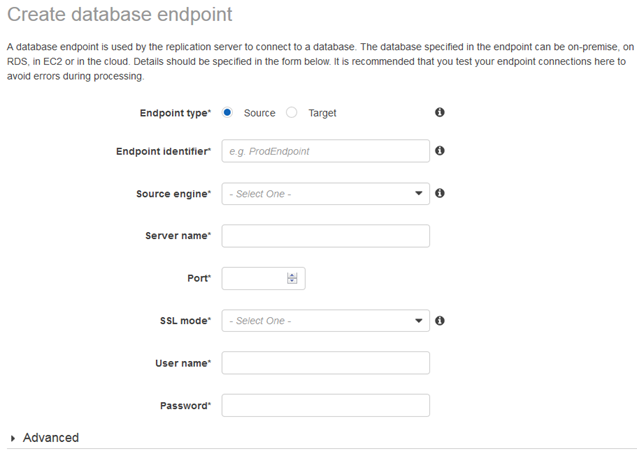

# Step 4: Create Your Oracle Source Endpoint

While your replication instance is being created, you can specify the Oracle source endpoint using the [AWS Management Console](https://console.aws.amazon.com "https://console.aws.amazon.com"). However, you can only test connectivity after the replication instance has been created, because the replication instance is used to test the connection.

To specify source or target database endpoints, do the following:

1. In the AWS DMS console, choose **Endpoints** on the navigation pane.
2. Choose **Create endpoint**. The **Create database endpoint page** appears, as shown following.

 3. Specify your connection information for the source Oracle database. The following table describes the source settings.

| For This Parameter              | Do This                                                                                                                                                                                                                                                                                                                                                                                                                                                                                                                                                                                                                                                                                                                                                                                                                                                                                                                                                                                                                                                                                                                                                                                                                                                                                                                                                                                             |
| ------------------------------- | --------------------------------------------------------------------------------------------------------------------------------------------------------------------------------------------------------------------------------------------------------------------------------------------------------------------------------------------------------------------------------------------------------------------------------------------------------------------------------------------------------------------------------------------------------------------------------------------------------------------------------------------------------------------------------------------------------------------------------------------------------------------------------------------------------------------------------------------------------------------------------------------------------------------------------------------------------------------------------------------------------------------------------------------------------------------------------------------------------------------------------------------------------------------------------------------------------------------------------------------------------------------------------------------------------------------------------------------------------------------------------------------------- | ---------------------------------------------------------------------------------------------------------------------------------------------------------------------------------------------------------------------------------------------------------------------------------------------------------------------- |
| **Endpoint type**               | Choose **Source**.                                                                                                                                                                                                                                                                                                                                                                                                                                                                                                                                                                                                                                                                                                                                                                                                                                                                                                                                                                                                                                                                                                                                                                                                                                                                                                                                                                                  |
| **Endpoint Identifier**         | Enter an identifier for your Oracle endpoint. The identifier for your endpoint must be unique within an AWS Region.                                                                                                                                                                                                                                                                                                                                                                                                                                                                                                                                                                                                                                                                                                                                                                                                                                                                                                                                                                                                                                                                                                                                                                                                                                                                                 |
| **Source Engine**               | Choose **oracle**.                                                                                                                                                                                                                                                                                                                                                                                                                                                                                                                                                                                                                                                                                                                                                                                                                                                                                                                                                                                                                                                                                                                                                                                                                                                                                                                                                                                  |
| **Server name**                 | Enter an IP address that AWS DMS can use to connect to your database from the replication server.                                                                                                                                                                                                                                                                                                                                                                                                                                                                                                                                                                                                                                                                                                                                                                                                                                                                                                                                                                                                                                                                                                                                                                                                                                                                                                   |
| **Port**                        | Enter the port which your database is listening for connections (the Oracle default is 1521).                                                                                                                                                                                                                                                                                                                                                                                                                                                                                                                                                                                                                                                                                                                                                                                                                                                                                                                                                                                                                                                                                                                                                                                                                                                                                                       |
| **SSL mode**                    | Choose a Secure Sockets Layer (SSL) mode if you want to enable connection encryption for this endpoint. Depending on the mode you select, you might need to provide certificate and server certificate information.                                                                                                                                                                                                                                                                                                                                                                                                                                                                                                                                                                                                                                                                                                                                                                                                                                                                                                                                                                                                                                                                                                                                                                                 |
| **Username**                    | Enter the user name. We recommend that you create a user specific to your migration.                                                                                                                                                                                                                                                                                                                                                                                                                                                                                                                                                                                                                                                                                                                                                                                                                                                                                                                                                                                                                                                                                                                                                                                                                                                                                                                |
| **Password**                    | Provide the password for the user name preceding.                                                                                                                                                                                                                                                                                                                                                                                                                                                                                                                                                                                                                                                                                                                                                                                                                                                                                                                                                                                                                                                                                                                                                                                                                                                                                                                                                   | 4. Choose the **Advanced** tab to set values for extra connection strings and the encryption key.                                                                                                                                                                                                                      |
| For This Option                 | Do This                                                                                                                                                                                                                                                                                                                                                                                                                                                                                                                                                                                                                                                                                                                                                                                                                                                                                                                                                                                                                                                                                                                                                                                                                                                                                                                                                                                             |
| ---                             | ---                                                                                                                                                                                                                                                                                                                                                                                                                                                                                                                                                                                                                                                                                                                                                                                                                                                                                                                                                                                                                                                                                                                                                                                                                                                                                                                                                                                                 |
| **Extra connection attributes** | Here you can add values for extra attributes that control the behavior of your endpoint. A few of the most relevant attributes are listed here. For the full list, see the documentation. Separate multiple entries from each other by using a semi-colon (;). \* **addSupplementalLogging:** AWS DMS will automatically add supplemental logging if you enable this option (addSupplementalLogging=Y). \* **useLogminerReader:** By default AWS DMS uses Oracle LogMiner to capture change data from the logs. AWS DMS can also parse the logs using its proprietary technology. If you use Oracle 12c and need to capture changes to tables that include LOBS, set this to No (useLogminerReader=N). \* **numberDataTypeScale:** Oracle supports a NUMBER data type that has no precision or scale. By default, NUMBER is converted to a number with a precision of 38 and scale of 10, number(38,10). Valid values are 0—​38 or -1 for FLOAT. \* **archivedLogDestId:** This option specifies the destination of the archived redo logs. The value should be the same as the DEST_ID number in the $archived_log table. When working with multiple log destinations (DEST_ID), we recommend that you specify a location identifier for archived redo logs. Doing so improves performance by ensuring that the correct logs are accessed from the outset. The default value for this option is 0. |
| **KMS key**                     | Choose the encryption key to use to encrypt replication storage and connection information. If you choose **(Default) aws/dms**, the default AWS KMS key associated with your user and region is used.                                                                                                                                                                                                                                                                                                                                                                                                                                                                                                                                                                                                                                                                                                                                                                                                                                                                                                                                                                                                                                                                                                                                                                                              | Before you save your endpoint, you can test it. To do so, select a VPC and replication instance from which to perform the test. As part of the test AWS DMS refreshes the list of schemas associated with the endpoint. (The schemas are presented as source options when creating a task using this source endpoint.) |
