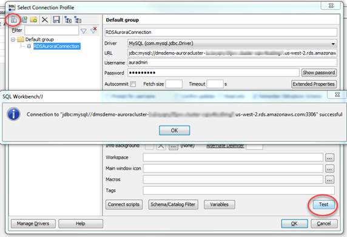
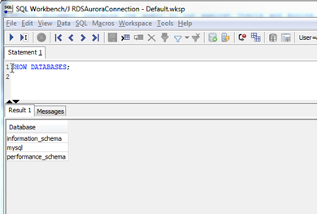

# Step 4: Test the Connectivity to the Aurora MySQL DB Instance

Next, test your connection to your Aurora MySQL DB instance.

1. In SQL Workbench/J, choose **File**, then choose **Connect window**. Choose the Create a new connection profile icon. using the following information: Connect to the Aurora MySQL DB instance in SQL Workbench/J by using the information as shown following:

| For This Parameter        | Do This                                                                                                                                      |
| ------------------------- | -------------------------------------------------------------------------------------------------------------------------------------------- |
| \*_New profile_ • name | Enter `RDSAuroraConnection`.                                                                                                                 |
| **Driver**                | Choose `MySQL (com.mysql.jdbc.Driver)`.                                                                                                      |
| **URL**                   | Use the \*_AuroraJDBCConnectionString_ • value you recorded when you examined the output details of the DMSdemo stack in a previous step. |
| **Username**              | Enter `auradmin`.                                                                                                                            |
| **Password**              | Provide the password for the admin user that you assigned when creating the Aurora MySQL DB instance using the AWS CloudFormation template.  |

2. Test the connection by choosing **Test**. Choose **OK** to close the dialog box, then choose OK to create the connection profile.

###### Note

If your connection is unsuccessful, ensure that the IP address you assigned when creating the AWS CloudFormation template is the one you are attempting to connect from. This is the most common issue when trying to connect to an instance. 3. Log on to the Aurora MySQL instance by using the master admin credentials. 4. Verify your connectivity to the Aurora MySQL DB instance by running a sample SQL command, such as `SHOW DATABASES;`.

