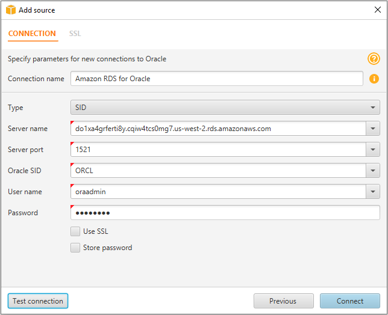
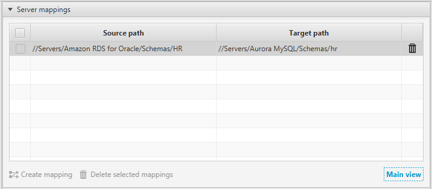
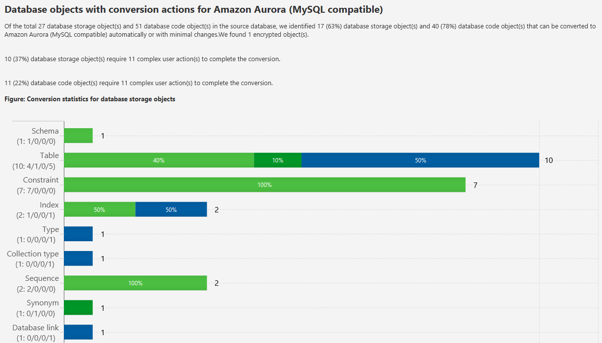

# Step 5: Use the AWS Schema Conversion Tool to Convert the Oracle Schema to Aurora MySQL

Before you migrate data to Aurora MySQL, you convert the Oracle schema to an Aurora MySQL schema. [This video covers all the steps of this process](https://youtu.be/ClAJUNa1Ucc "https://youtu.be/ClAJUNa1Ucc").

To convert an Oracle schema to an Aurora MySQL schema using AWS Schema Conversion Tool (AWS SCT), do the following:

1. Launch AWS SCT. In AWS SCT, choose **File**, then choose **New Project**. Create a new project named `DMSDemoProject`, specify the **Location** of the project folder, and then choose **OK**.
2. Choose **Add source** to add a source Oracle database to your project, then choose **Oracle**, and choose **Next**.
3. Enter the following information, and then choose **Test Connection**.

| For This Parameter  | Do This                                                                                                                                                                                                                                                                                                                                                                                                                                                                                |
| ------------------- | -------------------------------------------------------------------------------------------------------------------------------------------------------------------------------------------------------------------------------------------------------------------------------------------------------------------------------------------------------------------------------------------------------------------------------------------------------------------------------------- |
| **Connection name** | Enter `Amazon RDS for Oracle`. AWS SCT displays this name in the tree in the left panel.                                                                                                                                                                                                                                                                                                                                                                                               |
| **Type**            | Choose **SID**.                                                                                                                                                                                                                                                                                                                                                                                                                                                                        |
| **Server name**     | Use the **OracleJDBCConnectionString\* • value you used to connect to the Oracle DB instance, but remove the JDBC prefix information. For example, a sample connection string you use with SQL Workbench/J might be "jdbc:oracle:thin:@do1xa4grferti8y.cqiw4tcs0mg7.us-west-2.rds.amazonaws.com:1521:ORCL". For AWS SCT **Server name\*\*, you remove "jdbc:oracle:thin:@//" and ":1521" to use just the server name: "do1xa4grferti8y.cqiw4tcs0mg7.us-west-2.rds.amazonaws.com" |
| **Server port**     | Enter `1521`.                                                                                                                                                                                                                                                                                                                                                                                                                                                                          |
| **Oracle SID**      | Enter `ORCL`.                                                                                                                                                                                                                                                                                                                                                                                                                                                                          |
| **User name**       | Enter `oraadmin`.                                                                                                                                                                                                                                                                                                                                                                                                                                                                      |
| **Password**        | Enter the password for the admin user that you assigned when creating the Oracle DB instance using the AWS CloudFormation template.                                                                                                                                                                                                                                                                                                                                                    |

 4. Choose **OK** to close the alert box, then choose **Connect** to close the dialog box and to connect to the Oracle DB instance. 5. Choose **Add target** to add a target Amazon Aurora MySQL database to your project, then choose **Amazon Aurora (MySQL compatible)**, and choose **Next**. 6. Enter the following information and then choose **Test Connection**.

| For This Parameter  | Do This                                                                                                                                                                                                                                                                                                                                                                                                                                                                                                                                             |
| ------------------- | --------------------------------------------------------------------------------------------------------------------------------------------------------------------------------------------------------------------------------------------------------------------------------------------------------------------------------------------------------------------------------------------------------------------------------------------------------------------------------------------------------------------------------------------------- |
| **Connection name** | Enter `Aurora MySQL`. AWS SCT displays this name in the tree in the right panel.                                                                                                                                                                                                                                                                                                                                                                                                                                                                    |
| **Server name**     | Use the **AuroraJDBCConnectionString\* • value you used to connect to the Aurora MySQL DB instance, but remove the JDBC prefix information and the port suffix. For example, a sample connection string you use with SQL Workbench/J might be "jdbc:mysql://dmsdemo-auroracluster-1u1ogdfg35v.cluster-cqiw4tcs0mg7.us-west-2.rds.amazonaws.com:3306". For AWS SCT **Server name\*\*, you remove "jdbc:mysql://" and ":3306" to use just the server name: "dmsdemo-auroracluster-1u1ogdfg35v.cluster-cqiw4tcs0mg7.us-west-2.rds.amazonaws.com" |
| **Server port**     | Enter `3306`.                                                                                                                                                                                                                                                                                                                                                                                                                                                                                                                                       |
| **User name**       | Enter `auradmin`.                                                                                                                                                                                                                                                                                                                                                                                                                                                                                                                                   |
| **Password**        | Enter the password for the admin user that you assigned when creating the Oracle DB instance using the AWS CloudFormation template.                                                                                                                                                                                                                                                                                                                                                                                                                 |

7. Choose **OK** to close the alert box, then choose **Connect** to connect to the Amazon Aurora MySQL DB instance.
8. In the tree in the left panel, select only the **HR** schema. In the tree in the right panel, select your target Aurora MySQL database. Choose **Create mapping**.

 9. Choose **Main view**. In the tree in the left panel, right-click the **HR** schema and choose **Create report**. 10. Check the report and the action items it suggests. The report discusses the type of objects that can be converted by using AWS SCT, along with potential migration issues and actions to resolve these issues. For this walkthrough, you should see something like the following:

You can optionally save the report as .csv or .pdf format for later analysis. 11. Choose **Action Items**, and review any recommendations that you see. 12. In the tree in the left panel, right-click the **HR** schema and then choose **Convert schema**. 13. Choose **Yes** for the confirmation message. AWS SCT then converts your schema to the target database format. 14. In the tree in the right panel, choose the converted **hr** schema, and then choose **Apply to database** to apply the schema scripts to the target Aurora MySQL instance. 15. Choose the **hr** schema, and then choose **Refresh from Database** to refresh from the target database.
The database schema has now been converted and imported from source to target.
