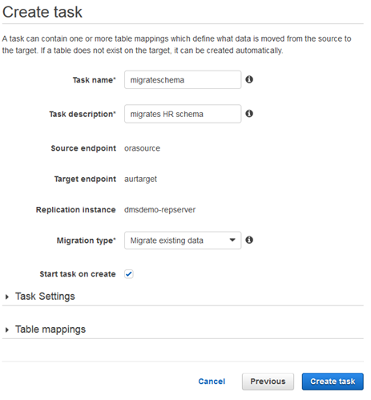
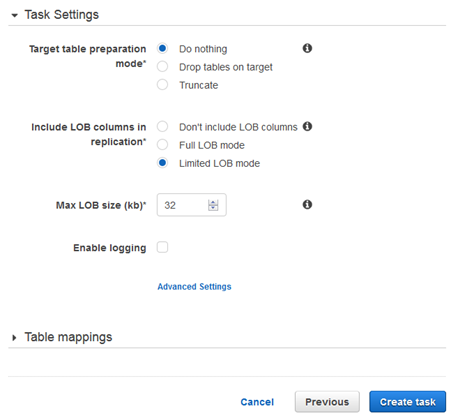
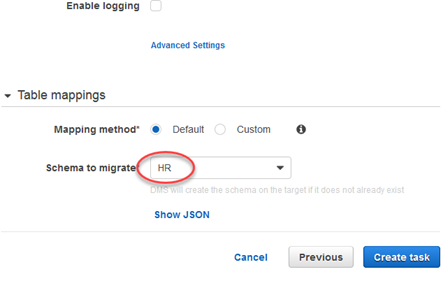
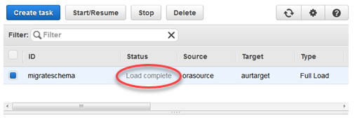

# Step 9: Create and Run Your AWS DMS Migration Task

Using a AWS DMS task, you can specify what schema to migrate and the type of migration. You can migrate existing data, migrate existing data and replicate ongoing changes, or replicate data changes only. This walkthrough migrates existing data only.

1. On the **Create Task** page, specify the task options. The following table describes the settings.

| For This Parameter       | Do This                                                                                  |
| ------------------------ | ---------------------------------------------------------------------------------------- |
| **Task name**            | Enter `migratehrschema`.                                                                 |
| **Task description**     | Enter a description for the task.                                                        |
| **Source endpoint**      | Shows `orasource` (the Amazon RDS for Oracle endpoint).                                  |
| **Target endpoint**      | Shows `aurtarget` (the Amazon Aurora MySQL endpoint).                                    |
| **Replication instance** | Shows `DMSdemo-repserver` (the AWS DMS replication instance created in an earlier step). |
| **Migration type**       | Choose **Migrate existing data**.                                                        |
| **Start task on create** | Select this option.                                                                      |

The page should look like the following:

 2. Under **Task Settings**, choose **Do nothing** for **Target table preparation mode**, because you have already created the tables through Schema Migration Tool. Because this migration doesn’t contain any LOBs, you can leave the LOB settings at their defaults.

Optionally, you can select **Enable logging**. If you enable logging, you will incur additional Amazon CloudWatch charges for the creation of CloudWatch logs. For this walkthrough, logs are not necessary.

 3. Leave the Advanced settings at their default values. 4. Choose **Table mappings**, choose **Default** for **Mapping method**, and then choose `HR` for **Schema to migrate**.

The completed section should look like the following.

 5. Choose **Create task**. The task will begin immediately.
The Tasks section shows you the status of the migration task.

You can monitor your task if you choose **Enable logging** when you set up your task. You can then view the CloudWatch metrics by doing the following:

1. On the navigation pane, choose **Tasks**.
2. Choose your migration task (`migratehrschema`).
3. Choose the **Task monitoring** tab, and monitor the task in progress on that tab.
