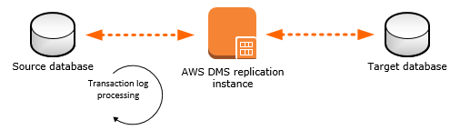

# Step 7: Create an AWS DMS Replication Instance

After we validate the schema structure between source and target databases, as described preceding, we proceed to the core part of this walkthrough, which is the data migration. The following illustration shows a high-level view of the migration process.

A DMS replication instance performs the actual data migration between source and target. The replication instance also caches the transaction logs during the migration. How much CPU and memory capacity a replication instance has influences the overall time required for the migration.

To create an AWS DMS replication instance, do the following:

1. Sign in to the AWS Management Console, select [AWS Database Migration Service](https://console.aws.amazon.com/dms/v2 "https://console.aws.amazon.com/dms/v2") (AWS DMS) and choose **Create replication instance**. If you are signed in as an AWS Identity and Access Management (IAM) user, you must have the appropriate permissions to access AWS DMS. For more information about the permissions required, see [IAM Permissions](../userguide/CHAP_Security.md#CHAP_Security.IAMPermissions "../userguide/CHAP_Security.md#CHAP_Security.IAMPermissions").
2. On the **Create replication instance** page, specify your replication instance information as shown following.

| For This Parameter                         | Do This                                                                                                 |
| ------------------------------------------ | ------------------------------------------------------------------------------------------------------- |
| **Name**                                   | Enter `DMSdemo-repserver`.                                                                              |
| **Descriptive Amazon Resource Name (ARN)** | Skip this optional field.                                                                               |
| **Description**                            | Enter a brief description, such as `DMS demo replication server`.                                       |
| **Instance class**                         | Choose **dms.t3.medium**. This instance class is large enough to migrate a small set of tables.         |
| **Engine version**                         | Choose **3.4.5**. This is the latest AWS DMS version, which includes all new features and enhancements. |
| **Allocated storage (GiB)**                | Choose **50**. This storage space is enough for your migration project.                                 |
| **VPC**                                    | Choose `DMSDemoVPC`, which is the VPC that was created by the AWS CloudFormation stack.                 |
| **Multi-AZ**                               | Choose `Dev or test workload (Single-AZ)`.                                                              |
| **Publicly accessible**                    | Leave this item selected.                                                                               |

3. For the **Advanced**, **Maintenance**, and **Tags** sections, leave the default settings as they are, and choose **Create**.
