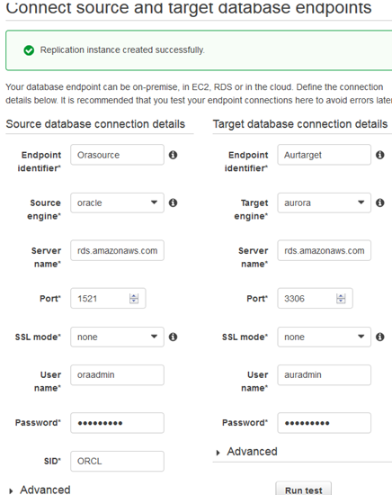
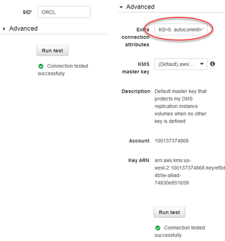

# Step 8: Create AWS DMS Source and Target Endpoints

While your replication instance is being created, you can specify the source and target database endpoints using the [AWS Management Console](https://console.aws.amazon.com/ "https://console.aws.amazon.com/"). However, you can only test connectivity after the replication instance has been created, because the replication instance is used in the connection.

1. Specify your connection information for the source Oracle database and the target Amazon Aurora MySQL database. The following table describes the source settings.

| For This Parameter      | Do This                                                                                                                                                         |
| ----------------------- | --------------------------------------------------------------------------------------------------------------------------------------------------------------- |
| **Endpoint Identifier** | Enter `Orasource` (the Amazon RDS for Oracle endpoint).                                                                                                         |
| **Source Engine**       | Choose **oracle**.                                                                                                                                              |
| **Server name**         | Provide the Oracle DB instance name. This is the \*_Server name_ • you used for AWS SCT, such as "do1xa4grferti8y.cqiw4tcs0mg7.us-west-2.rds.amazonaws.com". |
| **Port**                | Enter `1521`.                                                                                                                                                   |
| **SSL mode**            | Choose **None**.                                                                                                                                                |
| **Username**            | Enter `oraadmin`.                                                                                                                                               |
| **Password**            | Provide the password for the Oracle DB instance.                                                                                                                |
| **SID**                 | Provide the Oracle database name.                                                                                                                               |

The following table describes the target settings.

| For This Parameter      | Do This                                                                                                                                                                                           |
| ----------------------- | ------------------------------------------------------------------------------------------------------------------------------------------------------------------------------------------------- |
| **Endpoint Identifier** | Enter `Aurtarget` (the Amazon Aurora MySQL endpoint).                                                                                                                                             |
| **Target Engine**       | Choose **aurora**.                                                                                                                                                                                |
| **Servername**          | Provide the Aurora MySQL DB instance name. This is the \*_Server name_ • you used for AWS SCT, such as "dmsdemo-auroracluster-1u1oyqny35jwv.cluster-cqiw4tcs0mg7.us-west-2.rds.amazonaws.com". |
| **Port**                | Enter `3306`.                                                                                                                                                                                     |
| **SSL mode**            | Choose **None**.                                                                                                                                                                                  |
| **Username**            | Enter `auradmin`.                                                                                                                                                                                 |
| **Password**            | Provide the password for the Aurora MySQL DB instance.                                                                                                                                            |

The completed page should look like the following:

 2. In order to disable foreign key checks during the initial data load, you must add the following commands to the target Aurora MySQL DB instance. In the **Advanced** section, shown following, type the following commands for **Extra connection attributes**: `initstmt=SET FOREIGN_KEY_CHECKS=0;autocommit=1`

The first command disables foreign key checks during a load, and the second command commits the transactions that DMS executes.

 3. Choose **Next**.
