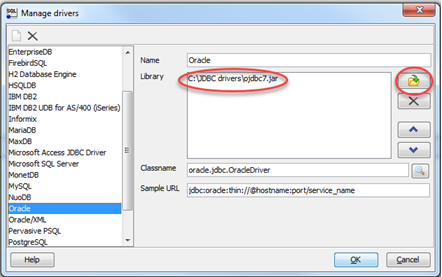
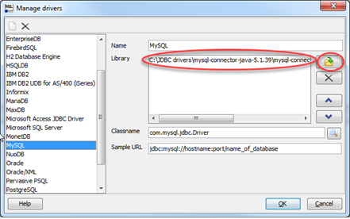
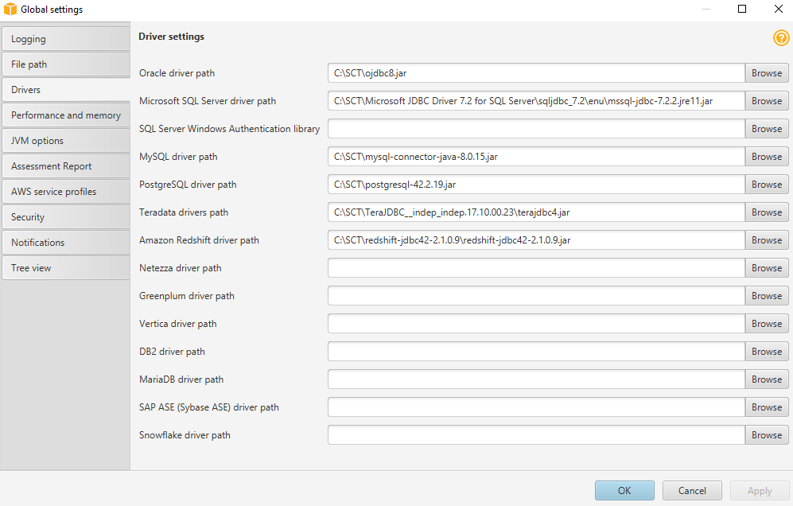

# Step 2: Install the SQL Tools and AWS Schema Conversion Tool on Your Local Computer

Next, you need to install a SQL client and the AWS Schema Conversion Tool (AWS SCT) on your local computer.

This walkthrough assumes you will use the SQL Workbench/J client to connect to the RDS instances for migration validation. A few other software tools you might want to consider are the following:

- [JACK DB](http://www.jackdb.com "http://www.jackdb.com"), an online web interface to work with RDS databases (Oracle and Aurora MySQL) over JDBC
- [DBVisualizer](https://www.dbvis.com/download/ "https://www.dbvis.com/download/")
- [Oracle SQL Developer](https://www.oracle.com/technetwork/developer-tools/sql-developer/overview/index-097090.html "https://www.oracle.com/technetwork/developer-tools/sql-developer/overview/index-097090.html")
  To install the SQL client software, do the following:

1.  Download SQL Workbench/J from [the SQL Workbench/J website](http://www.sql-workbench.net/downloads.html "http://www.sql-workbench.net/downloads.html"), and then install it on your local computer. This SQL client is free, open-source, and DBMS-independent.
2.  Download the JDBC driver for your Oracle database release. For more information, go to [https://www.oracle.com/jdbc](https://www.oracle.com/jdbc "https://www.oracle.com/jdbc").
3.  Download the MySQL JDBC driver (`–0—jar` file). For more information, go to [https://dev.mysql.com/downloads/connector/j/](https://dev.mysql.com/downloads/connector/j/ "https://dev.mysql.com/downloads/connector/j/").
4.  Using SQL Workbench/J, configure JDBC drivers for Oracle and Aurora MySQL to set up connectivity, as described following.

        1. In SQL Workbench/J, choose **File**, then choose **Manage Drivers**.
        2. From the list of drivers, choose **Oracle**.
        3. Choose the Open icon, then choose the `–0—jar` file for the Oracle JDBC driver that you downloaded in the previous step. Choose **OK**.

        
        4. From the list of drivers, choose MySQL.
        5. Choose the Open icon, then choose the MySQL JDBC driver that you downloaded in the previous step. Choose **OK**.

        

    To install the AWS Schema Conversion Tool and the required JDBC drivers, do the following:

5.  Download the AWS Schema Conversion Tool from [Installing, verifying, and updating the Schema Conversion Tool](../../../SchemaConversionTool/latest/userguide/CHAP_Installing.md "../../../SchemaConversionTool/latest/userguide/CHAP_Installing.md").
6.  Launch the AWS Schema Conversion Tool.
7.  In the AWS Schema Conversion Tool, choose **Global settings** from **Settings**.
8.  In **Global settings**, choose **Driver**, and then choose **Browse** for **Oracle driver path**. Locate the JDBC Oracle driver and choose **OK**. Next, choose **Browse** for **MySQL driver path**. Locate the JDBC MySQL driver and choose **OK**. Choose **OK** to close the dialog box.

