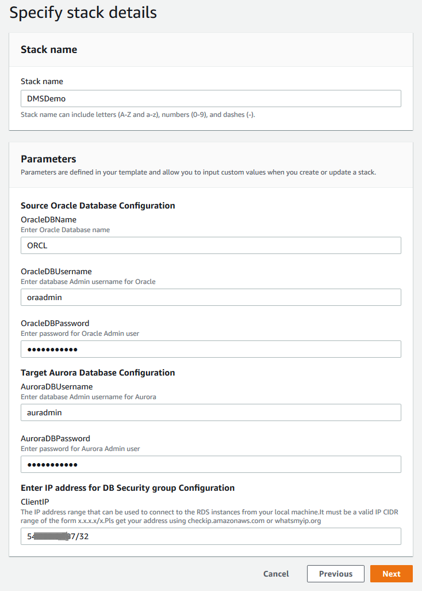
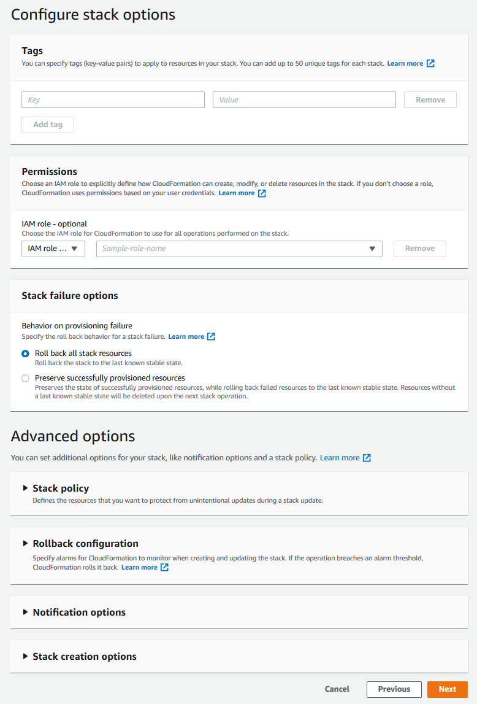
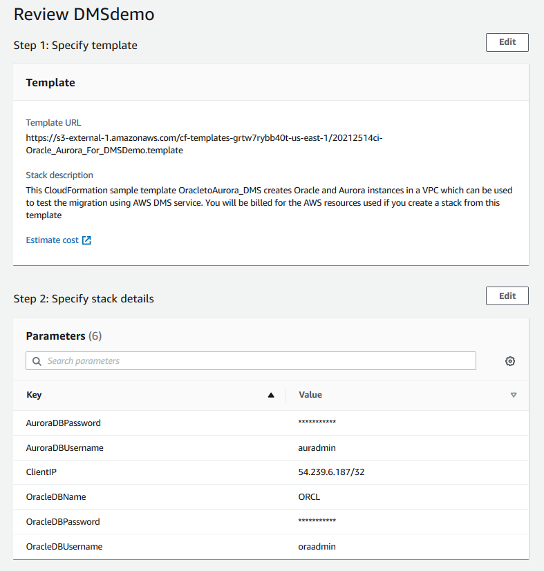
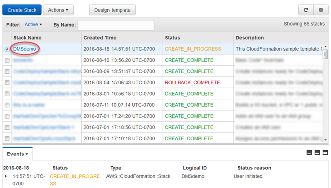
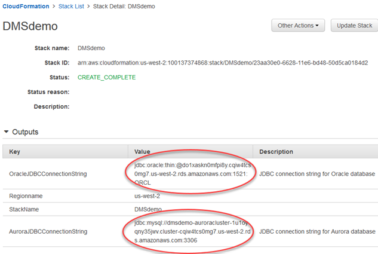

# Step 1: Launch the RDS Instances in a VPC by Using the AWS CloudFormation Template

Before you begin, you’ll need to download an AWS CloudFormation template. Follow these instructions:

1. Download the following archive to your computer: [`dms-sbs-RDSOracle2Aurora.zip`](samples/dms-sbs-RDSOracle2Aurora.md "samples/dms-sbs-RDSOracle2Aurora.md").
2. Extract the AWS CloudFormation template (`Oracle_Aurora_For_DMSDemo.template`) from the archive.
3. Copy and paste the `Oracle_Aurora_For_DMSDemo.template` file into your current directory.
   Now you need to provision the necessary AWS resources for this walkthrough. Do the following:

4. Sign in to the AWS Management Console and open the AWS CloudFormation console at [https://console.aws.amazon.com/cloudformation](https://console.aws.amazon.com/cloudformation/ "https://console.aws.amazon.com/cloudformation/").
5. Choose **Create stack** and then choose **With new resources (standard)**.
6. On the **Specify template** section of the **Create stack** page, choose **Upload a template file**.
7. Click **Choose file**, and then choose the `Oracle_Aurora_For_DMSDemo.template` file that you extracted from the `dms-sbs-RDSOracle2Aurora.zip` archive.
8. Choose **Next**. On the **Specify Details** page, provide parameter values as shown following.

| For This Parameter   | Do This                                                                                                                                                                                                                                                                                                                                                                                          |
| -------------------- | ------------------------------------------------------------------------------------------------------------------------------------------------------------------------------------------------------------------------------------------------------------------------------------------------------------------------------------------------------------------------------------------------ |
| **Stack Name**       | Enter `DMSdemo`.                                                                                                                                                                                                                                                                                                                                                                                 |
| **OracleDBName**     | Provide a unique name for your database. The name should begin with a letter. The default is `ORCL`.                                                                                                                                                                                                                                                                                             |
| **OracleDBUsername** | Specify the admin (DBA) user for managing the Oracle instance. The default is `oraadmin`.                                                                                                                                                                                                                                                                                                        |
| **OracleDBPassword** | Provide the password for the admin user. The default is `oraadmin123` .                                                                                                                                                                                                                                                                                                                          |
| **AuroraDBUsername** | Specify the admin (DBA) user for managing the Aurora MySQL instance. The default is `auradmin` .                                                                                                                                                                                                                                                                                                 |
| **AuroraDBPassword** | Provide the password for the admin user. The default is `auradmin123` .                                                                                                                                                                                                                                                                                                                          |
| **ClientIP**         | Specify the IP address in CIDR (x.x.x.x/32) format for your local computer. You can get your IP address from [whatsmyip.org](https://www.whatsmyip.org/ "https://www.whatsmyip.org/"). Your RDS instances' security group will allow ingress to this IP address. The default is access from anywhere (0.0.0.0/0), which is not recommended; you should use your IP address for this walkthrough. |

 6. Choose **Next**. On the **Configure stack options** page, shown following, choose **Next**.

 7. On the **Review** page, review the details, and if they are correct, scroll down and choose **Create stack**. You can get the estimated cost of running this AWS CloudFormation template by choosing **Estimate cost** at the **Template** section on top of the page.

 8. AWS can take about 20 minutes or more to create the stack with Amazon RDS for Oracle and Amazon Aurora MySQL instances.

 9. After the stack is created, choose **Stack**, select the DMSdemo stack, and then choose **Outputs**. Record the JDBC connection strings, **OracleJDBCConnectionString** and **AuroraJDBCConnectionString**, for use later in this walkthrough to connect to the Oracle and Aurora MySQL DB instances.

###### Note

Oracle 12c SE Two License version 12.1.0.2.v4 is available in all regions. However, Amazon Aurora MySQL is not available in all regions. Amazon Aurora MySQL is currently available in US East (N. Virginia), US West (Oregon), EU (Ireland), Asia Pacific (Tokyo), Asia Pacific (Mumbai), Asia Pacific (Sydney), and Asia Pacific (Seoul). If you try to create a stack in a region where Aurora MySQL is not available, creation fails with the error `Invalid DB Engine for AuroraCluster`.
