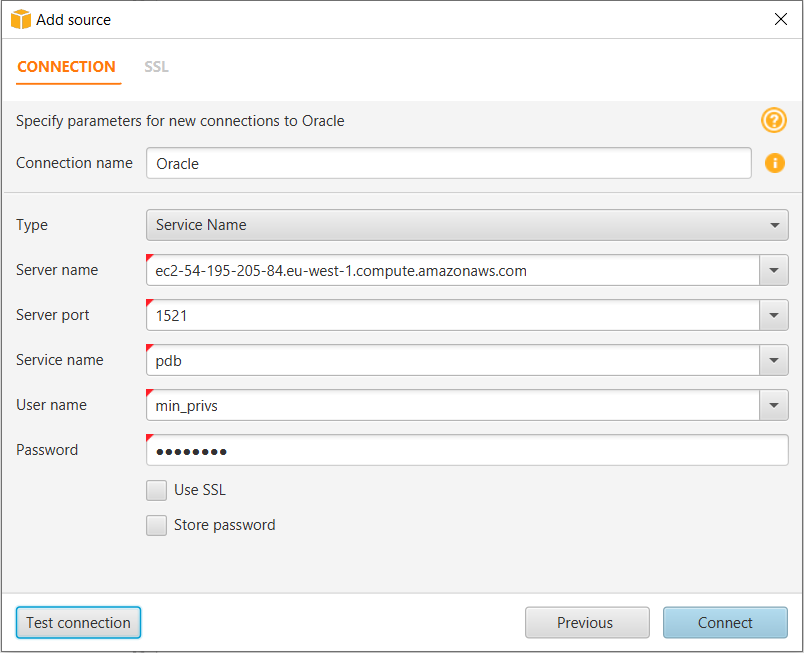
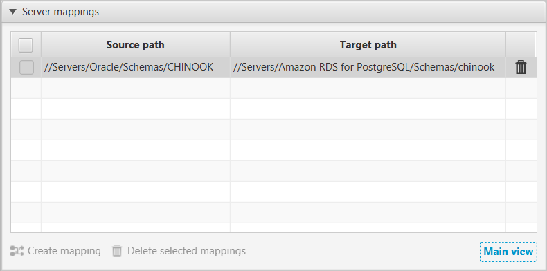

# Step 4: Use AWS SCT to Convert the Oracle Schema to PostgreSQL

Before you migrate data to PostgreSQL, you convert the Oracle schema to a PostgreSQL schema. [This video covers all the steps of this process](https://youtu.be/ibtNkChGFkw "https://youtu.be/ibtNkChGFkw").

To convert an Oracle schema to a PostgreSQL schema using AWS Schema Conversion Tool (AWS SCT), do the following:

1. Launch AWS SCT. In AWS SCT, choose **File**, then choose **New Project**. Create a new project named `AWS Schema Conversion Tool Oracle to PostgreSQL`, specify the **Location** of the project folder, and then choose **OK**.
2. Choose **Add source** to add a source Oracle database to your project, then choose **Oracle**, and choose **Next**.
3. Enter the following information, and then choose **Test Connection**.

| For This Parameter  | Do This                                                                   |
| ------------------- | ------------------------------------------------------------------------- |
| **Connection name** | Enter `Oracle`. AWS SCT displays this name in the tree in the left panel. |
| **Type**            | Choose **SID**.                                                           |
| **Server name**     | Enter the server name.                                                    |
| **Server port**     | Enter the Oracle port number. The default is `1521`.                      |
| **Oracle SID**      | Enter the database SID.                                                   |
| **User name**       | Enter the Oracle admin username.                                          |
| **Password**        | Enter the password for the admin user.                                    |

 4. Choose **OK** to close the alert box, then choose **Connect** to close the dialog box and to connect to the Oracle DB instance. 5. Choose **Add target** to add a target PostgreSQL database to your project, then choose **Amazon RDS for PostgreSQL**, and choose **Next**. 6. Enter the following information and then choose **Test Connection**.

| Parameter           | Description                                                                                   |
| ------------------- | --------------------------------------------------------------------------------------------- |
| **Connection name** | Enter `Amazon RDS for PostgreSQL`. AWS SCT displays this name in the tree in the right panel. |
| **Server name**     | Enter the server name.                                                                        |
| **Server port**     | Enter the PostgreSQL port number. The default is `5432`.                                      |
| **Database**        | Enter the database name.                                                                      |
| **User name**       | Enter the PostgreSQL admin username.                                                          |
| **Password**        | Enter the password for the admin user.                                                        |

7. Choose **OK** to close the alert box, then choose **Connect** to connect to the Amazon RDS for PostgreSQL DB instance.
8. In the tree in the left panel, select the schema to migrate. In the tree in the right panel, select your target Amazon RDS for PostgreSQL database. Choose **Create mapping**. For more information, see [Creating mapping rules](../../../SchemaConversionTool/latest/userguide/CHAP_Mapping.md "../../../SchemaConversionTool/latest/userguide/CHAP_Mapping.md") in the _Schema Conversion Tool User Guide_.

 9. Choose **Main view**. In the tree in the left panel, right-click the schema to migrate and choose **Convert schema**. 10. Choose **Yes** for the confirmation message. AWS SCT analyzes the schema, creates a database migration assessment report, and converts your schema to the target database format. 11. Choose **Assessment Report View** from the menu to check the database migration assessment report. The report breaks down by each object type and by how much manual change is needed to convert it successfully.

Generally, packages, procedures, and functions are more likely to have some issues to resolve because they contain the most custom PL/SQL code. AWS SCT also provides hints about how to fix these objects. 12. Choose the **Action Items** tab.

The **Action Items** tab shows each issue for each object that requires attention.

For each conversion issue, you can complete one of the following actions:

    * Modify the objects on the source Oracle database so that AWS SCT can convert the objects to the target Amazon RDS for PostgreSQL database.

    	1. Modify the objects on the source Oracle database.
    	2. Repeat the previous steps to convert the schema and check the assessment report.
    	3. If necessary, repeat this process until there are no conversion issues.
    	4. Choose **Main View** from the menu. Open the context (right-click) menu for the target Amazon RDS for PostgreSQL schema, and choose **Apply to database** to apply the schema changes to the Amazon RDS for PostgreSQL database, and confirm that you want to apply the schema changes.
    * Instead of modifying the source schema, modify scripts that AWS SCT generates before applying the scripts on the target Amazon RDS for PostgreSQL database.

    	1. Choose **Main View** from the menu. Open the context (right-click) menu for the target Amazon RDS for PostgreSQL schema name, and choose **Save as SQL**. Next, choose a name and destination for the script.
    	2. In the script, modify the objects to correct conversion issues.

    	You can also exclude foreign key constraints, triggers, and secondary indexes from the script because they can cause problems during the migration. After the migration is complete, you can create these objects on the Amazon RDS for PostgreSQL database.
    	3. Run the script on the target Amazon RDS for PostgreSQL database.

For more information, see [Converting Database Schema to Amazon RDS](../../../SchemaConversionTool/latest/userguide/CHAP_Converting.md "../../../SchemaConversionTool/latest/userguide/CHAP_Converting.md"). 13. (Optional) Use AWS SCT to create migration rules.

    1. Choose **Mapping view** and then choose **New migration rule**.
    2. Create additional migration transformation rules that are required based on the action items.
    3. Save the migration rules.
    4. Choose **Export script for DMS** to export a JSON format of all the transformations that the AWS DMS task will use. Choose **Save**.
