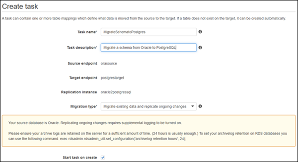
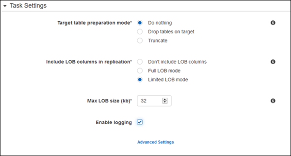
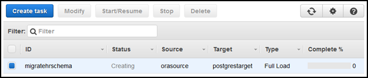

# Step 7: Create and Run Your AWS DMS Migration Task

Using an AWS DMS task, you can specify which schema to migrate and the type of migration. You can migrate existing data, migrate existing data and replicate ongoing changes, or replicate data changes only. This walkthrough migrates existing data and replicates ongoing changes.

1. On the **Create Task** page, specify the task options. The following table describes the settings.

| Parameter                | Description                                                                                                                             |
| ------------------------ | --------------------------------------------------------------------------------------------------------------------------------------- |
| **Task name**            | Enter a name for the migration task.                                                                                                    |
| **Task description**     | Enter a description for the task.                                                                                                       |
| **Source endpoint**      | Shows the Oracle source endpoint.<br>If you have more than one endpoint in the account, then choose the correct endpoint from the list. |
| **Target endpoint**      | Shows the PostgreSQL target endpoint.                                                                                                   |
| **Replication instance** | Shows the AWS DMS replication instance.                                                                                                 |
| **Migration type**       | Choose **Migrate existing data and replicate ongoing changes**.                                                                         |
| **Start task on create** | Select this option.                                                                                                                     |

The page should look like the following:

 2. Under **Task Settings**, choose **Do nothing** or **Truncate** for **Target table preparation mode**, because you have already created the tables using the AWS Schema Conversion Tool.

If the Oracle database has LOBs, then for **Include LOB columns in replication**, select **Full LOB mode** if you want to replicate the entire LOB for all tables. Select **Limited LOB mode** if you want to replicate the LOBs only up to a certain size. You specify the size of the LOB to migrate in **Max LOB size (kb)**.

It is best to select **Enable logging**. If you enable logging, then you can see any errors or warnings that the task encounters, and you can troubleshoot those issues.

 3. Leave the Advanced settings at their default values. 4. Choose **Table mappings**, and select the **JSON** tab. Next, select **Enable JSON editing**, and enter the table mappings you saved in the last step in [Step 4: Convert the Oracle Schema to PostgreSQL](chap-rdsoracle2postgresql.steps.md "chap-rdsoracle2postgresql.steps.md").

The following is an example of mappings that convert schema names and table names to lowercase.

```
{
  "rules": [
    {
      "rule-type": "transformation",
      "rule-id": "100000",
      "rule-name": "Default Lowercase Table Rule",
      "rule-action": "convert-lowercase",
      "rule-target": "table",
      "object-locator": {
        "schema-name": "%",
        "table-name": "%"
      }
    },
    {
      "rule-type": "transformation",
      "rule-id": "100001",
      "rule-name": "Default Lowercase Schema Rule",
      "rule-action": "convert-lowercase",
      "rule-target": "schema",
      "object-locator": {
        "schema-name": "%"
      }
    }
  ]
}
```

5. Choose **Create task**. The task will begin immediately.
   The Tasks section shows you the status of the migration task.


You can monitor your task if you chose **Enable logging** when you set up your task. You can then view the CloudWatch metrics by doing the following:

1. On the navigation pane, choose **Tasks**.
2. Choose your migration task.
3. Choose the **Task monitoring** tab, and monitor the task in progress on that tab.

When the full load is complete and cached changes are applied, the task will stop on its own. 4. On the target PostgreSQL database, enable foreign key constraints and triggers using the script you saved previously. 5. On the target PostgreSQL database, re-create the secondary indexes if you removed them previously. 6. In the AWS DMS console, start the AWS DMS task by clicking **Start/Resume** for the task.

The AWS DMS task keeps the target PostgreSQL database up-to-date with source database changes. AWS DMS will keep all of the tables in the task up-to-date until it is time to implement the application migration. The latency will be zero, or close to zero, when the target has caught up to the source.
