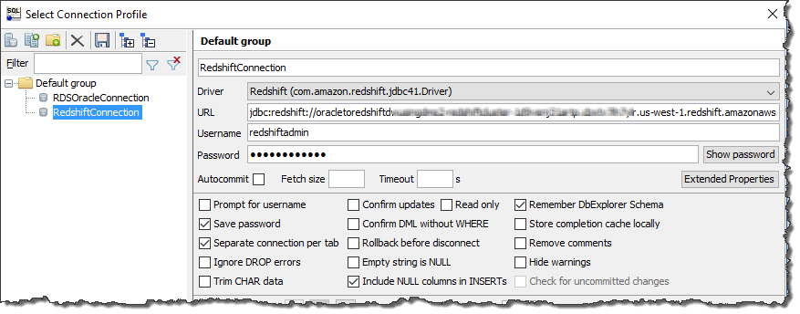

# Step 4: Test the Connectivity to the Amazon Redshift Database

Next, test your connection to your Amazon Redshift database.

1. In SQL Workbench/J, choose **File**, then choose **Connect window**. Choose the **Create a new connection profile** icon. Connect to the Amazon Redshift database in SQL Workbench/J by using the information shown following.

| Parameter                 | Action                                                                                                                                         |
| ------------------------- | ---------------------------------------------------------------------------------------------------------------------------------------------- |
| \*_New profile_ • name | Enter `RedshiftConnection`.                                                                                                                    |
| **Driver**                | Choose `Redshift (com.amazon.redshift.jdbc42.Driver)`.                                                                                         |
| **URL**                   | Use the \*_RedshiftJDBCConnectionString_ • value you recorded when you examined the output details of the DMSdemo stack in a previous step. |
| **Username**              | Enter `redshiftadmin`.                                                                                                                         |
| **Password**              | Enter `Redshift#123`.                                                                                                                          |

2. Test the connection by choosing **Test**. Choose **OK** to close the dialog box, then choose **OK** to create the connection profile.

###### Note

If your connection is unsuccessful, ensure that the IP address you assigned when creating the AWS CloudFormation template is the one you are attempting to connect from. This issue is the most common one when trying to connect to an instance. 3. Verify your connectivity to the Amazon Redshift DB instance by running a sample SQL command, such as `select current_date;`.
