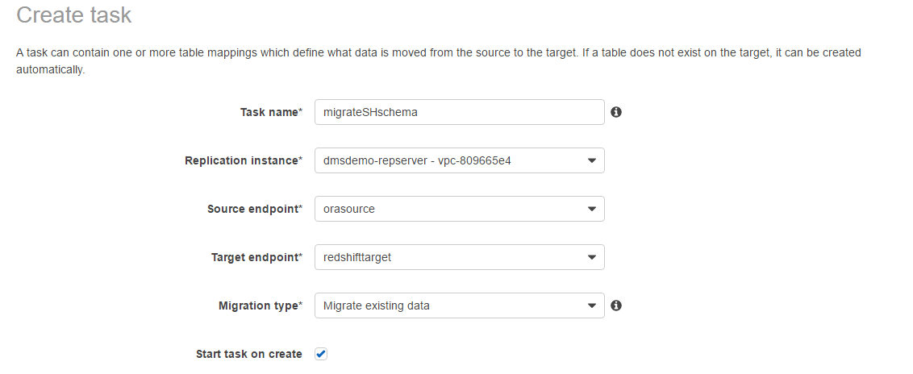
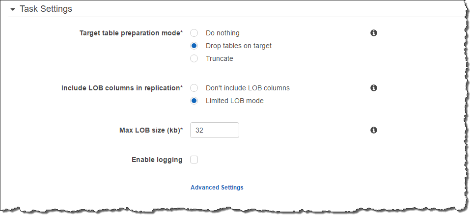
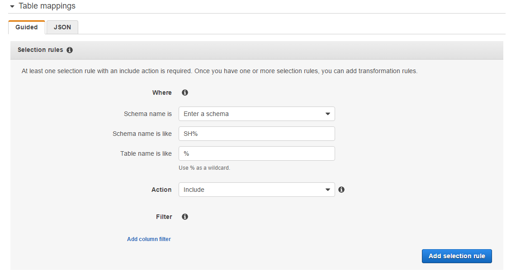
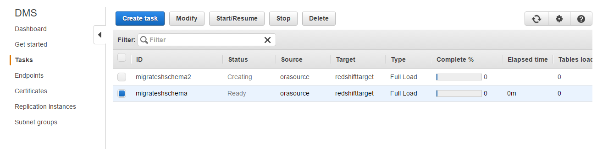

# Step 9: Create and Run Your AWS DMS Migration Task

Using an AWS DMS task, you can specify what schema to migrate and the type of migration. You can migrate existing data, migrate existing data and replicate ongoing changes, or replicate data changes only. This walkthrough migrates existing data only.

1. On the **Create Task** page, specify the task options. The following table describes the settings.

| Parameter                | Action                                                                                   |
| ------------------------ | ---------------------------------------------------------------------------------------- |
| **Task name**            | Enter `migrateSHschema`.                                                                 |
| **Replication instance** | Shows `DMSdemo-repserver` (the AWS DMS replication instance created in an earlier step). |
| **Source endpoint**      | Shows `orasource` (the Amazon RDS for Oracle endpoint).                                  |
| **Target endpoint**      | Shows `redshifttarget` (the Amazon Redshift endpoint).                                   |
| **Migration type**       | Choose **Migrate existing data**.                                                        |
| **Start task on create** | Choose this option.                                                                      |

The page should look like the following.

 2. On the **Task Settings** section, specify the settings as shown in the following table.

| Parameter                              | Action                       |
| -------------------------------------- | ---------------------------- |
| **Target table preparation mode**      | Choose **Do nothing**.       |
| **Include LOB columns in replication** | Choose **Limited LOB mode**. |
| **Max LOB size (kb)**                  | Accept the default (32).     |

The section should look like the following.

 3. In the **Selection rules** section, specify the settings as shown in the following table.

| Parameter               | Action                   |
| ----------------------- | ------------------------ |
| **Schema name is**      | Choose `Enter a schema`. |
| **Schema name is like** | Enter `SH%`.             |
| **Table name is like**  | Enter **%**.             |
| **Action**              | Choose `Include`.        |

The section should look like the following:

 4. Choose **Add selection rule**. 5. Choose **Create task**. The task begins immediately. The **Tasks** section shows you the status of the migration task.

