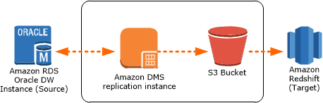

# Step 7: Create an AWS DMS Replication Instance

After we validate the schema structure between source and target databases, as described preceding, we proceed to the core part of this walkthrough, which is the data migration. The following illustration shows a high-level view of the migration process.

A DMS replication instance performs the actual data migration between source and target. The replication instance also caches the transaction logs during the migration. How much CPU and memory capacity a replication instance has influences the overall time required for the migration.

To create an AWS DMS replication instance, do the following:

1. Sign in to the AWS Management Console, open the AWS DMS console at https://console.aws.amazon.com/dms/v2/, and choose **Create Migration**. If you are signed in as an AWS Identity and Access Management (IAM) user, you must have the appropriate permissions to access AWS DMS. For more information about the permissions required, see [IAM Permissions](../userguide/CHAP_Security.md#CHAP_Security.IAMPermissions "../userguide/CHAP_Security.md#CHAP_Security.IAMPermissions").
2. Choose **Create migration** to start a database migration.
3. On the **Welcome** page, choose **Next**.
4. On the **Create replication instance** page, specify your replication instance information as shown following.

| Parameter               | Action                                                                                                |
| ----------------------- | ----------------------------------------------------------------------------------------------------- |
| **Name**                | Enter `DMSdemo-repserver`.                                                                            |
| **Description**         | Enter a brief description, such as `DMS demo replication server`.                                     |
| **Instance class**      | Choose **dms.t2.medium**. This instance class is large enough to migrate a small set of tables.       |
| **VPC**                 | Choose `OracletoRedshiftusingDMS`, which is the VPC that was created by the AWS CloudFormation stack. |
| **Multi-AZ**            | Choose `No`.                                                                                          |
| **Publicly accessible** | Leave this item selected.                                                                             |

5. For the **Advanced** section, leave the default settings as they are, and choose **Next**.
