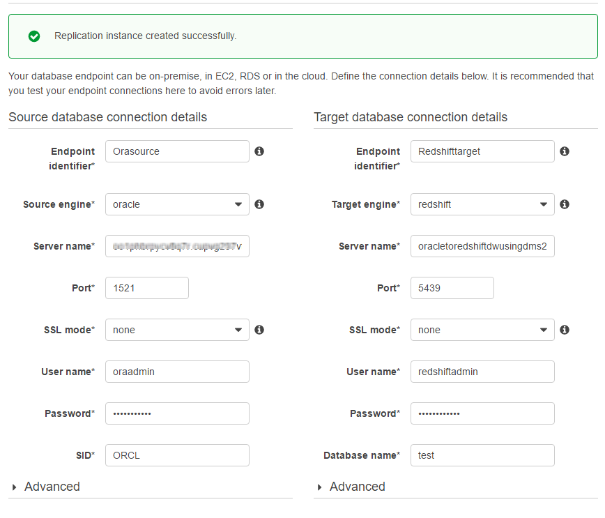

# Step 8: Create AWS DMS Source and Target Endpoints

While your replication instance is being created, you can specify the source and target database endpoints using the [AWS Management Console](https://console.aws.amazon.com/ "https://console.aws.amazon.com/"). However, you can only test connectivity after the replication instance has been created, because the replication instance is used in the connection.

1. Specify your connection information for the source Oracle database and the target Amazon Redshift database. The following table describes the source settings.

| Parameter               | Action                                                                                                                                                                  |
| ----------------------- | ----------------------------------------------------------------------------------------------------------------------------------------------------------------------- |
| **Endpoint Identifier** | Enter `Orasource` (the Amazon RDS for Oracle endpoint).                                                                                                                 |
| **Source Engine**       | Choose **oracle**.                                                                                                                                                      |
| **Server name**         | Provide the Oracle DB instance name. This name is the *_Server name_ • value that you used for AWS SCT, such as "abc123567.abc87654321.us-west-2.rds.amazonaws.com". |
| **Port**                | Enter `1521`.                                                                                                                                                           |
| **SSL mode**            | Choose **None**.                                                                                                                                                        |
| **Username**            | Enter `oraadmin`.                                                                                                                                                       |
| **Password**            | Enter `oraadmin123`.                                                                                                                                                    |
| **SID**                 | Enter `ORCL`.                                                                                                                                                           |

The following table describes the target settings.

| Parameter               | Action                                                                                                                                                                                                                              |
| ----------------------- | ----------------------------------------------------------------------------------------------------------------------------------------------------------------------------------------------------------------------------------- |
| **Endpoint Identifier** | Enter `Redshifttarget` (the Amazon Redshift endpoint).                                                                                                                                                                              |
| **Target Engine**       | Choose **redshift**.                                                                                                                                                                                                                |
| **Servername**          | Provide the Amazon Redshift DB instance name. This name is the *_Server name_ • value that you used for AWS SCT, such as `"oracletoredshiftdwusingdms-redshiftcluster-abc123567.abc87654321.us-west-2.redshift.amazonaws.com"`.. |
| **Port**                | Enter `5439`.                                                                                                                                                                                                                       |
| **SSL mode**            | Choose **None**.                                                                                                                                                                                                                    |
| **Username**            | Enter `redshiftadmin`.                                                                                                                                                                                                              |
| **Password**            | Enter `Redshift#123`.                                                                                                                                                                                                               |
| **Database name**       | Enter `test`.                                                                                                                                                                                                                       |

The completed page should look like the following.

 2. Wait for the status to say **Replication instance created successfully.**. 3. To test the source and target connections, choose **Run Test** for the source and target connections. 4. Choose **Next**.
