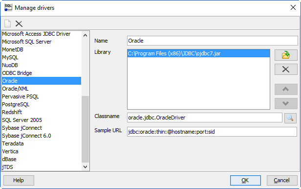
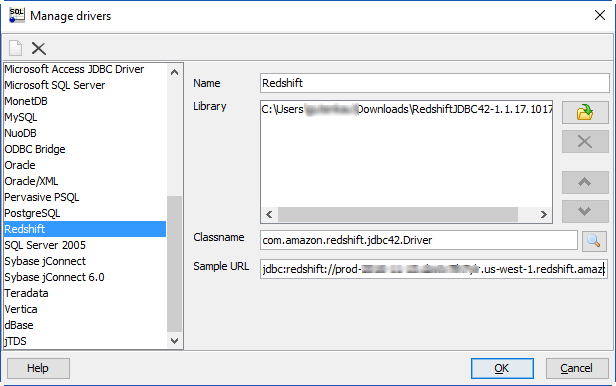

# Step 2: Install the SQL Tools and AWS Schema Conversion Tool on Your Local Computer

Next, you need to install a SQL client and AWS SCT on your local computer.

This walkthrough assumes you will use the SQL Workbench/J client to connect to the RDS instances for migration validation.

1.  Download SQL Workbench/J from [the SQL Workbench/J website](http://www.sql-workbench.net/downloads.html "http://www.sql-workbench.net/downloads.html"), and then install it on your local computer. This SQL client is free, open-source, and DBMS-independent.
2.  Download the JDBC driver for your Oracle database release. For more information, go to https://www.oracle.com/jdbc.
3.  Download the Amazon Redshift driver file, `RedshiftJDBC41-1.1.17.1017.jar`, as described following.
    1. Find the Amazon S3 URL to the file in [Previous JDBC Driver Versions](../../../redshift/latest/mgmt/jdbc-previous-versions.md "../../../redshift/latest/mgmt/jdbc-previous-versions.md") of the _Amazon Redshift Cluster Management Guide_.
    2. Download the driver as described in [Download the Amazon Redshift JDBC Driver](../../../redshift/latest/mgmt/configure-jdbc-connection.md#download-jdbc-driver "../../../redshift/latest/mgmt/configure-jdbc-connection.md#download-jdbc-driver") of the same guide.

4.  Using SQL Workbench/J, configure JDBC drivers for Oracle and Amazon Redshift to set up connectivity, as described following.

        1. In SQL Workbench/J, choose **File**, then choose **Manage Drivers**.
        2. From the list of drivers, choose **Oracle**.
        3. Choose the **Open** icon, then choose the `ojdbc.jar` file that you downloaded in the previous step. Choose **OK**.

        
        4. From the list of drivers, choose **Redshift**.
        5. Choose the **Open** icon, then choose the Amazon Redshift JDBC driver that you downloaded in the previous step. Choose **OK**.

        

    Next, install AWS SCT and the required JDBC drivers.

5.  Download AWS SCT from [Installing, verifying, and updating the Schema Conversion Tool](../../../SchemaConversionTool/latest/userguide/CHAP_Installing.md "../../../SchemaConversionTool/latest/userguide/CHAP_Installing.md").
6.  Follow the instructions to install AWS SCT.
7.  Launch AWS SCT.
8.  In AWS SCT, choose **Global settings** from **Settings**.
9.  Choose **Settings**, **Global settings**, then choose **Drivers**, and then choose **Browse** for **Oracle driver path**. Locate the Oracle JDBC driver and choose **OK**.
10. Choose **Browse** for **Amazon Redshift driver path**. Locate the Amazon Redshift JDBC driver and choose **OK**. Choose **OK** to close the dialog box.

