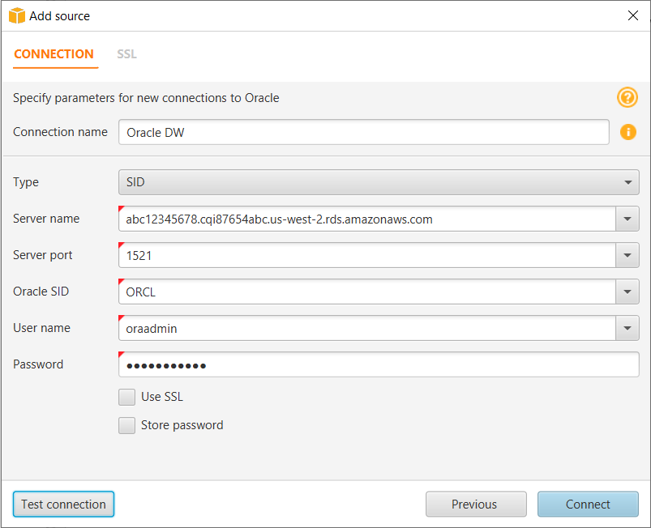
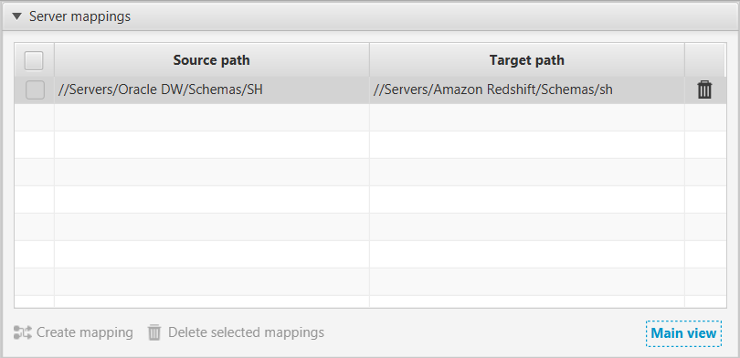
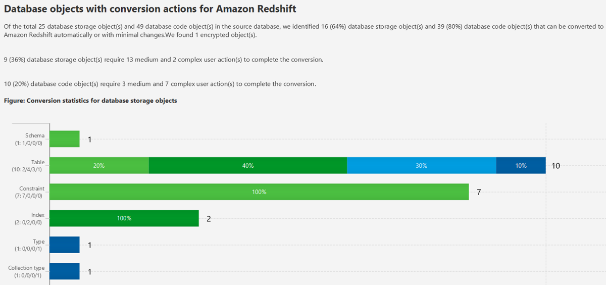

# Step 5: Use AWS SCT to Convert the Oracle Schema to Amazon Redshift

Before you migrate data to Amazon Redshift, you convert the Oracle schema to an Amazon Redshift schema. [This video covers all the steps of this process](https://youtu.be/ZK7J74VJT04 "https://youtu.be/ZK7J74VJT04").

To convert an Oracle schema to an Amazon Redshift schema using AWS Schema Conversion Tool (AWS SCT), do the following:

1. Launch AWS SCT. In AWS SCT, choose **File**, then choose **New Project**. Create a new project named `DWSchemaMigrationDemoProject`, specify the **Location** of the project folder, and then choose **OK**.
2. Choose **Add source** to add a source Oracle database to your project, then choose **Oracle**, and choose **Next**.
3. Enter the following information, and then choose **Test Connection**.

| Parameter           | Action                                                                                                                                                                                                                                                                                                                                                                                                                                                                                                                          |
| ------------------- | ------------------------------------------------------------------------------------------------------------------------------------------------------------------------------------------------------------------------------------------------------------------------------------------------------------------------------------------------------------------------------------------------------------------------------------------------------------------------------------------------------------------------------- |
| **Connection name** | Enter `Oracle DW`. AWS SCT displays this name in the tree in the left panel.                                                                                                                                                                                                                                                                                                                                                                                                                                                    |
| **Type**            | Choose **SID**.                                                                                                                                                                                                                                                                                                                                                                                                                                                                                                                 |
| **Server name**     | Use the **OracleJDBCConnectionString\* • value you used to connect to the Oracle DB instance, but remove the JDBC prefix information and the port and database name suffix. For example, a sample connection string you use with SQL Workbench/J might be `"jdbc:oracle:thin:@abc12345678.cqi87654abc.us-west-2.rds.amazonaws.com:1521:ORCL"`. For AWS SCT **Server name\*\*, you remove `"jdbc:oracle:thin:@"` and `":1521:ORCL"` and use just the server name: `"abc12345678.cqi87654abc.us-west-2.rds.amazonaws.com"`. |
| **Server port**     | Enter `1521`.                                                                                                                                                                                                                                                                                                                                                                                                                                                                                                                   |
| **Oracle SID**      | Enter `ORCL`.                                                                                                                                                                                                                                                                                                                                                                                                                                                                                                                   |
| **User name**       | Enter `oraadmin`.                                                                                                                                                                                                                                                                                                                                                                                                                                                                                                               |
| **Password**        | Enter `oraadmin123`.                                                                                                                                                                                                                                                                                                                                                                                                                                                                                                            |

 4. Choose **OK** to close the alert box, then choose **Connect** to close the dialog box and to connect to the Oracle DB instance. 5. Choose **Add target** to add a target Amazon Redshift database to your project, then choose **Amazon Redshift**, and choose **Next**. 6. Enter the following information and then choose **Test Connection**.

| Parameter           | Action                                                                                                                                                                                                                                                                                                                                                                                                                                                                                                                                                                                              |
| ------------------- | --------------------------------------------------------------------------------------------------------------------------------------------------------------------------------------------------------------------------------------------------------------------------------------------------------------------------------------------------------------------------------------------------------------------------------------------------------------------------------------------------------------------------------------------------------------------------------------------------- |
| **Connection name** | Enter `Amazon Redshift`. AWS SCT displays this name in the tree in the right panel.                                                                                                                                                                                                                                                                                                                                                                                                                                                                                                                 |
| **Type**            | Choose **SID**.                                                                                                                                                                                                                                                                                                                                                                                                                                                                                                                                                                                     |
| **Server name**     | Use the **RedshiftJDBCConnectionString\* • value you used to connect to the Amazon Redshift cluster, but remove the JDBC prefix information and the port suffix. For example, a sample connection string you use with SQL Workbench/J might be " jdbc:redshift://oracletoredshiftdwusingdms-redshiftcluster-abc123567.abc87654321.us-west-2.redshift.amazonaws.com:5439/test". For AWS SCT **Server name\*\*, you remove " jdbc:redshift://" and :5439/test" to use just the server name: "oracletoredshiftdwusingdms-redshiftcluster-abc123567.abc87654321.us-west-2.redshift.amazonaws.com" |
| **Server port**     | Enter `5439`.                                                                                                                                                                                                                                                                                                                                                                                                                                                                                                                                                                                       |
| **User name**       | Enter `redshiftadmin`.                                                                                                                                                                                                                                                                                                                                                                                                                                                                                                                                                                              |
| **Password**        | Enter `Redshift#123`.                                                                                                                                                                                                                                                                                                                                                                                                                                                                                                                                                                               |
| **Use AWS Glue**    | Turn off this option.                                                                                                                                                                                                                                                                                                                                                                                                                                                                                                                                                                               |

7. Choose **OK** to close the alert box, then choose **Connect** to connect to the Amazon Redshift DB instance.
8. In the tree in the left panel, select only the **SH** schema. In the tree in the right panel, select your target Amazon Redshift database. Choose **Create mapping**.

 9. Choose **Main view**. 10. In the tree in the left panel, right-click the **SH** schema and choose **Collect Statistics**. AWS SCT analyzes the source data to recommend the best keys for the target Amazon Redshift database. For more information, see [Collecting or Uploading Statistics](../../../SchemaConversionTool/latest/userguide/CHAP_Converting.md#CHAP_Converting.DW.Statistics "../../../SchemaConversionTool/latest/userguide/CHAP_Converting.md#CHAP_Converting.DW.Statistics").

###### Note

If the **SH** schema does not appear in the list, choose **Actions**, then choose **Refresh from Database**. 11. In the tree in the left panel, right-click the **SH** schema and choose **Create report**. AWS SCT analyzes the **SH** schema and creates a database migration assessment report for the conversion to Amazon Redshift. 12. Check the report and the action items it suggests. The report discusses the type of objects that can be converted by using AWS SCT, along with potential migration issues and actions to resolve these issues. For this walkthrough, you should see something like the following:

 13. Review the report summary. To save the report, choose either **Save to CSV** or **Save to PDF**. 14. Choose the **Action Items** tab. The report discusses the type of objects that can be converted by using AWS SCT, along with potential migration issues and actions to resolve these issues. 15. In the tree in the left panel, right-click the **SH** schema and choose **Convert schema**. 16. Choose **Yes** for the confirmation message. AWS SCT then converts your schema to the target database format.

###### Note

The choice of the Amazon Redshift sort keys and distribution keys is critical for optimal performance. You can use key management in AWS SCT to customize the choice of keys. For this walkthrough, we use the defaults recommended by AWS SCT. For more information, see [Optimizing Amazon Redshift](../../../SchemaConversionTool/latest/userguide/CHAP_Converting.DW.md "../../../SchemaConversionTool/latest/userguide/CHAP_Converting.DW.md"). 17. In the tree in the right panel, choose the converted **sh** schema, and then choose **Apply to database** to apply the schema scripts to the target Amazon Redshift instance. 18. In the tree in the right panel, choose the **sh** schema, and then choose **Refresh from Database** to refresh from the target database.
The database schema has now been converted and imported from source to target.
