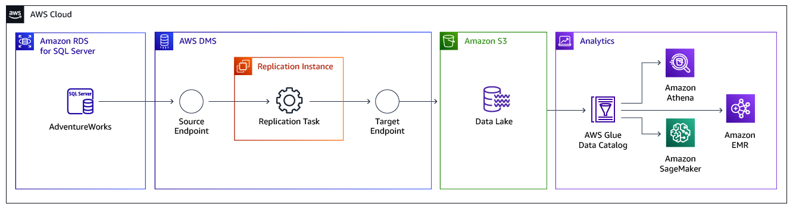
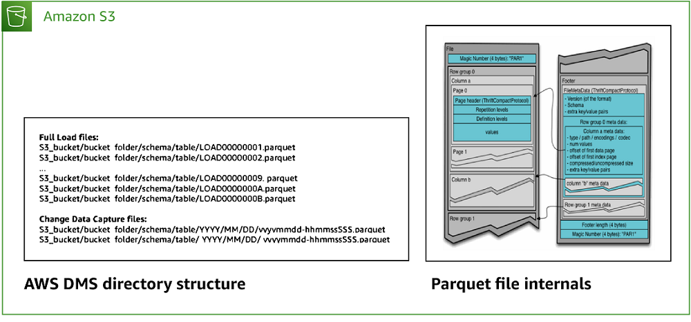

# Migrating an Amazon RDS for SQL Server Database to an Amazon S3 Data Lake

This walkthrough gets you started with the process of migrating from an Amazon Relational Database Service (Amazon RDS) for Microsoft SQL Server to Amazon Simple Storage Service (Amazon S3) cloud data lake using AWS Database Migration Service (AWS DMS).

For most organizations, data is distributed across multiple systems and data stores to support varied business needs. On-premises data stores struggle to scale performance as data sizes and formats grow exponentially for analytics and reporting purposes. These limitations in data storage and management limit efficient and comprehensive analytics.

Amazon S3 based data lakes provide reliable and scalable storage, where you can store structured, semi-structured and unstructured datasets for varying analytics needs. You can integrate Amazon S3 based data lakes with distributed processing frameworks such as Apache Spark, Apache Hive, and Presto to decouple compute and storage, so that both can scale independently.

###### Topics

- [Why Amazon S3?](#chap-rdssqlserver2s3datalake.whys3 "#chap-rdssqlserver2s3datalake.whys3")
- [Why AWS DMS?](#chap-rdssqlserver2s3datalake.whydms "#chap-rdssqlserver2s3datalake.whydms")
- [Solution overview](#chap-rdssqlserver2s3datalake.overview "#chap-rdssqlserver2s3datalake.overview")
- [Prerequisties for migrating from an Amazon RDS for SQL Server database to an Amazon S3 data lake](chap-rdssqlserver2s3datalake.md "chap-rdssqlserver2s3datalake.md")
- [Step-by-step Amazon RDS for SQL Server database to an Amazon S3 data lake migration walkthrough](chap-rdssqlserver2s3datalake.md "chap-rdssqlserver2s3datalake.md")

## Why Amazon S3?

Amazon S3 is an object storage service for structured, semi-structured, and unstructured data that offers industry-leading scalability, data availability, security, and performance. With a data lake built on Amazon S3, you can use native AWS services, optimize costs, organize data, and configure fine-tuned access controls to meet specific business, organizational, and compliance requirements.

Amazon S3 is designed for 99.999999999% (11 9s) of data durability. The service automatically creates and stores copies of all uploaded S3 objects across multiple systems. This means your data is available when needed and protected against failures, errors, and threats.

Amazon S3 is secure by design, scalable on demand, and durable against the failure of an entire AWS Availability Zone. You can use AWS native services and integrate with third-party service providers to run applications on your data lake.

## Why AWS DMS?

Data lakes typically require building, configuring, and maintaining multiple data ingestion pipelines from cloud and on-premises data stores.

Traditionally, databases can be loaded once with data ingestion tools such as import, export, bulk copy, and so on. Ongoing changes are either not possible or are implemented by bookmarking the initial state. Setting up a data lake using these methods can present challenges ranging from increased load on the source database to overheads while carrying schema changes.

AWS DMS supports a one-time load and near-real-time ongoing replication making the data migration seamless, while supporting multiple source and target database platforms. One of the common use cases is the need to derive insights on data stored in several sources. For example, you may need to identify monthly sales for a specific year on sales data stored on different database instances.

As a part of this walkthrough, we will configure AWS DMS to move data from an Amazon RDS for SQL Server database instance to Amazon S3 for a sales analytics use case.

###### Note

This introductory exercise doesn’t cover all use cases of migrating to Amazon S3 but provides an overview of the migration process using AWS DMS. This example covers commonly faced problems and describes best practices to follow when migrating to an Amazon S3 data lake.

## Solution overview

The following diagram displays a high-level architecture of the solution, where we use AWS DMS to move data from Microsoft SQL Server databases hosted on Amazon Relational Database Service (Amazon RDS) to Amazon Simple Storage Service (Amazon S3).

The following diagram shows the structure of the Amazon S3 bucket from the preceding diagram.

To replicate data, you need to create and configure the following artifacts in AWS DMS:

- **Replication Instance** — An AWS managed instance that hosts the AWS DMS engine. You control the type or size of the instance based on the workload you plan to migrate.
- **Source Endpoint** — An endpoint that provides connection details, data store type, and credentials to connect to a source database. For this use case, we will configure the source endpoint to point to the Amazon RDS for SQL Server database.
- **Target Endpoint** — AWS DMS supports several target systems including Amazon RDS, Amazon Aurora, Amazon Redshift, Amazon Kinesis Data Streams, Amazon S3, and more. For the use case, we will configure Amazon S3 as the target endpoint.
- **Replication Task** — A task that runs on the replication instance and connects to endpoints to replicate data from the source database to the target database

For this walkthrough, we will use the `AdventureWorks` sample database on an Amazon RDS for SQL Server instance as the base data for the walkthrough. The `AdventureWorks` database holds sales, marketing, and order data. We will use AWS DMS to move sales data from the source database to Amazon S3 object store, which can be used as a data lake for downstream analytics needs.

###### Note

You can refer to [Migrating a SQL Server Always On Database to Amazon Web Services](chap-manageddatabases.md "chap-manageddatabases.md") for details on migrating from a Microsoft SQL Server Always On database instance.

We will create an AWS DMS task, which will perform a one-time full load to migrate a point in time snapshot and will then stream incremental data to the target Amazon S3 bucket. This way, sales data in the S3 bucket will be kept in sync with the source database.
