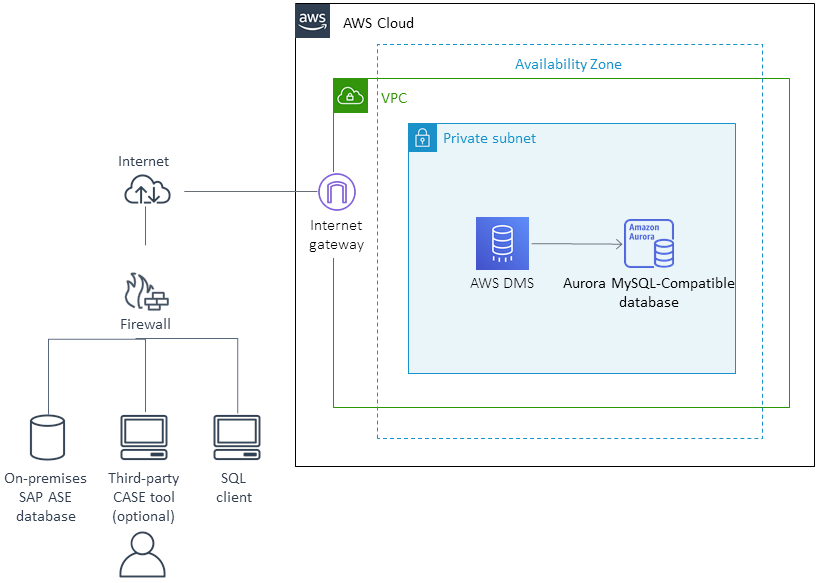

# Migrating from SAP ASE to Amazon Aurora MySQL

Following, you can find a high-level outline and a step-by-step walkthrough that show the migration process of an on-premises SAP ASE database to Amazon Aurora MySQL-Compatible Edition using AWS Database Migration Service (AWS DMS). Amazon Aurora is a highly available and managed relational database service with automatic scaling and high-performance features. The combination of MySQL compatibility with Aurora enterprise database capabilities provides an ideal target for commercial database migrations.

This walkthrough covers all steps in the migration from initial analysis of the source database to final cutover of applications to the target database.

The following diagram shows the basic architecture for the migration.

We use the **pubs2** database for SAP ASE as the example database in the rest of this document.

###### Topics

- [Prerequisties for migrating from SAP AWS to Amazon Aurora MySQL](chap-sap-ase-aurora-mysql.md "chap-sap-ase-aurora-mysql.md")
- [Preparation and assessment for migrating from SAP ASE to Amazon Aurora MySQL](chap-sap-ase-aurora-mysql.md "chap-sap-ase-aurora-mysql.md")
- [SAP ASE to Amazon Aurora MySQL database code conversion and data loading](chap-sap-ase-aurora-mysql.md "chap-sap-ase-aurora-mysql.md")
- [Best practices for migrating from SAP ASE to Amazon Aurora MySQL](chap-sap-ase-aurora-mysql.md "chap-sap-ase-aurora-mysql.md")
