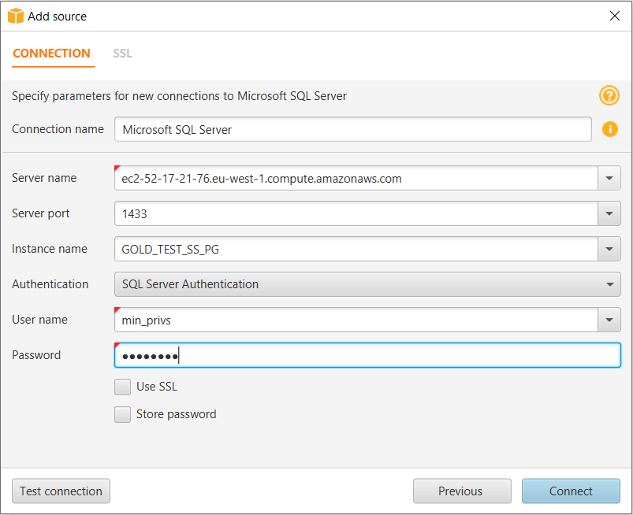
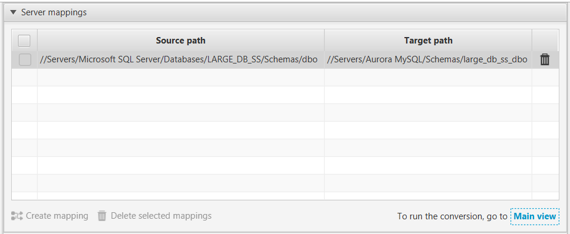

# Step 4: Use AWS SCT to Convert the SQL Server Schema to Aurora MySQL

Before you migrate data to Amazon Aurora MySQL, convert the Microsoft SQL Server schema to an Aurora MySQL schema using the AWS Schema Conversion Tool (AWS SCT). [This video covers all the steps of this process](https://youtu.be/1mwrggZe5UM "https://youtu.be/1mwrggZe5UM").

To convert a SQL Server schema to an Aurora MySQL schema, do the following:

1. Launch AWS SCT. In AWS SCT, choose **File**, then choose **New Project**. Create a new project named `AWS Schema Conversion Tool SQL Server to Aurora MySQL`, specify the **Location** of the project folder, and then choose **OK**.
2. Choose **Add source** to add a source Microsoft SQL Server database to your project, then choose **Microsoft SQL Server**, and choose **Next**.
3. Enter the following information, and then choose **Test connection**.

| Parameter           | Description                                                                             |
| ------------------- | --------------------------------------------------------------------------------------- |
| **Connection name** | Enter `Microsoft SQL Server`. AWS SCT displays this name in the tree in the left panel. |
| **Server name**     | Enter the server name.                                                                  |
| **Server port**     | Enter the SQL Server port number. The default is `1433`.                                |
| **Instance name**   | Enter the SQL Server database instance name.                                            |
| **User name**       | Enter the SQL Server admin user name.                                                   |
| **Password**        | Enter the password for the admin user.                                                  |

 4. Choose **OK** to close the alert box. Then choose **Connect** to close the dialog box and connect to the Microsoft SQL Server database instance. AWS SCT displays the structure of the Microsoft SQL Server database instance in the left panel. 5. Choose **Add target** to add a target Amazon Aurora MySQL database to your project, then choose **Amazon Aurora (MySQL compatible)**, and choose **Next**. 6. Enter the following information and then choose **Test Connection**.

| Parameter           | Description                                                                      |
| ------------------- | -------------------------------------------------------------------------------- |
| **Connection name** | Enter `Aurora MySQL`. AWS SCT displays this name in the tree in the right panel. |
| **Server name**     | Enter the server name.                                                           |
| **Server port**     | Enter the SQL Server port number. The default is `3306`.                         |
| **User name**       | Enter the Aurora MySQL admin user name.                                          |
| **Password**        | Enter the password for the admin user.                                           |

7. Choose **OK** to close the alert box. Then choose **Connect** to close the dialog box and connect to the Aurora MySQL database instance.
8. In the tree in the left panel, select the schema to migrate. In the tree in the right panel, select your target Aurora MySQL database. Choose **Create mapping**.
9. Choose **Main view**. In the tree in the left panel, right-click the HR schema and choose **Create report**.

 10. Open the context (right-click) menu for the schema to migrate, and then choose **Convert schema**. 11. Choose **Yes** for the confirmation message. AWS SCT analyzes the schema, creates a database migration assessment report, and converts your schema to the target database format. 12. Choose **Assessment Report View** from the menu to check the database migration assessment report. The report breaks down by each object type and by how much manual change is needed to convert it successfully.

Generally, packages, procedures, and functions are more likely to have some issues to resolve because they contain the most custom Transact-SQL code. AWS SCT also provides hints about how to fix these objects. 13. Choose the **Action Items** tab.

The **Action Items** tab shows each issue for each object that requires attention.

For each conversion issue, you can complete one of the following actions:

    * Modify the objects on the source SQL Server database so that AWS SCT can convert the objects to the target Aurora MySQL database.

    	1. Modify the objects on the source SQL Server database.
    	2. Repeat the previous steps to convert the schema and check the assessment report.
    	3. If necessary, repeat this process until there are no conversion issues.
    	4. Choose **Main View** from the menu. Open the context (right-click) menu for the target Aurora MySQL schema, and choose **Apply to database** to apply the schema changes to the Aurora MySQL database, and confirm that you want to apply the schema changes.
    * Instead of modifying the source schema, modify scripts that AWS SCT generates before applying the scripts on the target Aurora MySQL database.

    	1. Choose **Main View** from the menu. Open the context (right-click) menu for the target Aurora MySQL schema name, and choose **Save as SQL**. Next, choose a name and destination for the script.
    	2. In the script, modify the objects to correct conversion issues.

    	You can also exclude foreign key constraints, triggers, and secondary indexes from the script because they can cause problems during the migration. After the migration is complete, you can create these objects on the Aurora MySQL database.
    	3. Run the script on the target Aurora MySQL database.

For more information, see [Converting Database Schema to Amazon RDS](../../../SchemaConversionTool/latest/userguide/CHAP_Converting.md "../../../SchemaConversionTool/latest/userguide/CHAP_Converting.md"). 14. (Optional) Use AWS SCT to create migration rules.

    1. Choose **Mapping view** and then choose **New migration rule**.
    2. Create additional migration transformation rules that are required based on the action items.
    3. Save the migration rules.
    4. Choose **Export script for DMS** to export a JSON format of all the transformations that the AWS DMS task will use. Choose **Save**.
