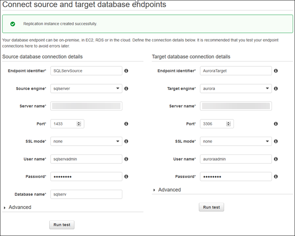

# Step 6: Create AWS DMS Source and Target Endpoints

While your replication instance is being created, you can specify the source and target database endpoints using the [AWS Management Console](https://console.aws.amazon.com/ "https://console.aws.amazon.com/"). However, you can test connectivity only after the replication instance has been created, because the replication instance is used in the connection.

1. In the AWS DMS console, specify your connection information for the source SQL Server database and the target Aurora MySQL database. The following table describes the source settings.

| Parameter               | Description                                                                        |
| ----------------------- | ---------------------------------------------------------------------------------- |
| **Endpoint Identifier** | Enter a name, such as `SQLServerSource`.                                           |
| **Source Engine**       | Choose **sqlserver**.                                                              |
| **Server name**         | Provide the SQL Server DB instance server name.                                    |
| **Port**                | Enter the port number of the database. The default for SQL Server is `1433`.       |
| **SSL mode**            | Choose an SSL mode if you want to enable encryption for your connection’s traffic. |
| **User name**           | Enter the name of the user you want to use to connect to the source database.      |
| **Password**            | Provide the password for the user.                                                 |
| **Database name**       | Provide the SQL Server database name.                                              |

The following table describes the advanced source settings.

| Parameter                       | Description                                                                                                                                                                                                                                                                                                                                                                                                                                                                                                                                                                                                                                                                                                                                                                                                                                                                                                                                                                                                                                                                                             |
| ------------------------------- | ------------------------------------------------------------------------------------------------------------------------------------------------------------------------------------------------------------------------------------------------------------------------------------------------------------------------------------------------------------------------------------------------------------------------------------------------------------------------------------------------------------------------------------------------------------------------------------------------------------------------------------------------------------------------------------------------------------------------------------------------------------------------------------------------------------------------------------------------------------------------------------------------------------------------------------------------------------------------------------------------------------------------------------------------------------------------------------------------------- |
| **Extra connection attributes** | Extra parameters that you can set in an endpoint to add functionality or change the behavior of AWS DMS. A few of the most relevant attributes are listed here. Use a semicolon (;) to separate multiple entries.<br>• `safeguardpolicy` - Changes the behavior of SQL Server by opening transactions to prevent the transaction log from being truncated while AWS DMS is reading the log. Valid values are `EXCLUSIVE_AUTOMATIC_TRUNCATION` or `RELY_ON_SQL_SERVER_REPLICATION_AGENT` (default).<br>• `useBCPFullLoad` - Directs AWS DMS to use BCP (bulk copy) for data loading. Valid values are `Y` or `N`. When the target table contains an identity column that does not exist in the source table, you must disable the use of BCP for loading the table by setting the parameter to `N`.<br>• `BCPPacketSize` - If BCP is enabled for data loads, then enter the maximum packet size used by BCP. Valid values are `1` – `100000` (default `16384`).<br>• `controlTablesFileGroup` - Specifies the file group to use for the control tables that the AWS DMS process creates in the database. |
| **KMS key**                     | Enter the KMS key if you choose to encrypt your replication instance’s storage.                                                                                                                                                                                                                                                                                                                                                                                                                                                                                                                                                                                                                                                                                                                                                                                                                                                                                                                                                                                                                         |

The following table describes the target settings.

| Parameter               | Description                                                                        |
| ----------------------- | ---------------------------------------------------------------------------------- |
| **Endpoint Identifier** | Enter a name, such as `Auroratarget`.                                              |
| **Target Engine**       | Choose **aurora**.                                                                 |
| **Server name**         | Provide the Aurora MySQL DB server name for the primary instance.                  |
| **Port**                | Enter the port number of the database. The default for Aurora MySQL is `3306`.     |
| **SSL mode**            | Choose **None**.                                                                   |
| **User name**           | Enter the name of the user that you want to use to connect to the target database. |
| **Password**            | Provide the password for the user.                                                 |

The following table describes the advanced target settings.

| Parameter                       | Description                                                                                                                                                                                                                                                                                                                                                                                                                                                                                                                                                                                                                                                                                                                     |
| ------------------------------- | ------------------------------------------------------------------------------------------------------------------------------------------------------------------------------------------------------------------------------------------------------------------------------------------------------------------------------------------------------------------------------------------------------------------------------------------------------------------------------------------------------------------------------------------------------------------------------------------------------------------------------------------------------------------------------------------------------------------------------- |
| **Extra connection attributes** | Extra parameters that you can set in an endpoint to add functionality or change the behavior of AWS DMS. A few of the most relevant attributes are listed here. Use a semicolon to separate multiple entries.<br>• `targetDbType` - By default, AWS DMS creates a different database for each schema that is being migrated. If you want to combine several schemas into a single database, set this option to `targetDbType=SPECIFIC_DATABASE`.<br>• `initstmt` - Use this option to invoke the MySQL `initstmt` connection parameter and accept anything MySQL `initstmt` accepts. For an Aurora MySQL target, it’s often useful to disable foreign key checks by setting this option to `initstmt=SET FOREIGN_KEY_CHECKS=0`. |
| **KMS key**                     | Enter the KMS key if you choose to encrypt your replication instance’s storage.                                                                                                                                                                                                                                                                                                                                                                                                                                                                                                                                                                                                                                                 |

The following is an example of the completed page.



For information about extra connection attributes, see [Using Extra Connection Attributes](../userguide/CHAP_Introduction.ConnectionAttributes.md "../userguide/CHAP_Introduction.ConnectionAttributes.md"). 2. After the endpoints and replication instance are created, test the endpoint connections by choosing **Run test** for the source and target endpoints. 3. Drop foreign key constraints and triggers on the target database.

During the full load process, AWS DMS does not load tables in any particular order, so it might load the child table data before parent table data. As a result, foreign key constraints might be violated if they are enabled. Also, if triggers are present on the target database, they might change data loaded by AWS DMS in unexpected ways.

```
ALTER TABLE 'table_name' DROP FOREIGN KEY 'fk_name';

DROP TRIGGER 'trigger_name';
```

4. If you dropped foreign key constraints and triggers on the target database, generate a script that enables the foreign key constraints and triggers.

Later, when you want to add them to your migrated database, you can just run this script. 5. (Optional) Drop secondary indexes on the target database.

Secondary indexes (as with all indexes) can slow down the full load of data into tables because they must be maintained and updated during the loading process. Dropping them can improve the performance of your full load process. If you drop the indexes, you must to add them back later, after the full load is complete.

```
ALTER TABLE 'table_name' DROP INDEX  'index_name';
```

6. Choose **Next**.
