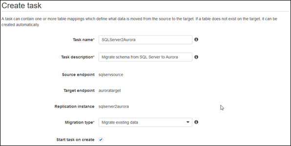
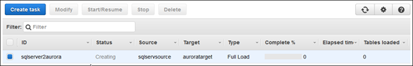

# Step 7: Create and Run Your AWS DMS Migration Task

Using an AWS DMS task, you can specify what schema to migrate and the type of migration. You can migrate existing data, migrate existing data and replicate ongoing changes, or replicate data changes only.

1. In the AWS DMS console, on the **Create task** page, specify the task options. The following table describes the settings.

| Parameter                | Description                                                                                                                                                                                                                                                                                                                                                                                                                                                                                                                                                                                                                                                                                                                                                                                                                                                                                                |
| ------------------------ | ---------------------------------------------------------------------------------------------------------------------------------------------------------------------------------------------------------------------------------------------------------------------------------------------------------------------------------------------------------------------------------------------------------------------------------------------------------------------------------------------------------------------------------------------------------------------------------------------------------------------------------------------------------------------------------------------------------------------------------------------------------------------------------------------------------------------------------------------------------------------------------------------------------- |
| **Task name**            | Enter a name for the migration task.                                                                                                                                                                                                                                                                                                                                                                                                                                                                                                                                                                                                                                                                                                                                                                                                                                                                       |
| **Task description**     | Enter a description for the task.                                                                                                                                                                                                                                                                                                                                                                                                                                                                                                                                                                                                                                                                                                                                                                                                                                                                          |
| **Source endpoint**      | Shows the SQL Server source endpoint. If you have more than one endpoint for the user, choose the correct endpoint from the list.                                                                                                                                                                                                                                                                                                                                                                                                                                                                                                                                                                                                                                                                                                                                                                       |
| **Target endpoint**      | Shows the Aurora MySQL target endpoint.                                                                                                                                                                                                                                                                                                                                                                                                                                                                                                                                                                                                                                                                                                                                                                                                                                                                    |
| **Replication instance** | Shows the AWS DMS replication instance.                                                                                                                                                                                                                                                                                                                                                                                                                                                                                                                                                                                                                                                                                                                                                                                                                                                                    |
| **Migration type**       | Choose an option. • **Migrate existing data** - AWS DMS migrates only your existing data. Changes to your source data aren’t captured and applied to your target. If you can afford to take an outage for the duration of the full load, then this is the simplest option. You can also use this option to create test copies of your database. If the source SQL Server database is an Amazon RDS database, you must choose this option. • **Migrate existing data and replicate ongoing changes** - AWS DMS captures changes while migrating your existing data. AWS DMS continues to capture and apply changes even after the bulk data has been loaded. Eventually the source and target databases are in sync, allowing for a minimal downtime. • **Replicate data changes only** - Bulk load data using a different method. This approach generally applies only to homogeneous migrations. |
| **Start task on create** | In most situations, you should choose this option. Sometimes, you might want to delay the start of a task, for example, if you want to change logging levels.                                                                                                                                                                                                                                                                                                                                                                                                                                                                                                                                                                                                                                                                                                                                              |

The page should look similar to the following:

 2. Under **Task settings**, specify the settings. The following table describes the settings.

| Parameter                              | Description                                                                                                                                                                                                                                                                                                                                                                                                                                                                                                                                                                                                                                                                                                                                                                                             |
| -------------------------------------- | ------------------------------------------------------------------------------------------------------------------------------------------------------------------------------------------------------------------------------------------------------------------------------------------------------------------------------------------------------------------------------------------------------------------------------------------------------------------------------------------------------------------------------------------------------------------------------------------------------------------------------------------------------------------------------------------------------------------------------------------------------------------------------------------------------- |
| **Target table preparation mode**      | Choose an option. • **Do nothing** - AWS DMS does nothing to prepare your tables. Your table structure remains the same, and any existing data remains in the table. You can use this method to consolidate data from multiple systems. • **Drop tables on target** - AWS DMS creates your target tables for you. AWS DMS drops and re-creates the tables to migrate before migration. AWS DMS creates the table and a primary key only for heterogeneous migrations. • **Truncate** - AWS DMS truncates a target table before loading it. If the target table doesn’t exist, then AWS DMS creates it. ImportantIf the AWS Schema Conversion Tool already created the tables on the target, choose **Do nothing\* • or **Truncate\*\*.                                                   |
| **Include LOB columns in replication** | Choose an option. • **Don’t include LOB columns** - Do not migrate LOB data. • **Full LOB mode** - AWS DMS migrates all LOBs (large objects) from the source to the target regardless of size. In this configuration, AWS DMS has no information about the maximum size of LOBs to expect. Thus, LOBs are migrated one at a time, piece by piece. Full LOB mode can be relatively slow. • **Limited LOB mode** - You set a maximum size LOB that AWS DMS accepts. This option enables AWS DMS to pre-allocate memory and load the LOB data in bulk. LOBs that exceed the maximum LOB size are truncated, and a warning is issued to the log file. In limited LOB mode, you get significant performance gains over full LOB mode. We recommend that you use limited LOB mode whenever possible. |
| **Max LOB size (kb)**                  | When \*_Limited LOB mode_ • is selected, this option determines the maximum LOB size that AWS DMS accepts. Any LOBs that are larger than this value are truncated to this value.                                                                                                                                                                                                                                                                                                                                                                                                                                                                                                                                                                                                                     |
| **Enable logging**                     | It’s best to select **Enable logging**. If you enable logging, you can see any errors or warnings that the task encounters, and you can troubleshoot those issues.                                                                                                                                                                                                                                                                                                                                                                                                                                                                                                                                                                                                                                      |

3. Leave the Advanced settings at their default values.
4. If you created and exported mapping rules with AWS SCT in the last step in [Step 4: Convert the SQL Server Schema to Aurora MySQL](chap-sqlserver2aurora.steps.md "chap-sqlserver2aurora.steps.md"), choose **Table mappings**, and select the **JSON** tab. Then select **Enable JSON editing**, and enter the table mappings you saved.

If you did not create mapping rules, then proceed to the next step. 5. Choose **Create task**. The task starts immediately.
The **Tasks** section shows you the status of the migration task.

If you chose **Enable logging** during setup, you can monitor your task. You can then view the Amazon CloudWatch metrics.

1. On the navigation pane, choose **Tasks**.
2. Choose your migration task.
3. Choose the **Task monitoring** tab, and monitor the task in progress on that tab.

When the full load is complete and cached changes are applied, the task stops on its own. 4. On the target Aurora MySQL database, if you disabled foreign key constraints and triggers, enable them using the script that you saved previously. 5. On the target Aurora MySQL database, re-create the secondary indexes if you removed them previously. 6. If you chose to use AWS DMS to replicate changes, in the AWS DMS console, start the AWS DMS task by choosing **Start/Resume** for the task.

Important replication instance metrics to monitor include the following:

    * CPU
    * FreeableMemory
    * DiskQueueDepth
    * CDCLatencySource
    * CDCLatencyTarget

The AWS DMS task keeps the target Aurora MySQL database up to date with source database changes. AWS DMS keeps all the tables in the task up to date until it’s time to implement the application migration. The latency is zero, or close to zero, when the target has caught up to the source.
For more information, see [Monitoring DMS tasks](../userguide/CHAP_Monitoring.md "../userguide/CHAP_Monitoring.md").
