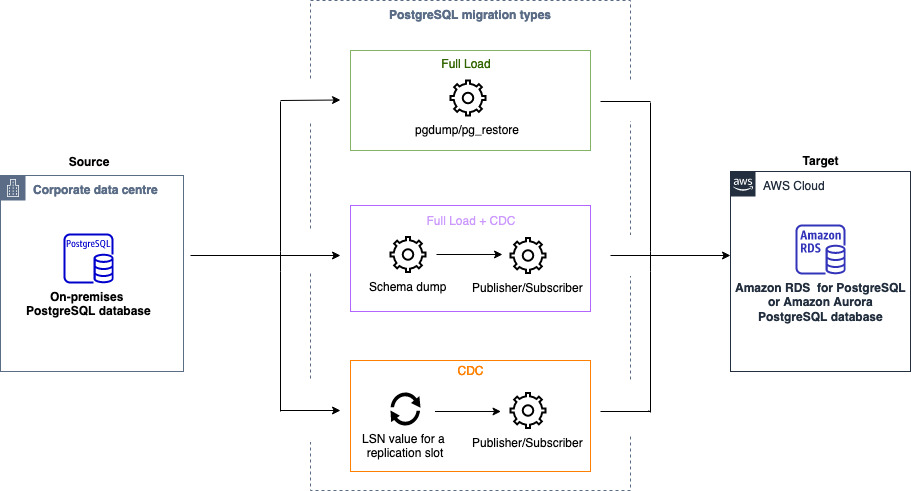

# PostgreSQL to Amazon RDS migration overview

This section provides high-level guidance for customers looking to migrate their PostgreSQL database to Amazon RDS for PostgreSQL using homogeneous data migrations in AWS DMS.

AWS DMS creates a serverless environment for your data migration. Depending on the type of your data migration, AWS DMS automatically chooses an appropriate native PostgreSQL database tool.

For full load migrations, AWS DMS uses pg_dump and pg_restore.

For full load and change data capture (CDC) migrations, AWS DMS uses pg_dump, pg_restore, and a publisher and subscriber model for logical replication.

For homogeneous data migrations of the change data capture type, AWS DMS configures the data replication from the start point that you provide in settings.

The following diagram illustrates how AWS DMS migrates data from PostgreSQL databases with homogeneous data migrations.

Start the walkthrough by [creating the required resources](dm-postgresql-step-1.md "dm-postgresql-step-1.md").
