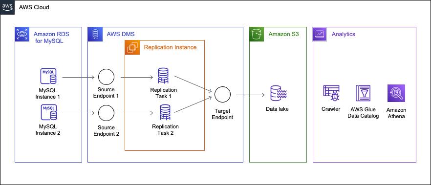
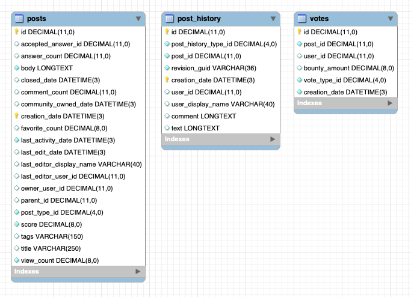

# Migrating an RDS for MySQL database to an S3 data lake

A data lake is a system architecture that enables you to store data in a centralized repository, allowing for categorization, catalogging security, and analysis by a diverse range of users and tools. In a data lake, you can analyze structured, semi-structured, and unstructured data, as well as transform these raw data assets as necessary.

Thousands of customers are building data lakes in AWS, using the cloud-scale storage provided by Amazon S3. The transformation capabilities of services such as AWS Glue, Amazon EMR, and the analytic capabilities of services such as Amazon Athena, Amazon Redshift, and Amazon SageMaker enable you to utilize data lakes easily and cost efficiently.

When building a data lake, a common concern is how to hydrate your data lake: populating data from upstream systems, and keeping the lake up-to-date as the source data grows and changes. Traditionally, customers have relied on SQL-level solutions to extract changed records from source systems, e.g., filtering on “last updated” timestamps, or performing full-refreshes on a periodic basis. Both solutions have drawbacks: last updated filters rely on the timestamps being accurately populated, and full refresh has performance and timeliness considerations.

A different approach is to use a database replication service like [AWS Database Migration Service (AWS DMS)](../userguide/CHAP_GettingStarted.md "../userguide/CHAP_GettingStarted.md"). AWS DMS captures source data changes from the database transaction logs and logically replicates them on the target (Change Data Capture, CDC). It can also perform a "full-load" to populate the data lake with an initial snapshot of your source data. Then, as changes occur on the source, AWS DMS finds and applies those changes to your data lake, ensuring your data is consistent.

In this document, we will describe the process of setting up an AWS data lake using source data from an Amazon RDS for MySQL database. We will host the lake on Amazon S3, and use AWS DMS to hydrate the data. After describing some prerequisites, we will walk through the steps to setup AWS DMS, connect to the source database, and discuss considerations you should know about when using AWS DMS.

###### Topics

- [Solution overview](#mysql-s3datalake.solutionoverview "#mysql-s3datalake.solutionoverview")
- [Use case](#mysql-s3datalake.usecase "#mysql-s3datalake.usecase")
- [Limitations](#mysql-s3datalake.limitations "#mysql-s3datalake.limitations")
- [Choosing an instance class and storage size](mysql-s3datalake.md "mysql-s3datalake.md")
- [Step-By-Step Migration](mysql-s3datalake.md "mysql-s3datalake.md")

## Solution overview

The following diagram displays a high-level architecture of the solution, where we use AWS DMS to move data from two MySQL databases hosted on Amazon RDS to Amazon S3.



This walkthrough assumes that the source data is sharded over two MySQL instances with identical schemas. Note that the only difference from having a single source instance is that you will create an additional endpoint and task. Therefore, this walkthrough can be applied even if the source is single instance. The schema and table structures used in this walkthrough will be explained in further detail later in the use case section.

In this walkthrough, you will set up the following resources in AWS DMS:

- **Replication Instance** — An AWS managed instance that hosts the AWS DMS engine. You control the type and size of the instance based on your workload.
- **Source Endpoint** — A resource that provides connection details, data store type, and credentials to connect to a source database. For this use case, we will configure the source endpoint to point to the Amazon RDS for MySQL database.
- **Target Endpoint** — AWS DMS supports several target systems including Amazon RDS, Amazon Aurora, Amazon Redshift, Amazon Kinesis Data Streams, Amazon S3, and more. For this use case, we will configure Amazon S3 as the target endpoint.
- **Replication Task** — A resource that runs on the replication instance and connects to endpoints to replicate data from the source to the target.

## Use case

The source MySQL engine version that we will use in this walkthrough is 8.0.31. AWS DMS supports Amazon RDS for MySQL 5.6 or higher as a source. There are three tables under the `dms_sample` schema in the two MySQL databases. The total size is about **220 GiB**. We assume a data change amount of about tens of GiB per day. A similar size of data exists in both instances. The primary keys of the `posts` and `post_history` tables are `id` and `creation_date`, and the tables are partitioned with 180 partitions on the `creation_date` column. The `votes` table is not partitioned and the `id` column is the primary key.



## Limitations

As a managed service, AWS DMS allows users to start migration in a few steps. However there are some limitations/restrictions
depending on the type of source and target endpoints.

There are some data types
that are not supported as MySQL source. Before you start your migration, it’s a good idea to find out if there are any unsupported
data types. Premigration assessments can help you find unsupported data in your source database. For information about datatypes supported in MySQL, see [Data types](../userguide/CHAP_Source.md#CHAP_Source.MySQL.DataTypes "../userguide/CHAP_Source.md#CHAP_Source.MySQL.DataTypes").

```
For other MySQL source or S3 target endpoint limitations, see the following documents:
* https://docs.aws.amazon.com/dms/latest/userguide/CHAP_Source.MySQL.html#CHAP_Source.MySQL.Limitations[Limitations on using a MySQL database as a source for [.shared]`DMS`]
* https://docs.aws.amazon.com/dms/latest/userguide/CHAP_Target.S3.html#CHAP_Target.S3.Limitations[Limitations to using Amazon S3 as a target]
```
