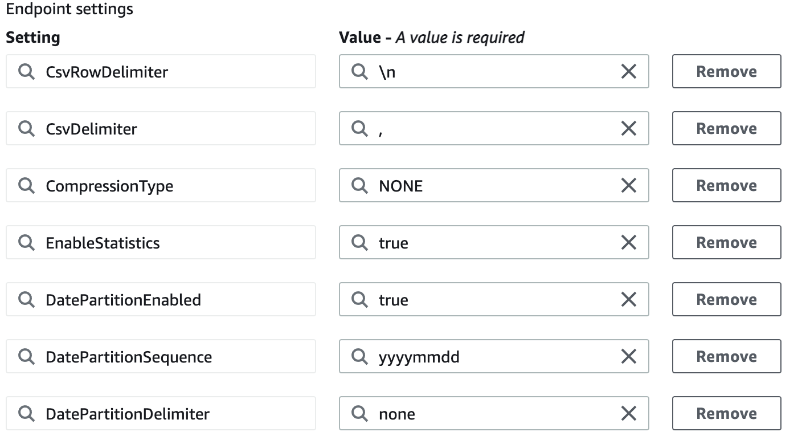
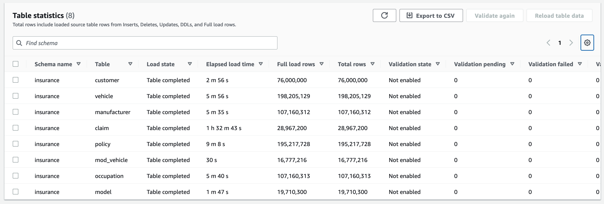

# Step-by-step an Amazon RDS PostgreSQL database to an Amazon S3 data lake migration walkthrough

###### Topics

- [Step 1: Create an AWS DMS replication instance](#postgresql-s3datalake.stepbystep.step1 "#postgresql-s3datalake.stepbystep.step1")
- [Step 2: Configure a source Amazon RDS for PostgreSQL database](#postgresql-s3datalake.stepbystep.step2 "#postgresql-s3datalake.stepbystep.step2")
- [Step 3: Create an AWS DMS source endpoint](#postgresql-s3datalake.stepbystep.step3 "#postgresql-s3datalake.stepbystep.step3")
- [Step 4: Configure a target Amazon S3 bucket](#postgresql-s3datalake.stepbystep.step4 "#postgresql-s3datalake.stepbystep.step4")
- [Step 5: Configure an AWS DMS target endpoint](#postgresql-s3datalake.stepbystep.step5 "#postgresql-s3datalake.stepbystep.step5")
- [Step 6: Create an AWS DMS task](#postgresql-s3datalake.stepbystep.step6 "#postgresql-s3datalake.stepbystep.step6")
- [Step 7: Run the AWS DMS tasks](#postgresql-s3datalake.stepbystep.step7 "#postgresql-s3datalake.stepbystep.step7")
- [Conclusion](#postgresql-s3datalake.conclusion "#postgresql-s3datalake.conclusion")

## Step 1: Create an AWS DMS replication instance

To create an AWS Database Migration Service (AWS DMS) replication instance, see [Creating a replication instance](../userguide/CHAP_ReplicationInstance.md "../userguide/CHAP_ReplicationInstance.md"). Usually, the full load phase is multi-threaded (depending on task configurations) and has a greater resource footprint than ongoing replication. Consequently, it’s advisable to start with a larger instance class and then scale down once the tasks are in the ongoing replication phase. Moreover, if you intend to migrate your workload using multiple tasks, monitor your replication instance metrics and resize your instance accordingly.

For this use case, we will migrate a data set of the Insurance database, which is about 100 GB in size. Because we’re performing a heterogeneous migration, we can start with a compute-optimized instance like c5.xlarge running the latest AWS DMS engine version. We can later scale up or down based on resource utilization during task execution.

To create an AWS DMS replication instance, do the following:

1. Sign in to the AWS Management Console, and open the [AWS DMS console](https://console.aws.amazon.com/dms/v2 "https://console.aws.amazon.com/dms/v2").
2. If you are signed in as an AWS Identity and Access Management (IAM) user, you must have the appropriate permissions to access AWS DMS. For more information about the permissions required, see [IAM permissions](../userguide/CHAP_Security.md#CHAP_Security.IAMPermissions "../userguide/CHAP_Security.md#CHAP_Security.IAMPermissions").
3. On the Welcome page, choose **Create replication instance** to start a database migration.
4. On the **Create replication instance** page, specify your replication instance information.

|                                                                                                       |                                                                                                                                                                                           |
| ----------------------------------------------------------------------------------------------------- | ----------------------------------------------------------------------------------------------------------------------------------------------------------------------------------------- | --------------------------------------------------------------------------------------------------------------------------------------------------------------------------------------------------------------------------------------------------------------------------------------------------------------------------------------------------------------------------------------------------------------------------------------------------------------------------------------------------------------------------------------------------------------------------------------------------------------------------------------------------------------------------------------------------------------------------------------------------------------------------------------------------------------------------------------------------------------------------------------------------------------------------------------------------------------------------------------------------------------------------------------------------------------------------------------------------------------------------------------------------------------------------------------------------------------------------------------------------------------------------------------------------------------------------------------------------------------------------------------------------------------------------------------------------------------------------------------------------------------------------------------------------------------------------------------------------------------------------------------------------------------------------------------------------------------------------------------------------------------------------------------------------------------------------------------------------------------------------------------------------------------------------------------------------------------------------------------------------------------------------------------------------------------------------------------------------------------------------------------------------------------------------------------------------------------------------------------------------------------------------------------------------------------------------------------------------------------------------------------------------------------------------------------------------------------------------------------------------------------------------------------------------------------------------------------------------------------------------------------------------------------------------------------------------------------------------------------------------------------------------------------------------------------------------------------------------------------------------------------------------------------------------------------------------------------------------------------------------------------------------------------------------------------------------------------------------------------------------------------------------------------------------------------------------------------------------------------------------------------------------------------------------------------------------------------------------------------------------------------------------------------------------------------------------------------------------------------------------------------------------------------------------------------------------------------------------------------------------------------------------------------------------------------------------------------------------------------------------------------------------------------------------------------------------------------------------------------------------------------------------------------------------------------------------------------------------------------------------------------------------------------------------------------------------------------------------------------------------------------------------------------------------------------------------------------------------------------------------------------------------------------------------------------------------------------------------------------------------------------------------------------------------------------------------------------------------------------------------------------------------------------------------------------------------------------------------------------------------------------------------------------------------------------------------------------------------------------------------------------------------------------------------------------------------------------------------------------------------------------------------------------------------------------------------------------------------------------------------------------------------------------------------------------------------------------------------------------------------------------------------------------------------------------------------------------------------------------------------------------------------------------------------------------------------------------------------------------------------------------------------------------------------------------------------------------------------------------------------------------------------------------------------------------------------------------------------------------------------------------------------------------------------------------------------------------------------------------------------------------------------------------------------------------------------------------------------------------------------------------------------------------------------------------------------------------------------------------------------------------------------------------------------------------------------------------------------------------------------------------------------------------------------------------------------------------------------------------------------------------------------------------------------------------------------------------------------------------------------------------------------------------------------------------------------------------------------------------------------------------------------------------------------------------------------------------------------------------------------------------------------------------------------------------------------------------------------------------------------------------------------------------------------------------------------------------------------------------------------------------------------------------------------------------------------------------------------------------------------------------------------------------------------------------------------------------------------------------------------------------------------------------------------------------------------------------------------------------------------------------------------------------------------------------------------------------------------------------------------------------------------------------------------------------------------------------------------------------------------------------------------------------------------------------------------------------------------------------------------------------------------------------------------------------------------------------------------------------------------------------------------------------------------------------------------------------------------------------------------------------------------------------------------------------------------------------------------------------------------------------------------------------------------------------------------------------------------------------------------------------------------------------------------------------------------------------------------------------------------------------------------------------------------------------------------------------------------------------------------------------------------------------------------------------------------------------------------------------------------------------------------------------------------------------------------------------------------------------------------------------------------------------------------------------------------------------------------------------------------------------------------------------------------------------------------------------------------------------------------------------------------------------------------------------------------------------------------------------------------------------------------------------------------------------------------------------------------------------------------------------------------------------------------------------------------------------------------------------------------------------------------------------------------------------------------------------------------------------------------------------------------------------------------------------------------------------------------------------------------------------------------------------------------------------------------------------------------------------------------------------------------------------------------------------------------------------------------------------------------------------------------------------------------------------------------------------------------------------------------------------------------------------------------------------------------------------------------------------------------------------------------------------------------------------------------------------------------------------------------------------------------------------------------------------------------------------------------------------------------------------------------------------------------------------------------------------------------------------------------------------------------------------------------------------------------------------------------------------------------------------------------------------------------------------------------------------------------------------------------------------------------------------------------------------------------------------------------------------------------------------------------------------------------------------------------------------------------------------------------------------------------------------------------------------------------------------------------------------------------------------------------------------------------------------------------------------------------------------------------------------------------------------------------------------------------------------------------------------------------------------------------------------------------------------------------------------------------------------------------------------------------------------------------------------------------------------------------------------------------------------------------------------------------------------------------------------------------------------------------------------------------------------------------------------------------------------------------------------------------------------------------------------------------------------------------------------------------------------------------------------------------------------------------------------------------------------------------------------------------------------------------------------------------------------------------------------------------------------------------------------------------------------------------------------------------------------------------------------------------------------------------------------------------------------------------------------------------------------------------------------------------------------------------------------------------------------------------------------------------------------------------------------------------------------------------------------------------------------------------------------------------------------------------------------------------------------------------------------------------------------------------------------------------------------------------------------------------------------------------------------------------------------------------------------------------------------------------------------------------------------------------------------------------------------------------------------------------------------------------------------------------------------------------------------------------------------------------------------------------------------------------------------------------------------------------------------------------------------------------------------------------------------------------------------------------------------------------------------------------------------------------------------------------------------------------------------------------------------------------------------------------------------------------------------------------------------------------------------------------------------------------------------------------------------------------------------------------------------------------------------------------------------------------------------------------------------------------------------------------------------------------------------------------------------------------------------------------------------------------------------------------------------------------------------------------------------------------------------------------------------------------------------------------------------------------------------------------------------------------------------------------------------------------------------------------------------------------------------------------------------------------------------------------------------------------------------------------------------------------------------------------------------------------------------------------------------------------------------------------------------------------------------------------------------------------------------------------------------------------------------------------------------------------------------------------------------------------------------------------------------------------------------------------------------------------------------------------------------------------------------------------------------------------------------------------------------------------------------------------------------------------------------------------------------------------------------------------------------------------------------------------------------------------------------------------------------------------------------------------------------------------------------------------------------------------------------------------------------------------------------------------------------------------------------------------------------------------------------------------------------------------------------------------------------------------------------------------------------------------------------------------------------------------------------------------------------------------------------------------------------------------------------------------------------------------------------------------------------------------------------------------------------------------------------------------------------------------------------------------------------------------------------------------------------------------------------------------------------------------------------------------------------------------------------------------------------------------------------------------------------------------------------------------------------------------------------------------------------------------------------------------------------------------------------------------------------------------------------------------------------------------------------------------------------------------------------------------------------------------------------------------------------------------------------------------------------------------------------------------------------------------------------------------------------------------------------------------------------------------------------------------------------------------------------------------------------------------------------------------------------------------------------------------------------------------------------------------------------------------------------------------------------------------------------------------------------------------------------------------------------------------------------------------------------------------------------------------------------- |
| For this parameter                                                                                    | Do the following                                                                                                                                                                          |
| **Name**                                                                                              | Enter `datalake-migration-ri`. If you are using multiple replication servers or sharing an account, choose a name that helps you quickly differentiate between the different servers.     |
| **Description**                                                                                       | Enter `Migrate PostgreSQL to S3 data lake`.                                                                                                                                               |
| **Instance class**                                                                                    | Choose `dms.c5.xlarge`. Each size and type of instance class has increasing CPU, memory, and I/O capacity.                                                                                |
| **Engine version**                                                                                    | Leave the default value chosen, which is the latest stable version of the AWS DMS replication engine.                                                                                     |
| **Allocated storage (GiB)**                                                                           | Choose `50`.                                                                                                                                                                              |
| **VPC**                                                                                               | Choose the virtual private cloud (VPC) in which your replication instance will launch. If possible, select the same VPC in which either your source or target database resides (or both). |
| **Multi AZ**                                                                                          | If you choose **Yes**, AWS DMS creates a second replication server in a different Availability Zone for failover if there is a problem with the primary replication server.               |
| **Publicly accessible**                                                                               | If either your source or target database resides outside of the VPC in which your replication server resides, you must make your replication server policy publicly accessible.           | ## Step 2: Configure a source Amazon RDS for PostgreSQL database One of the primary considerations when setting up AWS DMS replication is the load that it induces on the source database. During full load, AWS DMS tasks initiate two or three connections for each table that is configured for parallel load. Because AWS DMS settings and data volumes vary across tasks, workloads, and even across different runs of the same task, providing an estimate of resource utilization that applies for all use cases is difficult. Ongoing replication is single-threaded, and it usually consumes fewer resources than full load. Providing estimates for change data capture (CDC) resource utilization has the same challenges described above. For our source databases, we use an `m5.xlarge` Amazon RDS instance running PostgreSQL 13.4-R1. While the steps for Amazon RDS creation are out of scope for this walkthrough (for more information, see [Prerequisites](chap-rdsoracle2postgresql.md "chap-rdsoracle2postgresql.md")), make sure that your Amazon RDS instance has **Automatic Backups** turned on. If you plan to use CDC, you need to turn on logical replication to let DMS capture changes from Amazon RDS for PostgreSQL. To enable logical replication (required for performing CDC) for an Amazon RDS for PostgreSQL database: 1. Use the AWS master user account for the PostgreSQL DB instance as the user account for the PostgreSQL source endpoint. The master user account has the required roles that allow it to set up CDC. 2. If you use an account other than the master user account, make sure to create several objects from the master account for the account that you use. For more information, see Migrating an Amazon RDS for PostgreSQL database without using the master user account. 3. Set the `rds.logical_replication` parameter in your database parameter group to 1. This static parameter requires a reboot of the database instance to take effect. As part of applying this parameter, AWS DMS sets the `wal_level`, `max_wal_senders`, `max_replication_slots`, and `max_connections` parameters. These parameter changes can increase write ahead log (WAL) generation, so only set `rds.logical_replication` when you use logical replication slots. 4. The `wal_sender_timeout parameter` ends replication connections that are inactive longer than the specified number of milliseconds. The default is 60000 milliseconds (60 seconds). Setting the value to 0 (zero) disables the timeout mechanism, and is a valid setting for DMS. 5. When setting `wal_sender_timeout` to a non-zero value, DMS requires a minimum of 10000 milliseconds (10 seconds), and fails if the value is between 0 and 10000. Keep the value less than 5 minutes to avoid causing a delay during a Multi-AZ failover of a DMS replication instance. 6. Ensure the value of the `max_worker_processes` parameter in your Database Parameter Group is equal to or greater than the total combined values of `max_logical_replication_workers`, `autovacuum_max_workers`, and `max_parallel_workers`. A high number of background worker processes might impact application workloads on small instances. So, monitor performance of your database if you set `max_worker_processes` higher than the default value. ## Step 3: Create an AWS DMS source endpoint After you configure the AWS Database Migration Service (AWS DMS) replication instance and the source Amazon RDS, ensure connectivity between both the components. To ensure that the replication instance can access the server and the port for the database, make changes to the relevant security groups and network access control lists. For more information about your network configuration, see [Setting up a network for a replication instance](../userguide/CHAP_ReplicationInstance.md "../userguide/CHAP_ReplicationInstance.md"). After you completed the network configurations, you can create a source endpoint. In this case, we create a source endpoint for Amazon RDS PostgreSQL. To create a source endpoint, do the following: 1. Open the AWS DMS console at [https://console.aws.amazon.com/dms/v2/](https://console.aws.amazon.com/dms/v2/ "https://console.aws.amazon.com/dms/v2/"). 2. Choose **Endpoints**. 3. Choose **Create endpoint**. 4. On the **Create endpoint** page, enter the following information.                                                                                                                                                                                                                                                                                                                                                                                                                                                                                                                                                                                                                                                                                                                                                                                                                                                                                                                                                                                                                                                                                                                                                                                                                                                                                                                                                                                                                                                                                                                                                                                                                                                                                                                                                                                                                                                                                                                                                                                                                                                                                                                                                                                                                                                                                                                                                                                                                                                                                                                                                                                                                                                                                                                                                                                                                                                                                                                                                                                                                                                                                                                                                                                                                                                                                                                                                                                                                                                                                                                                                                                                                                                                                                                                                                                                                                                                                                                                                                                                                                                                                                                                                                                                                                                                                                                                                                                                                                                                                                                                                                                                                                                                                                                                                                                                                                                                                                                                                                                                                                                                                                                                                                                                                                                                                                                                                                                                                                                                                                                                                                                                                                                                                                                                                                                                                                                                                                                                                                                                                                                                                                                                                                                                                                                                                                                                                                                                                                                                                                                                                                                                                                                                                                                                                                                                                                                                                                                                                                                                                                                                                                                                                                                                                                                                                                                                                                                                                                                                                                                                                                                                                                                                                                                                                                                                                                                                                                                                                                                                                                                                                                                                                                                                                                                                                                                                                                                                                                                                                                                                                                                                                                                                                                                                                                                                                                                                                                                                                                                                                                                                                                                                                                                                                                                                                                                                                                                                                                                                                                                                                                                                                                                                                                                                                                                                                                                                                                                                                                                                                                                                                                                                                                                                                                                                                                                                                                                                                                                                                                                                                                                                                                                                                                                                                                                                                                                                                                                                                                                                                                                                                                                                                                                                                                                                                                                                                                                                                                                                                                                                                                                                                                                                                                                                                                                                                                                                                                                                                                                                                                                                                                                                                                                                                                                                                                                                                                                                                                                                                                                                                                                                                                                                                                                                                                                                                                                                                                                                                                                                                                                                                                                                                   |
|                                                                                                       |                                                                                                                                                                                           |
| ---                                                                                                   | ---                                                                                                                                                                                       |
| For this parameter                                                                                    | Do the following                                                                                                                                                                          |
| **Endpoint type**                                                                                     | Choose **Source endpoint**, turn on **Select Amazon RDS DB instance**, and choose `datalake-source-db-RDS instance`.                                                                      |
| **Endpoint identifier**                                                                               | Enter **pg13rds-dms-s3-source**                                                                                                                                                           |
| **Source engine**                                                                                     | Choose **PostgreSQL**                                                                                                                                                                     |
| **Access to endpoint database**                                                                       | Choose **Provide access information manually**.                                                                                                                                           |
| **Server name**                                                                                       | Enter the database server name on Amazon RDS.                                                                                                                                             |
| **Port**                                                                                              | Enter 5432.                                                                                                                                                                               |
| **Secure Socket Layer (SSL) mode**                                                                    | Choose **none**.                                                                                                                                                                          |
| **User name**                                                                                         | Enter **dms_user**.                                                                                                                                                                       |
| **Password**                                                                                          | Enter the password that you created for the `dms_user` user.                                                                                                                              | ## Step 4: Configure a target Amazon S3 bucket In this use case, we’re migrating the Insurance schema to Amazon S3. To create the Amazon S3 bucket, do the following: 1. Open the Amazon S3 console at [https://s3.console.aws.amazon.com/s3/home](https://s3.console.aws.amazon.com/s3/home "https://s3.console.aws.amazon.com/s3/home"). 2. Choose **Create bucket**. 3. For **Bucket name**, enter **pg-dms-s3-target**. 4. For **AWS Region**, choose the region that hosts your AWS DMS replication instance. 5. Leave the default values in the other fields and choose **Create bucket**. ## Step 5: Configure an AWS DMS target endpoint To use Amazon S3 as an AWS Database Migration Service (AWS DMS) target endpoint, create an IAM role with write and delete access to the S3 bucket. Then add DMS (dms.amazonaws.com) as a trusted entity in this IAM role. For more information, see [Prerequisites for using Amazon S3 as a target](../userguide/CHAP_Target.md#CHAP_Target.S3.Prerequisites "../userguide/CHAP_Target.md#CHAP_Target.S3.Prerequisites"). To create a target endpoint, do the following: 1. Open the AWS DMS console at [https://console.aws.amazon.com/dms/v2/](https://console.aws.amazon.com/dms/v2/ "https://console.aws.amazon.com/dms/v2/"). 2. Choose **Endpoints**, and then choose **Create endpoint**. 3. On the **Create endpoint page**, enter the following information.                                                                                                                                                                                                                                                                                                                                                                                                                                                                                                                                                                                                                                                                                                                                                                                                                                                                                                                                                                                                                                                                                                                                                                                                                                                                                                                                                                                                                                                                                                                                                                                                                                                                                                                                                                                                                                                                                                                                                                                                                                                                                                                                                                                                                                                                                                                                                                                                                                                                                                                                                                                                                                                                                                                                                                                                                                                                                                                                                                                                                                                                                                                                                                                                                                                                                                                                                                                                                                                                                                                                                                                                                                                                                                                                                                                                                                                                                                                                                                                                                                                                                                                                                                                                                                                                                                                                                                                                                                                                                                                                                                                                                                                                                                                                                                                                                                                                                                                                                                                                                                                                                                                                                                                                                                                                                                                                                                                                                                                                                                                                                                                                                                                                                                                                                                                                                                                                                                                                                                                                                                                                                                                                                                                                                                                                                                                                                                                                                                                                                                                                                                                                                                                                                                                                                                                                                                                                                                                                                                                                                                                                                                                                                                                                                                                                                                                                                                                                                                                                                                                                                                                                                                                                                                                                                                                                                                                                                                                                                                                                                                                                                                                                                                                                                                                                                                                                                                                                                                                                                                                                                                                                                                                                                                                                                                                                                                                                                                                                                                                                                                                                                                                                                                                                                                                                                                                                                                                                                                                                                                                                                                                                                                                                                                                                                                                                                                                                                                                                                                                                                                                                                                                                                                                                                                                                                                                                                                                                                                                                                                                                                                                                                                                                                                                                                                                                                                                                                                                                                                                                                                                                                                                                                                                                                                                                                                                                                                                                                                                                                                                                                                                                                                                                                                                                                                                                                                                                                                                                                                                                                                                                                                                                                                                                                                                                                                                                                                                                                                                                                                                                                                                                                                                                                                                                                                                                                                                                                                                                                                                                                                                                                                                                                                                                                                                                                                                                                                                                                                                                                                                                                                                                                                                                                                                                                                                                                                                                                                                                                                                                                                                                                                                                                                                                                                                                                                                                                                                                                                                                                                                                                                                                                                                                                                                                                                                                                                                                                                                                                                                                                                                                                                                                                                                                                                                                                                                                                                                                                                                                                                                                                                                                                                                                                                                                                                                                                                                                                                                                                                                                                                                                                                                                                                                          |
|                                                                                                       |                                                                                                                                                                                           |
| ---                                                                                                   | ---                                                                                                                                                                                       |
| For this parameter                                                                                    | Do the following                                                                                                                                                                          |
| **Endpoint type**                                                                                     | Choose **Target endpoint**, and turn off **Select Amazon RDS DB instance**.                                                                                                               |
| **Endpoint identifier**                                                                               | Enter **pg-dms-s3-target.**                                                                                                                                                               |
| **Target engine**                                                                                     | Choose **Amazon S3** .                                                                                                                                                                    |
| **Service access role ARN**                                                                           | Enter the IAM role that can access your Amazon S3 data lake.                                                                                                                              |
| **Bucket name**                                                                                       | Enter **<your-name>-datalake**.                                                                                                                                                           | Expand the **Endpoint settings** section, choose **Wizard**, and then choose **Add new setting** to add the settings as shown on the following image. When using AWS DMS to migrate data to an Amazon Simple Storage Service (Amazon S3) data lake, you can change the default task behavior, such as file formats, partitioning, file sizing, and so on. This helps reduce post-migration processing so that consuming applications can access the data with lower latency. You can customize task behavior using endpoint settings and extra connection attributes (ECAs). Most of the Amazon S3 endpoint settings and ECA settings overlap, except for a few parameters. In this walkthrough, we will configure Amazon S3 endpoint settings.  ### File Format and Data Partitioning When using Amazon S3 as a target in an AWS DMS task, both full load and change data capture (CDC) data is written to comma-separated value (.csv) format by default. For more compact storage and faster query options, you also have the option to have the data written to Apache Parquet (.parquet) format. Each file format has its own benefits, CSV files are human-readable and when there is not too much data (less than 50 GB per database) being migrated CSV can be a good choice. Data in parquet files is stored in columnar format which is built to support efficient compression and encoding schemes providing storage space savings and performance benefits. In this walkthrough we will be using CSV as the file format for the Athena and Quicksight to consume. AWS DMS writes data from a single source table into multiple files to the S3 target during full load and CDC as seen below. The size of these files can be modified by setting the extra connection attributes in the following link [https://docs.aws.amazon.com/dms/latest/userguide/CHAP_Target.S3.html#CHAP_Target.S3.Configuring](../userguide/CHAP_Target.md#CHAP_Target.S3.Configuring "../userguide/CHAP_Target.md#CHAP_Target.S3.Configuring"). This will make the processing of files easier for the application consuming this data as they will be in multiple smaller chunks. `schema_name/table_name1/LOAD00000001.csv schema_name/table_name1/LOAD00000002.csv ... schema_name/table_name2/LOAD00000001.csv schema_name/table_name2/LOAD00000002.csv schema_name/table_name2/LOAD00000003.csv schema_name/table_name2/20220521-145815742.csv schema_name/table_name2/20220521-145918391.csv` Additionally, to further optimize the consumption of data from the S3 bucket we can partition the data when loading it into the S3 bucket using AWS DMS. AWS DMS supports date based partitioning based on transactional commit dates for CDC and parallel load option for full load. Using both these options we can partition the data in the S3 bucket with a commit date for CDC and the partition columns date for full load as seen below. `schema_name/table_name1/20140912/LOAD00000001.csv schema_name/table_name1/20140914/LOAD00000002.csv ... ... schema_name/table_name2/20220615/20220615-203044023.csv` ### Determine file size By default, during ongoing replication AWS DMS tasks writes to Amazon S3 are triggered either if the file size reaches 32 KB or if the previous file write was more than 60 seconds ago. These settings ensure that the data capture latency is low. However, this approach creates numerous small files in the target Amazon S3 bucket. Because we’re migrating insurance data for an analytics use case, some latency is acceptable. However, we need to optimize this schema for cost and performance. When you use distributed processing frameworks such as Amazon Athena, it is recommended to avoid too many small files (less than 64 MB). Small files create management overhead for the driver node of the distributed processing framework. Because we plan to use Amazon Athena to query data from our Amazon S3 bucket, we need to make sure our target file size is at least 64 MB. Specify the following endpoint settings: `CdcMaxBatchInterval=3600` and `CdcMinFileSize=64000`. These settings ensure that AWS DMS writes the file until its size reaches 64 MB or if the last file write was more than an hour ago. ### Turn on S3 Partitioning Partitioning in Amazon S3 structures your data by folders and subfolders that help efficiently query data. For example, if you receive insurance claim record data daily from different regions, and you query data for a specific region and find stats for a few months, then it is recommended to partition data by region, year, and month. In Amazon S3, the path for our use case looks as following depending on your setting: `s3://<claim-data-bucket-name>/<region>/<schemaname>/<tablename>/<year><month><day> s3://insurance-policy-datalake  • s3://insurance-policy-datalake/US-WEST-DATA  • s3://insurance-policy-datalake/US-WEST-DATA/insurance  • s3://insurance-policy-datalake/US-WEST-DATA/insurance/claim/  • s3://insurance-policy-datalake/US-WEST-DATA/insurance/claim/20211123/LOAD00000001.csv  • s3://insurance-policy-datalake/US-WEST-DATA/insurance/policy  • s3://insurance-policy-datalake/US-WEST-DATA/insurance/policy/LOAD00000001.csv  • s3://insurance-policy-datalake/US-WEST-DATA/insurance/policy/20211123/  • s3://insurance-policy-datalake/US-WEST-DATA/insurance/policy/20211123/20211123-013830913.csv  • s3://insurance-policy-datalake/US-WEST-DATA/insurance/policy/20211127/20211127-175902985.csv` In the above example we have used partitioning in both full load and CDC. Partitioning provides performance benefits because data scanning will be limited to the amount of data in the specific partition based on the filter condition in your queries. For our insurance claim data example, your queries might look as follows: `SELECT <column-list> FROM <Claim-table-name> WHERE <region> = <region-name> AND <year> = <year-value>` If you use Amazon Athena to query data, partitioning helps reduce cost as Athena pricing is based on the amount of data that you scan when running queries. To turn on partitioning for ongoing changes in the above format, use the following settings. `bucketFolder=US-WEST-DATA DatePartitionedEnabled=true DatePartitionSequence=YYYYMMDD DatePartitionDelimiter=SLASH` ### Other considerations The preceding settings help optimize performance and cost. We also need to configure additional settings because:  • Our use case does not have a fixed end-date.  • We need to minimize issues arising from configurations or retroactive changes.  • We want to minimize recovery time in case of unforeseen issues. ### Serialize ongoing replication events A common challenge when using Amazon S3 as a target involves identifying the ongoing replication event sequence when multiple records are updated at the same time on the source database. AWS DMS provides two options to help serialize such events for Amazon S3. You can use the TimeStampColumnName endpoint setting or use transformation rules to include LSN column. Here, we will discuss the first option. For more information about the second option, see [Using Amazon S3 as a target](../userguide/CHAP_Target.md#CHAP_Target.S3.Configuring "../userguide/CHAP_Target.md#CHAP_Target.S3.Configuring"). ### Use the TimeStampColumnName endpoint setting The `TimeStampColumnName` setting adds another `⁣STRING` column to the target Parquet file created by AWS DMS. During the ongoing replication, the column value represents the commit timestamp of the event in SQL Server. For the full load phase, the columns values represent the timestamp of the data transfer to S3. The default format is `yyyy-MM-dd HH:mm:ss.SSSSSS`. This format provides a microsecond precision but depends on the source database transaction log timestamp precision. ### Include full load operation field All files created during the ongoing replication have the first column marked with `I`, `U`, or `D`. These symbols represent the DML operation on the source and stand for Insert, Update, or Delete operations. For full load files, you can add this column by configuring the endpoint setting. `includeOpForFullLoad=true` This ensures that all full load files are marked with an `I` operation. When you use this approach, new subscribers can consume the entire data set or prepare a fresh copy in case of any downstream processing issues. ## Step 6: Create an AWS DMS task After you configure the replication instance and endpoints, you need to analyze your source database. A good understanding of the workload helps plan an effective migration approach and minimize configuration issues. Find some important considerations following and learn how they apply to our walkthrough. ### Size and number of records The volume of migrated records affects the full load completion time. It is difficult to predict the full load time up front, but testing with a replica of a production instance should provide a baseline. Use this estimate to decide whether you should parallelize the full load by using multiple tasks or by using the parallel load option. The insurance schema includes 9 tables. The claim table is the largest table, containing about 800 million records. We can increase the number of tables loaded in parallel to 30 to accommodate the partitions in the table if the full load is slow. The default value for the number of tables loaded in parallel is 8. ### Transactions per second While full load is affected by the number of records, the ongoing replication performance relies on the number of transactions on the source Amazon RDS. Performance issues during change data capture (CDC) generally stem from resource constraints on the source database, replication instance, target database, and network bandwidth or throughput. Knowing average and peak Transactions Per Second(TPS) on the source and recording CDC throughput and latency metrics help baseline AWS DMS performance and identify an optimal task configuration. For more information, see [Replication task metrics](../userguide/CHAP_Monitoring.md#CHAP_Monitoring.Metrics.Task "../userguide/CHAP_Monitoring.md#CHAP_Monitoring.Metrics.Task"). In this walkthrough, we will track the CDC latency and throughput values after the task moves into the ongoing replication phase to baseline AWS DMS performance. ### Unsupported data types Identify the data types used in your tables and check that AWS DMS supports these data types. For more information, see [Source data types for PostgreSQL](../userguide/CHAP_Source.md#CHAP_Source-PostgreSQL-DataTypes "../userguide/CHAP_Source.md#CHAP_Source-PostgreSQL-DataTypes"). After running the initial load test, validate that AWS DMS converted the data as you expected. You can also initiate a pre-migration assessment to identify any unsupported data types in the migration scope. For more information, see [Specifying individual assessments](../userguide/CHAP_Tasks.md#CHAP_Tasks.AssessmentReport1.Individual "../userguide/CHAP_Tasks.md#CHAP_Tasks.AssessmentReport1.Individual"). ### Task configuration In this walkthrough, incremental changes to the source tables need to be migrated to the data lake. So, we will be using the Full Load + CDC option. For more information about the task creation steps and available configuration options, see [Creating a task](../userguide/CHAP_Tasks.md "../userguide/CHAP_Tasks.md"). We will first focus on the following settings. ### Table mappings Use selection rules to define the schemas and tables that the AWS DMS task will migrate. For more information, see [Selection rules and actions](../userguide/CHAP_Tasks.CustomizingTasks.TableMapping.SelectionTransformation.md "../userguide/CHAP_Tasks.CustomizingTasks.TableMapping.SelectionTransformation.md"). In this walkthrough, we are migrating all the tables (%) in the insurance schema. Another option is to include each table explicitly in the table mappings. However, that increases operational overhead by requiring repeated configurations. If we plan to add new tables to the source database in the future under the sales history schema, we should include all tables (%) in the table mapping. #### Note Mapping rules are applied at the task level. You need to add a mapping rule to each task that replicates data to your data lake. For our use case we needed just one task. ### LOB settings AWS DMS handles large binary object (LOB) columns differently compared to other data types. For more information, see [Migrating large binary objects (LOBs](../userguide/CHAP_BestPractices.md#CHAP_BestPractices.LOBS "../userguide/CHAP_BestPractices.md#CHAP_BestPractices.LOBS"). A detailed explanation of LOB handling by AWS DMS is out of scope for this walkthrough. However, remember that increasing the `LobMaxSize` value increases the task’s memory utilization. Because of that, it is recommended not to set `LobMaxSize` to a large value. For more information about LOB settings, see [Task Configuration](chap-rdssqlserver2s3datalake.steps.md#chap-rdssqlserver2s3datalake.steps.createtask.configuration "chap-rdssqlserver2s3datalake.steps.md#chap-rdssqlserver2s3datalake.steps.createtask.configuration"). The source data warehouse schema in this walkthrough does not have LOB data. However, in case there were any LOB columns to be migrated, we would have done further analysis on such columns. Because AWS DMS does not support Full LOB Mode for Amazon S3 endpoints, we need to identify a suitable `LobMaxSize` value. ### Parallel load Though, we used a large instance class in previous run, overall improvement was not significant as the data volume is relatively large (29 million records in the claim table alone). To further optimize the performance, we used [parallel-load ranges option](../userguide/CHAP_Tasks.CustomizingTasks.TableMapping.SelectionTransformation.md#CHAP_Tasks.CustomizingTasks.TableMapping.SelectionTransformation.Tablesettings.ParallelLoad "../userguide/CHAP_Tasks.CustomizingTasks.TableMapping.SelectionTransformation.md#CHAP_Tasks.CustomizingTasks.TableMapping.SelectionTransformation.Tablesettings.ParallelLoad"). Below is the mapping rule used for that option. As seen below, 11 boundaries are defined to cover data from 2012 to 2023 in 11 ranges. With this option, full load finished in about 1 hour 34 minutes. As a result, we were able to reduce the time taken to complete full load to almost 60% as compared to initial load. `{ "rules": [ { "rule-type": "selection", "rule-id": "463842200", "rule-name": "463842200", "object-locator": { "schema-name": "insurance", "table-name": "claim" }, "rule-action": "include", "filters": [] }, { "rule-type": "table-settings", "rule-id": "653647497", "rule-name": "653647497", "object-locator": { "schema-name": "insurance", "table-name": "claim" }, "parallel-load": { "type": "ranges", "columns": [ "claim_requested_timestamp" ], "boundaries": [ [ "2013-01-01 00:00:00" ], [ "2014-01-01 00:00:00" ], [ "2015-01-01 00:00:00" ], [ "2016-01-01 00:00:00" ], [ "2017-01-01 00:00:00" ], [ "2018-01-01 00:00:00" ], [ "2019-01-01 00:00:00" ], [ "2020-01-01 00:00:00" ], [ "2021-01-01 00:00:00" ], [ "2022-01-01 00:00:00" ] ] } } . . . ] }` ### Other task settings Choose **Enable CloudWatch Logs** to upload the AWS DMS task execution log to Amazon CloudWatch. You can use these logs to troubleshoot issues because they include error and warning messages, start and end times of the run, configuration issues, and so on. Changes to the task logging setting, such as enabling debug or trace, can also be helpful to diagnose performance issues. **Note** CloudWatch log usage is charged at standard rates. For more information, see [Amazon CloudWatch pricing](https://aws.amazon.com/cloudwatch/pricing/ "https://aws.amazon.com/cloudwatch/pricing/"). For **Target table preparation mode**, choose one of the following options: `Do nothing`, `Truncate`, or `Drop`. Use `Truncate` in data pipelines where the downstream systems rely on a fresh dump of clean data and do not rely on historical data. In this walkthrough, we choose **Do nothing** because we want to control the retention of files from previous runs. For **Maximum number of tables to load in parallel**, enter the number of parallel threads that AWS DMS initiates during full load. You can increase this value to improve the full load performance and minimize the load time when you have numerous tables. Since we have several partitions that can be loaded in parallel, we used the maximum value of 49. **Note** Increasing this parameter induces additional load on the source database, replication instance, and target database. To create a database migration task, do the following: 1. Open the AWS DMS console at [https://console.aws.amazon.com/dms/v2/](https://console.aws.amazon.com/dms/v2/ "https://console.aws.amazon.com/dms/v2/"). 2. Choose **Database migration tasks**, and then choose **Create task**. 3. On the **Create database migration task** page, enter the following information. |
|                                                                                                       |                                                                                                                                                                                           |
| ---                                                                                                   | ---                                                                                                                                                                                       |
| For This Parameter                                                                                    | Do This                                                                                                                                                                                   |
| **Task identifier**                                                                                   | Enter `pg-dms-s3-task`.                                                                                                                                                                   |
| **Replication instance**                                                                              | Choose `datalake-migration-ri` (the value that you configured on Step 1).                                                                                                                 |
| **Source database endpoint**                                                                          | Choose `pg-dms-s3-source` (the value that you configured on Step 3).                                                                                                                      |
| **Target database endpoint**                                                                          | Choose `pg-dms-s3-target` (the value that you configured on Step 4).                                                                                                                      |
| **Migration type**                                                                                    | Choose `Migrate existing data and replicate ongoing changes`.                                                                                                                             |
| **Editing mode**                                                                                      | Choose `Wizard`.                                                                                                                                                                          |
| **Custom CDC stop mode for source transactions**                                                      | Choose `Disable custom CDC stop mode`.                                                                                                                                                    |
| **Target table preparation mode**                                                                     | Choose `Do nothing`.                                                                                                                                                                      |
| **Stop task after full load completes**                                                               | Choose `Don’t stop`.                                                                                                                                                                      |
| **Include LOB columns in replication**                                                                | Choose `Limited LOB mode`.                                                                                                                                                                |
| **Maximum LOB size (KB)**                                                                             | Enter `32`.                                                                                                                                                                               |
| **Advanced task settings → Full load tuning settings → Maximum number of tables to load in parallel** | Enter `20`.                                                                                                                                                                               |
| **Enable validation**                                                                                 | Turn off because Amazon S3 does not support validation with CSV format.                                                                                                                   |
| **Enable CloudWatch logs**                                                                            | Turn on.                                                                                                                                                                                  | Leave the default values in the other fields and choose **Create task**. The task begins immediately. The **Database migration tasks** section shows you the status of the migration task. ## Step 7: Run the AWS DMS tasks After you create your AWS Database Migration Service (AWS DMS) task, run the task a few times to identify the full load run time and ongoing replication performance. You can validate that initial configurations work as expected. You can do this by monitoring and documenting resource utilization on the source database, replication instance, and target database. These details make up the initial baseline and help determine if you need further optimizations. After you start the task, the full load operation starts loading tables. You can see the table load completion status in the **Table Statistics** section and the corresponding target files in the Amazon S3 bucket. In this scenario, we had one task migrating the insurance claim schema which was 100 GB is size. The `claim` table in the insurance claim schema was the largest among them which contained all the history data with respect to claims. In a regular run with no parallel-load enabled the task took 2hrs and 34 mins to complete this is because the `claim` table was being migrated as a whole. The screenshot below shows table statistics with a r5.4xlarge replication instance with the parallel-load ranges option set. We were able to improve the performance of the task, and it completed in one hour and 32 minutes with the parallelism. In case you have a data set which is taking too long to migrate, using parallel-load and increasing the `MaxFullLoadSubTasks` setting could be a way to improve performance.  We covered most prerequisites that help avoid configuration related errors. If you observe issues when running the task, see [Troubleshooting migration tasks in AWS Database Migration Service](../userguide/CHAP_Troubleshooting.md "../userguide/CHAP_Troubleshooting.md"), [Best practices for AWS Database Migration Service](../userguide/CHAP_BestPractices.md "../userguide/CHAP_BestPractices.md"), or reach out to AWS Support for further assistance. Optionally, you could choose to validate the successful completion of the data migration by querying the S3 data using the Athena console. You can execute count queries or aggregation queries on key metric columns, and compare the results with the source database to validate the migration task. After you complete the migration, validate that your data migrated successfully and delete the AWS DMS resources that you created. ## Conclusion In this walkthrough, we carried out a step-by-step migration of an insurance claim history data warehouse from PostgreSQL to an AWS S3 data lake. The data lake is used by our example company for data visualization and analysis use cases. We achieved the crucial business requirements by using AWS DMS. Try out these steps to migrate your data to an S3 data lake and explore how you can centralize your data with a low-cost solution.                                                                                                                                                                                                                                                                                                                                                                                                                                                                                                                                                                                                                                                                                                                                                                                                                                                                                                                                                                                                                                                                                                                                                                                                                                                                                                                                                                                                                                                                                                                                                                                                                                                                                                                                                                                                                                                                                                                                                                                                                                                                                                                                                                                                                                                                                                                                                                                                                                                                                                                                                                                                                                                                                                                                                                                                                                                                                                                                                                                                                                                                                                                                                                                                                                                                                                                                                                                                                                                                                                                                                                                                                                                                                                                                                                                                                                                                                                                                                                                                                                                                                                                                                                                                                                                                                                                                                                                                                                                                                                                                                                                                                                                                                                                                                                                                                                                                                                                                                                                                                                                                                                                                                                                                                                                                                                                                                                                                                                                                                                                                                                                                                                                                                                                                                                                                                                                                                                                                                                                                                                                                                                                                                                                                                                                                                                                                                                                                                                                                                                                                                                                                                                                                                                                                                                                                                                                                                                                                                                                                                                                                                                                                                                                                                                                                                                                                                                                                                                                                                                                                                                                                                                                                                                                                                                                                                                                                                                                                                                                                                                                                                                                                                                                                                                                                                                                                                                                                                                                                                                                                                                                                                                                                                                                                                                                                                                                                                                                                                                                                                                                                                                                                                                                                                                                                                                                                                                                                                                                                                                                                                                                                                                                                                                                                                                                                                                                                                                                                                                                                                                                                                                                                                                                                                                                                                                                                                                                                                                                                                                                                                                                                                                                                                                                                                                                                                                                                                                                                                                                                                                                                                                                                                                                                                                                                                                                                                                                                                                                                                                                                                                                                                                                                                                                                                                                                                                                                                                                                                                                                                                                                                                                                                                                                                                                                                                                                                                                                                                                                                                                                                                                                                                                                                                                                                                                                                                                                                                                                                                                                                                                                                                                                                                                                                                                                                                                                                                                                                                                                                                                                                                                                                                                                                                                                                                                                                                                                                                                                                                                                                                                                                                                                                                                                                                                                                                                                                                                             |
