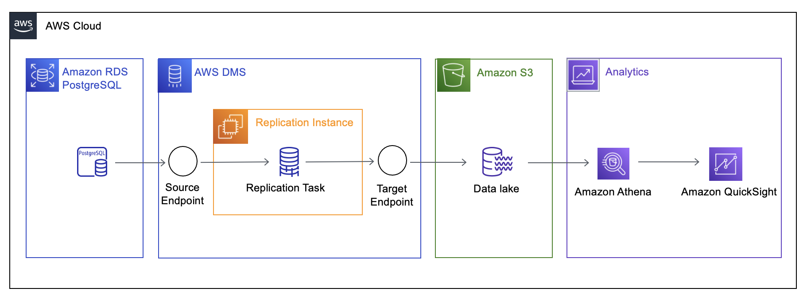

# Migrating an RDS PostgreSQL database to an S3 data lake

This walkthrough will help you understand the process of migrating data from Amazon Relational Database Service (Amazon RDS) for PostgreSQL database to Amazon Simple Storage Service (S3) using AWS Database Migration Service (AWS DMS).

In today’s day and age, a data lake is a key component of an organization’s data management strategy. Most organizations are
seeing an increase in the amount of data they are collecting, and traditional data management strategies can be challenging to
scale and operate. This results in siloed data with poor data quality, inconsistencies, and duplication.

As a part of this walkthrough, we’ll build a data lake in Amazon S3 using data hosted in an Amazon RDS for PostgreSQL
database. Amazon S3 is the largest and most performant cloud storage service. With Amazon S3, you can build a
cost-effective, secure data lake with 99.999999999% (11 9s) of durability. Amazon S3 allows you to store and manage
both structured and unstructured data at unlimited scale. For analytics, data lakes allow you to easily and cost-effectively
create machine learning (ML)-based data visualization dashboards through services like Amazon QuickSight.

To illustrate the process, we’ll migrate data from an example database using AWS DMS. AWS DMS is a managed
service that lets you migrate between heterogeneous sources and targets (in our case, PostgreSQL and Amazon S3).
Using AWS DMS, you can migrate your existing data and ensure that your source and target are synchronized through
ongoing replication.

###### Topics

- [Why AWS DMS?](#postgresql-s3datalake.whydms "#postgresql-s3datalake.whydms")
- [Use case](#postgresql-s3datalake.usecase "#postgresql-s3datalake.usecase")
- [Example data set](#postgresql-s3datalake.exampledataset "#postgresql-s3datalake.exampledataset")
- [Solution overview](#postgresql-s3datalake.solutionoverview "#postgresql-s3datalake.solutionoverview")
- [Prerequisites](#postgresql-s3datalake.prerequisites "#postgresql-s3datalake.prerequisites")
- [Step-by-step an Amazon RDS PostgreSQL database to an Amazon S3 data lake migration walkthrough](postgresql-s3datalake.md "postgresql-s3datalake.md")

## Why AWS DMS?

Data lakes typically require building, configuring, and maintaining multiple data ingestion pipelines from cloud and on-premises data stores. Traditionally, databases can be loaded once with data ingestion tools such as import, export, bulk copy, and so on. Ongoing changes are either not possible or are implemented by bookmarking the initial state. Setting up a data lake using these methods can present challenges ranging from increased load on the source database to overheads while carrying schema changes.

In contrast, AWS DMS extracts changes from the database transaction log generated by the database for recovery
purposes. AWS DMS then takes these changes, converts them to the target format, and applies them to the target.
This process provides near real-time replication to the target, reducing the complexity of replication monitoring.

## Use case

The following use case helps illustrate the challenge we’re trying to solve.

Let’s assume you run an insurance company. To improve customer service and to implement a delay detection mechanism,
you need to collect and store your customers’ claims history. If you can determine the relationship between the initial
time it takes to initially register a claim, the time spent in the claim process, and the average number of claims
processed per month, you can identify the delays in the claim process, and restore certain services to improve
customer experience.

In this document, we’ll walk through the migration of an PostgreSQL data warehouse hosted in an Amazon RDS PostgreSQL database to Amazon S3. We will show you the steps you can follow to migrate a large data warehouse dataset to an S3 data lake. We will cover various configurations and setups that you can do to achieve this goal to fulfill the critical business requirements mentioned below.

## Example data set

For this walkthrough we will use Insurance schema which includes 9 tables. The largest table is claim table which is a history table of all claims reported with 29 million rows. The total size of source database is about 100 GB and has about 10+ years worth of claim history data. The remaining tables are mostly smaller dimension tables.

## Solution overview

The following diagram displays a high-level architecture of the solution, where we use AWS DMS to move data from PostgreSQL databases hosted on Amazon RDS to Amazon S3.

Nowadays, most organizations prefer to first create a data lake containing all the data, and then transform and
move this data to their respective targets. Based on the use case, we will configure AWS DMS to replicate data
from a single database instance containing multiple tables to an S3 bucket and folder.

To replicate data, you need to create and configure the following artifacts in AWS:

- **Replication Instance** — An AWS managed instance that hosts the AWS DMS engine. You control the type or size of the instance based on the workload you plan to migrate.
- **Source Endpoint** — An endpoint that provides connection details, data store type, and credentials to connect to a source database. For this use case, we will configure a source endpoints to point to a Amazon RDS for PostgreSQL database.
- **Target Endpoint** — AWS DMS supports several target systems including Amazon RDS, Amazon Aurora, Amazon Redshift, Amazon Kinesis Data Streams, Amazon S3, and more. For the use case, we will configure Amazon S3 as the target endpoint. In this case we will be using a single S3 bucket to hold the data from both the PostgreSQL sources.
- **Replication Task** — A task that runs on the replication instance and connects to endpoints to replicate data from the source database to the target database. In this case we will have a single migrating the insurance claim data from Amazon RDS PostgreSQL to S3.
- **Amazon Athena** — Amazon Athena is a managed service that makes it easier to run the interactive queries against large data sets by directly uploading them to Amazon S3 while it manages the infrastructure and data handling. With Athena, we just need to define the schema for our data and start querying with standard SQL.
- **Amazon QuickSight** — Amazon QuickSight powers data-driven organizations with unified business intelligence (BI) at hyper scale. With QuickSight, all users can meet varying analytic needs from the same source of truth through modern interactive dashboards, paginated reports, embedded analytics, and natural language queries.

## Prerequisites

The following prerequisites are required to complete this walkthrough:

- An AWS account with AWS Identity and Access Management (IAM) credentials that allows you to launch Amazon RDS
  and AWS Database Migration Service (AWS DMS) instances in your AWS Region. For information about IAM
  credentials, see [Create an IAM user](../userguide/CHAP_GettingStarted.md#CHAP_SettingUp.IAM "../userguide/CHAP_GettingStarted.md#CHAP_SettingUp.IAM").
- An understanding of the Amazon Virtual Private Cloud (Amazon VPC) service and security groups.
  For information about using Amazon VPC with Amazon RDS, see
  [Amazon Virtual Private Cloud (VPCs) and Amazon RDS](../../../AmazonRDS/latest/UserGuide/USER_VPC.md "../../../AmazonRDS/latest/UserGuide/USER_VPC.md").
  For information about Amazon RDS security groups, see
  [Controlling access with security groups](../../../AmazonRDS/latest/UserGuide/Overview.md "../../../AmazonRDS/latest/UserGuide/Overview.md").
- An understanding of the supported features and limitations of AWS DMS. For information about AWS DMS, see [Getting started with Database Migration Service](../userguide/CHAP_GettingStarted.md "../userguide/CHAP_GettingStarted.md").
- An understanding of how to work with PostgreSQL as a source and Amazon S3 data lake as a target. For information about working with PostgreSQL as a source, see [Using a PostgreSQL-compatible database as a source for AWS DMS](../userguide/CHAP_Source.md "../userguide/CHAP_Source.md"). For information about working with Amazon S3 as a target, see [Using Amazon S3 as a target](../userguide/CHAP_Target.md "../userguide/CHAP_Target.md").
- An understanding of the supported data type conversion options for PostgreSQL and Amazon S3. For information about data types for PostgreSQL as a source, see [Source data types for PostgreSQL](../userguide/CHAP_Source.md#CHAP_Source-PostgreSQL-DataTypes "../userguide/CHAP_Source.md#CHAP_Source-PostgreSQL-DataTypes").
- An audit of your source PostgreSQL database. For each schema and all the objects under each schema, determine whether any of the objects are no longer being used. Deprecate these objects on the source PostgreSQL database, because there’s no need to migrate them if they aren’t being used.

For more information about AWS DMS, see [Getting started with Database Migration Service](../userguide/CHAP_GettingStarted.md "../userguide/CHAP_GettingStarted.md").
