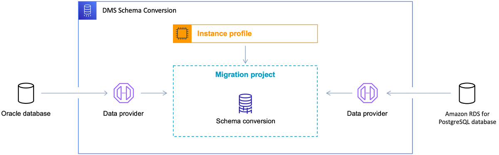

# Migrating Oracle databases to Amazon RDS for PostgreSQL with DMS Schema Conversion

This walkthrough gets you started with heterogeneous database migration from Oracle to Amazon RDS for PostgreSQL. To automate the migration, we use the AWS DMS Schema Conversion. This service helps assess the complexity of your migration and converts source Oracle database schemas and code objects to a format compatible with PostgreSQL. Then, you apply the converted code to your target database. This introductory exercise shows how you can use DMS Schema Conversion for this migration.

At a high level, this migration includes the following steps:

- Use the AWS Management Console to do the following:
  - Create a VPC in the Amazon VPC console.
  - Create IAM roles in the IAM console.
  - Create an Amazon S3 bucket in the Amazon S3 console.
  - Create your target Amazon RDS for PostgreSQL database in the Amazon RDS console.
  - Store database credentials in AWS Secrets Manager.

- Use the AWS DMS console to do the following:
  - Create an instance profile for your migration project.
  - Create data providers for your source and target databases.
  - Create a migration project.

- Use DMS Schema Conversion to do the following:

      + Assess the migration complexity and review the migration action items.
      + Convert your source database.
      + Apply the converted code to your target database.

  This walkthrough takes approximately three hours to complete. Make sure that you delete resources at the end of this walkthrough to avoid additional charges.

###### Topics

- [Migration overview](#schema-conversion-oracle-postgresql-migration-overview "#schema-conversion-oracle-postgresql-migration-overview")
- [Prerequisites for migrating Oracle databases to Amazon Aurora PostgreSQL with DMS schema conversion](schema-conversion-oracle-postgresql-prerequisites.md "schema-conversion-oracle-postgresql-prerequisites.md")
- [Step-by-step Oracle databases to Amazon Aurora PostgreSQL with DMS schema conversion migration walkthrough](schema-conversion-oracle-postgresql-step-by-step-migration.md "schema-conversion-oracle-postgresql-step-by-step-migration.md")
- [Migration from Oracle databases to Amazon Aurora PostgreSQL with DMS schema conversion next steps](schema-conversion-oracle-postgresql-next-steps.md "schema-conversion-oracle-postgresql-next-steps.md")

## Migration overview

This section provides high-level guidance for customers looking to migrate from Oracle to PostgreSQL using DMS Schema Conversion.

DMS Schema Conversion automatically converts your source Oracle database schemas and most of the database code objects to a format compatible with PostgreSQL. This conversion includes tables, views, stored procedures, functions, data types, synonyms, and so on. Any objects that DMS Schema Conversion can’t convert automatically are clearly marked. To complete the migration, you can convert these objects manually.

At a high level, DMS Schema Conversion operates with the following three components: instance profiles, data providers, and migration projects. An instance profile specifies network and security settings. A data provider stores database connection credentials. A migration project contains data providers, an instance profile, and migration rules. AWS DMS uses data providers and an instance profile to design a process that converts database schemas and code objects.

The following diagram illustrates the DMS Schema Conversion process.

Start the walkthrough by [creating the required resources](schema-conversion-oracle-postgresql-step-1.md "schema-conversion-oracle-postgresql-step-1.md").
