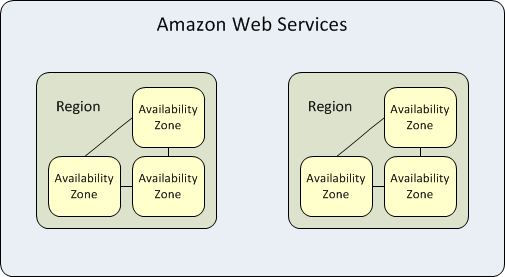
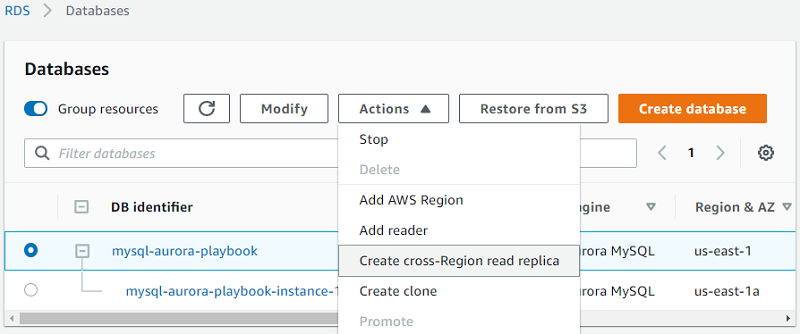
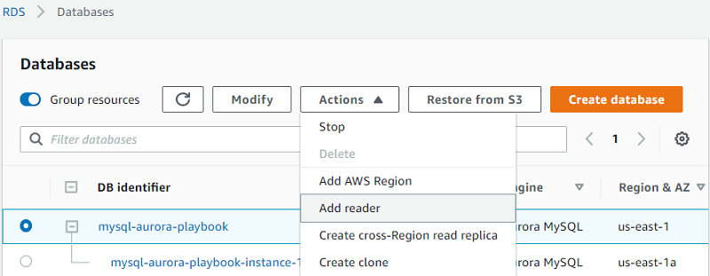

# High availability essentials

This topic provides reference content comparing high availability and disaster recovery features between Microsoft SQL Server 2019 and Amazon Aurora MySQL. You can gain insight into how Aurora MySQL offers similar or enhanced capabilities for database replication, failover, and read scaling compared to SQL Server’s solutions like Always On Availability Groups and Failover Cluster Instances.

| Feature compatibility             | AWS SCT / AWS DMS automation level         | AWS SCT action code index                           | Key differences                                                                        |
| --------------------------------- | ------------------------------------------ | --------------------------------------------------- | -------------------------------------------------------------------------------------- | --------------------------------------------------------------------------------------------------------------------------------------------------------------------------------------------------------------------------------------------------------------------------------------------------------------------------------------------------------------------------------------------------------------------------------------------------------------------------------------------------------------------------------------------------------------------------------------------------------------------------------------------------------------------------------------------------------------------------------------------------------------------------------------------------------------------------------------------------------------------------------------------------------------------------------------------------------------------------------------------------------------------------------------------------------------------------------------------------------------------------------------------------------------------------------------------------------------------------------------------------------------------------------------------------------------------------------------------------------------------------------------------------------------------------------------------------------------------------------------------------------------------------------------------------------------------------------------------------------------------------------------------------------------------------------------------------------------------------------------------------------------------------------------------------------------------------------------------------------------------------------------------------------------------------------------------------------------------------------------------------------------------------------------------------------------------------------------------------------------------------------------------------------------------------------------------------------------------------------------------------------------------------------------------------------------------------------------------------------------------------------------------------------------------------------------------------------------------------------------------------------------------------------------------------------------------------------------------------------------------------------------------------------------------------------------------------------------------------------------------------------------------------------------------------------------------------------------------------------------------------------------------------------------------------------------------------------------------------------------------------------------------------------------------------------------------------------------------------------------------------------------------------------------------------------------------------------------------------------------------------------------------------------------------------------------------------------------------------------------------------------------------------------------------------------------------------------------------------------------------------------------------------------------------------------------------------------------------------------------------------------------------------------------------------------------------------------------------------------------------------------------------------------------------------------------------------------------------------------------------------------------------------------------------------------------------------------------------------------------------------------------------------------------------------------------------------------------------------------------------------------------------------------------------------------------------------------------------------------------------------------------------------------------------------------------------------------------------------------------------------------------------------------------------------------------------------------------------------------------------------------------------------------------------------------------------------------------------------------------------------------------------------------------------------------------------------------------------------------------------------------------------------------------------------------------------------------------------------------------------------------------------------------------------------------------------------------------------------------------------------------------------------------------------------------------------------------------------------------------------------------------------------------------------------------------------------------------------------------------------------------------------------------------------------------------------------------------------------------------------------------------------------------------------------------------------------------------------------------------------------------------------------------------------------------------------------------------------------------------------------------------------------------------------------------------------------------------------------------------------------------------------------------------------------------------------------------------------------------------------------------------------------------------------------------------------------------------------------------------------------------------------------------------------------------------------------------------------------------------------------------------------------------------------------------------------------------------------------------------------------------------------------------------------------------------------------------------------------------------------------------------------------------------------------------------------------------------------------------------------------------------------------------------------------------------------------------------------------------------------------------------------------------------------------------------------------------------------------------------------------------------------------------------------------------------------------------------------------------------------------------------------------------------------------------------------------------------------------------------------------------------------------------------------------------------------------------------------------------------------------------------------------------------------------------------------------------------------------------------------------------------------------------------------------------------------------------------------------------------------------------------------------------------------------------------------------------------------------------------------------------------------------------------------------------------------------------------------------------------------------------------------------------------------------------------------------------------------------------------------------------------------------------------------------------------------------------------------------------------------------------------------------------------------------------------------------------------------------------------------------------------------------------------------------------------------------------------------------------------------------------------------------------------------------------------------------------------------------------------------------------------------------------------------------------------------------------------------------------------------------------------------------------------------------------------------------------------------------------------------------------------------------------------------------------------------------------------------------------------------------------------------------------------------------------------------------------------------------------------------------------------------------------------------------------------------------------------------------------------------------------------------------------------------------------------------------------------------------------------------------------------------------------------------------------------------------------------------------------------------------------------------------------------------------------------------------------------------------------------------------------------------------------------------------------------------------------------------------------------------------------------------------------------------------------------------------------------------------------------------------------------------------------------------------------------------------------------------------------------------------------------------------------------------------------------------------------------------------------------------------------------------------------------------------------------------------------------------------------------------------------------------------------------------------------------------------------------------------------------------------------------------------------------------------------------------------------------------------------------------------------------------------------------------------------------------------------------------------------------------------------------------------------------------------------------------------------------------------------------------------------------------------------------------------------------------------------------------------------------------------------------------------------------------------------------------------------------------------------------------------------------------------------------------------------------------------------------------------------------------------------------------------------------------------------------------------------------------------------------------------------------------------------------------------------------------------------------------------------------------------------------------------------------------------------------------------------------------------------------------------------------------------------------------------------------------------------------------------------------------------------------------------------------------------------------------------------------------------------------------------------------------------------------------------------------------------------------------------------------------------------------------------------------------------------------------------------------------------------------------------------------------------------------------------------------------------------------------------------------------------------------------------------------------------------------------------------------------------------------------------------------------------------------------------------------------------------------------------------------------------------------------------------------------------------------------------------------------------------------------------------------------------------------------------------------------------------------------------------------------------------------------------------------------------------------------------------------------------------------------------------------------------------------------------------------------------------------------------------------------------------------------------------------------------------------------------------------------------------------------------------------------------------------------------------------------------------------------------------------------------------------------------------------------------------------------------------------------------------------------------------------------------------------------------------------------------------------------------------------------------------------------------------------------------------------------------------------------------------------------------------------------------------------------------------------------------------------------------------------------------------------------------------------------------------------------------------------------------------------------------------------------------------------------------------------------------------------------------------------------------------------------------------------------------------------------------------------------------------------------------------------------------------------------------------------------------------------------------------------------------------------------------------------------------------------------------------------------------------------------------------------------------------------------------------------------------------------------------------------------------------------------------------------------------------------------------------------------------------------------------------------------------------------------------------------------------------------------------------------------------------------------------------------------------------------------------------------------------------------------------------------------------------------------------------------------------------------------------------------------------------------------------------------------------------------------------------------------------------------------------------------------------------------------------------------------------------------------------------------------------------------------------------------------------------------------------------------------------------------------------------------------------------------------------------------------------------------------------------------------------------------------------------------------------------------------------------------------------------------------------------------------------------------------------------------------------------------------------------------------------------------------------------------------------------------------------------------------------------------------------------------------------------------------------------------------------------------------------------------------------------------------------------------------------------------------------------------------------------------------------------------------------------------------------------------------------------------------------------------------------------------------------------------------------------------------------------------------------------------------------------------------------------------------------------------------------------------------------------------------------------------------------------------------------------------------------------------------------------------------------------------------------------------------------------------------------------------------------------------------------------------------------------------------------------------------------------------------------------------------------------------------------------------------------------------------------------------------------------------------------------------------------------------------------------------------------------------------------------------------------------------------------------------------------------------------------------------------------------------------------------------------------------------------------------------------------------------------------------------------------------------------------------------------------------------------------------------------------------------------------------------------------------------------------------------------------------------------------------------------------------------------------------------------------------------------------------------------------------------------------------------------------------------------------------------------------------------------------------------------------------------------------------------------------------------------------------------------------------------------------------------------------------------------------------------------------------------------------------------------------------------------------------------------------------------------------------------------------------------------------------------------------------------------------------------------------------------------------------------------------------------------------------------------------------------------------------------------------------------------------------------------------------------------------------------------------------------------------------------------------------------------------------------------------------------------------------------------------------------------------------------------------------------------------------------------------------------------------------------------------------------------------------------------------------------------------------------------------------------------------------------------------------------------------------------------------------------------------------------------------------------------------------------------------------------------------------------------------------------------------------------------------------------------------------------------------------------------------------------------------------------------------------------------------------------------------------------------------------------------------------------------------------------------------------------------------------------------------------------------------------------------------------------------------------------------------------------------------------------------------------------------------------------------------------------------------------------------------------------------------------------------------------------------------------------------------------------------------------------------------------------------------------------------------------------------------------------------------------------------------------------------------------------------------------------------------------------------------------------------------------------------------------------------------------------------------------------------------------------------------------------------------------------------------------------------------------------------------------------------------------------------------------------------------------------------------------------------------------------------------------------------------------------------------------------------------------------------------------------------------------------------------------------------------------------------------------------------------------------------------------------------------------------------------------------------------------------------------------------------------------------------------------------------------------------------------------------------------------------------------------------------------------------------------------------------------------------------------------------------------------------------------------------------------------------------------------------------------------------------------------------------------------------------------------------------------------------------------------------------------------------------------------------------------------------------------------------------------------------------------------------------------------------------------------------------------------------------------------------------------------------------------------------------------------------------------------------------------------------------------------------------------------------------------------------------------------------------------------------------------------------------------------------------------------------------------------------------------------------------------------------------------------------------------------------------------------------------------------------------------------------------------------------------------------------------------------------------------------------------------------------------------------------------------------------------------------------------------------------------------------------------------------------------------------------------------------------------------------------------------------------------------------------------------------------------------------------------------------------------------------------------------------------------------------------------------------------------------------------------------------------------------------------------------------------------------------------------------------------------------------------------------------------------------------------------------------------------------------------------------------------------------------------------------------------------------------------------------------------------------------------------------------------------------------------------------------------------------------------------------------------------------------------------------------------------------------------------------------------------------------------------------------------------------------------------------------------------------------------------------------------------------------------------------------------------------------------------------------------------------------------------------------------------------------------------------------------------------------------------------------------------------------------------------------------------------------------------------------------------------------------------------------------------------------------------------------------------------------------------------------------------------------------------------------------------------------------------------------------------------------------------------------------------------------------------------------------------------------------------------------------------------------------------------------------------------------------------------------------------------------------------------------------------------------------------------------------------------------------------------------------------------------------------------------------------------------------------------------------------------------------------------------------------------------------------------------------------------------------------------------------------------------------------------------------------------------------------- | ----------------------------------------- | --------------------------------------------------------------------------------------------------------- | --------------------------------------------------------------------------------------------------------------------------------------------------------------------------------------------------------------------------------------------------------------------------------------------------------------------------------------------------------------------------------------------------------------------------------------------------------------------------------------------------------------------------------------------------------------------------------------------------------------------------------------------------------------------------------------------------------------------------------------------------------------------------------------------------------------------------------------------------------------------------------------------------------------------------------------------------------------------------------------------------------------------------------------------------------------------------------------------------- |
| Four star feature compatibility   | N/A                                        | N/A                                                 | Multi replica, scale out solution using Amazon Aurora clusters and Availability Zones. | ## SQL Server Usage SQL Server provides several solutions to support high availability and disaster recovery requirements including Always On Failover Cluster Instances (FCI), Always On Availability Groups, Database Mirroring, and Log Shipping. The following sections describe each solution. SQL Server 2017 also adds new Availability Groups functionality which includes read-scale support without a cluster, Minimum Replica Commit Availability Groups setting, and Windows-Linux cross-OS migrations and testing. SQL Server 2019 introduces support for creating Database Snapshots of databases. A database snapshot is a read-only, static view of a SQL Server database. The database snapshot is transactional consistent with the source database as of the moment of the snapshot’s creation. Among other things, some benefits of the database snapshots with regard to high availability are:  • Snapshots can be used for reporting purposes.  • Maintaining historical data for report generation.  • Using a mirror database that you are maintaining for availability purposes to offload reporting. For more information, see [Database Snapshots](https://docs.microsoft.com/en-us/sql/relational-databases/databases/database-snapshots-sql-server?view=sql-server-ver15 "https://docs.microsoft.com/en-us/sql/relational-databases/databases/database-snapshots-sql-server?view=sql-server-ver15") in the _SQL Server documentation_. SQL Server 2019 introduces secondary to primary connection redirection for Always On Availability Groups. It allows client application connections to be directed to the primary replica regardless of the target server specified in the connections string. The connection string can target a secondary replica. Using the right configuration of the availability group replica and the settings in the connection string, the connection can be automatically redirected to the primary replica. For more information, see [Secondary to primary replica read/write connection redirection](https://docs.microsoft.com/en-us/sql/database-engine/availability-groups/windows/secondary-replica-connection-redirection-always-on-availability-groups?view=sql-server-ver15 "https://docs.microsoft.com/en-us/sql/database-engine/availability-groups/windows/secondary-replica-connection-redirection-always-on-availability-groups?view=sql-server-ver15") in the _SQL Server documentation_. ### Always On Failover Cluster Instances Always On Failover Cluster Instances use the Windows Server Failover Clustering (WSFC) operating system framework to deliver redundancy at the server instance level. An FCI is an instance of SQL Server installed across two or more WSFC nodes. For client applications, the FCI is transparent and appears to be a normal instance of SQL Server running on a single server. The FCI provides failover protection by moving the services from one WSFC node Windows server to another WSFC node windows server in the event the current "active" node becomes unavailable or degraded. FCIs target scenarios where a server fails due to a hardware malfunction or a software hang up. Without FCI, a significant hardware or software failure would render the service unavailable until the malfunction is corrected. With FCI, another server can be configured as a "stand by" to replace the original server if it stops servicing requests. For each service or cluster resource, there is only one node that actively services client requests (known as owning a resource group). A monitoring agent constantly monitors the resource owners and can transfer ownership to another node in the event of a failure or planned maintenance such as installing service packs or security patches. This process is completely transparent to the client application, which may continue to submit requests as normal when the failover or ownership transfer process completes. FCI can significantly minimize downtime due to hardware or software general failures. The main benefits of FCI are:  • Full instance level protection.  • Automatic failover of resources from one node to another.  • Supports a wide range of storage solutions. WSFC cluster disks can be iSCSI, Fiber Channel, SMB file shares, and others.  • Supports multi-subnet.  • No need client application configuration after a failover.  • Configurable failover policies.  • Automatic health detection and monitoring. For more information, see [Always On Failover Cluster Instances](https://docs.microsoft.com/en-us/sql/sql-server/failover-clusters/windows/always-on-failover-cluster-instances-sql-server?view=sql-server-ver15 "https://docs.microsoft.com/en-us/sql/sql-server/failover-clusters/windows/always-on-failover-cluster-instances-sql-server?view=sql-server-ver15") in the _SQL Server documentation_. ### Always On Availability Groups Always On Availability Groups is the most recent high availability and disaster recovery solution for SQL Server. It was introduced in SQL Server 2012 and supports high availability for one or more user databases. Because it can be configured and managed at the database level rather than the entire server, it provides much more control and functionality. As with FCI, Always On Availability Groups relies on the framework services of Windows Server Failover Cluster (WSFC) nodes. Always On Availability Groups utilize real-time log record delivery and apply mechanism to maintain near real-time, readable copies of one or more databases. These copies can also be used as redundant copies for resource usage distribution between servers (a scale-out read solution). The main characteristics of Always On Availability Groups are:  • Supports up to nine availability replicas: One primary replica and up to eight secondary readable replicas.  • Supports both asynchronous-commit and synchronous-commit availability modes.  • Supports automatic failover, manual failover, and a forced failover. Only the latter can result in data loss.  • Secondary replicas allow both read-only access and offloading of backups.  • Availability Group Listener may be configured for each availability group. It acts as a virtual server address where applications can submit queries. The listener may route requests to a read-only replica or to the primary replica for read-write operations. This configuration also facilitates fast failover as client applications don’t need to be reconfigured post failover.  • Flexible failover policies.  • The automatic page repair feature protects against page corruption.  • Log transport framework uses encrypted and compressed channels.  • Rich tooling and APIs including Transact-SQL DDL statements, management studio wizards, Always On Dashboard Monitor, and PowerShell scripting. For more information, see [Always On availability groups: a high-availability and disaster-recovery solution](https://docs.microsoft.com/en-us/sql/database-engine/availability-groups/windows/always-on-availability-groups-sql-server?view=sql-server-ver15 "https://docs.microsoft.com/en-us/sql/database-engine/availability-groups/windows/always-on-availability-groups-sql-server?view=sql-server-ver15") in the _SQL Server documentation_. ### Database Mirroring ###### Note Microsoft recommends avoiding Database Mirroring for new development. This feature is deprecated and will be removed in a future release. It is recommended to use Always On Availability Groups instead. Database mirroring is a legacy solution to increase database availability by supporting near instantaneous failover. It is similar in concept to Always On Availability Groups, but can only be configured for one database at a time and with only one standby replica. For more information, see [Database Mirroring](https://docs.microsoft.com/en-us/sql/database-engine/database-mirroring/database-mirroring-sql-server?view=sql-server-ver15 "https://docs.microsoft.com/en-us/sql/database-engine/database-mirroring/database-mirroring-sql-server?view=sql-server-ver15") in the _SQL Server documentation_. ### Log Shipping Log shipping is one of the oldest and well tested high availability solutions. It is configured at the database level similar to Always On Availability Groups and Database Mirroring. Log shipping can be used to maintain one or more secondary databases for a single primary database. The log shipping process involves three steps: 1. Backing up the transaction log of the primary database instance. 2. Copying the transaction log backup file to a secondary server. 3. Restoring the transaction log backup to apply changes to the secondary database. Log shipping can be configured to create multiple secondary database replicas by repeating steps 2 and 3 for each secondary server. Unlike FCI and Always On Availability Groups, log shipping solutions don’t provide automatic failover. In the event the primary database becomes unavailable or unusable for any reason, an administrator must configure the secondary database to serve as the primary and potentially reconfigure all client applications to connect to the new database. ###### Note Secondary databases can be used for read-only access, but require special handling. For more information, see [Configure Log Shipping](https://docs.microsoft.com/en-us/sql/database-engine/log-shipping/configure-log-shipping-sql-server?view=sql-server-ver15 "https://docs.microsoft.com/en-us/sql/database-engine/log-shipping/configure-log-shipping-sql-server?view=sql-server-ver15")in the _SQL Server documentation_. The main characteristics of Log Shipping solutions are:  • Provides redundancy for a single primary database and one or more secondary databases. Log shipping is considered less of a high availability solution due to the lack of automatic failover.  • Supports limited read-only access to secondary databases.  • Administrators have control over the timing and delays of the primary server log backup and secondary server restoration.  • Longer delays can be useful if data is accidentally modified or deleted in the primary database. For more information, see [About Log Shipping](https://docs.microsoft.com/en-us/sql/database-engine/log-shipping/about-log-shipping-sql-server?view=sql-server-ver15 "https://docs.microsoft.com/en-us/sql/database-engine/log-shipping/about-log-shipping-sql-server?view=sql-server-ver15") in the _SQL Server documentation_. ### Examples Configure an Always On Availability Group. `CREATE DATABASE DB1;` `ALTER DATABASE DB1 SET RECOVERY FULL;` `BACKUP DATABASE DB1 TO DISK = N'\\MyBackupShare\DB1\DB1.bak' WITH FORMAT;` `CREATE ENDPOINT DBHA STATE=STARTED AS TCP (LISTENER_PORT=7022) FOR DATABASE_MIRRORING (ROLE=ALL);` `CREATE AVAILABILITY GROUP AG_DB1 FOR DATABASE DB1 REPLICA ON 'SecondarySQL' WITH ( ENDPOINT_URL = 'TCP://SecondarySQL.MyDomain.com:7022', AVAILABILITY_MODE = ASYNCHRONOUS_COMMIT, FAILOVER_MODE = MANUAL );` `-- On SecondarySQL ALTER AVAILABILITY GROUP AG_DB1 JOIN;` `RESTORE DATABASE DB1 FROM DISK = N'\\MyBackupShare\DB1\DB1.bak' WITH NORECOVERY;` `-- On Primary BACKUP LOG DB1 TO DISK = N'\\MyBackupShare\DB1\DB1_Tran.bak' WITH NOFORMAT` `-- On SecondarySQL RESTORE LOG DB1 FROM DISK = N'\\MyBackupShare\DB1\DB1_Tran.bak' WITH NORECOVERY` `ALTER DATABASE MyDb1 SET HADR AVAILABILITY GROUP = MyAG;` For more information, see [Business continuity and database recovery](https://docs.microsoft.com/en-us/sql/database-engine/sql-server-business-continuity-dr?view=sql-server-ver15 "https://docs.microsoft.com/en-us/sql/database-engine/sql-server-business-continuity-dr?view=sql-server-ver15") in the _SQL Server documentation_. ## MySQL Usage Amazon Aurora MySQL-Compatible Edition (Aurora MySQL) is a fully managed Platform as a Service (PaaS) providing high availability capabilities. Amazon Relational Database Service (Amazon RDS) provides database and instance administration functionality for provisioning, patching, backup, recovery, failure detection, and repair. New Aurora MySQL database instances are always created as part of a cluster. If you don’t specify replicas at creation time, a single-node cluster is created. You can add database instances to clusters later. ### Regions and Availability Zones Amazon Relational Database Service (Amazon RDS) is hosted in multiple global locations. Each location is composed of Regions and Availability Zones. Each Region is a separate geographic area having multiple, isolated Availability Zones. Amazon RDS supports placement of resources such as database instances and data storage in multiple locations. By default, resources aren’t replicated across regions. Each region is completely independent and each Availability Zone is isolated from all others. However, the main benefit of Availability Zones within a Region is that they are connected through low-latency, high bandwidth local network links.  Resources may have different scopes. A resource may be global, associated with a specific region (region level), or associated with a specific Availability Zone within a region. For more information, see [Resource locations](../../../AWSEC2/latest/UserGuide/resources.md "../../../AWSEC2/latest/UserGuide/resources.md") in the _User Guide for Linux Instances_. When you create a database instance, you can specify an availability zone or use the default **No preference** option. In this case, Amazon chooses the availability zone for you. You can distribute Aurora MySQL instances across multiple availability zones. You can design applications designed to take advantage of failover such that in the event of an instance in one availability zone failing, another instance in different availability zone will take over and handle requests. You can use elastic IP addresses to abstract the failure of an instance by remapping the virtual IP address to one of the available database instances in another Availability Zone. For more information, see [Elastic IP addresses](../../../AWSEC2/latest/UserGuide/elastic-ip-addresses-eip.md "../../../AWSEC2/latest/UserGuide/elastic-ip-addresses-eip.md") in the _User Guide for Linux Instances_. An Availability Zone is represented by a region code followed by a letter identifier. For example, `us-east-1a`. ###### Note To guarantee even resource distribution across Availability Zones for a region, Amazon RDS independently maps Availability Zones to identifiers for each account. For example, the Availability Zone us-east-1a for one account might not be in the same location as us-east-1a for another account. Users can’t coordinate Availability Zones between accounts. ### Aurora MySQL DB Cluster A DB cluster consists of one or more DB instances and a cluster volume that manages the data for those instances. A cluster volume is a virtual database storage volume that may span multiple Availability Zones with each holding a copy of the database cluster data. An Amazon Aurora database cluster is made up of one of more of the following types of instances:  • A primary instance that supports both read and write workloads. This instance is used for all DML transactions. Every Amazon Aurora DB cluster has one, and only, one primary instance.  • An Amazon Aurora replica that supports read-only workloads. Every Aurora MySQL database cluster may contain from zero to 15 Amazon Aurora replicas in addition to the primary instance for a total maximum of 16 instances. Amazon Aurora Replicas enable scale-out of read operations by offloading reporting or other read-only processes to multiple replicas. Place Amazon Aurora replicas in multiple availability Zones to increase availability of the databases.  ### Endpoints Endpoints are used to connect to Aurora MySQL databases. An endpoint is a Universal Resource Locator (URL) comprised of a host address and port number.  • A cluster endpoint is an endpoint for an Amazon Aurora database cluster that connects to the current primary instance for that database cluster regardless of the availability zone in which the primary resides. Every Aurora MySQL DB cluster has one cluster endpoint and one primary instance. The cluster endpoint should be used for transparent failover for either read or write workloads. ###### Note Use the cluster endpoint for all write operations including all DML and DDL statements. If the primary instance of a DB cluster fails for any reason, Amazon Aurora automatically fails over server requests to a new primary instance. An example of a typical Aurora MySQL DB Cluster endpoint is: `mydbcluster.cluster-123456789012.us-east-1.rds.amazonaws.com:3306`.  • A reader endpoint is an endpoint that is used to connect to one of the Aurora read-only replicas in the database cluster. Each Aurora MySQL database cluster has one reader endpoint. If there are more than one Aurora Replicas in the cluster, the reader endpoint redirects the connection to one of the available replicas. Use the Reader Endpoint to support load balancing for read-only connections. If the DB cluster contains no replicas, the reader endpoint redirects the connection to the primary instance. If an Aurora Replica is created later, the Reader Endpoint starts directing connections to the new Aurora Replica with minimal interruption in service. An example of a typical Aurora MySQL DB Reader Endpoint is: `mydbcluster.cluster-ro-123456789012.us-east-1.rds.amazonaws.com:3306`.  • An instance endpoint is a specific endpoint for every database instance in an Aurora DB cluster. Every Aurora MySQL DB instance regardless of its role has its own unique instance endpoint. Use the Instance Endpoints only when the application handles failover and read workload scale-out on its own. For example, you can have certain clients connect to one replica and others to another. An example of a typical Aurora MySQL DB Reader Endpoint is: `mydbinstance.123456789012.us-east-1.rds.amazonaws.com:3306`. Some general considerations for using endpoints:  • Consider using the cluster endpoint instead of individual instance endpoints because it supports high-availability scenarios. In the event that the primary instance fails, Aurora MySQL automatically fails over to a new primary instance. You can accomplish this configuration by either promoting an existing Aurora replica to be the new primary or by creating a new primary instance.  • If you use the cluster endpoint instead of the instance endpoint, the connection is automatically redirected to the new primary.  • If you choose to use the instance endpoint, you must use the Amazon RDS console or the API to discover which database instances in the database cluster are available and their current roles. Then, connect using that instance endpoint.  • Be aware that the reader endpoint load balances connections to Aurora Replicas in an Aurora database cluster, but it doesn’t load balance specific queries or workloads. If your application requires custom rules for distributing read workloads, use instance endpoints.  • The reader endpoint may redirect connection to a primary instance during the promotion of an Aurora Replica to a new primary instance. ### Amazon Aurora Storage Aurora MySQL data is stored in a cluster volume. The cluster volume is a single, virtual volume that uses fast solid-state disk (SSD) drives. The cluster volume is comprised of multiple copies of the data distributed between availability zones in a region. This configuration minimizes the chances of data loss and allows for the failover scenarios mentioned in the preceding sections. Amazon Aurora cluster volumes automatically grow to accommodate the growth in size of your databases. An Aurora cluster volume has a maximum size of 64 terabytes (TiB). Since table size is theoretically limited to the size of the cluster volume, the maximum table size in an Aurora DB cluster is 64 TiB. ### Storage Auto-Repair The chance of data loss due to disk failure is greatly minimize due to the fact that Aurora MySQL maintains multiple copies of the data in three Availability Zones. Aurora MySQL detects failures in the disks that make up the cluster volume. If a disk segment fails, Aurora repairs the segment automatically. Repairs to the disk segments are made using data from the other cluster volumes to ensure correctness. This process allows Aurora to significantly minimize the potential for data loss and the subsequent need to restore a database. ### Survivable Cache Warming When a database instance starts, Aurora MySQL performs a warming process for the buffer pool. Aurora MySQL pre-loads the buffer pool with pages that have been frequently used in the past. This approach improves performance and shortens the natural cache filling process for the initial period when the database instance starts servicing requests. Aurora MySQL maintains a separate process to manage the cache, which can stay alive even when the database process restarts. The buffer pool entries remain in memory regardless of the database restart providing the database instance with a fully warm buffer pool. ### Crash Recovery Aurora MySQL can instantaneously recover from a crash and continue to serve requests. Crash recovery is performed asynchronously using parallel threads enabling the database to remain open and available immediately after a crash. For more information, see [Fault tolerance for an Aurora DB cluster](../../../AmazonRDS/latest/AuroraUserGuide/Concepts.md#Aurora.Managing.FaultTolerance "../../../AmazonRDS/latest/AuroraUserGuide/Concepts.md#Aurora.Managing.FaultTolerance") in the _User Guide for Aurora_. ### Delayed Replication ###### Note Amazon RDS for MySQL now supports delayed replication, which enables you to set a configurable time period for which a read replica lags behind the source database. In a standard MySQL replication configuration, there is minimal replication delay between the source and the replica. With delayed replication, you can introduce an intentional delay as a strategy for disaster recovery. A delay can be helpful when you want to recover from a human error. For example, if someone accidentally drops a table from your primary database, you can stop the replication just before the point at which the table was dropped and promote the replica to become a standalone instance. To assist with this process, Amazon RDS for MySQL now includes a stored procedure that will stop replication once a specified point in the binary log is reached. Refer to the blog post for more details. Configuring a read replica for delayed replication is done with stored procedure and can either be performed when the read replica is initially created or be specified for an existing read replica. Delayed replication is available for MySQL version 5.7.22 and later or MySQL 5.6.40 and later in all AWS Regions. For more information, see [Working with MySQL read replicas](../../../AmazonRDS/latest/UserGuide/USER_MySQL.Replication.md "../../../AmazonRDS/latest/UserGuide/USER_MySQL.Replication.md") in the _Amazon Relational Database Service User Guide_. For more information, see [Fault tolerance for an Aurora DB cluster](../../../AmazonRDS/latest/AuroraUserGuide/Concepts.md#Aurora.Managing.FaultTolerance "../../../AmazonRDS/latest/AuroraUserGuide/Concepts.md#Aurora.Managing.FaultTolerance") in the _User Guide for Aurora_. ### Examples With Amazon RDS and Amazon Aurora for MySQL there are two options for additional reader instance. |
| Amazon RDS Read Instance Option   | Description                                | Usage                                               |                                                                                        | ---                                                                                                                                                                                                                                                                                                                                                                                                                                                                                                                                                                                                                                                                                                                                                                                                                                                                                                                                                                                                                                                                                                                                                                                                                                                                                                                                                                                                                                                                                                                                                                                                                                                                                                                                                                                                                                                                                                                                                                                                                                                                                                                                                                                                                                                                                                                                                                                                                                                                                                                                                                                                                                                                                                                                                                                                                                                                                                                                                                                                                                                                                                                                                                                                                                                                                                                                                                                                                                                                                                                                                                                                                                                                                                                                                                                                                                                                                                                                                                                                                                                                                                                                                                                                                                                                                                                                                                                                                                                                                                                                                                                                                                                                                                                                                                                                                                                                                                                                                                                                                                                                                                                                                                                                                                                                                                                                                                                                                                                                                                                                                                                                                                                                                                                                                                                                                                                                                                                                                                                                                                                                                                                                                                                                                                                                                                                                                                                                                                                                                                                                                                                                                                                                                                                                                                                                                                                                                                                                                                                                                                                                                                                                                                                                                                                                                                                                                                                                                                                                                                                                                                                                                                                                                                                                                                                                                                                                                                                                                                                                                                                                                                                                                                                                                                                                                                                                                                                                                                                                                                                                                                                                                                                                                                                                                                                                                                                                                                                                                                                                                                                                                                                                                                                                                                                                                                                                                                                                                                                                                                                                                                                                                                                                                                                                                                                                                                                                                                                                                                                                                                                                                                                                                                                                                                                                                                                                                                                                                                                                                                                                                                                                                                                                                                                                                                                                                                                                                                                                                                                                                                                                                                                                                                                                                                                                                                                                                                                                                                                                                                                                                                                                                                                                                                                                                                                                                                                                                                                                                                                                                                                                                                                                                                                                                                                                                                                                                                                                                                                                                                                                                                                                                                                                                                                                                                                                                                                                                                                                                                                                                                                                                                                                                                                                                                                                                                                                                                                                                                                                                                                                                                                                                                                                                                                                                                                                                                                                                                                                                                                                                                                                                                                                                                                                                                                                                                                                                                                                                                                                                                                                                                                                                                                                                                                                                                                                                                                                                                                                                                                                                                                                                                                                                                                                                                                                                                                                                                                                                                                                                                                                                                                                                                                                                                                                                                                                                                                                                                                                                                                                                                                                                                                                                                                                                                                                                                                                                                                                                                                                                                                                                                                                                                                                                                                                                                                                                                                                                                                                                                                                                                                                                                                                                                                                                                                                                                                                                                                                                                                                                                                                                                                                                                                                                                                                                                                                                                                                                                                                                                                                                                                                                                                                                                                                                                                                                                                                                                                                                                                                                                                                                                                                                                                                                                                                                                                                                                                                                                                                                                                                                                                                                                                                                                                                                                                                                                                                                                                                                                                                                                                                                                                                                                                                                                                                                                                                                                                                                                                                                                                                                                                                                                                                                                                                                                                                                                                                                                                                                                                                                                                                                                                                                                                                                                                                                                                                                                                                                                                                                                                                                                                                                                                                                                                                                                                                                                                                                                                                                                                                                                                                                                                                                                                                                                                                                                                                                                                                                                                                                                                                                                                                                                                                                                                                                                                                                                                                                                                                                                                                                                                                                                                                                                                                                                                                                                                                                                                                                                                                                                                                                                                                                                                                                                                                                                                                                                                                                                                                                                                                                                                                                                                                                                                                                                                                                                                                                                                                                                                                                                                                                                                                                                                                                                                                                                                                                                                                                                                                                                                                   | ---                                       | ---                                                                                                       |
| Reader                            | Another reader instance in the same region | Better for lower costs and latency between instance |                                                                                        | Cross-region read replica                                                                                                                                                                                                                                                                                                                                                                                                                                                                                                                                                                                                                                                                                                                                                                                                                                                                                                                                                                                                                                                                                                                                                                                                                                                                                                                                                                                                                                                                                                                                                                                                                                                                                                                                                                                                                                                                                                                                                                                                                                                                                                                                                                                                                                                                                                                                                                                                                                                                                                                                                                                                                                                                                                                                                                                                                                                                                                                                                                                                                                                                                                                                                                                                                                                                                                                                                                                                                                                                                                                                                                                                                                                                                                                                                                                                                                                                                                                                                                                                                                                                                                                                                                                                                                                                                                                                                                                                                                                                                                                                                                                                                                                                                                                                                                                                                                                                                                                                                                                                                                                                                                                                                                                                                                                                                                                                                                                                                                                                                                                                                                                                                                                                                                                                                                                                                                                                                                                                                                                                                                                                                                                                                                                                                                                                                                                                                                                                                                                                                                                                                                                                                                                                                                                                                                                                                                                                                                                                                                                                                                                                                                                                                                                                                                                                                                                                                                                                                                                                                                                                                                                                                                                                                                                                                                                                                                                                                                                                                                                                                                                                                                                                                                                                                                                                                                                                                                                                                                                                                                                                                                                                                                                                                                                                                                                                                                                                                                                                                                                                                                                                                                                                                                                                                                                                                                                                                                                                                                                                                                                                                                                                                                                                                                                                                                                                                                                                                                                                                                                                                                                                                                                                                                                                                                                                                                                                                                                                                                                                                                                                                                                                                                                                                                                                                                                                                                                                                                                                                                                                                                                                                                                                                                                                                                                                                                                                                                                                                                                                                                                                                                                                                                                                                                                                                                                                                                                                                                                                                                                                                                                                                                                                                                                                                                                                                                                                                                                                                                                                                                                                                                                                                                                                                                                                                                                                                                                                                                                                                                                                                                                                                                                                                                                                                                                                                                                                                                                                                                                                                                                                                                                                                                                                                                                                                                                                                                                                                                                                                                                                                                                                                                                                                                                                                                                                                                                                                                                                                                                                                                                                                                                                                                                                                                                                                                                                                                                                                                                                                                                                                                                                                                                                                                                                                                                                                                                                                                                                                                                                                                                                                                                                                                                                                                                                                                                                                                                                                                                                                                                                                                                                                                                                                                                                                                                                                                                                                                                                                                                                                                                                                                                                                                                                                                                                                                                                                                                                                                                                                                                                                                                                                                                                                                                                                                                                                                                                                                                                                                                                                                                                                                                                                                                                                                                                                                                                                                                                                                                                                                                                                                                                                                                                                                                                                                                                                                                                                                                                                                                                                                                                                                                                                                                                                                                                                                                                                                                                                                                                                                                                                                                                                                                                                                                                                                                                                                                                                                                                                                                                                                                                                                                                                                                                                                                                                                                                                                                                                                                                                                                                                                                                                                                                                                                                                                                                                                                                                                                                                                                                                                                                                                                                                                                                                                                                                                                                                                                                                                                                                                                                                                                                                                                                                                                                                                                                                                                                                                                                                                                                                                                                                                                                                                                                                                                                                                                                                                                                                                                                                                                                                                                                                                                                                                                                                                                                                                                                                                                                                                                                                                                                                                                                                                                                                                                                                                                                                                                                                                                                                                                                                                                                                                                                                                                                                                                                                                                                                                                                                                                                                                                                                                                                                                                                                                                                                                                                                                                                                                                                                                                                                                                                                                                                                                                                                                                                                                                                                                                                                                             | Another reader instance in another region | Better when disaster recovery plan requires minimal distance between the primary and the standby instance | The following walkthroughs demonstrate how to create a cross-region read replica and a read replica in the same region. **To create a cross-region read replica** 1. Log in to the AWS Console, and choose **RDS**. 2. Select the instance and choose **Instance actions**, **Create cross-region read replica**.  3. On the next page, enter all required details and choose **Create**. After the replica is created, you can run read and write operations on the primary instance and read-only operations on the replica. **To create a read replica in the same region** 1. Log in to the AWS Console, and choose **RDS**. 2. Select the instance and choose **Instance actions**, **Add reader**.  3. On the next page, enter all required details and choose **Create**. After the replica is created, you can run read and write operations on the primary instance and read-only operations on the replica. ## Summary |
| Feature                           | SQL Server                                 | Aurora MySQL                                        | Comments                                                                               |
| ---                               | ---                                        | ---                                                 | ---                                                                                    |
| Server level failure protection   | Failover Cluster Instances                 | N/A                                                 | Not applicable. Clustering is handled by Aurora MySQL.                                 |
| Database level failure protection | Always On Availability Groups              | Amazon Aurora Replicas                              |                                                                                        |
| Log replication                   | Log Shipping                               | N/A                                                 | Not applicable. Aurora MySQL handles data replication at the storage level.            |
| Disk error protection             | `RESTORE…​ PAGE=`                          | Automatically                                       |                                                                                        |
| Maximum read-only replicas        | 8 + Primary                                | 15 + Primary                                        |                                                                                        |
| Failover address                  | Availability group listener                | Cluster endpoint                                    |                                                                                        |
| Read-only workloads               | `READ INTENT` connection                   | Read endpoint                                       |                                                                                        | For more information, see [Amazon Aurora DB clusters](../../../AmazonRDS/latest/AuroraUserGuide/Aurora.md "../../../AmazonRDS/latest/AuroraUserGuide/Aurora.md") in the _User Guide for Aurora_ and [Regions and Zones](../../../AWSEC2/latest/UserGuide/using-regions-availability-zones.md "../../../AWSEC2/latest/UserGuide/using-regions-availability-zones.md") in the _User Guide for Linux Instances_.                                                                                                                                                                                                                                                                                                                                                                                                                                                                                                                                                                                                                                                                                                                                                                                                                                                                                                                                                                                                                                                                                                                                                                                                                                                                                                                                                                                                                                                                                                                                                                                                                                                                                                                                                                                                                                                                                                                                                                                                                                                                                                                                                                                                                                                                                                                                                                                                                                                                                                                                                                                                                                                                                                                                                                                                                                                                                                                                                                                                                                                                                                                                                                                                                                                                                                                                                                                                                                                                                                                                                                                                                                                                                                                                                                                                                                                                                                                                                                                                                                                                                                                                                                                                                                                                                                                                                                                                                                                                                                                                                                                                                                                                                                                                                                                                                                                                                                                                                                                                                                                                                                                                                                                                                                                                                                                                                                                                                                                                                                                                                                                                                                                                                                                                                                                                                                                                                                                                                                                                                                                                                                                                                                                                                                                                                                                                                                                                                                                                                                                                                                                                                                                                                                                                                                                                                                                                                                                                                                                                                                                                                                                                                                                                                                                                                                                                                                                                                                                                                                                                                                                                                                                                                                                                                                                                                                                                                                                                                                                                                                                                                                                                                                                                                                                                                                                                                                                                                                                                                                                                                                                                                                                                                                                                                                                                                                                                                                                                                                                                                                                                                                                                                                                                                                                                                                                                                                                                                                                                                                                                                                                                                                                                                                                                                                                                                                                                                                                                                                                                                                                                                                                                                                                                                                                                                                                                                                                                                                                                                                                                                                                                                                                                                                                                                                                                                                                                                                                                                                                                                                                                                                                                                                                                                                                                                                                                                                                                                                                                                                                                                                                                                                                                                                                                                                                                                                                                                                                                                                                                                                                                                                                                                                                                                                                                                                                                                                                                                                                                                                                                                                                                                                                                                                                                                                                                                                                                                                                                                                                                                                                                                                                                                                                                                                                                                                                                                                                                                                                                                                                                                                                                                                                                                                                                                                                                                                                                                                                                                                                                                                                                                                                                                                                                                                                                                                                                                                                                                                                                                                                                                                                                                                                                                                                                                                                                                                                                                                                                                                                                                                                                                                                                                                                                                                                                                                                                                                                                                                                                                                                                                                                                                                                                                                                                                                                                                                                                                                                                                                                                                                                                                                                                                                                                                                                                                                                                                                                                                                                                                                                                                                                                                                                                                                                                                                                                                                                                                                                                                                                                                                                                                                                                                                                                                                                                                                                                                                                                                                                                                                                                                                                                                                                                                                                                                                                                                                                                                                                                                                                                                                                                                                                                                                                                                                                                                                                                                                                                                                                                                                                                                                                                                                                                                                                                                                                                                                                                                                                                                                                                                                                                                                                                                                                                                                                                                                                                                                                                                                                                                                                                                                                                                                                                                                                                                                                                                                                                                                                                                                                                                                                                                                                                                                                                                                                                                                                                                                                                                                                                                                                                                                                                                                                                                                                                                                                                                                                                                                                                                                                                                                                                                                                                                                                                                                                                                                                                                                                                                                                                                                                                                                                                                                                                                                                                                                                                                                                                                                                                                                                                                                                                                                                                                                                                                                                                                                                                                                                                                                                                                                                                                                                                                                                                                                                                                                                                                                                                                                                                                                                                                                                                                                                                                                                                                                                                                                                                                                                                                                                                                                                                                                                                                                                                                                                                                                                                                                                                                                                                                                                                                                                         |
