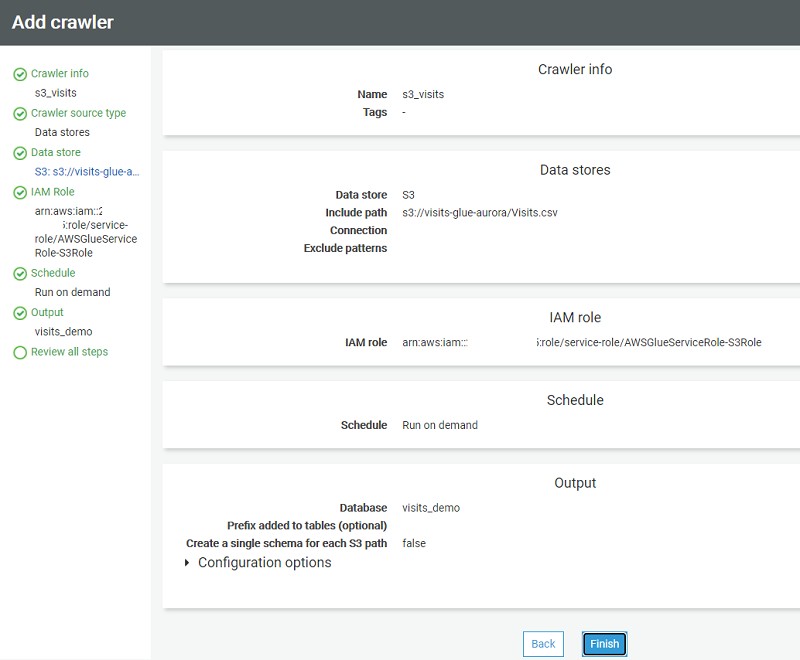

# ETL features

This topic provides reference content comparing SQL Server’s ETL capabilities with those of Amazon Aurora MySQL. You can understand the evolution of SQL Server’s ETL tools from DTS to SSIS, and learn about AWS Glue as the recommended ETL solution for Aurora MySQL.

| Feature compatibility          | AWS SCT / AWS DMS automation level | AWS SCT action code index | Key differences       |
| ------------------------------ | ---------------------------------- | ------------------------- | --------------------- |
| One star feature compatibility | N/A                                | N/A                       | Use AWS Glue for ETL. |

## SQL Server Usage

SQL Server offers a native Extract, Transform, and Load (ETL) framework of tools and services to support enterprise ETL requirements. The legacy Data Transformation Services (DTS) has been deprecated as of SQL Server 2008 and replaced with SQL Server Integration Services (SSIS), which was introduced with SQL Server 2005. For more information, see [Deprecated Database Engine Features in SQL Server 2008 R2](<https://docs.microsoft.com/en-us/previous-versions/sql/sql-server-2008-r2/ms143729(v=sql.105)> "https://docs.microsoft.com/en-us/previous-versions/sql/sql-server-2008-r2/ms143729(v=sql.105)") in the _SQL Server documentation_.

### DTS

DTS was introduced in SQL Server version 7 in 1998. It was significantly expanded in SQL Server 2000 with features such as FTP, database level operations, and Microsoft Message Queuing (MSMQ) integration. It included a set of objects, utilities, and services that enabled easy, visual construction of complex ETL operations across heterogeneous data sources and targets.

DTS supported OLE DB, ODBC, and text file drivers. It allowed transformations to be scheduled using SQL Server Agent. DTS also provided version control and backup capabilities with version control systems such as Microsoft Visual SourceSafe.

The fundamental entity in DTS was the DTS Package. Packages were the logical containers for DTS objects such as connections, data transfers, transformations, and notifications. The DTS framework also included the following tools:

- DTS Wizards
- DTS Package Designers
- DTS Query Designer
- DTS Run Utility

### SSIS

The SSIS framework was introduced in SQL Server 2005, but was limited to the top-tier editions only, unlike DTS which was available with all editions.

SSIS has evolved over DTS to offer a true modern, enterprise class, heterogeneous platform for a broad range of data migration and processing tasks. It provides a rich workflow oriented design with features for all types of enterprise data warehousing. It also supports scheduling capabilities for multi-dimensional cubes management.

SSIS provides the following tools:

- SSIS Import/Export Wizard is an SQL Server Management Studio extension that enables quick creation of packages for moving data between a wide array of sources and destinations. However, it has limited transformation capabilities.
- SQL Server Business Intelligence Development Studio (BIDS) is a developer tool for creating complex packages and transformations. It provides the ability to integrate procedural code into package transformations and provides a scripting environment. Recently, BIDS has been replaced by SQL Server Data Tools — Business Intelligence (SSDT-BI).

SSIS objects include:

- Connections
- Event handlers
- Workflows
- Error handlers
- Parameters (Beginning with SQL Server 2012)
- Precedence constraints
- Tasks
- Variables

SSIS packages are constructed as XML documents and can be saved to the file system or stored within a SQL Server instance using a hierarchical name space.

For more information, see [SQL Server Integration Services](https://docs.microsoft.com/en-us/sql/integration-services/sql-server-integration-services?view=sql-server-ver15 "https://docs.microsoft.com/en-us/sql/integration-services/sql-server-integration-services?view=sql-server-ver15") in the _SQL Server documentation_ and [Data Transformation Services](https://en.wikipedia.org/wiki/Data_Transformation_Services "https://en.wikipedia.org/wiki/Data_Transformation_Services") in the _Wikipedia_.

## MySQL Usage

Amazon Aurora MySQL-Compatible Edition (Aurora MySQL) provides AWS Glue for enterprise class Extract, Transform, and Load (ETL). It is a fully-managed service that performs data cataloging, cleansing, enriching, and movement between heterogeneous data sources and destinations. Being a fully managed service, the user doesn’t need to be concerned with infrastructure management.

AWS Glue key features include the following.

### Integrated Data Catalog

The AWS Glue Data Catalog is a persistent meta-data store, that can be used to store all data assets, whether in the cloud or on-premises. It stores table schemas, job steps, and additional meta data information for managing these processes. AWS Glue can automatically calculate statistics and register partitions to make queries more efficient. It maintains a comprehensive schema version history for tracking changes over time.

### Automatic Schema Discovery

AWS Glue provides automatic crawlers that can connect to source or target data providers. The crawler uses a prioritized list of classifiers to determine the schema for your data and then generates and stores the metadata in the AWS Glue Data Catalog. You can schedule crawlers or run them on-demand. You can also trigger a crawler when an event occurs to keep meta-data current.

### Code Generation

AWS Glue automatically generates the code to extract, transform, and load data. All you need to do is point Glue to your data source and target. The ETL scripts to transform, flatten, and enrich data are created automatically. AWS Glue scripts can be generated in Scala or Python and are written for Apache Spark.

### Developer Endpoints

When interactively developing Glue ETL code, AWS Glue provides development endpoints for editing, debugging, and testing. You can use any IDE or text editor for ETL development. Custom readers, writers, and transformations can be imported into Glue ETL jobs as libraries. You can also use and share code with other developers in the AWS Glue GitHub repository. For more information, see [this repository](https://github.com/awslabs/aws-glue-libs "https://github.com/awslabs/aws-glue-libs") on _GitHub_.

### Flexible Job Scheduler

AWS Glue jobs can be triggered for running either on a pre-defined schedule, on-demand, or as a response to an event.

Multiple jobs can be started in parallel and dependencies can be explicitly defined across jobs to build complex ETL pipelines. Glue handles all inter-job dependencies, filters bad data, and retries failed jobs. All logs and notifications are pushed to Amazon CloudWatch; you can monitor and get alerts from a central service.

### Migration Considerations

Currently, there are no automatic tools for migrating ETL packages from DTS or SSIS into AWS Glue. Migration from SQL Server to Aurora MySQL requires rewriting ETL processes to use AWS Glue.

Alternatively, consider using an EC2 SQL Server instance to run the SSIS service as an interim solution. The connectors and tasks must be revised to support Aurora MySQL instead of SQL Server, but this approach allows gradual migration to AWS Glue.

### Examples

The following walkthrough describes how to create an AWS Glue job to upload a comma-separated values (CSV) file from Amazon S3 to Aurora MySQL.

The source file for this walkthrough is a simple Visits table in CSV format. The objective is to upload this file to an Amazon S3 bucket and create an AWS Glue job to discover and copy it into an Aurora MySQL database.

#### Step 1 — Create a Bucket in Amazon S3 and Upload the CSV File

1. In the AWS console, choose **S3**, and then choose **Create bucket**.

###### Note

This walkthrough demonstrates how to create the buckets and upload the files manually, which is automated using the Amazon S3 API for production ETLs. Using the console to manually run all the settings will help you get familiar with the terminology, concepts, and workflow. 2. Enter a unique name for the bucket, select a region, and define the level of access. 3. Turn on versioning, add tags, turn on server-side encryption, and choose **Create bucket**. 4. On the Amazon S3 Management Console, choose the newly created bucket. 5. On the bucket page, choose **Upload**. 6. Choose **Add files**, select your CSV file, and choose **Upload**.

#### Step 2 — Add an Amazon Glue Crawler to Discover and Catalog the Visits File

1. In the AWS console, choose **AWS Glue**.
2. Choose **Tables**, and then choose **Add tables using a crawler**.
3. Enter the name of the crawler and choose **Next**.
4. On the **Specify crawler source type** page, leave the default values, and choose **Next**.
5. On the **Add a data store** page, specify a valid Amazon S3 path, and choose **Next**.
6. On the **Choose an IAM role** page, choose an existing IAM role, or create a new IAM role. Choose **Next**.
7. On the **Create a schedule for this crawler** page, choose **Run on demand**, and choose **Next**.
8. On the **Configure the crawler’s output** page, choose a database for the crawler’s output, enter an optional table prefix for easy reference, and choose **Next**.
9. Review the information that you provided and choose **Finish** to create the crawler.

#### Step 3 — Run the Amazon Glue Crawler

1. In the AWS console, choose **AWS Glue**, and then choose **Crawlers**.
2. Choose the crawler that you created on the previous step, and choose **Run crawler**.

After the crawler completes, the table should be discovered and recorded in the catalog in the table specified.

Click the link to get to the table that was just discovered and then click the table name.

Verify the crawler identified the table’s properties and schema correctly.

###### Note

You can manually adjust the properties and schema JSON files using the buttons on the top right.

If you don’t want to add a crawler, you can add tables manually.

1. In the AWS console, choose **AWS Glue**.
2. Choose **Tables**, and then choose **Add table manually**.

#### Step 4 — Create an ETL Job to Copy the Visits Table to an Aurora MySQL Database

1. In the AWS console, choose **AWS Glue**.
2. Choose **Jobs (legacy)**, and then choose **Add job**.
3. Enter a name for the ETL job and pick a role for the security context. For this example, use the same role created for the crawler. The job may consist of a pre-existing ETL script, a manually-authored script, or an automatic script generated by Amazon Glue. For this example, use Amazon Glue. Enter a name for the script file or accept the default, which is also the job’s name. Configure advanced properties and parameters if needed and choose **Next**.
4. Select the data source for the job and choose **Next**.
5. On the **Choose a transform type** page, choose **Change schema**.
6. On the **Choose a data target** page, choose **Create tables in your data target**, use the JDBC Data store, and the `gluerds` connection type. Choose **Add connection**.
7. On the **Add connection** page, enter the access details for the Amazon Aurora Instance and choose **Add**.
8. Choose **Next** to display the column mapping between the source and target. Leave the default mapping and data types, and choose **Next**.
9. Review the job properties and choose **Save job and edit script**.
10. Review the generated script and make manual changes if needed. You can use the built-in templates for source, target, target location, transform, and spigot using the buttons at the top right section of the screen.
11. Choose **Run job**.
12. In the AWS console, choose **AWS Glue**, and then choose **Jobs (legacy)**.
13. On the history tab, verify that the job status is set to **Succeeded**.
14. Open your query IDE, connect to the Aurora MySQL cluster, and query the visits database to make sure the data has been transferred successfully.

For more information, see [AWS Glue Developer Guide](../../../glue/latest/dg/what-is-glue.md "../../../glue/latest/dg/what-is-glue.md") and [AWS Glue resources](https://aws.amazon.com/glue/resources "https://aws.amazon.com/glue/resources").
