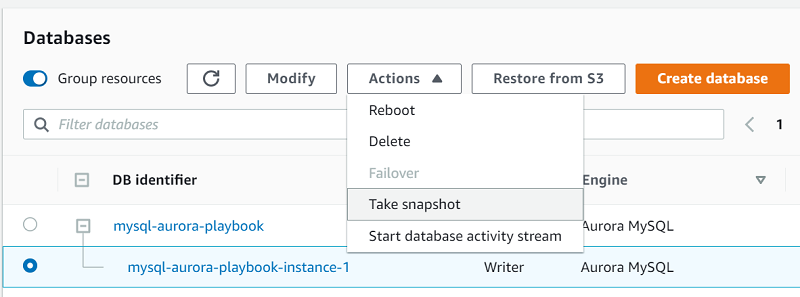

# Maintenance plans

This topic provides reference information about migrating maintenance tasks from Microsoft SQL Server 2019 to Amazon Aurora MySQL. You can understand the key differences in how routine database maintenance is handled between these two systems.

| Feature compatibility            | AWS SCT / AWS DMS automation level | AWS SCT action code index | Key differences                                            |
| -------------------------------- | ---------------------------------- | ------------------------- | ---------------------------------------------------------- |
| Three star feature compatibility | N/A                                | N/A                       | Use Amazon RDS for backups. Use SQL for table maintenance. |

## SQL Server Usage

A _maintenance plan_ is a set of automated tasks used to optimize a database, performs regular backups, and ensure it is free of inconsistencies. Maintenance plans are implemented as SQL Server Integration Services (SSIS) packages and are run by SQL Server Agent jobs. You can run them manually or automatically at scheduled time intervals.

SQL Server provides a variety of pre-configured maintenance tasks. You can create custom tasks using TSQL scripts or operating system batch files.

Maintenance plans are typically used for the following tasks:

- Backing up database and transaction log files.
- Performing cleanup of database backup files in accordance with retention policies.
- Performing database consistency checks.
- Rebuilding or reorganizing indexes.
- Decreasing data file size by removing empty pages (shrink a database).
- Updating statistics to help the query optimizer obtain updated data distributions.
- Running SQL Server Agent jobs for custom actions.
- Running a T-SQL task.

Maintenance plans can include tasks for operator notifications and history or maintenance cleanup. They can also generate reports and output the contents to a text file or the maintenance plan tables in the `msdb` database.

You can create and manage maintenance plans using the maintenance plan wizard in SQL Server Management Studio, Maintenance Plan Design Surface (provides enhanced functionality over the wizard), Management Studio Object Explorer, and T-SQL system stored procedures.

For more information, see [SQL Server Agent and MySQL Agent](chap-sql-server-aurora-mysql.management.md "chap-sql-server-aurora-mysql.management.md").

### Deprecated DBCC Index and Table Maintenance Commands

The DBCC DBREINDEX, INDEXDEFRAG, and SHOWCONTIG commands have been deprecated as of SQL Server 2008R2. For more information, see [Deprecated Database Engine Features in SQL Server 2008 R2](<https://docs.microsoft.com/en-us/previous-versions/sql/sql-server-2008-r2/ms143729(v=sql.105)> "https://docs.microsoft.com/en-us/previous-versions/sql/sql-server-2008-r2/ms143729(v=sql.105)") in the _SQL Server documentation_.

In place of the deprecated DBCC, SQL Server provides newer syntax alternatives as detailed in the following table.

| Deprecated DBCC command | Use instead                      |
| ----------------------- | -------------------------------- |
| `DBCC DBREINDEX`        | `ALTER INDEX …​ REBUILD`         |
| `DBCC INDEXDEFRAG`      | `ALTER INDEX …​ REORGANIZE`      |
| `DBCC SHOWCONTIG`       | `sys.dm_db_index_physical_stats` |

For the Aurora MySQL alternatives to these maintenance commands, see [Aurora MySQL Maintenance Plans](#chap-sql-server-aurora-mysql.management.maintenanceplans.mysql "#chap-sql-server-aurora-mysql.management.maintenanceplans.mysql").

### Examples

Enable Agent XPs, which are turned off by default.

```
EXEC [sys].[sp_configure] @configname = 'show advanced options', @configvalue = 1 RECONFIGURE ;
```

```
EXEC [sys].[sp_configure] @configname = 'agent xps', @configvalue = 1 RECONFIGURE;
```

Create a T-SQL maintenance plan for a single index rebuild.

```
USE msdb;
```

Add the Index Maintenance `IDX1` job to SQL Server Agent.

```
EXEC dbo.sp_add_job @job_name = N'Index Maintenance IDX1', @enabled = 1, @description = N'Optimize IDX1 for INSERT' ;
```

Add the T-SQL job step `Rebuild IDX1 to 50 percent fill`.

```
EXEC dbo.sp_add_jobstep @job_name = N'Index Maintenance IDX1', @step_name = N'Rebuild IDX1 to 50 percent fill', @subsystem = N'TSQL',
@command = N'Use MyDatabase; ALTER INDEX IDX1 ON Shcema.Table REBUILD WITH ( FILL_FACTOR = 50), @retry_attempts = 5, @retry_interval = 5;
```

Add a schedule to run every day at 01:00 AM.

```
EXEC dbo.sp_add_schedule @schedule_name = N'Daily0100', @freq_type = 4, @freq_interval = 1, @active_start_time = 010000;
```

Associate the schedule `Daily0100` with the job index maintenance `IDX1`.

```
EXEC sp_attach_schedule @job_name = N'Index Maintenance IDX1' @schedule_name = N'Daily0100' ;
```

For more information, see [Maintenance Plans](https://docs.microsoft.com/en-us/sql/relational-databases/maintenance-plans/maintenance-plans?view=sql-server-ver15 "https://docs.microsoft.com/en-us/sql/relational-databases/maintenance-plans/maintenance-plans?view=sql-server-ver15") in the _SQL Server documentation_.

## MySQL Usage

Amazon Relational Database Service (Amazon RDS) performs automated database backups by creating storage volume snapshots that back up entire instances, not individual databases.

Amazon RDS creates snapshots during the backup window for individual database instances and retains snapshots in accordance with the backup retention period. You can use the snapshots to restore a database to any point in time within the backup retention period.

###### Note

The state of a database instance must be ACTIVE for automated backups to occur.

You can backup database instances manually by creating an explicit database snapshot. Use the AWS console, the AWS CLI, or the AWS API to take manual snapshots.

### Examples

**Create a manual database snapshot using the Amazon RDS console**

1. In the AWS console, choose **RDS**, and then choose **Databases**.
2. Choose your Aurora PostgreSQL instance, and for **Instance actions** choose **Take snapshot**.



**Restore a database from a snapshot**

1. In the AWS console, choose **RDS**, and then choose **Snapshots**.
2. Choose the snapshot to restore, and for **Actions** choose **Restore snapshot**.

This action creates a new instance. 3. Enter the required configuration options in the wizard for creating a new Amazon Aurora database instance. Choose **Restore DB Instance**.

You can also restore a database instance to a point-in-time. For more information, see [Backup and Restore](chap-sql-server-aurora-mysql.hadr.md "chap-sql-server-aurora-mysql.hadr.md").

For all other tasks, use a third-party or a custom application scheduler.

**Rebuild and reorganize an index**

Aurora MySQL supports the `OPTIMIZE TABLE` command, which is similar to the `REORGANIZE` option of SQL Server indexes.

```
OPTIMIZE TABLE MyTable;
```

To perform a full table rebuild with all secondary indexes, perform a null altering action using either `ALTER TABLE <table> FORCE` or `ALTER TABLE <table> ENGINE = <current engine>`.

```
ALTER TABLE MyTable FORCE;
```

```
ALTER TABLE MyTable ENGINE = InnoDB
```

### Perform Database Consistency Checks

Use the `CHECK TABLE` command to perform a database consistency check.

```
CHECK TABLE <table name> [FOR UPGRADE | QUICK]
```

The `FOR UPGRADE` option checks if the table is compatible with the current version of MySQL to determine whether there have been any incompatible changes in any of the table’s data types or indexes since the table was created. The `QUICK` options doesn’t scan the rows to check for incorrect links.

For routine checks of a table, use the `QUICK` option.

###### Note

In most cases, Aurora MySQL will find all errors in the data file. When an error is found, the table is marked as corrupted and can’t be used until it is repaired.

### Converting Deprecated DBCC Index and Table Maintenance Commands

| Deprecated DBCC command | Aurora MySQL equivalent |
| ----------------------- | ----------------------- |
| `DBCC DBREINDEX`        | `ALTER TABLE …​ FORCE`  |
| `DBCC INDEXDEFRAG`      | `OPTIMIZE TABLE`        |
| `DBCC SHOWCONTIG`       | `CHECK TABLE`           |

### Decrease Data File Size by Removing Empty Pages

Unlike SQL Server that uses a single set of files for an entire database, Aurora MySQL uses one file for each database table. Therefore you don’t need to shrink an entire database.

### Update Statistics to Help the Query Optimizer Get Updated Data Distribution

Aurora MySQL uses both persistent and non-persistent table statistics. Non-persistent statistics are deleted on server restart and after some operations. The statistics are then recomputed on the next table access. Therefore, different estimates could be produced when recomputing statistics leading to different choices in run plans and variations in query performance.

Persistent optimizer statistics survive server restarts and provide better plan stability resulting in more consistent query performance. Persistent optimizer statistics provide the following control and flexibility options:

- Set the `innodb_stats_auto_recalc` configuration option to control whether statistics are updated automatically when changes to a table cross a threshold.
- Set the `STATS_PERSISTENT`, `STATS_AUTO_RECALC`, and `STATS_SAMPLE_PAGES` clauses with `CREATE TABLE` and `ALTER TABLE` statements to configure custom statistics settings for individual tables.
- View optimizer statistics in the `mysql.innodb_table_stats` and `mysql.innodb_index_stats` tables.
- View the `last_update` column of the `mysql.innodb_table_stats` and `mysql.innodb_index_stats` tables to see when statistics were last updated.
- Modify the `mysql.innodb_table_stats` and `mysql.innodb_index_stats` tables to force a specific query optimization plan or to test alternative plans without modifying the database.

For more information, see [Managing Statistics](chap-sql-server-aurora-mysql.tsql.md "chap-sql-server-aurora-mysql.tsql.md").

## Summary

The following table summarizes the key tasks that use SQL Server maintenance plans and a comparable Aurora MySQL solutions.

| Task                                                                        | SQL Server                                | Aurora MySQL                                                                             | Comments                                                                                                                     |
| --------------------------------------------------------------------------- | ----------------------------------------- | ---------------------------------------------------------------------------------------- | ---------------------------------------------------------------------------------------------------------------------------- |
| Rebuild or reorganize indexes                                               | `ALTER INDEX` / `ALTER TABLE`             | `OPTIMIZE TABLE` / `ALTER TABLE`                                                         |                                                                                                                              |
| Decrease data file size by removing empty pages                             | `DBCC SHRINKDATABASE` / `DBCC SHRINKFILE` | Files are for each table; not for each database. Rebuilding a table optimizes file size. | Not needed                                                                                                                   |
| Update statistics to help the query optimizer get updated data distribution | `UPDATE STATISTICS` / `sp_updatestats`    | Set `innodb_stats_auto_recalc` to `ON` in the instance global parameter group.           |                                                                                                                              |
| Perform database consistency checks                                         | `DBCC CHECKDB` / `DBCC CHECKTABLE`        | `CHECK TABLE`                                                                            |                                                                                                                              |
| Back up the database and transaction log files                              | `BACKUP DATABASE` / `BACKUP LOG`          | Automated backups and snapshots                                                          | For more information, see [Backup and Restore](chap-sql-server-aurora-mysql.hadr.md "chap-sql-server-aurora-mysql.hadr.md"). |
| Run SQL Server Agent jobs for custom actions                                | `sp_start_job`, `scheduled`               | Not supported                                                                            |                                                                                                                              |

For more information, see [CHECK TABLE Statement](https://dev.mysql.com/doc/refman/5.7/en/check-table.html "https://dev.mysql.com/doc/refman/5.7/en/check-table.html") in the _MySQL documentation_ and [Working with backups](../../../AmazonRDS/latest/UserGuide/USER_WorkingWithAutomatedBackups.md "../../../AmazonRDS/latest/UserGuide/USER_WorkingWithAutomatedBackups.md") in the _Amazon Relational Database Service User Guide_.
