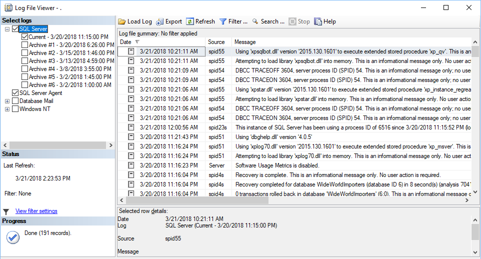

# Viewing server logs

This topic provides reference information about logging capabilities in SQL Server and Amazon Aurora MySQL. You can gain insights into how these database systems handle error logging, slow query logging, and general logging.

| Feature compatibility            | AWS SCT / AWS DMS automation level | AWS SCT action code index | Key differences                                                                          |
| -------------------------------- | ---------------------------------- | ------------------------- | ---------------------------------------------------------------------------------------- |
| Three star feature compatibility | N/A                                | N/A                       | View logs from the Amazon RDS console, the Amazon RDS API, the AWS CLI, or the AWS SDKs. |

## SQL Server Usage

SQL Server logs system and user generated events to the _SQL Server Error Log_ and to the _Windows Application Log_. It logs recovery messages, kernel messages, security events, maintenance events, and other general server level error and informational messages. The Windows Application Log contains events from all windows applications including SQL Server and SQL Server agent.

SQL Server Management Studio Log Viewer unifies all logs into a single consolidated view. You can also view the logs with any text editor.

Administrators typically use the SQL Server Error Log to confirm successful completion of processes, such as backup or batches, and to investigate the cause of run time errors. These logs can help detect current risks or potential future problem areas.

To view the log for SQL Server, SQL Server Agent, Database Mail, and Windows applications, open the SQL Server Management Studio Object Explorer pane, navigate to **Management**, **SQL Server Logs**, and choose the current log.

The following table identifies some common error codes database administrators typically look for in the error logs:

| Error code | Error message                 |
| ---------- | ----------------------------- |
| 1105       | Couldn’t allocate space.      |
| 3041       | Backup failed.                |
| 9002       | Transaction log full.         |
| 14151      | Replication agent failed.     |
| 17053      | Operating system error.       |
| 18452      | Login failed.                 |
| 9003       | Possible database corruption. |

### Examples

The following screenshot shows the typical log file viewer content:

For more information, see [Monitoring the Error Logs](https://docs.microsoft.com/en-us/sql/tools/configuration-manager/monitoring-the-error-logs?view=sql-server-ver15 "https://docs.microsoft.com/en-us/sql/tools/configuration-manager/monitoring-the-error-logs?view=sql-server-ver15") in the _SQL Server documentation_.

## MySQL Usage

Amazon Aurora MySQL-Compatible Edition (Aurora MySQL) provides administrators with access to the MySQL error log, slow query log, and the general log.

The MySQL Error Log is generated by default. To generate the slow query and general logs, set the corresponding parameters in the database parameter group. For more information, see [Server Options](chap-sql-server-aurora-mysql.configuration.md "chap-sql-server-aurora-mysql.configuration.md").

You can view Aurora MySQL logs directly from the Amazon RDS console, the Amazon RDS API, the AWS CLI, or the AWS SDKs. You can also direct the logs to a database table in the main database and use SQL queries to view the data. To download a binary log, use the `mysqlbinlog` utility.

The system writes error events to the `mysql-error.log` file, which you can view using the Amazon RDS console. Alternatively, you can use the Amazon RDS API, the Amazon RDS CLI, or the AWS SDKs retrieve to retrieve the log.

The `mysql-error.log` file buffers are flushed every five minutes and are appended to the `filemysql-error-running.log`. The `mysql-error-running.log` file is rotated every hour and retained for 24 hours.

Aurora MySQL writes to the error log only on server startup, server shutdown, or when an error occurs. A database instance may run for long periods without generating log entries.

You can turn on and configure the Aurora MySQL Slow Query and general logs to write log entries to a file or a database table by setting the corresponding parameters in the database parameter group. The following list identifies he parameters that control the log options:

- `slow_query_log` — Set to 1 to create the Slow Query Log. The default is 0.
- `general_log` — Set to 1 to create the General Log. The default is 0.
- `long_query_time` — Specify a value in seconds for the shortest query run time to be logged. The default is 10 seconds; the minimum is 0.
- `log_queries_not_using_indexes` — Set to 1 to log all queries not using indexes to the slow query log. The default is 0. Queries using indexes are logged even if their run time is less than the value of the `long_query_time` parameter.
- `log_output` — Specify one of the following options:
  - **TABLE** — Write general queries to the `mysql.general_log` table and slow queries to the `mysql.slow_log` table. This option is set by default.
  - **FILE** — Write both general and slow query logs to the file system. Log files are rotated hourly.
  - **NONE** — Disable logging.

### Examples

The following walkthrough demonstrates how to view the Aurora PostgreSQL error logs in the Amazon RDS console.

1. In the AWS console, choose **RDS**, and then choose **Databases**.
2. Choose the instance for which you want to view the error log.

 3. Scroll down to the logs section and choose the log name. The log viewer displays the log content.

For more information, see [MySQL database log files](../../../AmazonRDS/latest/UserGuide/USER_LogAccess.Concepts.md "../../../AmazonRDS/latest/UserGuide/USER_LogAccess.Concepts.md") in the _Amazon Relational Database Service User Guide_.
