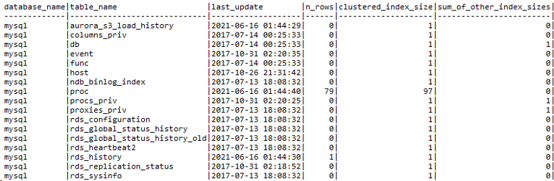
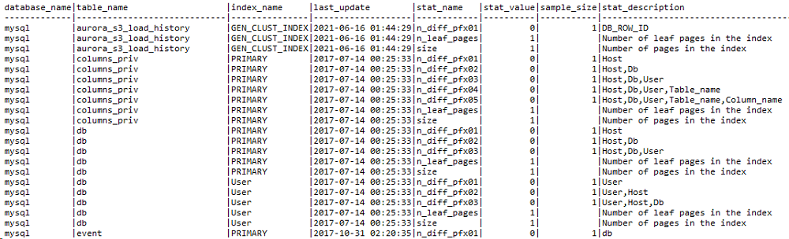

# Managing statistics for T-SQL

This topic provides reference information about statistics management in Microsoft SQL Server and Amazon Aurora MySQL, which is crucial for database performance optimization. You can understand the differences and similarities in how these two database systems handle statistics creation, storage, and maintenance.

| Feature compatibility            | AWS SCT / AWS DMS automation level | AWS SCT action code index | Key differences                                                              |
| -------------------------------- | ---------------------------------- | ------------------------- | ---------------------------------------------------------------------------- |
| Three star feature compatibility | No automation                      | N/A                       | Statistics contain only density information, and only for index key columns. |

## SQL Server Usage

Statistics objects in SQL Server are designed to support cost-based query optimizer. It uses statistics to evaluate the various plan options and choose an optimal plan for optimal query performance.

Statistics are stored as BLOBs in system tables and contain histograms and other statistical information about the distribution of values in one or more columns. A histogram is created for the first column only and samples the occurrence frequency of distinct values. Statistics and histograms are collected by either scanning the entire table or by sampling only a percentage of the rows.

You can view Statistics manually using the `DBCC SHOW_STATISTICS` statement or the more recent `sys.dm_db_stats_properties` and `sys.dm_db_stats_histogram` system views.

SQL Server provides the capability to create filtered statistics containing a `WHERE` predicate. Filtered statistics are useful for optimizing histogram granularity by eliminating rows whose values are of less interest, for example NULLs.

SQL Server can manage the collection and refresh of statistics automatically, which is the default. Use the `AUTO_CREATE_STATISTICS` and `AUTO_UPDATE_STATISTICS` database options to change the defaults.

When a query is submitted with `AUTO_CREATE_STATISTICS` on, and the query optimizer may benefit from a statistics that doesn’t yet exist, SQL Server creates the statistics automatically. You can use the `AUTO_UPDATE_STATISTICS_ASYNC` database property to set new statistics creation to occur immediately and causing queries to wait or to run asynchronously. When run asynchronously, the triggering run can’t benefit from optimizations the optimizer may derive from it.

After creation of a new statistics object, either automatically or explicitly using the `CREATE STATISTICS` statement, the refresh of the statistics is controlled by the `AUTO_UPDATE_STATISTICS` database option. When set to `ON`, statistics are recalculated when they are stale, which happens when significant data modifications have occurred since the last refresh.

### Syntax

```
CREATE STATISTICS <Statistics Name>
ON <Table Name> (<Column> [,...])
[WHERE <Filter Predicate>]
[WITH <Statistics Options>;
```

### Examples

Create new statistics on multiple columns. Set to use a full scan and to not refresh.

```
CREATE STATISTICS MyStatistics
ON MyTable (Col1, Col2)
WITH FULLSCAN, NORECOMPUTE;
```

Update statistics with a 50% sampling rate.

```
UPDATE STATISTICS MyTable(MyStatistics)
WITH SAMPLE 50 PERCENT;
```

View the statistics histogram and data.

```
DBCC SHOW_STATISTICS ('MyTable','MyStatistics');
```

Turn off automatic statistics creation for a database.

```
ALTER DATABASE MyDB SET AUTO_CREATE_STATS OFF;
```

For more information, see [Statistics](https://docs.microsoft.com/en-us/sql/relational-databases/statistics/statistics?view=sql-server-ver15 "https://docs.microsoft.com/en-us/sql/relational-databases/statistics/statistics?view=sql-server-ver15"), [CREATE STATISTICS (Transact-SQL)](https://docs.microsoft.com/en-us/sql/t-sql/statements/create-statistics-transact-sql?view=sql-server-ver15 "https://docs.microsoft.com/en-us/sql/t-sql/statements/create-statistics-transact-sql?view=sql-server-ver15"), and [DBCC SHOW_STATISTICS (Transact-SQL)](https://docs.microsoft.com/en-us/sql/t-sql/database-console-commands/dbcc-show-statistics-transact-sql?view=sql-server-ver15 "https://docs.microsoft.com/en-us/sql/t-sql/database-console-commands/dbcc-show-statistics-transact-sql?view=sql-server-ver15") in the _SQL Server documentation_.

## MySQL Usage

Amazon Aurora MySQL-Compatible Edition (Aurora MySQL) supports two modes of statistics management: persistent optimizer statistics and non-persistent optimizer statistics. As the name suggests, persistent statistics are written to disk and survive service restart. Non-persistent statistics are kept in memory only and need to be recreated after service restart. It is recommended to use persistent optimizer statistics (the default for Aurora MySQL) for improved plan stability.

Statistics in Aurora MySQL are created for indexes only. Aurora MySQL doesn’t support independent statistics objects on columns that aren’t part of an index.

Typically, administrators change the statistics management mode by setting the global parameter `innodb_stats_persistent = ON`. This option isn’t supported for Aurora MySQL because it requires server `SUPER` privileges. Therefore, control the statistics management mode by changing the behavior for individual tables using the table option `STATS_PERSISTENT = 1`. There are no column-level or statistics-level options for setting parameter values.

To view statistics metadata, use the `INFORMATION_SCHEMA.STATISTICS` standard view. To view detailed persistent optimizer statistics, use the `innodb_table_stats` and `innodb_index_stats` tables.

The following image shows an example of `mysql.innodb_table_stats` content.



The following image shows an example of `mysql.innodb_index_stats` content.



Automatic refresh of statistics is controlled by the global parameter `innodb_stats_auto_recalc`, which is set to `ON` in Aurora MySQL. You can set it individually for each table using the `STATS_AUTO_RECALC=1` option.

To explicitly force refresh of table statistics, use the `ANALYZE TABLE` statement. It is not possible to refresh individual statistics or columns.

Use the `NO_WRITE_TO_BINLOG` or its clearer alias `LOCAL` to avoid replication to replication replicas.

Use `ALTER TABLE …​ ANALYZE PARTITION` to analyze one or more individual partitions. For more information, see [Storage](chap-sql-server-aurora-mysql.md "chap-sql-server-aurora-mysql.md").

###### Note

Amazon Relational Database Service (Amazon RDS) for MySQL 8 adds new `INFORMATION_SCHEMA.INNODB_CACHED_INDEXES` table which reports the number of index pages cached in the InnoDB buffer pool for each index.

### Syntax

```
ANALYZE [NO_WRITE_TO_BINLOG | LOCAL] TABLE <Table Name> [,...];
```

```
CREATE TABLE ( <Table Definition> ) | ALTER TABLE <Table Name>
STATS_PERSISTENT = <1|0>,
STATS_AUTO_RECALC = <1|0>,
STATS_SAMPLE_PAGES = <Statistics Sampling Size>;
```

### Migration Considerations

Unlike SQL Server, Aurora MySQL collects only density information. It doesn’t collect detailed key distribution histograms. This difference is critical for understanding run plans and troubleshooting performance issues, which aren’t affected by individual values used by query parameters.

Statistics collection is managed at the table level. You can’t manage individual statistics objects or individual columns. In most cases, that shouldn’t pose a challenge for successful migration.

### Examples

Create a table with explicitly set statistics options.

```
CREATE TABLE MyTable
(
    Col1 INT NOT NULL AUTO_INCREMENT,
    Col2 VARCHAR(255),
    DateCol DATETIME,
    PRIMARY KEY (Col1),
    INDEX IDX_DATE (DateCol)
) ENGINE=InnoDB,
STATS_PERSISTENT=1,
STATS_AUTO_RECALC=1,
STATS_SAMPLE_PAGES=25;
```

Refresh all statistics for `MyTable1` and `MyTable2`.

```
ANALYZE TABLE MyTable1, MyTable2;
```

Change `MyTable` to use non persistent statistics.

```
ALTER TABLE MyTable STATS_PERSISTENT=0;
```

## Summary

The following table identifies similarities, differences, and key migration considerations.

| Feature                     | SQL Server                                                    | Aurora MySQL                          | Comments                                                                                  |
| --------------------------- | ------------------------------------------------------------- | ------------------------------------- | ----------------------------------------------------------------------------------------- |
| Column statistics           | `CREATE STATISTICS`                                           | N/A                                   |                                                                                           |
| Index statistics            | Implicit with every index                                     | Implicit with every index             | Statistics are maintained automatically for every table index.                            |
| Refresh / update statistics | `UPDATE STATISTICS`<br>`EXECUTE sp_updatestats`               | `ANALYZE TABLE`                       | Minimal scope in Aurora MySQL is the entire table. No control over individual statistics. |
| Auto create statistics      | `AUTO_CREATE_STATISTICS` database option                      | N/A                                   |                                                                                           |
| Auto update statistics      | `AUTO_UPDATE_STATISTICS` database option                      | `STATS_AUTO_RECALC` table option      |                                                                                           |
| Statistics sampling         | Use the `SAMPLE` option of `CREATE` and `UPDATE STATISTICS`   | `STATS_SAMPLE_PAGES` table option     | Can only use page number, not percentage for `STATS_SAMPLE_PAGES`.                        |
| Full scan refresh           | Use the `FULLSCAN` option of `CREATE` and `UPDATE STATISTICS` | N/A                                   | Using a very large `STATS_SAMPLE_PAGES` may serve the same purpose.                       |
| Non-persistent statistics   | N/A                                                           | Use `STATS_PERSISTENT=0` table option |                                                                                           |

For more information, see [The INFORMATION_SCHEMA STATISTICS Table](https://dev.mysql.com/doc/refman/5.7/en/information-schema-statistics-table.html "https://dev.mysql.com/doc/refman/5.7/en/information-schema-statistics-table.html")
[Configuring Persistent Optimizer Statistics Parameters](https://dev.mysql.com/doc/refman/5.7/en/innodb-persistent-stats.html "https://dev.mysql.com/doc/refman/5.7/en/innodb-persistent-stats.html"), [Configuring Optimizer Statistics for InnoDB](https://dev.mysql.com/doc/refman/5.7/en/innodb-performance-optimizer-statistics.html "https://dev.mysql.com/doc/refman/5.7/en/innodb-performance-optimizer-statistics.html"), and [Configuring Optimizer Statistics for InnoDB](https://dev.mysql.com/doc/refman/5.7/en/innodb-performance-optimizer-statistics.html "https://dev.mysql.com/doc/refman/5.7/en/innodb-performance-optimizer-statistics.html") in the _MySQL documentation_.
