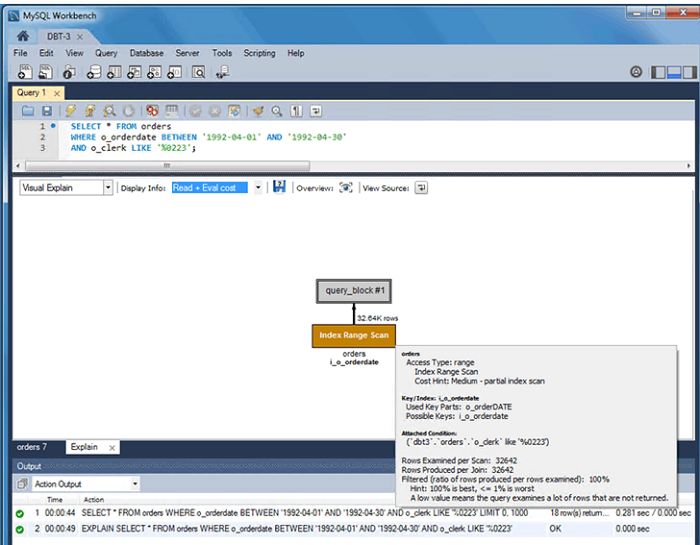

# Tuning run plans

This topic provides reference information about query execution plans in Microsoft SQL Server and Amazon Aurora MySQL. You can use these tools to analyze and optimize query performance in your database systems.

| Feature compatibility          | AWS SCT / AWS DMS automation level | AWS SCT action code index | Key differences                                                                        |
| ------------------------------ | ---------------------------------- | ------------------------- | -------------------------------------------------------------------------------------- | -------------------------------------------------------------------------------------------------------------------------------------------------------------------------------------------------------------------------------------------------------------------------------------------------------------------------------------------------------------------------------------------------------------------------------------------------------------------------------------------------------------------------------------------------------------------------------------------------------------------------------------------------------------------------------------------------------------------------------------------------------------------------------------------------------------------------------------------------------------------------------------------------------------------------------------------------------------------------------------------------------------------------------------------------------------------------------------------------------------------------------------------------------------------------------------------------------------------------------------------------------------------------------------------------------------------------------------------------------------------------------------------------------------------------------------------------------------------------------------------------------------------------------------------------------------------------------------------------------------------------------------------------------------------------------------------------------------------------------------------------------------------------------------------------------------------------------------------------------------------------------------------------------------------------------------------------------------------------------------------------------------------------------------------------------------------------------------------------------------------------------------------------------------------------------------------------------------------------------------------------------------------------------------------------------------------------------------------------------------------------------------------------------------------------------------------------------------------------------------------------------------------------------------------------------------------------------------------------------------------------------------------------------------------------------------------------------------------------------------------------------------------------------------------------------------------------------------------------------------------------------------------------------------------------------------------------------------------------------------------------------------------------------------------------------------------------------------------------------------------------------------------------------------------------------------------------------------------------------------------------------------------------------------------------------------------------------------------------------------------------------------------------------------------------------------------------------------------------------------------------------------------------------------------------------------------------------------------------------------------------------------------------------------------------------------------------------------------------------------------------------------------------------------------------------------------------------------------------------------------------------------------------------------------------------------------------------------------------------------------------------------------------------------------------------------------------------------------------------------------------------------------------------------------------------------------------------------------------------------------------------------------------------------------------------------------------------------------------------------------------------------------------------------------------------------------------------------------------------------------------------------------------------------------------------------------------------------------------------------------------------------------------------------------------------------------------------------------------------------------------------------------------------------------------------------------------------------------------------------------------------------------------------------------------------------------------------------------------------------------------------------------------------------------------------------------------------------------------------------------------------------------- | -------- | --------------- | -------------------- | ----------------------- | ---------------- | ---------------- | ----------------- | ---------------- | --------------------------------------------------------------------------------------------------------------------------------------------------------------------------------------------------------------------------------------------------------------------------------------------------------------------------------------------------------------------------------------------------------------------------------------------------------------------------------------------------------------------------------------------------------------------------------------------------------------------------------------------------------------------------------------------------------------------------------------------------------------------------------------------------------------------------------------------------------------------------------------------------------------------------------------------------------------------------------------------------------------------------------------------------- |
| Two star feature compatibility | N/A                                | N/A                       | Syntax differences. Completely different optimizer with different operators and rules. | ## SQL Server Usage Run plans provide users detailed information about the data access and processing methods chosen by the SQL Server Query Optimizer. They also provide estimated or actual costs of each operator and sub tree. Run plans provide critical data for troubleshooting query performance challenges. SQL Server creates run plans for most queries and returns them to client applications as plain text or XML documents. SQL Server produces a run plan when a query run, but it can also generate estimated plans without running a query. SQL Server Management Studio provides a graphical view of the underlying XML plan document using icons and arrows instead of textual information. This graphical view is extremely helpful when investigating the performance aspects of a query. To request an estimated run plan, use the `SET SHOWPLAN_XML`, `SHOWPLAN_ALL`, or `SHOWPLAN_TEXT` statements. SQL Server 2017 introduces automatic tuning, which notifies users whenever a potential performance issue is detected and lets them apply corrective actions, or lets the database engine automatically fix performance problems. Automatic tuning SQL Server enables users to identify and fix performance issues caused by query run plan choice regressions. For more information, see [Automatic tuning](https://docs.microsoft.com/en-us/sql/relational-databases/automatic-tuning/automatic-tuning?view=sql-server-ver15 "https://docs.microsoft.com/en-us/sql/relational-databases/automatic-tuning/automatic-tuning?view=sql-server-ver15") in the _SQL Server documentation_. ### Examples Show the estimated run plan for a query. `SET SHOWPLAN_XML ON; SELECT * FROM MyTable WHERE SomeColumn = 3; SET SHOWPLAN_XML OFF;` Actual run plans return after run of the query or batch of queries completes. Actual run plans include run-time statistics about resource usage and warnings. To request the actual run plan, use the `SET STATISTICS XML` statement to return the XML document object. Alternatively, use the `STATISTICS PROFILE` statement, which returns an additional result set containing the query run plan. Show the actual run plan for a query. `SET STATISTICS XML ON; SELECT * FROM MyTable WHERE SomeColumn = 3; SET STATISTICS XML OFF;` The following example shows a partial graphical run plan from SQL Server Management Studio.  For more information, see [Display and Save Execution Plans](https://docs.microsoft.com/en-us/sql/relational-databases/performance/display-and-save-execution-plans?view=sql-server-ver15 "https://docs.microsoft.com/en-us/sql/relational-databases/performance/display-and-save-execution-plans?view=sql-server-ver15") in the _SQL Server documentation_. ## MySQL Usage Amazon Aurora MySQL-Compatible Edition (Aurora MySQL) provides the `EXPLAIN/DESCRIBE` statement to display run plan and used with the `SELECT`, `DELETE`, `INSERT`, `REPLACE`, and `UPDATE` statements. ###### Note You can use the `EXPLAIN/DESCRIBE` statement to retrieve table and column metadata. When you use `EXPLAIN` with a statement, MySQL returns the run plan generated by the query optimizer. MySQL explains how the statement will be processed including information about table joins and order. When you use `EXPLAIN` with the `FOR CONNECTION` option, it returns the run plan for the statement running in the named connection. You can use the FORMAT option to select either a `TRADITIONAL` tabular format or a JSON format. The `EXPLAIN` statement requires `SELECT` permissions for all tables and views accessed by the query directly or indirectly. For views, `EXPLAIN` requires the `SHOW VIEW` permission. `EXPLAIN` can be extremely valuable for improving query performance when used to find missing indexes. You can also use `EXPLAIN` to determine if the optimizer joins tables in an optimal order. MySQL Workbench includes an easy to read visual explain feature similar to SQL Server Management Studio graphical run plans. ###### Note Amazon Relational Database Service (Amazon RDS) for MySQL implements a new form of the `EXPLAIN` statement. You can use `EXPLAIN ANALYZE` in MySQL 8.0.18. This statement provides expanded information about the run of `SELECT` statements in the `TREE` format for each iterator used in processing the query and making it possible to compare estimated cost with the actual cost of the query. This information includes startup cost total cost number of rows returned by this iterator and the number of run loops. In MySQL 8.0.21 and later this statement also supports a `FORMAT=TREE` specifier. `TREE` is the only supported format. For more information, see [Obtaining Information with EXPLAIN ANALYZE](https://dev.mysql.com/doc/refman/8.0/en/explain.html#explain-analyze "https://dev.mysql.com/doc/refman/8.0/en/explain.html#explain-analyze") in the _MySQL documentation_. ### Syntax Simplified syntax for the EXPLAIN statement: ``` {EXPLAIN | DESCRIBE | DESC} [EXTENDED | FORMAT = TRADITIONAL | JSON] [SELECT statement | DELETE statement | INSERT statement | REPLACE statement | UPDATE statement | FOR CONNECTION <connection id>] `### Examples View the run plan for a statement.` CREATE TABLE Employees ( EmployeeID INT NOT NULL PRIMARY KEY, Name VARCHAR(100) NOT NULL, INDEX USING BTREE(Name) ); ` ` EXPLAIN SELECT * FROM Employees WHERE Name = 'Jason'; ` ` id select_type table partitions type possible_keys key key_len ref rows Extra 1 SIMPLE Employees ref Name Name 102 const 1 ```View the MySQL Workbench graphical run plan.  ###### Note To instruct the optimizer to use a join order corresponding to the order in which the tables are specified in a`SELECT`statement, use`SELECT STRAIGHT_JOIN`. For more information, see [Query Hints and Plan Guides](chap-sql-server-aurora-mysql.tuning.md "chap-sql-server-aurora-mysql.tuning.md"). For more information, see [EXPLAIN Statement](https://dev.mysql.com/doc/refman/5.7/en/explain.html "https://dev.mysql.com/doc/refman/5.7/en/explain.html") in the *MySQL documentation\*. |
