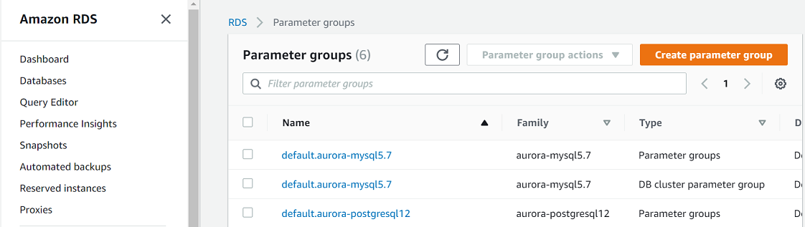

# Configuring server options

This topic provides reference information about parameter configuration in SQL Server and PostgreSQL, specifically in the context of migrating from SQL Server 2019 to Amazon Aurora PostgreSQL. You can understand the differences in how server-level settings and parameters are managed between these two database systems.

| Feature compatibility                                                                       | AWS SCT / AWS DMS automation level                                                                                                                                                                                                                                                                           | AWS SCT action code index | Key differences                                                                                                                             |
| ------------------------------------------------------------------------------------------- | ------------------------------------------------------------------------------------------------------------------------------------------------------------------------------------------------------------------------------------------------------------------------------------------------------------ | ------------------------- | ------------------------------------------------------------------------------------------------------------------------------------------- | ------------------------------------------------------------------------------------------------------------------------------------------------------------------------------------------------------------------------------------------------------------------------------------------------------------------------------------------------------------------------------------------------------------------------------------------------------------------------------------------------------------------------------------------------------------------------------------------------------------------------------------------------------------------------------------------------------------------------------------------------------------------------------------------------------------------------------------------------------------------------------------------------------------------------------------------------------------------------------------------------------------------------------------------------------------------------------------------------------------------------------------------------------------------------------------------------------------------------------------------------------------------------------------------------------------------------------------------------------------------------------------------------------------------------------------------------------------------------------------------------------------------------------------------------------------------------------------------------------------------------------------------------------------------------------------------------------------------------------------------------------------------------------------------------------------------------------------------------------------------------------------------------------------------------------------------------------------------------------------------------------------------------------------------------------------------------------------------------------------------------------------------------------------------------------------------------------------------------------------------------------------------------------------------------------------------------------------------------------------------------------------------------------------------------------------------------------------------------------------------------------------------------------------------------------------------------------------------------------------------------------------------------------------------------------------------------------------------------------------------------------------------------------------------------------------------------------------------------------------------------------------------------------------------------------------------------------------------------------------------------------- |
| One star feature compatibility                                                              | N/A                                                                                                                                                                                                                                                                                                          | N/A                       | Use Cluster and Database/Cluster Parameter.                                                                                                 | ## SQL Server Usage SQL Server provides server-level settings that affect all databases and all sessions. You can modify these settings using the `sp_configure` system stored procedure. You can use server options to perform the following configuration tasks:  • Define hardware utilization such as memory management, affinity mask, priority boost, network packet size, and soft Non-Uniform Memory Access (NUMA).  • Alter run time global values such as recovery interval, remote login timeout, optimization for ad-hoc workloads, and cost threshold for parallelism.  • Enable and disable global features such as C2 Audit, OLE, procedures, CLR procedures, and allow trigger recursion.  • Configure global security settings such as server authentication mode, remote access, shell access with `xp_cmdshell`, CLR access level, and database chaining.  • Set default values for sessions such as user options, default language, backup compression, and fill factor. Some settings require an explicit `RECONFIGURE` command to apply the changes to the server. High risk settings require `RECONFIGURE WITH OVERRIDE` for the changes to be applied. Some advanced options are hidden by default. To view and modify these settings, set `show advanced options` to 1 and run `sp_configure`. ###### Note Server audits are managed with the T-SQL commands `CREATE` and `ALTER SERVER AUDIT`. ### Syntax `EXECUTE sp_configure <option>, <value>;` ### Examples Limit server memory usage to 4 GB. `EXECUTE sp_configure 'show advanced options', 1;` `RECONFIGURE;` `sp_configure 'max server memory', 4096;` `RECONFIGURE;` Allow command shell access from T-SQL. `EXEC sp_configure 'show advanced options', 1;` `RECONFIGURE;` `EXEC sp_configure 'xp_cmdshell', 1;` `RECONFIGURE;` View the current values. `EXECUTE sp_configure` For more information, see [Server Configuration Options (SQL Server)](https://docs.microsoft.com/en-us/sql/database-engine/configure-windows/server-configuration-options-sql-server?view=sql-server-ver15 "https://docs.microsoft.com/en-us/sql/database-engine/configure-windows/server-configuration-options-sql-server?view=sql-server-ver15") in the _SQL Server documentation_. ## PostgreSQL Usage When running PostgreSQL databases as Amazon Aurora Clusters, Parameter Groups are used to change to cluster-level and database-level parameters. Most of the PostgreSQL parameters are configurable in an Amazon Aurora PostgreSQL-Compatible Edition (Aurora PostgreSQL) cluster, but some are disabled and can’t be modified. Because Amazon Aurora clusters restrict access to the underlying operating system, modification to PostgreSQL parameters must be made using Parameter Groups. Amazon Aurora is a cluster of database instances and, as a direct result, some of the PostgreSQL parameters apply to the entire cluster while other parameters apply only to a particular database instance. |
| Aurora PostgreSQL parameter class                                                           | Controlled by                                                                                                                                                                                                                                                                                                |                           | ---                                                                                                                                         | ---                                                                                                                                                                                                                                                                                                                                                                                                                                                                                                                                                                                                                                                                                                                                                                                                                                                                                                                                                                                                                                                                                                                                                                                                                                                                                                                                                                                                                                                                                                                                                                                                                                                                                                                                                                                                                                                                                                                                                                                                                                                                                                                                                                                                                                                                                                                                                                                                                                                                                                                                                                                                                                                                                                                                                                                                                                                                                                                                                                                                     |
| **Cluster-level parameters** Single cluster parameter group for each Amazon Aurora Cluster. | Managed by cluster parameter groups. For example,  • The PostgreSQL `wal_buffers` parameter is controlled by a cluster parameter group. + The PostgreSQL `autovacuum` parameter is controlled by a cluster parameter group. + The `client_encoding` parameter is controlled by a cluster parameter group. |                           | **Database instance-level parameters** You can associate every instance in an Amazon Aurora cluster with a unique database parameter group. | Managed by database parameter groups. For example,  • The PostgreSQL `shared_buffers` memory cache configuration parameter is controlled by a database parameter group with an optimized default value based on the configured database class: `{DBInstanceClassMemory/10922}`.  • The PostgreSQL `max_connections` parameter, which controls the maximum number of client connections allowed to the PostgreSQL instance, is controlled by a database parameter group. The default value is optimized by AWS based on the configured database class: `LEAST({DBInstanceClassMemory/9531392},5000)`.  • The `authentication_timeout` parameter, which controls the maximum time to complete client authentication (in seconds), is controlled by a database parameter group.  • The `superuser_reserved_connections` parameter, which determines the number of reserved connection slots for PostgreSQL superusers, is configured by a database parameter group.  • The PostgreSQL `effective_cache_size`, which informs the query optimizer how much cache is present in the kernel and helps control how expensive large index scans will be, is controlled by a database level parameter group. The default value is optimized by AWS based on database class (RAM): `{DBInstanceClassMemory/10922}`.                                                                                                                                                                                                                                                                                                                                                                                                                                                                                                                                                                                                                                                                                                                                                                                                                                                                                                                                                                                                                                                                                                                                                                                                                                                                                                                                                                                                                                                                                                                                                                                                                                                                                 |

| New parameters in PostgreSQL 10: 1. `enable_gathermerge` enables the gather merge run plan. 2. `max_parallel_workers` stands for the maximum number of parallel workers process. 3. `max_sync_workers_per_subscription` stands for the maximum number of synchronous workers for subscription. 4. `wal_consistency_checking` checks consistency of WAL on the standby instance (can’t be set in Aurora PostgreSQL). 5. `max_logical_replication_workers` stands for the maximum number of logical replication worker process. 6. `max_pred_locks_per_relation` stands for the maximum number of records that you can predicate-lock before locking the entire relation. 7. `max_pred_locks_per_page` stands for the maximum number of records that you can predicate-lock before locking the entire page. 8. `min_parallel_table_scan_size` stands for the minimum table size to consider parallel table scan. 9. `min_parallel_index_scan_size` stands for the minimum table size to consider parallel index scan. ### Examples **To create and configure a new parameter group** 1. Sign in to the AWS Management Console and choose **RDS**. 2. Choose **Parameter groups**. ###### Note You can’t edit the default parameter group. Create a custom parameter group to apply changes to your Amazon Aurora cluster and its database instances.  3. Select the DB family from the Parameter group family drop-down list. 4. For **Type**, select the DB parameter group. 5. Choose **Create**. **To modify an existing parameter group** 1. Sign in to the AWS Management Console and choose **RDS**. 2. Choose **Parameter groups**. 3. Choose the name of the parameter to edit. 4. Choose **Edit parameters**. 5. Change parameter values and choose **Save changes**. For more information, see [Working with parameter groups](../../../AmazonRDS/latest/UserGuide/USER_WorkingWithParamGroups.md "../../../AmazonRDS/latest/UserGuide/USER_WorkingWithParamGroups.md") in the _Amazon RDS User Guide_.
