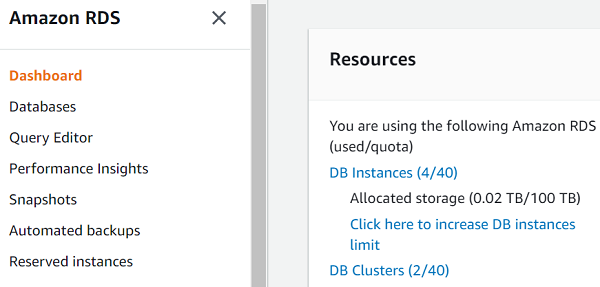
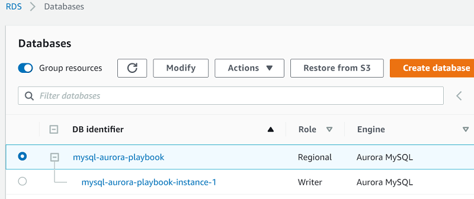
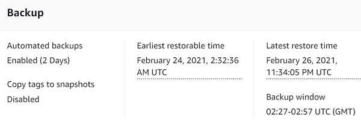
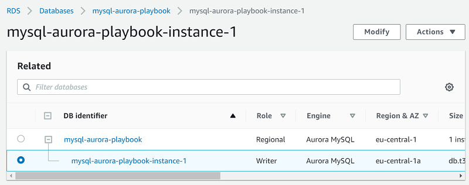
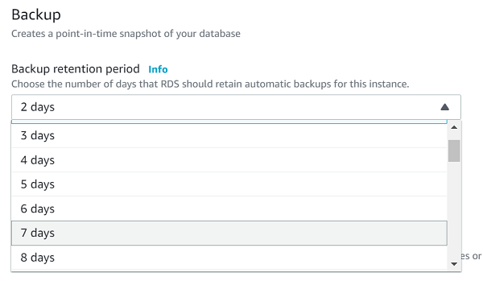

# Backup and restore design

This topic provides reference information about backup and restore capabilities in Microsoft SQL Server and Amazon Aurora PostgreSQL. You can understand the differences and similarities between these two database systems in terms of their backup and recovery features. The topic compares various aspects such as recovery models, backup types, and restore operations, helping you grasp how these functionalities translate between SQL Server and Aurora PostgreSQL.

| Feature compatibility           | AWS SCT / AWS DMS automation level | AWS SCT action code index                                                                                                                                                             | Key differences                             |
| ------------------------------- | ---------------------------------- | ------------------------------------------------------------------------------------------------------------------------------------------------------------------------------------- | ------------------------------------------- |
| Four star feature compatibility | N/A                                | [Backup](chap-sql-server-aurora-pg.tools.md#chap-sql-server-aurora-pg.tools.actioncode.backup "chap-sql-server-aurora-pg.tools.md#chap-sql-server-aurora-pg.tools.actioncode.backup") | Storage level backup managed by Amazon RDS. |

## SQL Server Usage

The term _backup_ refers to both the process of copying data and to the resulting set of data created by the processes that copy data for safekeeping and disaster recovery. Backup processes copy SQL Server data and transaction logs to media such as tapes, network shares, cloud storage, or local files. You can copy these backups back to the database using a _restore_ process.

SQL Server uses files, or filegroups, to create backups for an individual database or subset of a database. Table backups aren’t supported.

When a database uses the FULL recovery model, transaction logs also need to be backed up. Transaction logs allow backing up only database changes since the last full backup and provide a mechanism for point-in-time restore operations.

Recovery model is a database-level setting that controls transaction log management. The three available recovery models are SIMPLE, FULL, and BULK LOGGED. For more information, see [Recovery Models (SQL Server)](https://docs.microsoft.com/en-us/sql/relational-databases/backup-restore/recovery-models-sql-server?view=sql-server-ver15 "https://docs.microsoft.com/en-us/sql/relational-databases/backup-restore/recovery-models-sql-server?view=sql-server-ver15") in the _SQL Server documentation_.

The SQL Server `RESTORE` process copies data and log pages from a previously created backup back to the database. It then triggers a recovery process that rolls forward all committed transactions not yet flushed to the data pages when the backup took place. It also rolls back all uncommitted transactions written to the data files.

SQL Server supports the following types of backups:

- **Copy-only backups** are independent of the standard chain of SQL Server backups. They are typically used as one-off backups for special use cases and don’t interrupt normal backup operations.
- **Data backups** copy data files and the transaction log section of the activity during the backup. A data backup may contain the whole database (database backup) or part of the database. The parts can be a partial backup, a file, or a filegroup.
- **A database backup** is a data backup representing the entire database at the point in time when the backup process finished.
- **A differential backup** is a data backup containing only the data structures (extents) modified since the last full backup. A differential backup is dependent on the previous full backup and can’t be used alone.
- **A full backup** is a data backup containing a Database Backup and the transaction log records of the activity during the backup process.
- **Transaction log backups** don’t contain data pages. They contain the log pages for all transaction activity since the last full backup or the previous transaction log backup.
- **File backups** consist of one or more files or filegroups.

SQL Server also supports media families and media sets that you can use to mirror and stripe backup devices. For more information, see [Media Sets, Media Families, and Backup Sets (SQL Server)](https://docs.microsoft.com/en-us/sql/relational-databases/backup-restore/media-sets-media-families-and-backup-sets-sql-server?view=sql-server-ver15 "https://docs.microsoft.com/en-us/sql/relational-databases/backup-restore/media-sets-media-families-and-backup-sets-sql-server?view=sql-server-ver15") in the _SQL Server documentation_.

SQL Server 2008 Enterprise edition and later versions, support backup compression. Backup compression provides the benefit of a smaller backup file footprint, less I/O consumption, and less network traffic at the expense of increased CPU utilization for running the compression algorithm. For more information, see [Backup Compression (SQL Server)](https://docs.microsoft.com/en-us/sql/relational-databases/backup-restore/backup-compression-sql-server?view=sql-server-ver15 "https://docs.microsoft.com/en-us/sql/relational-databases/backup-restore/backup-compression-sql-server?view=sql-server-ver15") in the _SQL Server documentation_.

A database backed up in the `SIMPLE` recovery mode can only be restored from a full or differential backup. For `FULL` and `BULK LOGGED` recovery models, you can restore transaction log backups to minimize potential data loss.

Restoring a database involves maintaining a correct sequence of individual backup restores. For example, a typical restore operation may include the following steps:

1. Restore the most recent full backup.
2. Restore the most recent differential backup.
3. Restore a set of uninterrupted transaction log backups, in order.
4. Recover the database.

For large databases, a full restore, or a complete database restore, from a full database backup isn’t always a practical solution. SQL Server supports data file restore that restores and recovers a set of files and a single Data Page Restore, except for databases using the `SIMPLE` recovery model.

### Syntax

SQL Server uses the following backup syntax.

```
Backing Up a Whole Database
BACKUP DATABASE <Database Name> [ <Files / Filegroups> ] [ READ_WRITE_FILEGROUPS ]
  TO <Backup Devices>
  [ <MIRROR TO Clause> ]
  [ WITH [DIFFERENTIAL ]
  [ <Option List> ][;]
```

```
BACKUP LOG <Database Name>
  TO <Backup Devices>
  [ <MIRROR TO clause> ]
  [ WITH <Option List> ][;]
```

```
<Option List> =
COPY_ONLY | {COMPRESSION | NO_COMPRESSION } | DESCRIPTION = <Description>
| NAME = <Backup Set Name> | CREDENTIAL | ENCRYPTION | FILE_SNAPSHOT | { EXPIREDATE =
<Expiration Date> | RETAINDAYS = <Retention> }
{ NOINIT | INIT } | { NOSKIP | SKIP } | { NOFORMAT | FORMAT } |
{ NO_CHECKSUM | CHECKSUM } | { STOP_ON_ERROR | CONTINUE_AFTER_ERROR }
{ NORECOVERY | STANDBY = <Undo File for Log Shipping> } | NO_TRUNCATE
ENCRYPTION ( ALGORITHM = <Algorithm> | SERVER CERTIFICATE = <Certificate> | SERVER
ASYMMETRIC KEY = <Key> );
```

SQL Server uses the following restore syntax.

```
RESTORE DATABASE <Database Name> [ <Files / Filegroups> ] | PAGE = <Page ID>
FROM <Backup Devices>
[ WITH [ RECOVERY | NORECOVERY | STANDBY = <Undo File for Log Shipping> } ]
[, <Option List>]
[;]
```

```
RESTORE LOG <Database Name> [ <Files / Filegroups> ] | PAGE = <Page ID>
[ FROM <Backup Devices>
[ WITH [ RECOVERY | NORECOVERY | STANDBY = <Undo File for Log Shipping> } ]
[, <Option List>]
[;]
```

```
<Option List> =
MOVE <File to Location>
| REPLACE | RESTART | RESTRICTED_USER | CREDENTIAL
| FILE = <File Number> | PASSWORD = <Password>
| { CHECKSUM | NO_CHECKSUM } | { STOP_ON_ERROR | CONTINUE_AFTER_ERROR }
| KEEP_REPLICATION | KEEP_CDC
| { STOPAT = <Stop Time>
| STOPATMARK = <Log Sequence Number>
| STOPBEFOREMARK = <Log Sequence Number>
```

### Examples

Perform a full compressed database backup.

```
BACKUP DATABASE MyDatabase TO DISK='C:\Backups\MyDatabase\FullBackup.bak'
WITH COMPRESSION;
```

Perform a log backup.

```
BACKUP DATABASE MyDatabase TO DISK='C:\Backups\MyDatabase\LogBackup.bak'
WITH COMPRESSION;
```

Perform a partial differential backup.

```
BACKUP DATABASE MyDatabase
  FILEGROUP = 'FileGroup1',
  FILEGROUP = 'FileGroup2'
  TO DISK='C:\Backups\MyDatabase\DB1.bak'
  WITH DIFFERENTIAL;
```

Restore a database to a point in time.

```
RESTORE DATABASE MyDatabase
  FROM DISK='C:\Backups\MyDatabase\FullBackup.bak'
  WITH NORECOVERY;

RESTORE LOG AdventureWorks2012
  FROM DISK='C:\Backups\MyDatabase\LogBackup.bak'
  WITH NORECOVERY, STOPAT = '20180401 10:35:00';

RESTORE DATABASE AdventureWorks2012 WITH RECOVERY;
```

For more information, see [Backup Overview (SQL Server)](https://docs.microsoft.com/en-us/sql/relational-databases/backup-restore/backup-overview-sql-server?view=sql-server-ver15 "https://docs.microsoft.com/en-us/sql/relational-databases/backup-restore/backup-overview-sql-server?view=sql-server-ver15") and [Restore and Recovery Overview (SQL Server)](https://docs.microsoft.com/en-us/sql/relational-databases/backup-restore/restore-and-recovery-overview-sql-server?view=sql-server-ver15 "https://docs.microsoft.com/en-us/sql/relational-databases/backup-restore/restore-and-recovery-overview-sql-server?view=sql-server-ver15") in the _SQL Server documentation_.

## PostgreSQL Usage

Amazon Aurora PostgreSQL-Compatible Edition (Aurora PostgreSQL) continuously backs up all cluster volumes and retains restore data for the duration of the backup retention period. The backups are incremental and you can use them to restore the cluster to any point in time within the backup retention period. You can specify a backup retention period from one to 35 days when creating or modifying a database cluster. Backups incur no performance impact and don’t cause service interruptions.

Additionally, you can manually trigger data snapshots in a cluster volume that you can save beyond the retention period. You can use Snapshots to create new database clusters.

###### Note

Manual snapshots incur storage charges for Amazon Relational Database Service (Amazon RDS).

### Restoring Data

You can recover databases from Amazon Aurora automatically retained data or from a manually saved snapshot. Using the automatically retained data significantly reduces the need to take frequent snapshots and maintain Recovery Point Objective (RPO) policies.

The Amazon Relational Database Service (Amazon RDS) console displays the available time frame for restoring database instances in the Latest Restorable Time and Earliest Restorable Time fields. The Latest Restorable Time is typically within the last five minutes. The Earliest Restorable Time is the end of the backup retention period.

###### Note

The Latest Restorable Time and Earliest Restorable Time fields display when a database cluster restore has been completed. Both display NULL until the restore process completes.

### Database Cloning

Database cloning is a fast and cost-effective way to create copies of a database. You can create multiple clones from a single DB cluster. You can also create additional clones from existing clones. When first created, a cloned database requires only minimal additional storage space.

Database cloning uses a copy-on-write protocol. Data is copied only when it changes either on the source or cloned database.

Data cloning is useful for avoiding impacts on production databases. For example:

- Testing schema or parameter group modifications.
- Isolating intensive workloads. For example, exporting large amounts of data and running high resource-consuming queries.
- Development and testing with a copy of a production database.

### Copying and sharing snapshots

You can copy and share database snapshots within the same AWS Region, across AWS Regions, and across AWS accounts. Snapshot sharing allows an authorized AWS account to access and copy snapshots. Authorized users can restore a snapshot from its current location without first copying it.

Copying an automated snapshot to another AWS account requires two steps:

- Create a manual snapshot from the automated snapshot.
- Copy the manual snapshot to another account.

### Backup Storage

In all Amazon RDS regions, backup storage is the collection of both automated and manual snapshots for all database instances and clusters. The size of this storage is the sum of all individual instance snapshots.

When an Aurora PostgreSQL database instance is deleted, all automated backups of that database instance are also deleted. However, Amazon RDS provides the option to create a final snapshot before deleting a database instance. This final snapshot is retained as a manual snapshot. Manual snapshots aren’t automatically deleted.

### The Backup Retention Period

Retention periods for Aurora PostgreSQL DB cluster backups are configured when creating a cluster. If not explicitly set, the default retention is one day when using the Amazon RDS API or the AWS CLI. The retention period is seven days if using the AWS Console. You can modify the backup retention period at any time with values of one to 35 days.

### Disabling automated backups

You can’t disable automated backups on Aurora PostgreSQL. The backup retention period for Aurora PostgreSQL is managed by the database cluster.

### Migration Considerations

Migrating from a self-managed backup policy to a Platform as a Service (PaaS) environment such as Aurora PostgreSQL is a complete paradigm shift. You no longer need to worry about transaction logs, file groups, disks running out of space, and purging old backups.

Amazon RDS provides guaranteed continuous backup with point-in-time restore up to 35 days.

Managing a SQL Server backup policy with similar RTO and RPO is a challenging task. With Aurora PostgreSQL, all you need to set is the retention period and take some manual snapshots for special use cases.

### Examples

The following walkthrough describes how to change Aurora PostgreSQL DB cluster retention settings from one day to seven days using the Amazon RDS console.

1. Log in to the Amazon RDS Console and on dashboard choose **Databases**.

 2. Choose the relevant DB identifier.

 3. Verify the current automatic backup settings.

 4. In this cluster, select database instance with the writer role.

 5. On the top right, choose **Modify**. 6. For **Backup retention period**, choose \*7 Days.

 7. Choose **Continue** and review the summary. 8. For **When to apply modifications**, choose **Apply during the next scheduled maintenance window** to apply your changes during the next scheduled maintenance window. Or, choose **Apply immediately** to apply your changes immediately. 9. Choose **Modify DB instance**.

For more information, see [Maintenance Plans](chap-sql-server-aurora-pg.management.md "chap-sql-server-aurora-pg.management.md").

## Summary

| Feature               | SQL Server                             | Aurora PostgreSQL                                                                                                                                                                                                                                                                                                                                                                                                                                                            | Comments                                                                                                                                                                                                                                                                                                                                                                                                                                                                                                                                    |
| --------------------- | -------------------------------------- | ---------------------------------------------------------------------------------------------------------------------------------------------------------------------------------------------------------------------------------------------------------------------------------------------------------------------------------------------------------------------------------------------------------------------------------------------------------------------------- | ------------------------------------------------------------------------------------------------------------------------------------------------------------------------------------------------------------------------------------------------------------------------------------------------------------------------------------------------------------------------------------------------------------------------------------------------------------------------------------------------------------------------------------------- | ---------------------------------------------------------------------------------------------------------------------------------------------------------------------------------------------------------------------------- |
| Recovery Model        | `SIMPLE`, `BULK LOGGED`, `FULL`        | N/A                                                                                                                                                                                                                                                                                                                                                                                                                                                                          | The functionality of Aurora PostgreSQL backups is equivalent to the `FULL` recovery model.                                                                                                                                                                                                                                                                                                                                                                                                                                                  |
| Backup database       | `BACKUP DATABASE`                      | `aws rds create-db-clustersnapshot --db-cluster-snapshot-identifier Snapshot_name --db-cluster-identifier Cluster_Name`                                                                                                                                                                                                                                                                                                                                                      |                                                                                                                                                                                                                                                                                                                                                                                                                                                                                                                                             |
| Partial backup        | `BACKUP DATABASE …​ FILE= …​           | FILEGROUP = …​`                                                                                                                                                                                                                                                                                                                                                                                                                                                              | N/A                                                                                                                                                                                                                                                                                                                                                                                                                                                                                                                                         | Can use export utilities. For more information, see [SQL Server Export and Import with Text Files and PostgreSQL pg_dump and pg_restore](chap-sql-server-aurora-pg.management.md "chap-sql-server-aurora-pg.management.md"). |
| Log backup            | `BACKUP LOG`                           | N/A                                                                                                                                                                                                                                                                                                                                                                                                                                                                          | Backup is at the storage level.                                                                                                                                                                                                                                                                                                                                                                                                                                                                                                             |
| Differential backups  | `BACKUP DATABASE …​ WITH DIFFERENTIAL` | N/A                                                                                                                                                                                                                                                                                                                                                                                                                                                                          | You can do manually using export tools.                                                                                                                                                                                                                                                                                                                                                                                                                                                                                                     |
| Database snapshots    | `BACKUP DATABASE …​ WITH COPY_ONLY`    | Amazon RDS console or API.                                                                                                                                                                                                                                                                                                                                                                                                                                                   | The terminology is inconsistent between SQL Server and Aurora PostgreSQL. A database snapshot in SQL Server is similar to database cloning in Aurora PostgreSQL. Aurora PostgreSQL database snapshots are similar to a `COPY_ONLY` backup in SQL Server.                                                                                                                                                                                                                                                                                    |
| Database clones       | `CREATE DATABASE…​ AS SNAPSHOT OF…​`   | Create new cluster from a cluster snapshot: `aws rds restore-db-cluster-from-snapshot --db-clusteridentifier NewCluster --snapshot-identifier SnapshotToRestore --engine aurora-postgresql`.<br>Add a new instance to the new or restored cluster: `aws rds create-db-instance --region us-east-1 --db-subnet-group default --engine aurora-postgresql --dbcluster-identifier clustername-restore --db-instanceidentifier newinstancenodeA --db-instance-class db.r4.large`. | The terminology is inconsistent between SQL Server and Aurora PostgreSQL. A database snapshot in SQL Server is similar to database cloning in Aurora PostgreSQL. Aurora PostgreSQL database snapshots are similar to a `COPY_ONLY` backup in SQL Server.                                                                                                                                                                                                                                                                                    |
| Point in time restore | `RESTORE DATABASE                      | LOG …​ WITH STOPAT…​`                                                                                                                                                                                                                                                                                                                                                                                                                                                        | Create new cluster from a cluster snapshot by given custom time to restore: `aws rds restore-db-clusterto-point-in-time --db-clusteridentifier clusternamerestore --source-db-clusteridentifier<br>clustername --restore-to-time 2017-09-19T23:45:00.000Z`.<br>Add a new instance to the new or restored cluster: `aws rds create-db-instance --region us-east-1 --db-subnet-group default --engine aurora-postgresql --dbcluster-identifier clustername-restore --db-instanceidentifier newinstancenodeA --db-instance-class db.r4.large`. |                                                                                                                                                                                                                              |
| Partial restore       | `RESTORE DATABASE…​ FILE= …​           | FILEGROUP = …​`                                                                                                                                                                                                                                                                                                                                                                                                                                                              | N/A                                                                                                                                                                                                                                                                                                                                                                                                                                                                                                                                         | You can restore the cluster to a new cluster and copy the needed data to the primary cluster.                                                                                                                                |

For more information, see [Managing an Amazon Aurora DB cluster](../../../AmazonRDS/latest/AuroraUserGuide/CHAP_Aurora.md "../../../AmazonRDS/latest/AuroraUserGuide/CHAP_Aurora.md") in the _User Guide for Aurora_.
